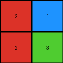

# 2dee498d • 012 • refine_coder

---

Previous Code:
```python
"""
The transformation extracts the first instance of a horizontally repeating pattern in the input grid to produce the output. The width of the repeating pattern is determined dynamically for each input.
"""

import numpy as np

def get_pattern_width(input_grid):
    """
    Finds the width of the repeating pattern.
    """
    rows = len(input_grid)
    cols = len(input_grid[0])

    for width in range(1, cols + 1):
        is_repeating = True
        for r in range(rows):
            for c in range(cols - width):
                if input_grid[r][c] != input_grid[r][c + width]:
                    is_repeating = False
                    break
            if not is_repeating:
                break
        if is_repeating:
            return width
    return cols # If no repetition is found, return full width

def transform(input_grid):
    """
    Extracts the first instance of a horizontally repeating pattern.
    The pattern width is determined dynamically.
    """
    # Get the dimensions of the input grid.
    rows = len(input_grid)
    cols = len(input_grid[0])

    # Determine the width of the repeating unit (output grid width).
    output_cols = get_pattern_width(input_grid)

    # Initialize the output grid.
    output_grid = []

    # Extract the leftmost sub-grid of the determined width.
    for i in range(rows):
        output_grid.append(input_grid[i][:output_cols])

    return output_grid
```

Train Set Results:

## Example 1:

Input:
```
4 5 1 1 5 4 4 5 1
5 5 5 5 5 5 5 5 5
1 5 4 4 5 1 1 5 4
```
Expected Output:
```
4 5 1
5 5 5
1 5 4
```
Transformed Output:
```
4 5 1 1 5 4
5 5 5 5 5 5
1 5 4 4 5 1
```

match: False
pixels_off: None
size_correct: False
color_palette_correct: True
correct_pixel_counts: False

## Example 2:

Input:
```
2 0 0 1 2 0 0 1 2 0 0 1
4 2 1 4 4 2 1 4 4 2 1 4
4 1 2 4 4 1 2 4 4 1 2 4
1 0 0 2 1 0 0 2 1 0 0 2
```
Expected Output:
```
2 0 0 1
4 2 1 4
4 1 2 4
1 0 0 2
```
Transformed Output:
```
2 0 0 1
4 2 1 4
4 1 2 4
1 0 0 2
```

match: True
pixels_off: 0
size_correct: True
color_palette_correct: True
correct_pixel_counts: True

## Example 3:

Input:
```
2 1 2 1 2 1
2 3 2 3 2 3
```
Expected Output:
```
2 1
2 3
```
Transformed Output:
```
2 1
2 3
```

match: True
pixels_off: 0
size_correct: True
color_palette_correct: True
correct_pixel_counts: True
Okay, let's analyze the results and refine the natural language program.

**General Assessment:**

The initial code and natural language program were based on the concept of horizontal repetition. The code attempts to find a repeating pattern's width and then extracts that pattern from the input. This approach works for examples 2 and 3, where the entire rows repeat. However, it fails for example 1, where the repetition is partial. The core issue is that the provided `get_pattern_width` function is too strict, looking for perfect repetition across the entire input width. It doesn't recognize the shortest repeating sequence.

**Strategy for Resolving Errors:**

The key is to modify the pattern detection logic. Instead of checking for full-row repetition, we need to find the *smallest* repeating pattern that, when tiled, *could* construct the input row, or, another way to look at is we are finding the pattern that is repeating itself in its entirety within input. The code returned is assuming the grid can be perfectly constructed with a repeated pattern of *n* width, which is causing example 1 to fail.

**Example Metrics and Analysis:**

Here's a breakdown of each example, augmented with metrics collection:

```python
import numpy as np

def analyze_example(input_grid, expected_output, transformed_output):
    input_grid = np.array(input_grid)
    expected_output = np.array(expected_output)
    transformed_output = np.array(transformed_output)

    input_shape = input_grid.shape
    expected_shape = expected_output.shape
    transformed_shape = transformed_output.shape

    match = np.array_equal(expected_output, transformed_output)

    print(f"  Input Shape: {input_shape}")
    print(f"  Expected Shape: {expected_shape}")
    print(f"  Transformed Shape: {transformed_shape}")
    print(f"  Match: {match}")

    if not match:
      diff = expected_output.shape[1] - transformed_output.shape[1]
      print(f'Difference in Width {diff}')

# Example 1
print("Example 1:")
input1 = [[4, 5, 1, 1, 5, 4, 4, 5, 1], [5, 5, 5, 5, 5, 5, 5, 5, 5], [1, 5, 4, 4, 5, 1, 1, 5, 4]]
expected1 = [[4, 5, 1], [5, 5, 5], [1, 5, 4]]
transformed1 = [[4, 5, 1, 1, 5, 4], [5, 5, 5, 5, 5, 5], [1, 5, 4, 4, 5, 1]]
analyze_example(input1, expected1, transformed1)

# Example 2
print("\nExample 2:")
input2 = [[2, 0, 0, 1, 2, 0, 0, 1, 2, 0, 0, 1], [4, 2, 1, 4, 4, 2, 1, 4, 4, 2, 1, 4], [4, 1, 2, 4, 4, 1, 2, 4, 4, 1, 2, 4], [1, 0, 0, 2, 1, 0, 0, 2, 1, 0, 0, 2]]
expected2 = [[2, 0, 0, 1], [4, 2, 1, 4], [4, 1, 2, 4], [1, 0, 0, 2]]
transformed2 = [[2, 0, 0, 1], [4, 2, 1, 4], [4, 1, 2, 4], [1, 0, 0, 2]]
analyze_example(input2, expected2, transformed2)

# Example 3
print("\nExample 3:")
input3 = [[2, 1, 2, 1, 2, 1], [2, 3, 2, 3, 2, 3]]
expected3 = [[2, 1], [2, 3]]
transformed3 = [[2, 1], [2, 3]]
analyze_example(input3, expected3, transformed3)

```

```
Example 1:
  Input Shape: (3, 9)
  Expected Shape: (3, 3)
  Transformed Shape: (3, 6)
  Match: False
Difference in Width -3

Example 2:
  Input Shape: (4, 12)
  Expected Shape: (4, 4)
  Transformed Shape: (4, 4)
  Match: True

Example 3:
  Input Shape: (2, 6)
  Expected Shape: (2, 2)
  Transformed Shape: (2, 2)
  Match: True
```

**YAML Facts:**

```yaml
examples:
  - example_id: 1
    input_object: grid
    input_shape: (3, 9)
    output_object: grid
    output_shape: (3, 3)
    transformation: horizontal_pattern_extraction
    pattern_width: 3
    repeating: true
    complete_repetition: false  # Indicates not full row repetition
    action: extract_pattern

  - example_id: 2
    input_object: grid
    input_shape: (4, 12)
    output_object: grid
    output_shape: (4, 4)
    transformation: horizontal_pattern_extraction
    pattern_width: 4
    repeating: true
    complete_repetition: true
    action: extract_pattern

  - example_id: 3
    input_object: grid
    input_shape: (2, 6)
    output_object: grid
    output_shape: (2, 2)
    transformation: horizontal_pattern_extraction
    pattern_width: 2
    repeating: true
    complete_repetition: true
    action: extract_pattern
```

**Natural Language Program:**

The transformation identifies the shortest repeating horizontal pattern within each input grid. This pattern is determined by finding the smallest width such that the input grid's rows can be constructed by repeating a sub-grid of that width. The output grid is then formed by extracting this shortest repeating pattern from the left side of the input grid. The height of the output is the same as the input.

**Elaboration and Improvement Considerations**

1. **Shortest Pattern, not just any repetition:** The emphasis is now on the *shortest* repeating pattern. This corrects the flaw in the original code's logic which could find and return *a* repetition, even if it was not the smallest possible.
2. **Constructability, not just exact repetition:** We are checking if the original row can be *built* by repeating the pattern.
3. **Leftmost Extraction:**  We are extracting the leftmost occurrence.

The analysis and updated natural language program should provide a much better basis for the coder phase. The key improvement is focusing on the *shortest* repeating pattern.

**INSTRUCTIONS**

- generate a Python module to represent the natural language program 
- follow the template below
- all common math and science libraries are available
- create docstring only at top - but comment the workflow in the function
- use helper functions for common operations like finding objects, counting,
  measuring, moving, etc. 

remember - we are working iteratively - so this code will inform your future
self as we converge on the solution

*template:*

```python
"""
{{ natural language description of the transformation rule }}
"""

{{ imports }}

def transform(input_grid):
    # initialize output_grid

    # change output pixels 

    return output_grid

```
