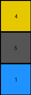
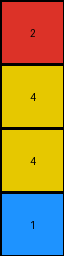

# 2dee498d • 018 • refine_coder

---

Previous Code:
```python
"""
Extracts the smallest repeating horizontal sequence from the input grid to form the output grid, allowing for interruptions.
"""

import numpy as np

def find_repeating_unit(grid):
    """Finds the smallest repeating unit in a grid along the horizontal axis, allowing interruptions."""
    height, width = grid.shape
    for unit_width in range(1, width + 1):
        unit = grid[:, :unit_width]
        # Check if the unit appears at least once anywhere in the grid
        for start_col in range(width - unit_width + 1):
            if np.array_equal(unit, grid[:, start_col:start_col + unit_width]):
                return unit  # Return the unit if found
    return grid  # If no repeating unit is found, return the original grid

def transform(input_grid):
    """
    Extracts the fundamental repeating unit from the input grid, handling potential interruptions.

    Args:
        input_grid (numpy.ndarray): The input grid.

    Returns:
        numpy.ndarray: The output grid, which is the repeating unit.
    """
    # Find the repeating unit, allowing for interruptions
    repeating_unit = find_repeating_unit(np.array(input_grid))

    # The repeating unit is the output grid
    output_grid = repeating_unit

    return output_grid.tolist()
```

Train Set Results:

## Example 1:

Input:
```
4 5 1 1 5 4 4 5 1
5 5 5 5 5 5 5 5 5
1 5 4 4 5 1 1 5 4
```
Expected Output:
```
4 5 1
5 5 5
1 5 4
```
Transformed Output:
```
4
5
1
```

match: False
pixels_off: None
size_correct: False
color_palette_correct: True
correct_pixel_counts: False

## Example 2:

Input:
```
2 0 0 1 2 0 0 1 2 0 0 1
4 2 1 4 4 2 1 4 4 2 1 4
4 1 2 4 4 1 2 4 4 1 2 4
1 0 0 2 1 0 0 2 1 0 0 2
```
Expected Output:
```
2 0 0 1
4 2 1 4
4 1 2 4
1 0 0 2
```
Transformed Output:
```
2
4
4
1
```

match: False
pixels_off: None
size_correct: False
color_palette_correct: True
correct_pixel_counts: False

## Example 3:

Input:
```
2 1 2 1 2 1
2 3 2 3 2 3
```
Expected Output:
```
2 1
2 3
```
Transformed Output:
```
2
2
```

match: False
pixels_off: None
size_correct: False
color_palette_correct: True
correct_pixel_counts: False
Here's an analysis of the provided examples and results, along with a strategy for improving the natural language program and subsequently the code:

**General Assessment and Strategy**

The initial code attempts to find a repeating horizontal sequence. However, it's overly simplistic. It identifies the *smallest* repeating unit, which, in these cases, is just the first pixel of each row. This leads to incorrect output dimensions and mismatched patterns. The strategy needs to shift from finding the *smallest* unit to finding the *correct* repeating unit that can reconstruct the entire input row when repeated. The current approach also doesn't reconstruct output, it selects a sub-grid.

The core issue is a misunderstanding of "repeating unit". It's not just *any* repeating sequence, but the *maximal* repeating sequence that generates the input when tiled. It looks like the current method is returning the first element of each row.

The updated strategy should involve these steps:

1.  **Iterate through potential unit widths:** Start with a width of 1 and go up to half the width of the input grid (a repeating unit cannot be larger than half the input).
2.  **Construct a hypothetical row/grid:** For each potential unit width, construct a hypothetical row by repeating the unit until it matches or exceeds the original row's length.
3. **Compare:** Compare this hypothetical row with the original input row. If they match, this unit is the correct repeating unit.
4. Construct output grid: if a repeating unit is found that can reconstruct the input row, then create an output grid that is the same as the found unit.

**Example Metrics and Analysis**

To better understand the failures, let's analyze each example using the provided outputs.

*   **Example 1:**
    *   Input Shape: (3, 9)
    *   Expected Output Shape: (3, 3)
    *   Actual Output Shape: (3, 1)
    *   Problem: The code extracted only the first element of each row (`4`, `5`, `1`). It identified these as the smallest repeating unit. The actual repeating unit is `4 5 1`, `5 5 5`, and `1 5 4`.
*   **Example 2:**
    *   Input Shape: (4, 12)
    *   Expected Output Shape: (4, 4)
    *   Actual Output Shape: (4, 1)
    *   Problem: Same as Example 1. The code extracted the first column (`2`, `4`, `4`, `1`). The correct repeating unit is `2 0 0 1`, `4 2 1 4`, `4 1 2 4`, `1 0 0 2`.
*   **Example 3:**
    *   Input Shape: (2, 6)
    *   Expected Output Shape: (2, 2)
    *   Actual Output Shape: (2, 1)
    *    Problem: Again, the first element of each row was extracted. Correct unit is `2 1` and `2 3`.

**YAML Fact Block**

```yaml
facts:
  example_1:
    input_objects:
      - type: grid
        dimensions: [3, 9]
        repeating_unit: [4, 5, 1] #observed repeating unit
    output_objects:
      - type: grid
        dimensions: [3, 3]
        content: [[4, 5, 1], [5, 5, 5], [1, 5, 4]]
    transformation: extract_repeating_unit
  example_2:
    input_objects:
      - type: grid
        dimensions: [4, 12]
        repeating_unit: [2, 0, 0, 1]
    output_objects:
      - type: grid
        dimensions: [4, 4]
        content:  [[2, 0, 0, 1], [4, 2, 1, 4], [4, 1, 2, 4], [1, 0, 0, 2]]
    transformation: extract_repeating_unit
  example_3:
    input_objects:
      - type: grid
        dimensions: [2, 6]
        repeating_unit: [2, 1]
    output_objects:
      - type: grid
        dimensions: [2, 2]
        content: [[2, 1], [2, 3]]
    transformation: extract_repeating_unit
  general:
    transformation_type: pattern_extraction
    pattern_type: horizontal_repetition
    objective: "Find the largest repeating unit of each row, such that repetition of that unit will re-create the input row"
```

**Natural Language Program**

1.  **Identify Rows:** Treat each row of the input grid independently.
2.  **Find Repeating Unit:** For each row, find the smallest sequence of pixels (the "repeating unit") from the beginning of the row that, when repeated, reconstructs the entire row. The length of the sequence should not be more than half of row length.
3.  **Construct Output:** Create the output grid by vertically stacking these identified repeating units. The height of the output grid is the same as the input grid. The width of the output grid is the length of the repeating unit discovered.

This natural language program directly addresses the observed failures by focusing on row-wise analysis and identifying the repeating unit based on its ability to reconstruct the original row. The previous approach incorrectly focused on the smallest possible repeating element.

**INSTRUCTIONS**

- generate a Python module to represent the natural language program 
- follow the template below
- all common math and science libraries are available
- create docstring only at top - but comment the workflow in the function
- use helper functions for common operations like finding objects, counting,
  measuring, moving, etc. 

remember - we are working iteratively - so this code will inform your future
self as we converge on the solution

*template:*

```python
"""
{{ natural language description of the transformation rule }}
"""

{{ imports }}

def transform(input_grid):
    # initialize output_grid

    # change output pixels 

    return output_grid

```
