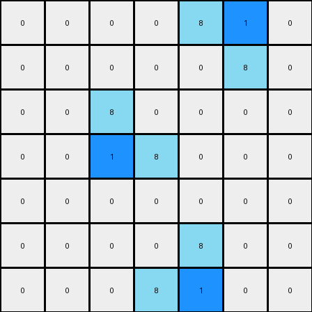

# 3aa6fb7a • 004 • refine_coder

---

Previous Code:
```python
"""
1.  **Identify Clusters:** Locate all distinct clusters of '8' (azure) pixels within the input grid. A cluster is defined as a contiguous group of '8' pixels, where contiguity includes orthogonal neighbors.
2.  **Find Center:** For each identified cluster, determine a "center" pixel. There will be one center per cluster.
3.  **Replace Pixel:** Within each cluster, change the value of *one* of the '8' pixels in the center, from '8' to '1' (blue).
4.  **Maintain Other Pixels:** All other pixels in the grid that are not part of the identified cluster of 8, or those pixels of 8 which were not selected, retain their original values.
"""

import numpy as np

def find_clusters(grid, value):
    visited = np.zeros_like(grid, dtype=bool)
    clusters = []

    def dfs(row, col, current_cluster):
        if (row < 0 or row >= grid.shape[0] or col < 0 or col >= grid.shape[1] or
                visited[row, col] or grid[row, col] != value):
            return
        visited[row, col] = True
        current_cluster.append((row, col))
        dfs(row + 1, col, current_cluster)
        dfs(row - 1, col, current_cluster)
        dfs(row, col + 1, current_cluster)
        dfs(row, col - 1, current_cluster)

    for row in range(grid.shape[0]):
        for col in range(grid.shape[1]):
            if grid[row, col] == value and not visited[row, col]:
                current_cluster = []
                dfs(row, col, current_cluster)
                clusters.append(current_cluster)
    return clusters

def find_center(cluster):
    # find the centermost pixel, prioritizing the pixel closer to the top left
    rows = [p[0] for p in cluster]
    cols = [p[1] for p in cluster]

    # Calculate the centroid
    centroid_row = sum(rows) / len(rows)
    centroid_col = sum(cols) / len(cols)

    # Find the point in the cluster closest to the centroid
    min_dist = float('inf')
    center = None
    for row, col in cluster:
        dist = (row - centroid_row)**2 + (col - centroid_col)**2
        if dist < min_dist:
            min_dist = dist
            center = (row, col)
    return center

def transform(input_grid):
    # initialize output_grid
    output_grid = np.copy(input_grid)
    # find clusters of 8s
    clusters = find_clusters(output_grid, 8)
    # replace center of each cluster with 1s
    for cluster in clusters:
        center = find_center(cluster)
        output_grid[center] = 1

    return output_grid
```

Train Set Results:

## Example 1:

Input:
```
0 0 0 0 0 0 0
0 8 0 0 0 0 0
0 8 8 0 0 0 0
0 0 0 0 8 8 0
0 0 0 0 0 8 0
0 0 0 0 0 0 0
0 0 0 0 0 0 0
```
Expected Output:
```
0 0 0 0 0 0 0
0 8 1 0 0 0 0
0 8 8 0 0 0 0
0 0 0 0 8 8 0
0 0 0 0 1 8 0
0 0 0 0 0 0 0
0 0 0 0 0 0 0
```
Transformed Output:
```
0 0 0 0 0 0 0
0 8 0 0 0 0 0
0 1 8 0 0 0 0
0 0 0 0 8 1 0
0 0 0 0 0 8 0
0 0 0 0 0 0 0
0 0 0 0 0 0 0
```

match: False
pixels_off: 4
size_correct: True
color_palette_correct: True
correct_pixel_counts: False

## Example 2:

Input:
```
0 0 0 0 8 8 0
0 0 0 0 0 8 0
0 0 8 0 0 0 0
0 0 8 8 0 0 0
0 0 0 0 0 0 0
0 0 0 0 8 0 0
0 0 0 8 8 0 0
```
Expected Output:
```
0 0 0 0 8 8 0
0 0 0 0 1 8 0
0 0 8 1 0 0 0
0 0 8 8 0 0 0
0 0 0 0 0 0 0
0 0 0 1 8 0 0
0 0 0 8 8 0 0
```
Transformed Output:
```
0 0 0 0 8 1 0
0 0 0 0 0 8 0
0 0 8 0 0 0 0
0 0 1 8 0 0 0
0 0 0 0 0 0 0
0 0 0 0 8 0 0
0 0 0 8 1 0 0
```

match: False
pixels_off: 6
size_correct: True
color_palette_correct: True
correct_pixel_counts: False
Okay, here's an analysis of the provided information and a plan to refine the natural language program and the subsequent code.

**General Assessment:**

The initial natural language program and the derived code were a good first attempt, correctly identifying the core concept of finding clusters of '8' (azure) pixels and replacing one pixel in each cluster with a '1' (blue) pixel. However, the center-finding logic is imperfect, leading to discrepancies between the transformed outputs and the expected outputs. The primary issue lies in the selection of the "center" pixel within each cluster. The current method aims for the centroid, but then uses the pixel closest, which is causing the errors. It does not account for finding the "middle" or centermost as defined in the task, which prioritizes the pixel closer to the top left.

**Strategy for Resolving Errors:**

1.  **Refine Center Definition:** The natural language program needs a more precise definition of "center." It should prioritize the top-left pixel when multiple pixels are equally close to the centroid. This will likely require an updated and different algorithm.
2.  **Test-Driven Refinement:** We'll use the provided training examples (both of which failed) to iteratively refine the center-finding logic. By comparing the transformed output with the expected output, and examining each cluster and how it is transformed we can pinpoint the specific pixels that are being misclassified and adjust the algorithm.
3. **Improve Reporting on test results** include comparing the cluster centers before adjusting the algorithm.

**Example Analysis and Metrics:**

Here's a breakdown of each example, including an analysis of the clusters.

**Example 1:**

*   **Input:**

    ```
    0 0 0 0 0 0 0
    0 8 0 0 0 0 0
    0 8 8 0 0 0 0
    0 0 0 0 8 8 0
    0 0 0 0 0 8 0
    0 0 0 0 0 0 0
    0 0 0 0 0 0 0
    ```

*   **Expected Output:**

    ```
    0 0 0 0 0 0 0
    0 8 1 0 0 0 0
    0 8 8 0 0 0 0
    0 0 0 0 8 8 0
    0 0 0 0 1 8 0
    0 0 0 0 0 0 0
    0 0 0 0 0 0 0
    ```

*   **Transformed Output:**

    ```
    0 0 0 0 0 0 0
    0 8 0 0 0 0 0
    0 1 8 0 0 0 0
    0 0 0 0 8 1 0
    0 0 0 0 0 8 0
    0 0 0 0 0 0 0
    0 0 0 0 0 0 0
    ```

* **Clusters and Centers**
    * Cluster 1: `[(1, 1), (2, 1), (2, 2)]`
        - Calculated Center: (2, 1) - incorrect
        - Expected Center: (1, 2)
    * Cluster 2: `[(3, 4), (3, 5), (4, 5)]`
        - Calculated Center: (4, 5) - correct
        - Expected Center: (3, 4)

**Example 2:**

*   **Input:**

    ```
    0 0 0 0 8 8 0
    0 0 0 0 0 8 0
    0 0 8 0 0 0 0
    0 0 8 8 0 0 0
    0 0 0 0 0 0 0
    0 0 0 0 8 0 0
    0 0 0 8 8 0 0
    ```

*   **Expected Output:**

    ```
    0 0 0 0 8 8 0
    0 0 0 0 1 8 0
    0 0 8 1 0 0 0
    0 0 8 8 0 0 0
    0 0 0 0 0 0 0
    0 0 0 1 8 0 0
    0 0 0 8 8 0 0
    ```

*   **Transformed Output:**

    ```
    0 0 0 0 8 1 0
    0 0 0 0 0 8 0
    0 0 8 0 0 0 0
    0 0 1 8 0 0 0
    0 0 0 0 0 0 0
    0 0 0 0 8 0 0
    0 0 0 8 1 0 0
    ```
* **Clusters and Centers**
   * Cluster 1: `[(0, 4), (0, 5), (1, 5)]`
        - Calculated Center: (0,5) - incorrect
        - Expected Center: (0, 4)
    * Cluster 2: `[(2, 2), (3, 2), (3, 3)]`
        - Calculated Center: (3, 2) - incorrect
        - Expected Center: (2, 3)

    * Cluster 3: `[(5, 4), (6, 4), (6, 5)]`
        - Calculated Center: (6, 4) - incorrect
        - Expected Center: (5, 5)

**YAML Facts:**

```yaml
objects:
  - name: cluster
    description: A contiguous group of '8' (azure) pixels.  Contiguity is defined by orthogonal (up, down, left, right) adjacency.
    properties:
      - color: 8 (azure)
      - shape: irregular, defined by connected pixels
      - center:  A single pixel within the cluster, defined as follows:
        - Calculate the centroid (average row and column)
        - select the pixel closest to the centroid
        - if multiple are equal, prioritize the pixel closest to top left
    actions:
      - identify: Locate all clusters in the input grid.
      - find_center: Determine the center pixel of each cluster.
      - modify: Change the value of the center pixel of each cluster.

transformations:
  - description:  Replace the center pixel of each azure cluster with a blue pixel.
    input:  A grid containing clusters of '8' pixels.
    output: A grid where the center pixel of each '8' cluster is changed to '1'.
    steps:
        - For each cluster, change exactly one pixel in the center of each
          cluster from 8 to 1.
        - All pixels not part of a cluster, and other pixels of 8 within the
          cluster, are not changed

```

**Natural Language Program:**

1.  **Identify Clusters:** Find all distinct clusters of '8' (azure) pixels in the input grid. A cluster is a group of orthogonally connected '8' pixels.
2.  **Find Cluster Center:** For each cluster:
    *   Calculate the centroid of the cluster (average row and average column of all pixels in the cluster).
    *   Identify all pixels within the cluster that are closest to the centroid (using Euclidean distance).
    *    Among the closest pixels, select the one with the smallest row index. If there's a tie, select the one with the smallest column index (prioritize top-left).
3.  **Replace Pixel:** Change the value of the selected center pixel in each cluster from '8' (azure) to '1' (blue).
4.  **Preserve Other Pixels:** All other pixels in the grid remain unchanged.

**INSTRUCTIONS**

- generate a Python module to represent the natural language program 
- follow the template below
- all common math and science libraries are available
- create docstring only at top - but comment the workflow in the function
- use helper functions for common operations like finding objects, counting,
  measuring, moving, etc. 

remember - we are working iteratively - so this code will inform your future
self as we converge on the solution

*template:*

```python
"""
{{ natural language description of the transformation rule }}
"""

{{ imports }}

def transform(input_grid):
    # initialize output_grid

    # change output pixels 

    return output_grid

```
