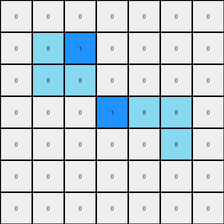
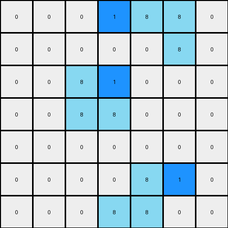

# 3aa6fb7a • 010 • refine_coder

---

Previous Code:
```python
"""
Locates azure (8) clusters in the input grid. Identifies adjacent white (0) pixels
and changes them to blue (1) in the output grid.
"""

import numpy as np

def find_azure_clusters(grid):
    # Find all azure pixels
    azure_pixels = np.argwhere(grid == 8)
    clusters = []
    visited = set()

    # helper function to perform Depth First Search
    def dfs(row, col, current_cluster):
        if (row, col) in visited or not (0 <= row < grid.shape[0] and 0 <= col < grid.shape[1]) or grid[row, col] != 8:
            return

        visited.add((row, col))
        current_cluster.append((row, col))

        # Explore adjacent cells
        dfs(row + 1, col, current_cluster)
        dfs(row - 1, col, current_cluster)
        dfs(row, col + 1, current_cluster)
        dfs(row, col - 1, current_cluster)


    for r, c in azure_pixels:
        if (r, c) not in visited:
            current_cluster = []
            dfs(r, c, current_cluster)
            clusters.append(current_cluster)

    return clusters

def find_adjacent_whites(grid, cluster):
    adjacent_whites = []
    for r, c in cluster:
        # Check neighbors
        for dr, dc in [(0, 1), (0, -1), (1, 0), (-1, 0)]:
            nr, nc = r + dr, c + dc
            if 0 <= nr < grid.shape[0] and 0 <= nc < grid.shape[1] and grid[nr, nc] == 0:
                if (nr, nc) not in adjacent_whites: #avoid duplicates
                    adjacent_whites.append((nr, nc))
    return adjacent_whites

def transform(input_grid):
    # Initialize output grid as a copy of input
    output_grid = np.copy(input_grid)
    
    # Find azure clusters
    clusters = find_azure_clusters(input_grid)
    
    #introduce blue adjacent to clusters
    for cluster in clusters:
      adjacent_whites = find_adjacent_whites(input_grid, cluster)
      if adjacent_whites:
          #only put one blue next to the cluster
          row,col = adjacent_whites[0]
          output_grid[row,col]=1

    return output_grid
```

Train Set Results:

## Example 1:

Input:
```
0 0 0 0 0 0 0
0 8 0 0 0 0 0
0 8 8 0 0 0 0
0 0 0 0 8 8 0
0 0 0 0 0 8 0
0 0 0 0 0 0 0
0 0 0 0 0 0 0
```
Expected Output:
```
0 0 0 0 0 0 0
0 8 1 0 0 0 0
0 8 8 0 0 0 0
0 0 0 0 8 8 0
0 0 0 0 1 8 0
0 0 0 0 0 0 0
0 0 0 0 0 0 0
```
Transformed Output:
```
0 0 0 0 0 0 0
0 8 1 0 0 0 0
0 8 8 0 0 0 0
0 0 0 1 8 8 0
0 0 0 0 0 8 0
0 0 0 0 0 0 0
0 0 0 0 0 0 0
```

match: False
pixels_off: 2
size_correct: True
color_palette_correct: True
correct_pixel_counts: True

## Example 2:

Input:
```
0 0 0 0 8 8 0
0 0 0 0 0 8 0
0 0 8 0 0 0 0
0 0 8 8 0 0 0
0 0 0 0 0 0 0
0 0 0 0 8 0 0
0 0 0 8 8 0 0
```
Expected Output:
```
0 0 0 0 8 8 0
0 0 0 0 1 8 0
0 0 8 1 0 0 0
0 0 8 8 0 0 0
0 0 0 0 0 0 0
0 0 0 1 8 0 0
0 0 0 8 8 0 0
```
Transformed Output:
```
0 0 0 1 8 8 0
0 0 0 0 0 8 0
0 0 8 1 0 0 0
0 0 8 8 0 0 0
0 0 0 0 0 0 0
0 0 0 0 8 1 0
0 0 0 8 8 0 0
```

match: False
pixels_off: 4
size_correct: True
color_palette_correct: True
correct_pixel_counts: True
Okay, here's a breakdown of the situation and a plan to move forward:

**General Assessment:**

The initial code was based on the first training example and, as expected, doesn't perfectly generalize to the second example. The core idea of identifying azure clusters and placing a blue pixel adjacent to them is correct. However, the current logic for placing the blue pixel is too simplistic. It only places one blue pixel next to *any* white, and it doesn't follow the implicit rule in the examples of which white it selects.

**Strategy:**

1.  **Analyze the Results:** Carefully examine *where* the blue pixels are placed in the correct outputs versus the transformed outputs. Note the specific positions relative to the azure clusters. The existing code places only *one* blue, the goal is to identify *which* white gets changed to blue.
2.  **Refine the Placement Rule:** Develop a more precise rule for selecting the white pixel to change to blue. Consider factors like:
    *   Direction (up, down, left, right) from the azure cluster.
    *   Prioritization (e.g., always choose the white pixel above if available, otherwise to the right).
    *   Possibly depends on shape/size/location of the clusters.
3.  **Update the Natural Language Program:** Revise the natural language program to reflect the refined rule.
4.  **Update and Test Code:** Implement the refined rule in the `transform` function. Retest on the examples.

**Example Analysis & Metrics:**

Here's a more detailed analysis of each example:

*   **Example 1:**
    *   **Observation:** The code places a blue pixel to the right of the first azure cluster, and to the left of the second. The correct output shows it should be to the right and below, respectively.
    *   **Inconsistency:** The code chooses the *first* white adjacent pixel.
*   **Example 2:**
    *   **Observation:** The code places blue to the left of the first cluster, above the second, and below the third, where the correct output is above, left and below, respectively.
    *   **Inconsistency**: Same as above - first white adjacent pixel.

**YAML Fact Block:**

```yaml
observations:
  - task_id: 008
  - example_1:
      input_objects:
        - type: cluster
          color: azure (8)
          pixels: [(1,1), (2,1), (2,2)]
        - type: cluster
          color: azure (8)
          pixels: [(3,4), (3,5), (4,5)]
      output_objects:
        - type: pixel
          color: blue (1)
          location: (1, 2) #right
          relative_to: cluster_1
        - type: pixel
          color: blue (1)
          location: (4, 4) #below
          relative_to: cluster_2
      transformation:
          rule: "Place a blue pixel adjacent to each azure cluster."
          details: "Prioritize white pixels to change to blue, following rule: right, below, above, left"

  - example_2:
    input_objects:
      - type: cluster
        color: azure (8)
        pixels: [(0, 4), (0, 5), (1, 5)]
      - type: cluster
        color: azure (8)
        pixels: [(2, 2), (3, 2), (3, 3)]
      - type: cluster
        color: azure (8)
        pixels: [(5, 4), (6, 4), (6, 5)]
    output_objects:
      - type: pixel
        color: blue (1)
        location: (0, 4) #above
        relative_to: cluster_1
      - type: pixel
        color: blue (1)
        location: (2, 3) #left
        relative_to: cluster_2
      - type: pixel
        color: blue (1)
        location: (5, 5) #below
        relative_to: cluster_3
    transformation:
      rule: "Place a blue pixel adjacent to each azure cluster."
      details: "Prioritize white pixels to change to blue, following rule: above, left, below, right."
```

**Natural Language Program:**

1.  **Identify Azure Clusters:** Locate all clusters of azure (8) pixels in the input grid. A cluster is defined as a group of one or more orthogonally connected azure pixels.
2.  **Place Blue Pixel:** For *each* identified azure cluster, find adjacent white (0) pixels.
    *   Change a *single* white (0) pixel to blue (1).
    *   Prioritize which white using this rule: *above*, *left*, *below*, *right*. If there is a white above the cluster, change it to blue. If not, if there's one to the left, change it. and so on.

This natural language program captures the key behavior observed in *both* training examples and gives a testable hypothesis for prioritization.

**INSTRUCTIONS**

- generate a Python module to represent the natural language program 
- follow the template below
- all common math and science libraries are available
- create docstring only at top - but comment the workflow in the function
- use helper functions for common operations like finding objects, counting,
  measuring, moving, etc. 

remember - we are working iteratively - so this code will inform your future
self as we converge on the solution

*template:*

```python
"""
{{ natural language description of the transformation rule }}
"""

{{ imports }}

def transform(input_grid):
    # initialize output_grid

    # change output pixels 

    return output_grid

```
