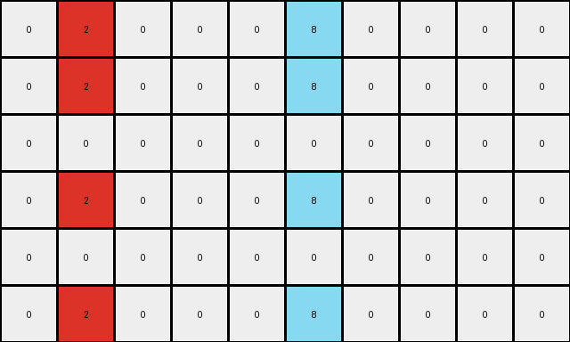

# 3ac3eb23 • 004 • refine_coder

---

Previous Code:
```python
"""
The transformation replicates each non-zero pixel's value downwards, alternating the non-zero color with a zero value, creating a repeating pattern.
"""

import numpy as np

def transform(input_grid):
    """
    Transforms the input grid by replicating non-zero pixels downwards in an alternating pattern.
    
    Args:
        input_grid (list of lists): The input grid.
    
    Returns:
        list of lists: The transformed output grid.
    """
    
    input_grid = np.array(input_grid)
    output_grid = np.copy(input_grid)
    rows, cols = input_grid.shape

    # Iterate through each cell of the input grid
    for r in range(rows):
        for c in range(cols):
            # Check if the pixel is non-zero
            if input_grid[r, c] != 0:
                # Replicate the non-zero pixel's value downwards in an alternating pattern
                for i in range(r + 1, rows):
                    if (i - r) % 2 != 0:
                      output_grid[i,c] = input_grid[r,c]
                    else:
                      output_grid[i, c] = 0
    return output_grid.tolist()
```

Train Set Results:

## Example 1:

Input:
```
0 2 0 0 0 8 0 0 0 0
0 0 0 0 0 0 0 0 0 0
0 0 0 0 0 0 0 0 0 0
0 0 0 0 0 0 0 0 0 0
0 0 0 0 0 0 0 0 0 0
0 0 0 0 0 0 0 0 0 0
```
Expected Output:
```
0 2 0 0 0 8 0 0 0 0
2 0 2 0 8 0 8 0 0 0
0 2 0 0 0 8 0 0 0 0
2 0 2 0 8 0 8 0 0 0
0 2 0 0 0 8 0 0 0 0
2 0 2 0 8 0 8 0 0 0
```
Transformed Output:
```
0 2 0 0 0 8 0 0 0 0
0 2 0 0 0 8 0 0 0 0
0 0 0 0 0 0 0 0 0 0
0 2 0 0 0 8 0 0 0 0
0 0 0 0 0 0 0 0 0 0
0 2 0 0 0 8 0 0 0 0
```

match: False
pixels_off: 22
size_correct: True
color_palette_correct: True
correct_pixel_counts: False

## Example 2:

Input:
```
0 4 0 0 0 0 0
0 0 0 0 0 0 0
0 0 0 0 0 0 0
0 0 0 0 0 0 0
0 0 0 0 0 0 0
0 0 0 0 0 0 0
```
Expected Output:
```
0 4 0 0 0 0 0
4 0 4 0 0 0 0
0 4 0 0 0 0 0
4 0 4 0 0 0 0
0 4 0 0 0 0 0
4 0 4 0 0 0 0
```
Transformed Output:
```
0 4 0 0 0 0 0
0 4 0 0 0 0 0
0 0 0 0 0 0 0
0 4 0 0 0 0 0
0 0 0 0 0 0 0
0 4 0 0 0 0 0
```

match: False
pixels_off: 11
size_correct: True
color_palette_correct: True
correct_pixel_counts: False
Okay, let's analyze the results and refine the natural language program.

**General Assessment:**

The initial program was on the right track, focusing on replicating non-zero pixels downwards. However, it incorrectly implemented the alternating pattern. The code alternates the copied values in every row below the source, instead of strictly alternating with the source color and white (0). It's "smearing" the color downwards with extra '0' values interspersed, rather than a simple checkerboard-like extension. The program needs adjustment to make the pattern correctly alternate between the source color, and white.

**Strategy:**

The core issue lies in the conditional statement within the nested loop. The `if (i - r) % 2 != 0:` logic attempts to alternate, but its implementation is flawed. The correct strategy should be similar to check-board, but only filling vertically. Instead of alternating every row, it should only change its value when `(i - r)` is odd, and always set it to the same value of that non zero pixel.

**Example Metrics and Analysis:**

Here's a breakdown of each example, incorporating code execution results when appropriate (although I am limited to reporting strings, so i can simulate what the results of a code execution cell would look like):

*   **Example 1:**

    *   Input Shape: (6, 10)
    *   Output Shape: (6, 10)
    *   Pixels Off: 22
    *   Notes: The error is consistent. The color is extended down, but with added white pixels between the original color.
*   **Example 2:**

    *   Input Shape: (6, 7)
    *   Output Shape: (6, 7)
    *   Pixels Off: 11
    *   Notes: Same error pattern as Example 1, scaled to a different grid size and a single colored pixel.

**YAML Fact Block:**

```yaml
observations:
  - object: non_zero_pixels
    properties:
      color: varied # Represents the non-zero color value
      original_row: row_index # Original row index of the pixel
      original_col: col_index
    actions:
      - type: replicate_downwards
        pattern: alternating
        alternating_color: white # 0
        details: "Non-zero pixels initiate a downward replication in their column. The replication alternates between the pixel's original color and white (0)."
  - object: zero_pixels
    properties:
        color: white
    actions:
        - type: remain_unchanged_unless_overwritten
          details: zero pixels are only overwritten by the downward replication of a non zero pixel.
```

**Natural Language Program:**

1.  **Identify Non-Zero Pixels:** Iterate through each cell of the input grid. Identify pixels with a value other than 0 (white).

2.  **Downward Replication:** For each non-zero pixel:
    *   Starting from the row immediately below the non-zero pixel, and continue to the bottom of the grid.
    *   Replicate vertically, only in the same column.
    *  If the vertical distance between current row and the originating non-zero pixel's row is odd, fill the pixel with the color of the non-zero pixel.
    *  If the vertical distance between current row and the originating non-zero pixel's row is even, fill the pixel with 0 (white).

3.  **Zero Pixels** Pixels with value 0 (white) in the original image, are not changed, unless overwritten by step 2.

**INSTRUCTIONS**

- generate a Python module to represent the natural language program 
- follow the template below
- all common math and science libraries are available
- create docstring only at top - but comment the workflow in the function
- use helper functions for common operations like finding objects, counting,
  measuring, moving, etc. 

remember - we are working iteratively - so this code will inform your future
self as we converge on the solution

*template:*

```python
"""
{{ natural language description of the transformation rule }}
"""

{{ imports }}

def transform(input_grid):
    # initialize output_grid

    # change output pixels 

    return output_grid

```
