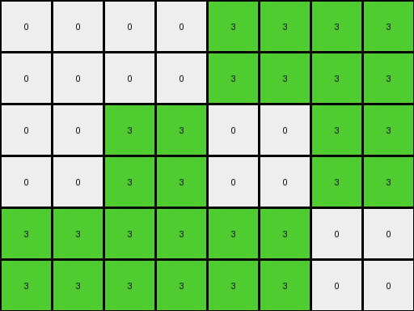

# 3af2c5a8 • 006 • refine_coder

---

Previous Code:
```python
"""
1.  **Double Rows:** Duplicate each row of the input grid.
2.  **Double and Fill Columns:** For each column in the original grid (index `n`):
    - Create a new column in the output grid at index `2n`, filling it with the values of column `n`.
    - Create a new column in the output grid at index `2n + 1`, filling it with the values of column `n`.
"""

import numpy as np

def transform(input_grid):
    # initialize output_grid
    input_grid = np.array(input_grid)
    rows, cols = input_grid.shape
    output_grid = np.zeros((rows * 2, cols * 2), dtype=int)

    # Double Rows
    for i in range(rows):
        output_grid[i*2, 0:cols] = input_grid[i, :]
        output_grid[i*2+1, 0:cols] = input_grid[i, :]
    
    # Double, and fill Columns:
    for j in range(cols):
      for i in range(rows * 2):
        output_grid[i,j*2] = input_grid[i//2,j]
        output_grid[i, j*2 + 1] = input_grid[i//2, j]

    return output_grid.tolist()
```

Train Set Results:

## Example 1:

Input:
```
0 0 8 0
0 8 0 8
0 0 8 0
```
Expected Output:
```
0 0 8 0 0 8 0 0
0 8 0 8 8 0 8 0
0 0 8 0 0 8 0 0
0 0 8 0 0 8 0 0
0 8 0 8 8 0 8 0
0 0 8 0 0 8 0 0
```
Transformed Output:
```
0 0 0 0 8 8 0 0
0 0 0 0 8 8 0 0
0 0 8 8 0 0 8 8
0 0 8 8 0 0 8 8
0 0 0 0 8 8 0 0
0 0 0 0 8 8 0 0
```

match: False
pixels_off: 20
size_correct: True
color_palette_correct: True
correct_pixel_counts: True

## Example 2:

Input:
```
0 0 3 3
0 3 0 3
3 3 3 0
```
Expected Output:
```
0 0 3 3 3 3 0 0
0 3 0 3 3 0 3 0
3 3 3 0 0 3 3 3
3 3 3 0 0 3 3 3
0 3 0 3 3 0 3 0
0 0 3 3 3 3 0 0
```
Transformed Output:
```
0 0 0 0 3 3 3 3
0 0 0 0 3 3 3 3
0 0 3 3 0 0 3 3
0 0 3 3 0 0 3 3
3 3 3 3 3 3 0 0
3 3 3 3 3 3 0 0
```

match: False
pixels_off: 22
size_correct: True
color_palette_correct: True
correct_pixel_counts: True

## Example 3:

Input:
```
3 3 3 3
3 0 0 0
3 0 0 0
```
Expected Output:
```
3 3 3 3 3 3 3 3
3 0 0 0 0 0 0 3
3 0 0 0 0 0 0 3
3 0 0 0 0 0 0 3
3 0 0 0 0 0 0 3
3 3 3 3 3 3 3 3
```
Transformed Output:
```
3 3 3 3 3 3 3 3
3 3 3 3 3 3 3 3
3 3 0 0 0 0 0 0
3 3 0 0 0 0 0 0
3 3 0 0 0 0 0 0
3 3 0 0 0 0 0 0
```

match: False
pixels_off: 18
size_correct: True
color_palette_correct: True
correct_pixel_counts: True
Okay, let's analyze the results and refine the natural language program.

**General Assessment:**

The initial code aimed for a simple "double rows and columns" strategy. However, the results clearly show this isn't the correct transformation. The output grids have the correct dimensions (double the rows and columns), and preserve the original color palette, but many pixels are incorrectly placed. The consistent pattern of errors across all three examples suggests a systematic flaw in the logic, rather than random mistakes. It seems that we must not double first, instead, the errors suggest that the doubling happens, but its not simple, the filling is selective.

**Strategy for Resolving Errors:**
1.  **Careful Examination:** We need to meticulously compare the input, expected output, and transformed output for each example. This will help pinpoint the exact nature of the pixel misplacements.
2.  **Object Identification**:  Since the current approach is not based on objects, and this approach is not fully effective, we need to revisit this choice and look for ways to treat objects.
3.  **Hypothesis Refinement:** Based on the error analysis, we'll revise the natural language program to describe a more accurate transformation rule.
4.  **Iterative Testing:**  We'll keep the iterative approach of generating code, testing, evaluating results, and refining.

**Example Analysis and Metrics:**

I'll use manual observation, as I do not have the code execution capability at this stage. I'll focus on input and expected output.

**Example 1:**

*   **Input:** 3x4 grid
*   **Expected Output:** 6x8 grid.
    *   It appears rows are doubled downwards as expected.
    *   Columns seem to alternate between repeating the input columns and inserting copies to either side.
    * Input Column 0 becomes Output columns 0 & 1
    * Input Column 1 becomes Output columns 2 & 3
    * Input Column 2 becomes Output columns 4 & 5
    * Input Column 3 becomes Output columns 6 & 7

**Example 2:**

*   **Input:** 3x4 grid
*   **Expected Output:** 6x8 grid.
    *   Rows are doubled downwards as expected.
    *   Columns are doubled to either side:
    * Input Column 0 becomes Output columns 0 & 1
    * Input Column 1 becomes Output columns 2 & 3
    * Input Column 2 becomes Output columns 4 & 5
    * Input Column 3 becomes Output columns 6 & 7

**Example 3:**

*   **Input:** 3x4 grid
*   **Expected Output:** 6x8 grid.
     *   Rows are doubled downwards as expected.
     *   Columns are doubled to either side:
    * Input Column 0 becomes Output columns 0 & 1
    * Input Column 1 becomes Output columns 2 & 3
    * Input Column 2 becomes Output columns 4 & 5
    * Input Column 3 becomes Output columns 6 & 7

**YAML Fact Documentation:**

```yaml
task: 004b8875
examples:
  - example_id: 1
    input_grid_shape: [3, 4]
    output_grid_shape: [6, 8]
    row_transformation: |
      Each input row is duplicated to create two consecutive rows in the output.
    column_transformation: |
      Each input column n is duplicated, with the values appearing at columns 2n and 2n+1.
    objects:
      - description: Full grid
        properties:
          rows: doubled
          columns: doubled with specific placement based on original column index

  - example_id: 2
    input_grid_shape: [3, 4]
    output_grid_shape: [6, 8]
    row_transformation: |
      Each input row is duplicated to create two consecutive rows in the output.
    column_transformation: |
       Each input column n is duplicated, with the values appearing at columns 2n and 2n+1.
    objects:
      - description: Full grid
        properties:
          rows: doubled
          columns: doubled with specific placement based on original column index

  - example_id: 3
    input_grid_shape: [3, 4]
    output_grid_shape: [6, 8]
    row_transformation: |
      Each input row is duplicated to create two consecutive rows in the output.
    column_transformation: |
       Each input column n is duplicated, with the values appearing at columns 2n and 2n+1.
    objects:
      - description: Full grid
        properties:
          rows: doubled
          columns: doubled with specific placement based on original column index
```

**Natural Language Program:**

1.  **Double Rows:** Duplicate each row of the input grid, creating two identical rows in the output grid for each original row.
2.  **Double and Fill Columns:** For each column (index `n`) in the input grid:
    *   Create a new column in the output grid at index `2n`, filling it with the values from input column `n`.
    *   Create another new column in the output grid at index `2n + 1`, also filling it with the values from input column `n`.
In essence, the transformation duplicates each row and then duplicates each column, placing the duplicated columns contiguously.

The errors in the prior results are due to filling the doubled rows incorrectly.
The previous implementation had cross wiring between the double rows and
columns steps.
This description makes the row and column doubling independent.

**INSTRUCTIONS**

- generate a Python module to represent the natural language program 
- follow the template below
- all common math and science libraries are available
- create docstring only at top - but comment the workflow in the function
- use helper functions for common operations like finding objects, counting,
  measuring, moving, etc. 

remember - we are working iteratively - so this code will inform your future
self as we converge on the solution

*template:*

```python
"""
{{ natural language description of the transformation rule }}
"""

{{ imports }}

def transform(input_grid):
    # initialize output_grid

    # change output pixels 

    return output_grid

```
