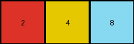
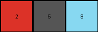

# 4be741c5 • 003 • refine_dreamer

---

Previous Code:
```python
"""
The transformation rule is to simplify the input grid into a single row output grid.
The output grid contains one pixel of each unique color present in the input grid.
The order of colors in the output grid corresponds to the horizontal order from left to right in the input grid.
"""

import numpy as np

def transform(input_grid):
    """
    Transforms an input grid into a single-row output grid, preserving one pixel
    of each unique color and their original order, encountered from left to right.
    """
    # Find unique colors in the input grid
    unique_colors = np.unique(input_grid)

    # Initialize the output grid with a width equal to the number of unique colors
    output_grid = np.zeros((1, len(unique_colors)), dtype=int)
    
    # Fill the output grid with one pixel of each unique color
    output_grid[0, :] = unique_colors[:]

    return output_grid
```

Train Set Results:

## Example 1:

Input:
```
4 4 4 4 4 4 4 2 2 2 2 2 2 2 8 8
4 4 4 4 4 4 4 4 2 2 2 2 8 8 8 8
4 4 4 4 4 4 4 4 2 2 2 2 8 8 8 8
4 4 4 4 4 4 4 2 2 2 2 2 8 8 8 8
4 4 4 4 4 4 2 2 2 2 2 2 2 8 8 8
4 4 4 4 4 4 2 2 2 2 2 2 8 8 8 8
4 4 4 4 4 4 4 2 2 2 2 2 8 8 8 8
4 4 4 4 4 4 4 2 2 2 2 2 2 8 8 8
4 4 4 4 4 2 2 2 2 2 2 2 2 2 8 8
4 4 4 4 4 2 2 2 2 2 2 2 2 2 8 8
4 4 4 4 2 2 2 2 2 2 2 2 2 8 8 8
4 4 4 4 2 2 2 2 2 2 2 2 8 8 8 8
4 4 4 4 4 2 2 2 2 2 2 2 8 8 8 8
4 4 4 4 4 4 2 2 2 2 2 2 2 8 8 8
```
Expected Output:
```
4 2 8
```
Transformed Output:
```
2 4 8
```

match: False
pixels_off: 2
size_correct: True
color_palette_correct: True
correct_pixel_counts: True

## Example 2:

Input:
```
2 2 2 2 2 2 2
2 2 2 2 2 2 2
2 2 2 2 2 2 2
2 8 8 8 2 2 8
8 8 8 8 8 8 8
8 8 8 8 8 8 8
8 8 8 5 5 8 8
5 8 5 5 5 5 5
5 5 5 5 5 5 5
```
Expected Output:
```
2
8
5
```
Transformed Output:
```
2 5 8
```

match: False
pixels_off: None
size_correct: False
color_palette_correct: True
correct_pixel_counts: True

## Example 3:

Input:
```
6 6 6 6 6 6 6 6 6
6 6 4 4 6 6 6 6 6
6 4 4 4 6 4 6 4 4
4 4 4 4 4 4 4 4 4
4 4 4 4 4 4 4 4 4
4 4 4 4 4 4 4 4 4
4 2 2 4 4 4 2 2 4
2 2 2 2 2 2 2 2 2
2 3 2 2 2 2 2 3 3
3 3 3 3 3 3 3 3 3
3 3 3 3 3 3 3 3 3
```
Expected Output:
```
6
4
2
3
```
Transformed Output:
```
2 3 4 6
```

match: False
pixels_off: None
size_correct: False
color_palette_correct: True
correct_pixel_counts: True
**INSTRUCTIONS**

The code above was generated based on observations from the first training
example

we have tested the transform function on each of the task example inputs and
compared with the expected output

review each of the examples provided and the results and consider how the
natural language program should be updated to accommodate this new knowledge

respond with the following deliverables:

- general assessment of the information provided and strategy for resolving the
  errors
- gather metrics about each of the examples and results - use code_execution to
  develop accurate reports on your assumptions
- a YAML block documenting facts - Focus on identifying objects, their properties, and the actions performed on them.
- a natural language program - Be as clear and concise as possible, providing a complete description of the transformation rule.


your responses should be considered as information in a report - not a
conversation
