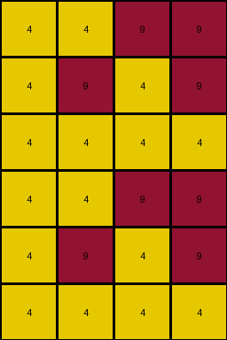
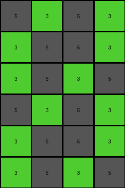

# 4c4377d9 • 009 • refine_dreamer

---

Previous Code:
```python
"""
1.  **Duplicate:** Duplicate the entire input grid vertically to create a 6x4 grid.
2.  **Mirror Top Left:**
    The first row of the duplicated grid is unchanged.
    The values of first column is copied to the last column of the duplicated grid.
3.  **Mirror Bottom Right**
The last row of the duplicated grid is unchanged.
The values of the last column are copied to the first column.

In short, the transformation copies values from the left edge of the input to the right edge of the output, and copies values from the right edge to the left edge.
"""

import numpy as np

def transform(input_grid):
    # Duplicate the input grid vertically
    output_grid = np.concatenate((input_grid, input_grid), axis=0)

    # Get dimensions of the output grid
    rows, cols = output_grid.shape

    # Mirror Top Left to bottom Right: Copy first column to last column
    output_grid[:, cols - 1] = output_grid[:, 0]

     # Mirror Bottom Right to Top Left: Copy last column of input to the first column of output
    output_grid[:,0] = np.concatenate((input_grid[:, -1], input_grid[:, -1]), axis=0)
    
    return output_grid
```

Train Set Results:

## Example 1:

Input:
```
9 9 5 9
5 5 9 9
9 5 9 9
```
Expected Output:
```
9 5 9 9
5 5 9 9
9 9 5 9
9 9 5 9
5 5 9 9
9 5 9 9
```
Transformed Output:
```
9 9 5 9
9 5 9 5
9 5 9 9
9 9 5 9
9 5 9 5
9 5 9 9
```

match: False
pixels_off: 8
size_correct: True
color_palette_correct: True
correct_pixel_counts: True

## Example 2:

Input:
```
4 1 1 4
1 1 1 1
4 4 4 1
```
Expected Output:
```
4 4 4 1
1 1 1 1
4 1 1 4
4 1 1 4
1 1 1 1
4 4 4 1
```
Transformed Output:
```
4 1 1 4
1 1 1 1
1 4 4 4
4 1 1 4
1 1 1 1
1 4 4 4
```

match: False
pixels_off: 8
size_correct: True
color_palette_correct: True
correct_pixel_counts: True

## Example 3:

Input:
```
9 4 9 4
9 9 4 4
4 4 4 4
```
Expected Output:
```
4 4 4 4
9 9 4 4
9 4 9 4
9 4 9 4
9 9 4 4
4 4 4 4
```
Transformed Output:
```
4 4 9 9
4 9 4 9
4 4 4 4
4 4 9 9
4 9 4 9
4 4 4 4
```

match: False
pixels_off: 10
size_correct: True
color_palette_correct: True
correct_pixel_counts: True

## Example 4:

Input:
```
3 3 5 5
3 5 5 3
5 5 3 3
```
Expected Output:
```
5 5 3 3
3 5 5 3
3 3 5 5
3 3 5 5
3 5 5 3
5 5 3 3
```
Transformed Output:
```
5 3 5 3
3 5 5 3
3 5 3 5
5 3 5 3
3 5 5 3
3 5 3 5
```

match: False
pixels_off: 8
size_correct: True
color_palette_correct: True
correct_pixel_counts: True
**INSTRUCTIONS**

The code above was generated based on observations from the first training
example

we have tested the transform function on each of the task example inputs and
compared with the expected output

review each of the examples provided and the results and consider how the
natural language program should be updated to accommodate this new knowledge

respond with the following deliverables:

- general assessment of the information provided and strategy for resolving the
  errors
- gather metrics about each of the examples and results - use code_execution to
  develop accurate reports on your assumptions
- a YAML block documenting facts - Focus on identifying objects, their properties, and the actions performed on them.
- a natural language program - Be as clear and concise as possible, providing a complete description of the transformation rule.


your responses should be considered as information in a report - not a
conversation
