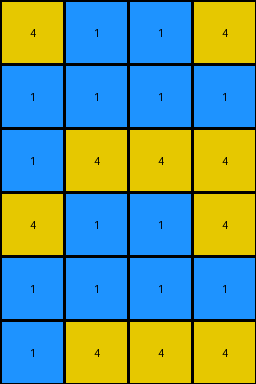
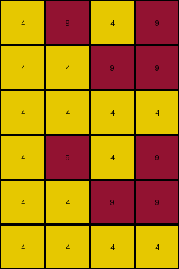

# 4c4377d9 • 011 • refine_dreamer

---

Previous Code:
```python
"""
1.  **Duplicate:** Create a vertically duplicated copy of the input grid. The output grid will have twice the number of rows as the input grid and the same number of columns.

2.  **Horizontal Mirror (within each duplicate):** Within *each* of the duplicated sections (top half and bottom half), perform a horizontal mirror operation. This means reversing the order of columns within each half.  The leftmost column becomes the rightmost, the second leftmost becomes the second rightmost, and so on.
"""

import numpy as np

def transform(input_grid):
    # Duplicate the input grid vertically
    output_grid = np.concatenate((input_grid, input_grid), axis=0)

    # Get dimensions of the output grid and input_grid
    rows_out, cols_out = output_grid.shape
    rows_in, cols_in = input_grid.shape

    # Horizontal Mirror (Top Half)
    for i in range(rows_in):
        output_grid[i, :] = input_grid[i, ::-1]  # Reverse the row

    # Horizontal Mirror (Bottom Half)
    for i in range(rows_in):
        output_grid[i + rows_in, :] = input_grid[i, ::-1] # Reverse the row

    return output_grid
```

Train Set Results:

## Example 1:

Input:
```
9 9 5 9
5 5 9 9
9 5 9 9
```
Expected Output:
```
9 5 9 9
5 5 9 9
9 9 5 9
9 9 5 9
5 5 9 9
9 5 9 9
```
Transformed Output:
```
9 5 9 9
9 9 5 5
9 9 5 9
9 5 9 9
9 9 5 5
9 9 5 9
```

match: False
pixels_off: 12
size_correct: True
color_palette_correct: True
correct_pixel_counts: True

## Example 2:

Input:
```
4 1 1 4
1 1 1 1
4 4 4 1
```
Expected Output:
```
4 4 4 1
1 1 1 1
4 1 1 4
4 1 1 4
1 1 1 1
4 4 4 1
```
Transformed Output:
```
4 1 1 4
1 1 1 1
1 4 4 4
4 1 1 4
1 1 1 1
1 4 4 4
```

match: False
pixels_off: 8
size_correct: True
color_palette_correct: True
correct_pixel_counts: True

## Example 3:

Input:
```
9 4 9 4
9 9 4 4
4 4 4 4
```
Expected Output:
```
4 4 4 4
9 9 4 4
9 4 9 4
9 4 9 4
9 9 4 4
4 4 4 4
```
Transformed Output:
```
4 9 4 9
4 4 9 9
4 4 4 4
4 9 4 9
4 4 9 9
4 4 4 4
```

match: False
pixels_off: 16
size_correct: True
color_palette_correct: True
correct_pixel_counts: True

## Example 4:

Input:
```
3 3 5 5
3 5 5 3
5 5 3 3
```
Expected Output:
```
5 5 3 3
3 5 5 3
3 3 5 5
3 3 5 5
3 5 5 3
5 5 3 3
```
Transformed Output:
```
5 5 3 3
3 5 5 3
3 3 5 5
5 5 3 3
3 5 5 3
3 3 5 5
```

match: False
pixels_off: 8
size_correct: True
color_palette_correct: True
correct_pixel_counts: True
**INSTRUCTIONS**

The code above was generated based on observations from the first training
example

we have tested the transform function on each of the task example inputs and
compared with the expected output

review each of the examples provided and the results and consider how the
natural language program should be updated to accommodate this new knowledge

respond with the following deliverables:

- general assessment of the information provided and strategy for resolving the
  errors
- gather metrics about each of the examples and results - use code_execution to
  develop accurate reports on your assumptions
- a YAML block documenting facts - Focus on identifying objects, their properties, and the actions performed on them.
- a natural language program - Be as clear and concise as possible, providing a complete description of the transformation rule.


your responses should be considered as information in a report - not a
conversation
