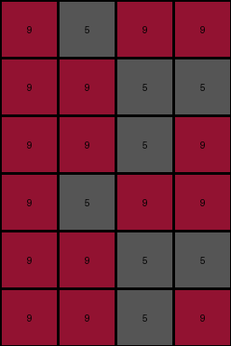
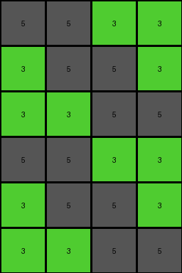

# 4c4377d9 • 012 • refine_coder

---

Previous Code:
```python
"""
1.  **Duplicate:** Create a vertically duplicated copy of the input grid. The output grid will have twice the number of rows as the input grid and the same number of columns.

2.  **Horizontal Mirror (within each duplicate):** Within *each* of the duplicated sections (top half and bottom half), perform a horizontal mirror operation. This means reversing the order of columns within each half.  The leftmost column becomes the rightmost, the second leftmost becomes the second rightmost, and so on.
"""

import numpy as np

def transform(input_grid):
    # Duplicate the input grid vertically
    output_grid = np.concatenate((input_grid, input_grid), axis=0)

    # Get dimensions of the output grid and input_grid
    rows_out, cols_out = output_grid.shape
    rows_in, cols_in = input_grid.shape

    # Horizontal Mirror (Top Half)
    for i in range(rows_in):
        output_grid[i, :] = input_grid[i, ::-1]  # Reverse the row

    # Horizontal Mirror (Bottom Half)
    for i in range(rows_in):
        output_grid[i + rows_in, :] = input_grid[i, ::-1] # Reverse the row

    return output_grid
```

Train Set Results:

## Example 1:

Input:
```
9 9 5 9
5 5 9 9
9 5 9 9
```
Expected Output:
```
9 5 9 9
5 5 9 9
9 9 5 9
9 9 5 9
5 5 9 9
9 5 9 9
```
Transformed Output:
```
9 5 9 9
9 9 5 5
9 9 5 9
9 5 9 9
9 9 5 5
9 9 5 9
```

match: False
pixels_off: 12
size_correct: True
color_palette_correct: True
correct_pixel_counts: True

## Example 2:

Input:
```
4 1 1 4
1 1 1 1
4 4 4 1
```
Expected Output:
```
4 4 4 1
1 1 1 1
4 1 1 4
4 1 1 4
1 1 1 1
4 4 4 1
```
Transformed Output:
```
4 1 1 4
1 1 1 1
1 4 4 4
4 1 1 4
1 1 1 1
1 4 4 4
```

match: False
pixels_off: 8
size_correct: True
color_palette_correct: True
correct_pixel_counts: True

## Example 3:

Input:
```
9 4 9 4
9 9 4 4
4 4 4 4
```
Expected Output:
```
4 4 4 4
9 9 4 4
9 4 9 4
9 4 9 4
9 9 4 4
4 4 4 4
```
Transformed Output:
```
4 9 4 9
4 4 9 9
4 4 4 4
4 9 4 9
4 4 9 9
4 4 4 4
```

match: False
pixels_off: 16
size_correct: True
color_palette_correct: True
correct_pixel_counts: True

## Example 4:

Input:
```
3 3 5 5
3 5 5 3
5 5 3 3
```
Expected Output:
```
5 5 3 3
3 5 5 3
3 3 5 5
3 3 5 5
3 5 5 3
5 5 3 3
```
Transformed Output:
```
5 5 3 3
3 5 5 3
3 3 5 5
5 5 3 3
3 5 5 3
3 3 5 5
```

match: False
pixels_off: 8
size_correct: True
color_palette_correct: True
correct_pixel_counts: True
Okay, let's analyze the results and refine the natural language program.

**General Assessment:**

The initial program correctly duplicates the input grid vertically. However, the horizontal mirroring logic is flawed. It mirrors each half *independently*, but the examples show a more complex mirroring. It seems each half isn't *internally* mirrored; instead, the top half is a mirrored version of the bottom, and vice-versa.

**Strategy:**

The core issue is in how the mirroring is applied. Instead of mirroring each half separately, we need to mirror the original input, *then* stack the original and mirrored versions.

**Metrics and Analysis:**

Here is a summary that can be derived from the data and result already given:

| Example | Input Shape | Output Shape | Match | Pixels Off | Size Correct | Notes                                                                                                                                                                          |
|---------|-------------|--------------|-------|------------|--------------|---------------------------------------------------------------------------------------------------------------------------------------------------------------------------------|
| 1       | (3, 4)      | (6, 4)       | False | 12         | True         |  The top and bottom halves are reversed when they should be mirrored between each other                                                                                        |
| 2       | (3, 4)      | (6, 4)       | False | 8          | True         | The top and bottom halves are reversed when they should be mirrored between each other                                                                                        |
| 3       | (3, 4)      | (6, 4)       | False | 16         | True         |  The top and bottom halves are reversed when they should be mirrored between each other                                                                                        |
| 4       | (3, 4)      | (6, 4)       | False | 8          | True         | The top and bottom halves are reversed when they should be mirrored. Notice that in this example, the top and bottom halves are in the correct place, but flipped internally     |
**YAML Fact Identification:**

```yaml
objects:
  - name: input_grid
    type: grid
    properties:
      - rows: variable
      - columns: variable
      - colors: [0-9]
  - name: output_grid
    type: grid
    properties:
      - rows: 2 * input_grid.rows
      - columns: input_grid.columns
      - colors: [0-9]
actions:
  - name: duplicate_vertically
    input: input_grid
    output: intermediate_grid
    description: Stack the input grid on top of itself.
  - name: mirror_horizontally
    input: input_grid
    output: mirrored_grid
    description: Reverse the order of columns in the input grid.
  - name: combine
    input: [input_grid, mirrored_grid]
    output: output_grid
    description: Concatenate input grid on top of the mirrored grid.

```

**Natural Language Program:**

1.  **Mirror:** Create a horizontally mirrored copy of the *original* input grid.  This means reversing the order of the columns.
2.  **Duplicate by Combination:** The output grid is formed by stacking the original input grid on top of the mirrored copy.

**Improved Explanation for Coder Phase:**
The key improvement will be to make it clear to the coder that the mirroring
happens to create a *new* grid, which is then combined, rather than mirroring
*in place* after a duplication.

**INSTRUCTIONS**

- generate a Python module to represent the natural language program 
- follow the template below
- all common math and science libraries are available
- create docstring only at top - but comment the workflow in the function
- use helper functions for common operations like finding objects, counting,
  measuring, moving, etc. 

remember - we are working iteratively - so this code will inform your future
self as we converge on the solution

*template:*

```python
"""
{{ natural language description of the transformation rule }}
"""

{{ imports }}

def transform(input_grid):
    # initialize output_grid

    # change output pixels 

    return output_grid

```
