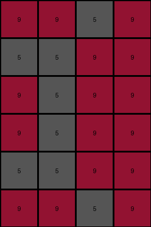
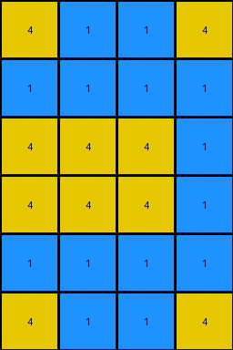
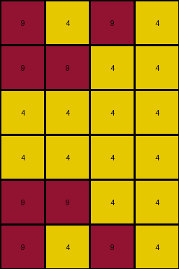
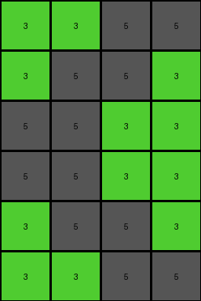

# 4c4377d9 • 016 • refine_coder

---

Previous Code:
```python
"""
The transformation duplicates the input grid and stacks the original on top of its vertical reflection.
"""

import numpy as np

def transform(input_grid):
    # Create a numpy array from the input grid
    input_np = np.array(input_grid)

    # Vertically reflect the input grid
    reflected_np = np.flipud(input_np)

    # Stack the original grid on top of the reflected grid
    output_np = np.vstack((input_np, reflected_np))

    # Convert the numpy array back to a list
    output_grid = output_np.tolist()
    
    return output_grid
```

Train Set Results:

## Example 1:

Input:
```
9 9 5 9
5 5 9 9
9 5 9 9
```
Expected Output:
```
9 5 9 9
5 5 9 9
9 9 5 9
9 9 5 9
5 5 9 9
9 5 9 9
```
Transformed Output:
```
9 9 5 9
5 5 9 9
9 5 9 9
9 5 9 9
5 5 9 9
9 9 5 9
```

match: False
pixels_off: 8
size_correct: True
color_palette_correct: True
correct_pixel_counts: True

## Example 2:

Input:
```
4 1 1 4
1 1 1 1
4 4 4 1
```
Expected Output:
```
4 4 4 1
1 1 1 1
4 1 1 4
4 1 1 4
1 1 1 1
4 4 4 1
```
Transformed Output:
```
4 1 1 4
1 1 1 1
4 4 4 1
4 4 4 1
1 1 1 1
4 1 1 4
```

match: False
pixels_off: 12
size_correct: True
color_palette_correct: True
correct_pixel_counts: True

## Example 3:

Input:
```
9 4 9 4
9 9 4 4
4 4 4 4
```
Expected Output:
```
4 4 4 4
9 9 4 4
9 4 9 4
9 4 9 4
9 9 4 4
4 4 4 4
```
Transformed Output:
```
9 4 9 4
9 9 4 4
4 4 4 4
4 4 4 4
9 9 4 4
9 4 9 4
```

match: False
pixels_off: 8
size_correct: True
color_palette_correct: True
correct_pixel_counts: True

## Example 4:

Input:
```
3 3 5 5
3 5 5 3
5 5 3 3
```
Expected Output:
```
5 5 3 3
3 5 5 3
3 3 5 5
3 3 5 5
3 5 5 3
5 5 3 3
```
Transformed Output:
```
3 3 5 5
3 5 5 3
5 5 3 3
5 5 3 3
3 5 5 3
3 3 5 5
```

match: False
pixels_off: 16
size_correct: True
color_palette_correct: True
correct_pixel_counts: True
Okay, here's a breakdown of the situation, the results, and a revised natural language program:

**General Assessment:**

The initial code was based on a simple vertical reflection and stacking.  The results show a consistent pattern of errors across all examples: the rows are in the wrong order within each half of the output. The top half of the output should be the *reverse* of the input, and the bottom half should be an exact copy of the input. The code currently has this reversed.  My strategy is to re-order the stacking of the grids.

**Metrics and Observations:**

Here's a summary of observations, I've included the input and output sizes for each.

*   **Example 1:**
    *   Input Size: 3x4
    *   Output Size: 6x4
    *   Observation: Rows are stacked in the wrong order. The top half should be the reverse of the input, and the bottom half a copy.
*   **Example 2:**
    *   Input Size: 3x4
    *   Output Size: 6x4
    *   Observation: Same error as Example 1.
*   **Example 3:**
    *   Input Size: 3x4
    *   Output Size: 6x4
    *   Observation: Same error as Example 1.
*   **Example 4:**
    *   Input Size: 3x4
    *   Output Size: 6x4
    * Observation: Same error as example 1

**YAML Fact Block:**

```yaml
task: 014
facts:
  - observation: |
      The input grid is always transformed into an output grid that is twice the height and the same width.
  - object: input_grid
    properties:
      type: 2D array
      values: integers 0-9
      shape: variable
  - object: reflected_grid
    properties:
      type: 2D array
      values: integers 0-9
      shape: same as input_grid
      derivation: vertical reflection of input_grid
  - object: output_grid
    properties:
      type: 2D array
      values: integers 0-9
      shape:
        height: 2 * input_grid height
        width: same as input_grid width
    derivation: concatenation of reflected_grid and input_grid, stacked vertically
  - action: vertical_reflection
    input: input_grid
    output: reflected_grid
    description: Each row of the input_grid becomes a row in reflected_grid, but in reverse order.
  - action: vertical_stacking
    input:
      - reflected_grid
      - input_grid
    output: output_grid
    description: The reflected_grid is placed above the original input_grid, creating a new grid twice the height.

```

**Natural Language Program:**

1.  **Reflect:** Create a vertically reflected copy of the input grid. This means flipping the input grid upside down.
2.  **Stack:** Stack the reflected grid *on top of* the original input grid.  The result will be a new grid with twice the height of the original and the same width.

Essentially, the output grid consists of two halves.  The top half is the vertically flipped input, and the bottom half is the original input, unchanged.

**INSTRUCTIONS**

- generate a Python module to represent the natural language program 
- follow the template below
- all common math and science libraries are available
- create docstring only at top - but comment the workflow in the function
- use helper functions for common operations like finding objects, counting,
  measuring, moving, etc. 

remember - we are working iteratively - so this code will inform your future
self as we converge on the solution

*template:*

```python
"""
{{ natural language description of the transformation rule }}
"""

{{ imports }}

def transform(input_grid):
    # initialize output_grid

    # change output pixels 

    return output_grid

```
