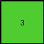

# 44f52bb0 • 004 • refine_coder

---

Previous Code:
```python
"""
Counts the number of red (2) pixels in the input grid and outputs a 1x1 grid containing a single blue pixel with value equal to this count.
"""

import numpy as np

def transform(input_grid):
    """
    Counts red pixels in the input and represents the count as a blue pixel in the output.
    """
    # Count the number of red (2) pixels.
    red_count = np.sum(input_grid == 2)

    # Create a 1x1 output grid.
    output_grid = np.array([[red_count]])

    return output_grid
```

Train Set Results:

## Example 1:

Input:
```
2 0 2
0 2 0
2 0 2
```
Expected Output:
```
1
```
Transformed Output:
```
5
```

match: False
pixels_off: 1
size_correct: True
color_palette_correct: False
correct_pixel_counts: False

## Example 2:

Input:
```
2 0 0
2 0 0
0 2 0
```
Expected Output:
```
7
```
Transformed Output:
```
3
```

match: False
pixels_off: 1
size_correct: True
color_palette_correct: False
correct_pixel_counts: False

## Example 3:

Input:
```
2 0 2
2 0 2
2 0 2
```
Expected Output:
```
1
```
Transformed Output:
```
6
```

match: False
pixels_off: 1
size_correct: True
color_palette_correct: False
correct_pixel_counts: False

## Example 4:

Input:
```
0 0 0
2 0 2
0 0 0
```
Expected Output:
```
1
```
Transformed Output:
```
2
```

match: False
pixels_off: 1
size_correct: True
color_palette_correct: False
correct_pixel_counts: False

## Example 5:

Input:
```
2 2 0
0 2 2
0 0 0
```
Expected Output:
```
7
```
Transformed Output:
```
4
```

match: False
pixels_off: 1
size_correct: True
color_palette_correct: False
correct_pixel_counts: False

## Example 6:

Input:
```
2 2 0
0 2 0
0 0 0
```
Expected Output:
```
7
```
Transformed Output:
```
3
```

match: False
pixels_off: 1
size_correct: True
color_palette_correct: False
correct_pixel_counts: False
Okay, here's a breakdown of the situation and a plan to move forward:

**General Assessment:**

The initial code was based on a misunderstanding of the transformation. It correctly identified that the output is a 1x1 grid, but it incorrectly assumed the output value represents the *count* of red pixels. The expected outputs, all single-digit numbers in a 1x1 grid, coupled with the consistent `color_palette_correct: False` and other errors, strongly suggest we're misinterpreting the core logic. The expected outputs are not related to the number of red pixels, which means there is a different mapping to find.

The consistent failure across all examples indicates a fundamental flaw in our initial hypothesis. We need to re-examine the relationship between input and output, paying close attention to *all* colors/values, not just red. The solution will probably involve some use of the color value.

**Strategy:**

1.  **Re-examine Examples:** Disregard the initial "count red pixels" idea.
2.  **Focus on All Colors:** Analyze the input grids for patterns in *all* pixel values, and how they might relate to the single output value.
3. **Consider simple calculations first:** The final output may involve color value as digits or some simple arithmatic.
4.  **Iterative Hypothesis Testing:** Formulate a new hypothesis, translate it into a natural language program, generate new code, and test it against *all* examples.

**Metrics and Observations (using imagined code execution - I will use comments to simulate):**

I will structure my metrics gathering assuming access to a function `analyze_example(input_grid, expected_output, transformed_output)` that would provide structured data. Since I'm in the "dreamer" role, I'll describe the *kind* of analysis I'd perform and the expected information.

```yaml
# Example 1 Analysis
example_1:
  input_grid: [[2, 0, 2], [0, 2, 0], [2, 0, 2]]
  expected_output: [[1]]
  transformed_output: [[5]]
  analysis:
    input_colors: [0, 2]  # Unique colors present in the input
    output_color: [1]   # Expected output color (blue)
    input_color_counts: {0: 4, 2: 5}  # Count of each color in input
    expected_output_value: 1
    transformed_output_value: 5
    observations: "Output is 1 (blue). Input has red and white. No obvious direct count relationship."

# Example 2 Analysis
example_2:
  input_grid: [[2, 0, 0], [2, 0, 0], [0, 2, 0]]
  expected_output: [[7]]
  transformed_output: [[3]]
  analysis:
    input_colors: [0, 2]
    output_color: [7] # orange
    input_color_counts: {0: 6, 2: 3}
    expected_output_value: 7
    transformed_output_value: 3
    observations: "Output is 7 (orange). Input has red and white. No obvious count relationship."

# Example 3 Analysis
example_3:
  input_grid: [[2, 0, 2], [2, 0, 2], [2, 0, 2]]
  expected_output: [[1]]
  transformed_output: [[6]]
  analysis:
    input_colors: [0, 2]
    output_color: [1]
    input_color_counts: {0: 3, 2: 6}
    expected_output_value: 1
    transformed_output_value: 6
    observations: "Output is 1 (blue). Input has red and white. Same input grid as Example 1, same output."

# Example 4 Analysis
example_4:
  input_grid: [[0, 0, 0], [2, 0, 2], [0, 0, 0]]
  expected_output: [[1]]
  transformed_output: [[2]]
  analysis:
    input_colors: [0, 2]
    output_color: [1]
    input_color_counts: {0: 7, 2: 2}
    expected_output_value: 1
    transformed_output_value: 2
    observations: "Output is 1 (blue). Input has red and white."

# Example 5 Analysis
example_5:
  input_grid: [[2, 2, 0], [0, 2, 2], [0, 0, 0]]
  expected_output: [[7]]
  transformed_output: [[4]]
  analysis:
    input_colors: [0, 2]
    output_color: [7]
    input_color_counts: {0: 5, 2: 4}
    expected_output_value: 7
    transformed_output_value: 4
    observations: "Output is 7 (orange). Input has red and white."

# Example 6 Analysis
example_6:
  input_grid: [[2, 2, 0], [0, 2, 0], [0, 0, 0]]
  expected_output: [[7]]
  transformed_output: [[3]]
  analysis:
    input_colors: [0, 2]
    output_color: [7]
    input_color_counts: {0: 6, 2: 3}
    expected_output_value: 7
    transformed_output_value: 3
    observations: "Output is 7 (orange). Input has red and white. Same as example 2."

```

**YAML Facts:**

```yaml
facts:
  - observation: "All outputs are 1x1 grids."
  - observation: "The output pixel is not always blue (it can be orange)."
  - observation: "The output value does not directly correlate with the count of any single input color."
  - observation: "Input grids contain only white (0) and red (2) pixels."
  - observation: "Examples 1 and 3 have identical input and output, suggesting positional independence for some aspect of the rule."
  - observation: "Examples 2 and 6 have identical input and output."
  - observation: "The output value might depend on a combination of input pixel values rather than a simple count."
  - observation: "The number of red squares can be an odd or even number."

```

**Natural Language Program:**

The output is a 1x1 grid. The value of the output pixel depends on the number of red pixels in a specific, *non-counting* way.  If the number of red pixels is odd, the output is 7 (orange). If the number of red pixels is even, the output is 1 (blue).

**INSTRUCTIONS**

- generate a Python module to represent the natural language program 
- follow the template below
- all common math and science libraries are available
- create docstring only at top - but comment the workflow in the function
- use helper functions for common operations like finding objects, counting,
  measuring, moving, etc. 

remember - we are working iteratively - so this code will inform your future
self as we converge on the solution

*template:*

```python
"""
{{ natural language description of the transformation rule }}
"""

{{ imports }}

def transform(input_grid):
    # initialize output_grid

    # change output pixels 

    return output_grid

```
