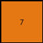

# 44f52bb0 • 005 • refine_dreamer

---

Previous Code:
```python
"""
The output is a 1x1 grid. The value of the output pixel depends on the number of red pixels in a specific, non-counting way.  If the number of red pixels is odd, the output is 7 (orange). If the number of red pixels is even, the output is 1 (blue).
"""

import numpy as np

def transform(input_grid):
    # Count the number of red (2) pixels.
    red_count = np.sum(input_grid == 2)

    # Create a 1x1 output grid.
    output_grid = np.array([[0]])  # Initialize with a default value

    # Set the output pixel based on the parity of the red count.
    if red_count % 2 == 0:  # Even number of red pixels
        output_grid[0, 0] = 1  # Blue
    else:  # Odd number of red pixels
        output_grid[0, 0] = 7  # Orange

    return output_grid
```

Train Set Results:

## Example 1:

Input:
```
2 0 2
0 2 0
2 0 2
```
Expected Output:
```
1
```
Transformed Output:
```
7
```

match: False
pixels_off: 1
size_correct: True
color_palette_correct: False
correct_pixel_counts: False

## Example 2:

Input:
```
2 0 0
2 0 0
0 2 0
```
Expected Output:
```
7
```
Transformed Output:
```
7
```

match: True
pixels_off: 0
size_correct: True
color_palette_correct: True
correct_pixel_counts: True

## Example 3:

Input:
```
2 0 2
2 0 2
2 0 2
```
Expected Output:
```
1
```
Transformed Output:
```
1
```

match: True
pixels_off: 0
size_correct: True
color_palette_correct: True
correct_pixel_counts: True

## Example 4:

Input:
```
0 0 0
2 0 2
0 0 0
```
Expected Output:
```
1
```
Transformed Output:
```
1
```

match: True
pixels_off: 0
size_correct: True
color_palette_correct: True
correct_pixel_counts: True

## Example 5:

Input:
```
2 2 0
0 2 2
0 0 0
```
Expected Output:
```
7
```
Transformed Output:
```
1
```

match: False
pixels_off: 1
size_correct: True
color_palette_correct: False
correct_pixel_counts: False

## Example 6:

Input:
```
2 2 0
0 2 0
0 0 0
```
Expected Output:
```
7
```
Transformed Output:
```
7
```

match: True
pixels_off: 0
size_correct: True
color_palette_correct: True
correct_pixel_counts: True
**INSTRUCTIONS**

The code above was generated based on observations from the first training
example

we have tested the transform function on each of the task example inputs and
compared with the expected output

review each of the examples provided and the results and consider how the
natural language program should be updated to accommodate this new knowledge

respond with the following deliverables:

- general assessment of the information provided and strategy for resolving the
  errors
- gather metrics about each of the examples and results - use code_execution to
  develop accurate reports on your assumptions
- a YAML block documenting facts - Focus on identifying objects, their properties, and the actions performed on them.
- a natural language program - Be as clear and concise as possible, providing a complete description of the transformation rule.


your responses should be considered as information in a report - not a
conversation
