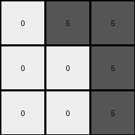

# 6150a2bd • 005 • refine_dreamer

---


Previous Code:
```python
"""
The input grid is rotated 90 degrees counter-clockwise. Individual connected components of the same color (single pixels or groups) are treated as distinct objects. These objects maintain their shape and internal arrangement of pixels, and their positions within the grid are updated based on the 90-degree counter-clockwise rotation of the entire grid, relative to the center of the grid.
"""

import numpy as np
from scipy.ndimage import label, center_of_mass

def get_objects(grid):
    """
    Identifies and returns a list of objects within the grid.  Each object
    is represented as a dictionary containing its color and a list of
    its pixel coordinates.
    """
    grid_np = np.array(grid)
    labeled_grid, num_objects = label(grid_np)
    objects = []
    for i in range(1, num_objects + 1):
        positions = np.argwhere(labeled_grid == i)
        color = grid_np[positions[0][0], positions[0][1]]
        objects.append({
            'color': color,
            'positions': positions.tolist()
        })
    return objects

def rotate_point(point, center, angle_degrees):
    """Rotates a single point around a center point by a given angle."""
    angle_radians = np.radians(angle_degrees)
    x, y = point
    cx, cy = center
    rotated_x = cx + (x - cx) * np.cos(angle_radians) - (y - cy) * np.sin(angle_radians)
    rotated_y = cy + (x - cx) * np.sin(angle_radians) + (y - cy) * np.cos(angle_radians)
    return [round(rotated_x), round(rotated_y)]

def transform(input_grid):
    """
    Transforms the input grid according to the defined rule.
    """
    # 1. Identify objects in the input grid.
    objects = get_objects(input_grid)

    # 2. Determine the dimensions of the input grid and its center.
    rows = len(input_grid)
    cols = len(input_grid[0])
    center = (rows / 2.0 - 0.5, cols / 2.0 - 0.5)  # Subtract 0.5 for 0-indexing

    # 3. Create an empty output grid of the rotated dimensions.
    output_grid = [[0] * rows for _ in range(cols)]  # Rotated dimensions

    # 4. Iterate through each object and its positions.
    for obj in objects:
        rotated_positions = []
        for pos in obj['positions']:
            # 5. Rotate each pixel position around the grid's center.
            rotated_pos = rotate_point(pos, center, -90)  # -90 for counter-clockwise
            rotated_positions.append(rotated_pos)
        
        # 6. Place the object's color in the new, rotated positions.
        for rotated_pos in rotated_positions:
            #   Check bounds for the output grid
            if 0 <= rotated_pos[0] < cols and 0 <= rotated_pos[1] < rows:
                output_grid[rotated_pos[0]][rotated_pos[1]] = obj['color']

    return output_grid
```

Train Set Results:

## Example 1:

Input:
```
3 3 8
3 7 0
5 0 0
```
Expected Output:
```
0 0 5
0 7 3
8 3 3
```
Transformed Output:
```
3 3 3
0 3 3
0 0 3
```

match: False
pixels_off: 6
size_correct: True
color_palette_correct: True
correct_pixel_counts: False

## Example 2:

Input:
```
5 5 2
1 0 0
0 0 0
```
Expected Output:
```
0 0 0
0 0 1
2 5 5
```
Transformed Output:
```
0 5 5
0 0 5
0 0 5
```

match: False
pixels_off: 5
size_correct: True
color_palette_correct: True
correct_pixel_counts: False

**INSTRUCTIONS**

The code above was generated based on observations from the first training
example

we have tested the transform function on each of the task example inputs and
compared with the expected output

review each of the examples provided and the results and consider how the
natural language program should be updated to accommodate this new knowledge

respond with the following deliverables:

- general assessment of the information provided and strategy for resolving the
  errors
- gather metrics about each of the examples and results - use code_execution to
  develop accurate reports on your assumptions
- a YAML block documenting facts - Focus on identifying objects, their properties, and the actions performed on them.
- a natural language program - Be as clear and concise as possible, providing a complete description of the transformation rule.


your responses should be considered as information in a report - not a
conversation
