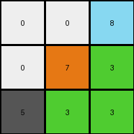
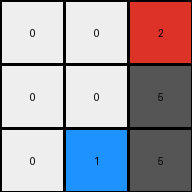

# 6150a2bd • 009 • refine_dreamer

---


Previous Code:
```python
"""
The transformation takes the input grid, inverts the positions of pixels across both axes (effectively rotating it 180 degrees), and creates the output, preserving pixel colors.
"""

import numpy as np

def transform(input_grid):
    """
    Transforms a 3x3 input grid into a 3x3 output grid.
    The transformation inverts and mirrors the input across both axes
      while preserving the colors of the pixels.

    Args:
        input_grid (list of lists): A 3x3 grid represented as a list of lists.

    Returns:
        list of lists: The transformed 3x3 grid.
    """
    # Initialize the output grid as a 3x3 matrix filled with zeros
    output_grid = [[0, 0, 0], [0, 0, 0], [0, 0, 0]]
    n = len(input_grid)

    # Iterate through each cell of the input grid
    for i in range(n):
        for j in range(n):
            # Calculate the new indices by swapping across both diagonals
            new_i = n - 1 - j
            new_j = n - 1 - i

            # Assign colors of input pixels to the output pixels
            output_grid[new_i][new_j] = input_grid[i][j]

    return output_grid
```

Train Set Results:

## Example 1:

Input:
```
3 3 8
3 7 0
5 0 0
```
Expected Output:
```
0 0 5
0 7 3
8 3 3
```
Transformed Output:
```
0 0 8
0 7 3
5 3 3
```

match: False
pixels_off: 2
size_correct: True
color_palette_correct: True
correct_pixel_counts: True

## Example 2:

Input:
```
5 5 2
1 0 0
0 0 0
```
Expected Output:
```
0 0 0
0 0 1
2 5 5
```
Transformed Output:
```
0 0 2
0 0 5
0 1 5
```

match: False
pixels_off: 4
size_correct: True
color_palette_correct: True
correct_pixel_counts: True

**INSTRUCTIONS**

The code above was generated based on observations from the first training
example

we have tested the transform function on each of the task example inputs and
compared with the expected output

review each of the examples provided and the results and consider how the
natural language program should be updated to accommodate this new knowledge

respond with the following deliverables:

- general assessment of the information provided and strategy for resolving the
  errors
- gather metrics about each of the examples and results - use code_execution to
  develop accurate reports on your assumptions
- a YAML block documenting facts - Focus on identifying objects, their properties, and the actions performed on them.
- a natural language program - Be as clear and concise as possible, providing a complete description of the transformation rule.


your responses should be considered as information in a report - not a
conversation
