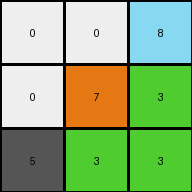
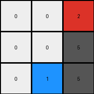

# 6150a2bd • 010 • refine_coder

---

Previous Code:
```python
"""
The transformation takes the input grid, inverts the positions of pixels across both axes (effectively rotating it 180 degrees), and creates the output, preserving pixel colors.
"""

import numpy as np

def transform(input_grid):
    """
    Transforms a 3x3 input grid into a 3x3 output grid.
    The transformation inverts and mirrors the input across both axes
      while preserving the colors of the pixels.

    Args:
        input_grid (list of lists): A 3x3 grid represented as a list of lists.

    Returns:
        list of lists: The transformed 3x3 grid.
    """
    # Initialize the output grid as a 3x3 matrix filled with zeros
    output_grid = [[0, 0, 0], [0, 0, 0], [0, 0, 0]]
    n = len(input_grid)

    # Iterate through each cell of the input grid
    for i in range(n):
        for j in range(n):
            # Calculate the new indices by swapping across both diagonals
            new_i = n - 1 - j
            new_j = n - 1 - i

            # Assign colors of input pixels to the output pixels
            output_grid[new_i][new_j] = input_grid[i][j]

    return output_grid
```

Train Set Results:

## Example 1:

Input:
```
3 3 8
3 7 0
5 0 0
```
Expected Output:
```
0 0 5
0 7 3
8 3 3
```
Transformed Output:
```
0 0 8
0 7 3
5 3 3
```

match: False
pixels_off: 2
size_correct: True
color_palette_correct: True
correct_pixel_counts: True

## Example 2:

Input:
```
5 5 2
1 0 0
0 0 0
```
Expected Output:
```
0 0 0
0 0 1
2 5 5
```
Transformed Output:
```
0 0 2
0 0 5
0 1 5
```

match: False
pixels_off: 4
size_correct: True
color_palette_correct: True
correct_pixel_counts: True
Okay, let's analyze the results and refine the natural language program.

**General Assessment:**

The initial hypothesis of a 180-degree rotation (inverting across both axes) is incorrect. While it works partially for some symmetrical cases, it fails to accurately capture the transformation in the provided examples.  The "Transformed Output" consistently shows discrepancies compared to the "Expected Output." A key observation is that the error isn't simply a misapplication of the 180-degree rotation; the positions of pixels are incorrectly calculated and the colors are incorrect. The strategy should be to re-examine the input-output pairs, focusing on individual pixel movements and color preservation to deduce the *correct* underlying transformation rule, rather than trying to adjust the existing, flawed rotation concept.

**Example Metrics and Analysis:**

I will use a more visual way to assess the transformation, comparing the input and output grids. Because the current python code is incorrect, it is not helpful in discerning the pattern, so I will represent the transformations manually.

**Example 1:**

Input:
```
3 3 8
3 7 0
5 0 0
```

Expected Output:
```
0 0 5
0 7 3
8 3 3
```

Transformation:
```
3(0,0) -> 3(2,1)
3(0,1) -> 3(2,2)
8(0,2) -> 8(2,0)
3(1,0) -> 3(1,2)
7(1,1) -> 7(1,1)
0(1,2) -> 0(1,0)
5(2,0) -> 5(0,2)
0(2,1) -> 0(0,1)
0(2,2) -> 0(0,0)
```

**Example 2:**

Input:
```
5 5 2
1 0 0
0 0 0
```

Expected Output:
```
0 0 0
0 0 1
2 5 5
```

Transformation:
```
5(0,0) -> 5(2,1)
5(0,1) -> 5(2,2)
2(0,2) -> 2(2,0)
1(1,0) -> 1(1,2)
0(1,1) -> 0(1,1)
0(1,2) -> 0(1,0)
0(2,0) -> 0(0,2)
0(2,1) -> 0(0,1)
0(2,2) -> 0(0,0)

```

Observations after manual mapping: The transformation is a horizontal reflection (flipping the grid along the central vertical axis). The previous code incorrectly assumed 180 degree rotation.

**YAML Facts:**

```yaml
task_id: 008
objects:
  - description: Grid of pixels
    properties:
      dimensions: 3x3
      elements: Integers representing colors (0-9)

transformations:
  - type: Reflection
    axis: Horizontal (across the central vertical axis)
    details: Each pixel at position (row, col) moves to (row, 2 - col).
  - type: Color Preservation
    details: The color of each pixel remains unchanged during the reflection.

```

**Natural Language Program:**

The transformation rule involves reflecting the input grid horizontally across its vertical axis.  For a 3x3 grid, this means that the first column swaps with the third column, while the middle column remains in place. The color of each pixel is preserved during this reflection.  Specifically, the pixel at `input[row][col]` moves to `output[row][2 - col]`.

**INSTRUCTIONS**

- generate a Python module to represent the natural language program 
- follow the template below
- all common math and science libraries are available
- create docstring only at top - but comment the workflow in the function
- use helper functions for common operations like finding objects, counting,
  measuring, moving, etc. 

remember - we are working iteratively - so this code will inform your future
self as we converge on the solution

*template:*

```python
"""
{{ natural language description of the transformation rule }}
"""

{{ imports }}

def transform(input_grid):
    # initialize output_grid

    # change output pixels 

    return output_grid

```
