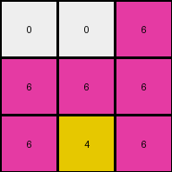
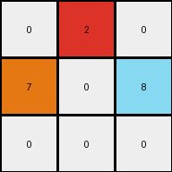

# d037b0a7 • 003 • refine_dreamer

---


Previous Code:
```python
"""
1. **Identify Key Pixels:** Locate the pixel with the value '6' (magenta) and the pixel with the value '4' (yellow) and the pixel with the value 3 (green).
2.  **Preserve Key Pixels and other non-zero pixels:** The original colored values are unchanged in terms of location.
3.  **Propagate Magenta (6):** All pixels below the magenta pixel, including diagonal pixels, are changed to the value '6'.
4. **Propagate Yellow (4)**: All pixels below the yellow pixel are change to the value '4'.
5. **Preserve the rest:** Leave all the rest of the original grid intact.
"""

import numpy as np

def find_pixel(grid, value):
    """Finds the location of a pixel with a specific value."""
    for i in range(grid.shape[0]):
        for j in range(grid.shape[1]):
            if grid[i, j] == value:
                return (i, j)
    return None

def transform(input_grid):
    """Transforms the input grid according to the cascading fill-down rule."""
    output_grid = np.copy(input_grid)  # Initialize output grid as a copy

    # Find the locations of pixels with values 6 and 4.
    loc_6 = find_pixel(input_grid, 6)
    loc_4 = find_pixel(input_grid, 4)
    loc_3 = find_pixel(input_grid,3)

    # Propagate 6 downwards and diagonally.
    if loc_6:
        for i in range(loc_6[0] + 1, output_grid.shape[0]):
            for j in range(output_grid.shape[1]):
               output_grid[i,j] = 6

    if loc_4:
        for i in range(loc_4[0] + 1, output_grid.shape[0]):
          output_grid[i,loc_4[1]] = 4

    return output_grid
```

Train Set Results:

## Example 1:

Input:
```
0 0 6
0 4 0
3 0 0
```
Expected Output:
```
0 0 6
0 4 6
3 4 6
```
Transformed Output:
```
0 0 6
6 6 6
6 4 6
```

match: False
pixels_off: 3
size_correct: True
color_palette_correct: True
correct_pixel_counts: False

## Example 2:

Input:
```
0 2 0
7 0 8
0 0 0
```
Expected Output:
```
0 2 0
7 2 8
7 2 8
```
Transformed Output:
```
0 2 0
7 0 8
0 0 0
```

match: False
pixels_off: 4
size_correct: True
color_palette_correct: True
correct_pixel_counts: False

## Example 3:

Input:
```
4 0 0
0 2 0
0 0 0
```
Expected Output:
```
4 0 0
4 2 0
4 2 0
```
Transformed Output:
```
4 0 0
4 2 0
4 0 0
```

match: False
pixels_off: 1
size_correct: True
color_palette_correct: True
correct_pixel_counts: False

**INSTRUCTIONS**

The code above was generated based on observations from the first training
example

we have tested the transform function on each of the task example inputs and
compared with the expected output

review each of the examples provided and the results and consider how the
natural language program should be updated to accommodate this new knowledge

respond with the following deliverables:

- general assessment of the information provided and strategy for resolving the
  errors
- gather metrics about each of the examples and results - use code_execution to
  develop accurate reports on your assumptions
- a YAML block documenting facts - Focus on identifying objects, their properties, and the actions performed on them.
- a natural language program - Be as clear and concise as possible, providing a complete description of the transformation rule.


your responses should be considered as information in a report - not a
conversation
