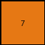

# 44f52bb0 • 005 • refine_dreamer

---


Previous Code:
```python
"""
Examines the input grid for red pixels, determines their connectedness, and outputs a 1x1 grid with either a blue (1) or orange (7) pixel based on whether the red pixels form a single connected group.
"""

import numpy as np

def is_fully_connected(grid, red_pixels):
    """
    Checks if a set of red pixels in a grid are fully connected.
    """
    if not red_pixels:
        return True  # No red pixels, vacuously true

    visited = set()
    queue = [red_pixels[0]]
    visited.add(red_pixels[0])

    while queue:
        r, c = queue.pop(0)
        # Check neighbors (up, down, left, right)
        for dr, dc in [(0, 1), (0, -1), (1, 0), (-1, 0)]:
            nr, nc = r + dr, c + dc
            if (nr, nc) in red_pixels and (nr, nc) not in visited:
                visited.add((nr, nc))
                queue.append((nr, nc))

    return len(visited) == len(red_pixels)

def transform(input_grid):
    # Find coordinates of all red pixels
    red_pixels = []
    for r in range(input_grid.shape[0]):
        for c in range(input_grid.shape[1]):
            if input_grid[r, c] == 2:
                red_pixels.append((r, c))

    # Determine connectedness
    fully_connected = is_fully_connected(input_grid, red_pixels)

    # Create a 1x1 output grid
    output_grid = np.zeros((1, 1), dtype=int)

    # Set output based on connectedness
    if fully_connected:
        output_grid[0, 0] = 1  # Blue
    else:
        output_grid[0, 0] = 7  # Orange

    return output_grid
```

Train Set Results:

## Example 1:

Input:
```
2 0 2
0 2 0
2 0 2
```
Expected Output:
```
1
```
Transformed Output:
```
7
```

match: False
pixels_off: 1
size_correct: True
color_palette_correct: False
correct_pixel_counts: False

## Example 2:

Input:
```
2 0 0
2 0 0
0 2 0
```
Expected Output:
```
7
```
Transformed Output:
```
7
```

match: True
pixels_off: 0
size_correct: True
color_palette_correct: True
correct_pixel_counts: True

## Example 3:

Input:
```
2 0 2
2 0 2
2 0 2
```
Expected Output:
```
1
```
Transformed Output:
```
7
```

match: False
pixels_off: 1
size_correct: True
color_palette_correct: False
correct_pixel_counts: False

## Example 4:

Input:
```
0 0 0
2 0 2
0 0 0
```
Expected Output:
```
1
```
Transformed Output:
```
7
```

match: False
pixels_off: 1
size_correct: True
color_palette_correct: False
correct_pixel_counts: False

## Example 5:

Input:
```
2 2 0
0 2 2
0 0 0
```
Expected Output:
```
7
```
Transformed Output:
```
1
```

match: False
pixels_off: 1
size_correct: True
color_palette_correct: False
correct_pixel_counts: False

## Example 6:

Input:
```
2 2 0
0 2 0
0 0 0
```
Expected Output:
```
7
```
Transformed Output:
```
1
```

match: False
pixels_off: 1
size_correct: True
color_palette_correct: False
correct_pixel_counts: False

**INSTRUCTIONS**

The code above was generated based on observations from the first training
example

we have tested the transform function on each of the task example inputs and
compared with the expected output

review each of the examples provided and the results and consider how the
natural language program should be updated to accommodate this new knowledge

respond with the following deliverables:

- general assessment of the information provided and strategy for resolving the
  errors
- gather metrics about each of the examples and results - use code_execution to
  develop accurate reports on your assumptions
- a YAML block documenting facts - Focus on identifying objects, their properties, and the actions performed on them.
- a natural language program - Be as clear and concise as possible, providing a complete description of the transformation rule.


your responses should be considered as information in a report - not a
conversation
