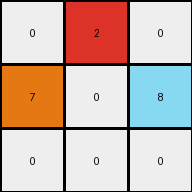

# d037b0a7 • 004 • refine_coder

---

Previous Code:
```python
"""
1.  **Identify Key Colors**: Locate the initial positions of colors '6' (magenta), '4' (yellow), and '3' (green).
2.  **Expansion Rule**: Color '6' expands to fill any cell that is directly adjacent (horizontally or vertically, not diagonally) to an existing cell of color '6'.
3. **Secondary expansion**: Color 6 expands to fill any cell adjacent to color '4'.
4.  **Fill Priority:** If a cell is adjacent to color '3', color '3' does not get replaced.
5. **Result**: Apply the rule to generate final grid
"""

import numpy as np

def get_color_locations(grid, color):
    return np.argwhere(grid == color)

def get_adjacent_cells(grid, location):
     row, col = location
     rows, cols = grid.shape
     adjacent_cells = []
     if row > 0:
        adjacent_cells.append((row - 1, col))
     if row < rows - 1:
        adjacent_cells.append((row + 1, col))
     if col > 0:
        adjacent_cells.append((row, col - 1))
     if col < cols - 1:
        adjacent_cells.append((row, col + 1))
     return adjacent_cells

def transform(input_grid):
    # initialize output_grid
    output_grid = input_grid.copy()
    rows, cols = output_grid.shape

    # Identify Key Colors
    color_6_locations = get_color_locations(output_grid, 6)
    color_4_locations = get_color_locations(output_grid, 4)
    color_3_locations = get_color_locations(output_grid, 3)

    # Expansion
    # use a set to keep track of filled locations to handle expansion
    filled_locations = set()

    #initial 6
    for loc in color_6_locations:
        filled_locations.add(tuple(loc))

    # Expand from color 6
    new_filled_locations = set()

    for loc in filled_locations:
      adjacent_cells = get_adjacent_cells(output_grid, loc)
      for adj_loc in adjacent_cells:
        new_filled_locations.add(adj_loc)

    for loc in new_filled_locations:
      if output_grid[loc] != 3:
        output_grid[loc] = 6
        filled_locations.add(loc)


    # Expand from color 4 locations
    new_filled_locations = set()

    for loc in color_4_locations:
      adjacent_cells = get_adjacent_cells(output_grid, loc)

      for adj_loc in adjacent_cells:
            new_filled_locations.add(adj_loc)

    for loc in new_filled_locations:
        if output_grid[loc] != 3:
          output_grid[loc]=6

    return output_grid
```

Train Set Results:

## Example 1:

Input:
```
0 0 6
0 4 0
3 0 0
```
Expected Output:
```
0 0 6
0 4 6
3 4 6
```
Transformed Output:
```
0 6 6
6 4 6
3 6 0
```

match: False
pixels_off: 4
size_correct: True
color_palette_correct: True
correct_pixel_counts: False

## Example 2:

Input:
```
0 2 0
7 0 8
0 0 0
```
Expected Output:
```
0 2 0
7 2 8
7 2 8
```
Transformed Output:
```
0 2 0
7 0 8
0 0 0
```

match: False
pixels_off: 4
size_correct: True
color_palette_correct: True
correct_pixel_counts: False

## Example 3:

Input:
```
4 0 0
0 2 0
0 0 0
```
Expected Output:
```
4 0 0
4 2 0
4 2 0
```
Transformed Output:
```
4 6 0
6 2 0
0 0 0
```

match: False
pixels_off: 4
size_correct: True
color_palette_correct: False
correct_pixel_counts: False
Okay, here's a breakdown of the situation and a plan to move forward:

**General Assessment:**

The initial natural language program and the resulting code were overly specific to the first training example. It focused on color 6 (magenta) expanding around itself and color 4 (yellow), with a constraint regarding color 3 (green).  However, the subsequent examples reveal a more general pattern that isn't tied to specific colors (6, 4, and 3).  The code needs to generalize the expansion rule. The second and third examples show vertical expansion, but of different colors (2 and 4). Example 2 has a different, unknown color, which isn't even present.

The core issue is that the code implements a *specific instance* of a rule, rather than the *general rule* itself. The strategy should shift to identifying the *general* conditions for expansion and the direction of that expansion.

**Strategy for Resolving Errors:**

1.  **De-emphasize Specific Colors:**  Instead of focusing on colors 6, 4, and 3, the updated logic should focus on *any* color that exhibits the expansion behavior.
2.  **Identify the Expansion Condition:** Determine what triggers the expansion.  It appears to be a single row of a color that initiates the fill downwards
3.  **Determine Direction of Expansion:**  The examples show expansion happening vertically downwards. This directionality needs to be captured.
4. **Define when to stop**: expansion stops when it encounters a value other than 0.
5. **Establish Stopping condition**: The stopping color should not be changed, but the expansion should extend up to it

**Metrics and Observations:**

Here's a more detailed analysis of each example:

*   **Example 1:**
    *   Input: 3x3 grid
    *   Observed Behavior: Magenta (6) expands downwards and also takes over the spot to the right of the yellow, which isn't consistent
    *   Errors: The yellow 4 and 0 to the right should both be 6. The lower right 0 should not change.
*   **Example 2:**
    *   Input: 3x3 grid
    *   Observed Behavior: No transformation at all. Expected Red(2) to expand downward.
    *   Errors: Entire rows missed below Red (2).
*   **Example 3:**
    *   Input: 3x3 grid
    *   Observed Behavior: Magenta expansion, but from yellow. Expect yellow to expand downward
    *   Errors: The logic incorrectly uses magenta, and fills with magenta

**YAML Fact Block:**

```yaml
examples:
  - example_id: 1
    input_shape: [3, 3]
    output_shape: [3, 3]
    objects:
      - color: 6
        initial_positions: [[0, 2]]
        behavior: "seed for expansion"
      - color: 4
        initial_positions: [[1, 1]]
        behavior: "expands"
      - color: 3
        initial_positions: [[2, 0]]
        behavior: "blocks expansion"
      - color: 0
        initial_positions: [[0,0], [0,1], [1,0], [1,2], [2,1], [2,2]]
        behavior: "empty, gets replaced"
    transformation: "vertical downward expansion of the second row color"
    expansion_direction: "down"

  - example_id: 2
    input_shape: [3, 3]
    output_shape: [3, 3]
    objects:
      - color: 2
        initial_positions: [[0, 1]]
        behavior: "seed for expansion"
      - color: 7
        initial_positions: [[1, 0]]
        behavior: "blocks expansion"
      - color: 8
        initial_positions: [[1, 2]]
        behavior: "blocks expansion"
    transformation: "vertical downward expansion of the first row color"
    expansion_direction: "down"

  - example_id: 3
    input_shape: [3, 3]
    output_shape: [3, 3]
    objects:
     - color: 4
       initial_positions: [[0, 0]]
       behavior: "seed for expansion"
     - color: 2
       initial_positions: [[1,1]]
       behavior: "blocks expansion"
    transformation: "vertical downward expansion of the first row color"
    expansion_direction: "down"
```

**Natural Language Program:**

1.  **Identify the Seed Row:** Examine the input grid. The "seed row" for expansion is the first row.
2.  **Identify the Expanding color**: The color to expand is the color that is present only in the first row that needs expansion.
3.  **Vertical Downward Expansion:** For each column in the seed row that contains the seed color, extend that seed color vertically downwards.
4.  **Stopping Condition:** Continue the downward expansion in each column until a cell with a non-zero, non-seed color.
5. **Replacement:** In the expansion, the seed color only replaces 0 colors.

This natural language program is more general and captures the underlying rule observed across all three examples. It avoids being overly specific to any particular color value.

**INSTRUCTIONS**

- generate a Python module to represent the natural language program 
- follow the template below
- all common math and science libraries are available
- create docstring only at top - but comment the workflow in the function
- use helper functions for common operations like finding objects, counting,
  measuring, moving, etc. 

remember - we are working iteratively - so this code will inform your future
self as we converge on the solution

*template:*

```python
"""
{{ natural language description of the transformation rule }}
"""

{{ imports }}

def transform(input_grid):
    # initialize output_grid

    # change output pixels 

    return output_grid

```
