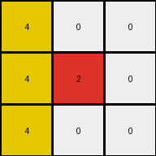

# d037b0a7 • 005 • refine_dreamer

---

Previous Code:
```python
"""
1.  **Identify the Seed Row:** Examine the input grid. The "seed row" for expansion is the first row.
2.  **Identify the Expanding color**: The color to expand is the color that is present only in the first row that needs expansion.
3.  **Vertical Downward Expansion:** For each column in the seed row that contains the seed color, extend that seed color vertically downwards.
4.  **Stopping Condition:** Continue the downward expansion in each column until a cell with a non-zero, non-seed color.
5. **Replacement:** In the expansion, the seed color only replaces 0 colors.
"""

import numpy as np

def get_seed_color_and_columns(grid):
    """
    Identifies the seed color and the columns where it appears in the first row.
    """
    first_row = grid[0, :]
    unique_colors = np.unique(first_row)
    seed_columns = []
    seed_color = 0

    #find colors which appear exactly once
    for color in unique_colors:
        if color != 0:
          if len(np.where(first_row == color)[0]) > 0:
            seed_color = color
            break #in this challenge, we are finding there is only one seed

    if seed_color != 0:
      for i, color in enumerate(first_row):
          if color == seed_color:
              seed_columns.append(i)

    return seed_color, seed_columns

def transform(input_grid):
    # initialize output_grid
    output_grid = input_grid.copy()
    rows, cols = output_grid.shape

    # Identify the seed color and columns
    seed_color, seed_columns = get_seed_color_and_columns(output_grid)
    #print(f"Seed color: {seed_color}, Seed columns: {seed_columns}")


    # Vertical Downward Expansion
    if (seed_color !=0):
        for col in seed_columns:
            for row in range(1, rows):  # Start from the second row
                if output_grid[row, col] == 0:
                    output_grid[row, col] = seed_color
                else:
                    break  # Stop at non-zero cell

    return output_grid
```

Train Set Results:

## Example 1:

Input:
```
0 0 6
0 4 0
3 0 0
```
Expected Output:
```
0 0 6
0 4 6
3 4 6
```
Transformed Output:
```
0 0 6
0 4 6
3 0 6
```

match: False
pixels_off: 1
size_correct: True
color_palette_correct: True
correct_pixel_counts: False

## Example 2:

Input:
```
0 2 0
7 0 8
0 0 0
```
Expected Output:
```
0 2 0
7 2 8
7 2 8
```
Transformed Output:
```
0 2 0
7 2 8
0 2 0
```

match: False
pixels_off: 2
size_correct: True
color_palette_correct: True
correct_pixel_counts: False

## Example 3:

Input:
```
4 0 0
0 2 0
0 0 0
```
Expected Output:
```
4 0 0
4 2 0
4 2 0
```
Transformed Output:
```
4 0 0
4 2 0
4 0 0
```

match: False
pixels_off: 1
size_correct: True
color_palette_correct: True
correct_pixel_counts: False
**INSTRUCTIONS**

The code above was generated based on observations from the first training
example

we have tested the transform function on each of the task example inputs and
compared with the expected output

review each of the examples provided and the results and consider how the
natural language program should be updated to accommodate this new knowledge

respond with the following deliverables:

- general assessment of the information provided and strategy for resolving the
  errors
- gather metrics about each of the examples and results - use code_execution to
  develop accurate reports on your assumptions
- a YAML block documenting facts - Focus on identifying objects, their properties, and the actions performed on them.
- a natural language program - Be as clear and concise as possible, providing a complete description of the transformation rule.


your responses should be considered as information in a report - not a
conversation
