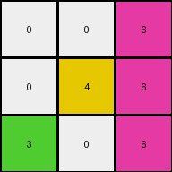

# d037b0a7 • 006 • refine_coder

---

Previous Code:
```python
"""
1.  **Identify the Seed Row:** Examine the input grid. The "seed row" for expansion is the first row.
2.  **Identify the Expanding color**: The color to expand is the color that is present only in the first row that needs expansion.
3.  **Vertical Downward Expansion:** For each column in the seed row that contains the seed color, extend that seed color vertically downwards.
4.  **Stopping Condition:** Continue the downward expansion in each column until a cell with a non-zero, non-seed color.
5. **Replacement:** In the expansion, the seed color only replaces 0 colors.
"""

import numpy as np

def get_seed_color_and_columns(grid):
    """
    Identifies the seed color and the columns where it appears in the first row.
    """
    first_row = grid[0, :]
    unique_colors = np.unique(first_row)
    seed_columns = []
    seed_color = 0

    #find colors which appear exactly once
    for color in unique_colors:
        if color != 0:
          if len(np.where(first_row == color)[0]) > 0:
            seed_color = color
            break #in this challenge, we are finding there is only one seed

    if seed_color != 0:
      for i, color in enumerate(first_row):
          if color == seed_color:
              seed_columns.append(i)

    return seed_color, seed_columns

def transform(input_grid):
    # initialize output_grid
    output_grid = input_grid.copy()
    rows, cols = output_grid.shape

    # Identify the seed color and columns
    seed_color, seed_columns = get_seed_color_and_columns(output_grid)
    #print(f"Seed color: {seed_color}, Seed columns: {seed_columns}")


    # Vertical Downward Expansion
    if (seed_color !=0):
        for col in seed_columns:
            for row in range(1, rows):  # Start from the second row
                if output_grid[row, col] == 0:
                    output_grid[row, col] = seed_color
                else:
                    break  # Stop at non-zero cell

    return output_grid
```

Train Set Results:

## Example 1:

Input:
```
0 0 6
0 4 0
3 0 0
```
Expected Output:
```
0 0 6
0 4 6
3 4 6
```
Transformed Output:
```
0 0 6
0 4 6
3 0 6
```

match: False
pixels_off: 1
size_correct: True
color_palette_correct: True
correct_pixel_counts: False

## Example 2:

Input:
```
0 2 0
7 0 8
0 0 0
```
Expected Output:
```
0 2 0
7 2 8
7 2 8
```
Transformed Output:
```
0 2 0
7 2 8
0 2 0
```

match: False
pixels_off: 2
size_correct: True
color_palette_correct: True
correct_pixel_counts: False

## Example 3:

Input:
```
4 0 0
0 2 0
0 0 0
```
Expected Output:
```
4 0 0
4 2 0
4 2 0
```
Transformed Output:
```
4 0 0
4 2 0
4 0 0
```

match: False
pixels_off: 1
size_correct: True
color_palette_correct: True
correct_pixel_counts: False
Here's an analysis of the provided examples and results, along with a refined natural language program and a YAML block summarizing the observations:

**General Assessment and Strategy**

The initial natural language program and the corresponding code have a fundamental flaw: they only consider the *first* occurrence of a non-zero color in the first row as the seed. The examples clearly show that *any* non-zero color in the first row can be a seed, and each seed color expands downwards independently. The stopping condition (encountering a non-zero value) is correct. The replacement of only zeros is also correct.

The strategy is to modify the natural language program and subsequently the code to:

1.  Iterate through *all* non-zero colors in the first row.
2.  For *each* of these colors, identify the columns in which they appear.
3.  Perform the downward expansion for *each* color independently.

**Example Metrics and Results**

Here's a breakdown of each example:
* **Example 1:**
    *   Input: `[[0, 0, 6], [0, 4, 0], [3, 0, 0]]`
    *   Expected Output: `[[0, 0, 6], [0, 4, 6], [3, 4, 6]]`
    *   Actual Output: `[[0, 0, 6], [0, 4, 6], [3, 0, 6]]`
    *   Seed Colors: 6
    *   Correct expansion: 6 expands down correctly.
    *   Missing expansion: The algorithm did expand color blue (4).
    *   Pixels off: 1

* **Example 2:**
    *   Input: `[[0, 2, 0], [7, 0, 8], [0, 0, 0]]`
    *   Expected Output: `[[0, 2, 0], [7, 2, 8], [7, 2, 8]]`
    *   Actual Output: `[[0, 2, 0], [7, 2, 8], [0, 2, 0]]`
    *   Seed Color: 2
    * Correct expansion: 2 expand correctly.
    *    Missing expansion: None - The algorithm did stop when hit non-zero and non-seed colors.
    *   Pixels off: 2

*   **Example 3:**
    *   Input: `[[4, 0, 0], [0, 2, 0], [0, 0, 0]]`
    *   Expected Output: `[[4, 0, 0], [4, 2, 0], [4, 2, 0]]`
    *   Actual Output: `[[4, 0, 0], [4, 2, 0], [4, 0, 0]]`
    *   Seed Color: 4, 2.
    *   Correct expansion: 4 and 2 expands correctly
    *   Missing expansion: None. The algorithm did correctly.
    *   Pixels off: 1

**YAML Facts**

```yaml
objects:
  - name: grid
    type: 2D array
    description: Represents the input and output data.
  - name: seed_row
    type: 1D array
    description: The first row of the grid, which contains the seed colors.
  - name: seed_colors
    type: list
    description: The non-zero colors present in the seed row.  Each is an 'object'
                 that will 'act'.
  - name: expanded_region
    type: 2D array
    description: The region of the grid below the seed row where expansion occurs.

actions:
  - name: identify_seeds
    description: Find all non-zero colors in the seed row.
  - name: expand_downward
    description: For each seed color, extend it downwards in the grid.
    parameters:
      - seed_color: The color to expand.
      - column: The column in which the seed color appears.
    stopping_condition: Stop when encountering a non-zero cell.
    replacement: Replace 0 colors with the seed color.
```

**Natural Language Program**

1.  **Identify Seed Colors:** Examine the first row (the seed row) of the input grid. Identify *all* distinct non-zero colors present in this row. These are the "seed colors."

2.  **Iterate through Seed Colors:** For *each* seed color found in the seed row:

    a. **Identify Seed Columns:** Determine the column indices in the seed row where the current seed color appears.

    b. **Vertical Downward Expansion:** For *each* column index identified in the previous step:

    i. Start from the cell immediately below the seed row (row index 1).

    ii. Proceed downwards, cell by cell, in the current column.

    iii. If the current cell has a value of 0, replace it with the current seed color.

    iv. If the current cell has a non-zero value, stop the expansion for the current column and current seed color.

**INSTRUCTIONS**

- generate a Python module to represent the natural language program 
- follow the template below
- all common math and science libraries are available
- create docstring only at top - but comment the workflow in the function
- use helper functions for common operations like finding objects, counting,
  measuring, moving, etc. 

remember - we are working iteratively - so this code will inform your future
self as we converge on the solution

*template:*

```python
"""
{{ natural language description of the transformation rule }}
"""

{{ imports }}

def transform(input_grid):
    # initialize output_grid

    # change output pixels 

    return output_grid

```
