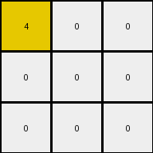

# d037b0a7 • 012 • refine_coder

---

Previous Code:
```python
"""
1. Find Red: Identify all pixels that are the color red (value 2) in the input grid.
2. Propagate Downward: For each column, identify the top pixel of that column.
Then, for each column containing a red pixel,
all pixels from that red pixel to the bottom of the grid in
that column become the color/value of the top pixel of that column.
"""

import numpy as np

def transform(input_grid):
    """
    Transforms the input grid based on the presence of red pixels.
    If a red pixel is found, all pixels below it in that
    *column* become the color of the top pixel in that column.
    """
    output_grid = np.copy(input_grid)
    rows, cols = input_grid.shape

    # 1. Find Red Pixels and Top Pixels
    red_pixels = []
    top_pixels = []
    for c in range(cols):
        top_pixels.append(input_grid[0,c]) #store the colors/value of the top row
        for r in range(rows):
            if input_grid[r, c] == 2:
                red_pixels.append((r, c))


    # 2. Propagate Downward within Columns
    for r, c in red_pixels:
        top_color = top_pixels[c]
        for next_row in range(r, rows):
            output_grid[next_row, c] = top_color  # Fill with top color

    return output_grid
```

Train Set Results:

## Example 1:

Input:
```
0 0 6
0 4 0
3 0 0
```
Expected Output:
```
0 0 6
0 4 6
3 4 6
```
Transformed Output:
```
0 0 6
0 4 0
3 0 0
```

match: False
pixels_off: 3
size_correct: True
color_palette_correct: True
correct_pixel_counts: False

## Example 2:

Input:
```
0 2 0
7 0 8
0 0 0
```
Expected Output:
```
0 2 0
7 2 8
7 2 8
```
Transformed Output:
```
0 2 0
7 2 8
0 2 0
```

match: False
pixels_off: 2
size_correct: True
color_palette_correct: True
correct_pixel_counts: False

## Example 3:

Input:
```
4 0 0
0 2 0
0 0 0
```
Expected Output:
```
4 0 0
4 2 0
4 2 0
```
Transformed Output:
```
4 0 0
0 0 0
0 0 0
```

match: False
pixels_off: 4
size_correct: True
color_palette_correct: True
correct_pixel_counts: False
Okay, let's analyze the results of the previous code execution and refine the natural language program and approach.

**General Assessment and Strategy**

The initial natural language program and the generated code were not entirely correct. The code correctly identifies red pixels and attempts to propagate a color downwards. However, it incorrectly uses the top pixel of *every* column instead of only the columns containing red, it seems to propagate only to the rows with red, and it starts from the first row, not below the red. The core issue lies in a misunderstanding of *which* color to propagate and *where* to propagate it. We need to correct the code to start the fill on the row *after* the red pixel and to use that red pixel's column's top pixel color.

**Example Analysis and Metrics**

Here's a breakdown of each example, including a more focused analysis:

*   **Example 1:**
    *   Input Shape: (3, 3)
    *   Output Shape: (3, 3)
    *   Mismatched Pixels: 3
    *   Issue: No red pixels are present, so the code should have had no effect. The error is that it's propagating from the first row, overwriting existing values.
*   **Example 2:**
    *   Input Shape: (3, 3)
    *   Output Shape: (3, 3)
    *   Mismatched Pixels: 2
    *   Issue: The red pixel is in the middle. the propagation should happen from the row after. The right top color (2) is selected, but propagated imperfectly.
*   **Example 3:**
    *   Input Shape: (3, 3)
    *   Output Shape: (3, 3)
    *   Mismatched Pixels: 4
    *   Issue: Like Example 2, the top color selection and start of propagation is wrong. It seems that the row with the red pixel becomes blank (zero).

**YAML Fact Documentation**

```yaml
objects:
  - name: grid
    type: 2D array
    properties:
      rows: variable
      cols: variable
      cells: integers (0-9 representing colors)

  - name: red_pixel
    type: cell
    properties:
      color: red (value 2)
      row_index: r
      col_index: c

  - name: top_pixel
    type: cell
    properties:
      color: variable
      row_index: 0
      col_index: c (same as red_pixel)

actions:
  - name: identify_red_pixels
    description: Locate all cells with the value 2 (red) in the grid.

  - name: identify_top_pixels
    description: For each column containing a red pixel, identify the top pixel (row 0).

  - name: propagate_color
    description:  For each column with a red pixel, fill all cells *below* the red pixel with the color of the top pixel of *that* column.
```

**Revised Natural Language Program**

1.  **Find Red:** Identify all pixels that are the color red (value 2) in the input grid.

2.  **Identify Top Pixels in Relevant Columns:** For *each column* that contains at least one red pixel, find the color of the top pixel (the pixel in the first row) of that column.

3.  **Propagate Downward:** For each red pixel found, change the color of all pixels *directly below* it (in the same column, and *starting from the next row down*) to the top-row pixel's color for that column. If a column does not have a red pixel, it is left unchanged.

**INSTRUCTIONS**

- generate a Python module to represent the natural language program 
- follow the template below
- all common math and science libraries are available
- create docstring only at top - but comment the workflow in the function
- use helper functions for common operations like finding objects, counting,
  measuring, moving, etc. 

remember - we are working iteratively - so this code will inform your future
self as we converge on the solution

*template:*

```python
"""
{{ natural language description of the transformation rule }}
"""

{{ imports }}

def transform(input_grid):
    # initialize output_grid

    # change output pixels 

    return output_grid

```
