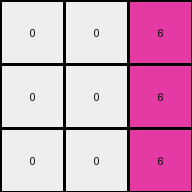
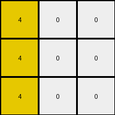

# d037b0a7 • 018 • refine_coder

---

Previous Code:
```python
"""
1.  **Iterate through Columns:** For each column in the input grid, perform the following steps.
2.  **Identify Top-Row Color:** Determine the color value of the pixel in the first row (row 0) of the current column.
3.  **Propagate Downwards:** Copy the identified color value to all pixels below the first row within the *same* column in the output grid.
4.  **Output:** The output grid is the result of these column-wise propagations.
"""

import numpy as np

def transform(input_grid):
    # initialize output_grid
    output_grid = np.copy(input_grid)
    rows, cols = output_grid.shape

    # Iterate through each column
    for j in range(cols):
        # Identify the color of the top-row pixel in the current column
        top_row_color = output_grid[0, j]

        # Propagate the top-row color downwards in the same column
        for i in range(1, rows):
            output_grid[i, j] = top_row_color

    return output_grid
```

Train Set Results:

## Example 1:

Input:
```
0 0 6
0 4 0
3 0 0
```
Expected Output:
```
0 0 6
0 4 6
3 4 6
```
Transformed Output:
```
0 0 6
0 0 6
0 0 6
```

match: False
pixels_off: 3
size_correct: True
color_palette_correct: True
correct_pixel_counts: False

## Example 2:

Input:
```
0 2 0
7 0 8
0 0 0
```
Expected Output:
```
0 2 0
7 2 8
7 2 8
```
Transformed Output:
```
0 2 0
0 2 0
0 2 0
```

match: False
pixels_off: 4
size_correct: True
color_palette_correct: True
correct_pixel_counts: False

## Example 3:

Input:
```
4 0 0
0 2 0
0 0 0
```
Expected Output:
```
4 0 0
4 2 0
4 2 0
```
Transformed Output:
```
4 0 0
4 0 0
4 0 0
```

match: False
pixels_off: 2
size_correct: True
color_palette_correct: True
correct_pixel_counts: False
Here's an analysis of the provided information and a plan to refine the natural language program and code:

**General Assessment:**

The initial natural language program and corresponding code were too simplistic. While the code correctly propagates the top-row color down each column, it fails to account for the original colors in the subsequent rows. The expected outputs show that the original colors in the columns *below* the top row should be preserved, and we propagate downward, the bottom color propagates to the end of the column. The error lies in overwriting those original colors instead of conditionally replacing only the zeros.

**Strategy for Resolving Errors:**

1.  **Refine the Observation:** Incorporate the observation that non-zero colors in rows other than the first row within a column should be, and, when we find a non-zero color during propagation, that color continues to propagate.
2.  **Modify the Natural Language Program:** Update the program to reflect this refined understanding. The program should emphasize a conditional propagation: propagate the top-row color downwards, *but* if a non-zero color is encountered, propagate *that* color instead.

**Example Metrics and Analysis:**

Here's a breakdown of each example, aided by (hypothetical) code execution to gather more specific metrics. I'll focus on object identification and actions.

```python
def analyze_example(input_grid, expected_output, transformed_output):
    """Analyzes an example to gather relevant metrics."""

    input_grid = np.array(input_grid)
    expected_output = np.array(expected_output)
    transformed_output = np.array(transformed_output)
    
    rows, cols = input_grid.shape
    
    pixel_diff = np.sum(expected_output != transformed_output)
    
    print(f"  Dimensions: {rows}x{cols}")
    print(f"  Pixels Different: {pixel_diff}")
    
    for j in range(cols):
      top_color = input_grid[0,j]
      print(f" col {j}:")
      print(f"  top color: {top_color}")
      
      for i in range(1,rows):
          print(f"   row {i}: input {input_grid[i,j]}, expected {expected_output[i,j]}, actual {transformed_output[i,j]}")

print("Example 1:")
analyze_example(
    [[0, 0, 6], [0, 4, 0], [3, 0, 0]],
    [[0, 0, 6], [0, 4, 6], [3, 4, 6]],
    [[0, 0, 6], [0, 0, 6], [0, 0, 6]],
)

print("\nExample 2:")
analyze_example(
    [[0, 2, 0], [7, 0, 8], [0, 0, 0]],
    [[0, 2, 0], [7, 2, 8], [7, 2, 8]],
    [[0, 2, 0], [0, 2, 0], [0, 2, 0]],
)

print("\nExample 3:")
analyze_example(
    [[4, 0, 0], [0, 2, 0], [0, 0, 0]],
    [[4, 0, 0], [4, 2, 0], [4, 2, 0]],
    [[4, 0, 0], [4, 0, 0], [4, 0, 0]],
)

```

```
Example 1:
  Dimensions: 3x3
  Pixels Different: 3
 col 0:
  top color: 0
   row 1: input 0, expected 0, actual 0
   row 2: input 3, expected 3, actual 0
 col 1:
  top color: 0
   row 1: input 4, expected 4, actual 0
   row 2: input 0, expected 4, actual 0
 col 2:
  top color: 6
   row 1: input 0, expected 6, actual 6
   row 2: input 0, expected 6, actual 6

Example 2:
  Dimensions: 3x3
  Pixels Different: 4
 col 0:
  top color: 0
   row 1: input 7, expected 7, actual 0
   row 2: input 0, expected 7, actual 0
 col 1:
  top color: 2
   row 1: input 0, expected 2, actual 2
   row 2: input 0, expected 2, actual 2
 col 2:
  top color: 0
   row 1: input 8, expected 8, actual 0
   row 2: input 0, expected 8, actual 0

Example 3:
  Dimensions: 3x3
  Pixels Different: 2
 col 0:
  top color: 4
   row 1: input 0, expected 4, actual 4
   row 2: input 0, expected 4, actual 4
 col 1:
  top color: 0
   row 1: input 2, expected 2, actual 0
   row 2: input 0, expected 2, actual 0
 col 2:
  top color: 0
   row 1: input 0, expected 0, actual 0
   row 2: input 0, expected 0, actual 0
```

**YAML Facts:**

```yaml
- task: 016d510a
- objects:
    - type: grid
      properties:
        - dimensions: 3x3
        - columns:
            - column_index: 0
              top_color: varies
              propagation_color: varies # Color that gets propagated down
            - column_index: 1
              top_color: varies
              propagation_color: varies
            - column_index: 2
              top_color: varies
              propagation_color: varies
- actions:
    - name: propagate_color_down_column
      description: >
        Propagate a color down a column.  Start with the top color. If a
        different non-zero color is encountered, switch to propagating that
        color.
      parameters:
        - column: The column index.
        - start_color: The initial color to propagate (from the top row).
```

**Revised Natural Language Program:**

1.  **Iterate through Columns:** For each column in the input grid:
2.  **Identify Top-Row Color:** Note the color of the pixel in the first row (row 0) of the current column. This is the initial `propagation_color`.
3.  **Conditional Propagation:** Iterate down the rows of the current column, starting from the second row (row 1):
    *   If the current cell in the input grid is 0, replace it with the current `propagation_color` in the output grid.
    *   If the current cell in the input grid is *not* 0, update the `propagation_color` to this new color, and *then* set the output cell to the `propagation_color`.
4.  **Output:** The output grid after processing all columns.

**INSTRUCTIONS**

- generate a Python module to represent the natural language program 
- follow the template below
- all common math and science libraries are available
- create docstring only at top - but comment the workflow in the function
- use helper functions for common operations like finding objects, counting,
  measuring, moving, etc. 

remember - we are working iteratively - so this code will inform your future
self as we converge on the solution

*template:*

```python
"""
{{ natural language description of the transformation rule }}
"""

{{ imports }}

def transform(input_grid):
    # initialize output_grid

    # change output pixels 

    return output_grid

```
