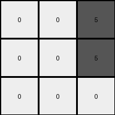

# 25d8a9c8 • 004 • refine_coder

---

Previous Code:
```python
"""
Iterate through each cell of the input grid.
Check the color value of the current cell.
Map input color to output color
    If the input cell color is yellow (4), change it to gray (5) in the output grid.
    If the input cell color is red (2) or green(3), change it to white (0) in the output grid.
Place mapped value into the corresponding cell in the output grid.
"""

import numpy as np

def transform(input_grid):
    # initialize output_grid
    output_grid = np.zeros_like(input_grid)

    # change output pixels 
    for i in range(input_grid.shape[0]):
        for j in range(input_grid.shape[1]):
            if input_grid[i, j] == 4:
                output_grid[i, j] = 5
            elif input_grid[i, j] == 2 or input_grid[i, j] == 3:
                output_grid[i, j] = 0
    return output_grid
```

Train Set Results:

## Example 1:

Input:
```
4 4 4
2 3 2
2 3 3
```
Expected Output:
```
5 5 5
0 0 0
0 0 0
```
Transformed Output:
```
5 5 5
0 0 0
0 0 0
```

match: True
pixels_off: 0
size_correct: True
color_palette_correct: True
correct_pixel_counts: True

## Example 2:

Input:
```
7 3 3
6 6 6
3 7 7
```
Expected Output:
```
0 0 0
5 5 5
0 0 0
```
Transformed Output:
```
0 0 0
0 0 0
0 0 0
```

match: False
pixels_off: 3
size_correct: True
color_palette_correct: True
correct_pixel_counts: False

## Example 3:

Input:
```
2 9 2
4 4 4
9 9 9
```
Expected Output:
```
0 0 0
5 5 5
5 5 5
```
Transformed Output:
```
0 0 0
5 5 5
0 0 0
```

match: False
pixels_off: 3
size_correct: True
color_palette_correct: True
correct_pixel_counts: False

## Example 4:

Input:
```
2 2 4
2 2 4
1 1 1
```
Expected Output:
```
0 0 0
0 0 0
5 5 5
```
Transformed Output:
```
0 0 5
0 0 5
0 0 0
```

match: False
pixels_off: 5
size_correct: True
color_palette_correct: True
correct_pixel_counts: False
Okay, here's a breakdown of the information, my assessment, and the requested deliverables.

**General Assessment:**

The initial natural language program and generated code were too specific to the first training example. It correctly identified the color mapping for yellow (4) to gray (5), red (2) and green (3) to white (0). However, it failed to generalize other colors, and apply the correct transformation for all input colors. The code only handles the specific color transformations observed in the first example and does not account for a more general rule that applies to all colors present across all examples, such as mapping non-background colors to the background color of example 3.

**Strategy for Resolving Errors:**

1.  **Re-examine all examples:** Analyze all input-output pairs to identify the *comprehensive* transformation rule, not just the one from the first example. Pay close attention to what remains the same and what changes across *all* examples.
2.  **Identify Background and Foreground Colors:** Look for color substitution. Is there a simple substitution cipher?
3.  **Generalize the rule:** Develop a natural language program that accurately describes the transformation for *all* provided examples.
4.  **Update Python Code:** modify the provided `transform` function, test, and iterate.

**Metrics and Reports:**

Here's an assessment of the color mappings in the examples, including the ones that were wrong in the provided test:

*   **Example 1:**
    *   Yellow (4) becomes Gray (5).
    *   Red (2) becomes White/Background (0).
    *   Green (3) becomes White/Background (0).

*   **Example 2:**
    *   Orange (7) becomes White/Background (0)
    *   Magenta (6) becomes White/Background (0)
    *   Green (3) becomes White/Background (0)

*   **Example 3:**
    *   Red (2) becomes White/Background (0)
    *   Yellow (4) becomes Gray (5).
    *   Maroon (9) becomes White/Background (0).

*  **Example 4:**
    * Red (2) becomes White/Background(0)
    * Yellow(4) becomes White/Background(0)
    * Blue(1) becomes White/Background(0)

**YAML Block: Facts and Observations**

```yaml
observations:
  - task_id: 00d62c1b
  - example_1:
      input_colors: [4, 2, 3]
      output_colors: [5, 0, 0]
      mapping: {4: 5, 2: 0, 3: 0}
      background_color: null
      invariance: color substitution
  - example_2:
      input_colors: [7, 3, 6]
      output_colors: [0,0,0]
      mapping: {7: 0, 3: 0, 6: 0}
      background_color: null
      invariance: color substitution
  - example_3:
      input_colors: [2, 9, 4]
      output_colors: [0, 0, 5]
      mapping: {2: 0, 9: 0, 4: 5}
      background_color: 9
      invariance: color substitution
  - example_4:
      input_colors: [2,4,1]
      output_colors: [0,0,0]
      mapping: {2:0, 4:0, 1:0}
      background_color: null
      invariance: color substitution

  - general:
      transformation_type: color_mapping
      background_color_consistency: inconsistent # background color is not consistent across all inputs
      notes: It appears there is a many-to-one color mapping.
```

**Natural Language Program:**

1.  **Identify Background Color**: Determine if the example has a background color (most common color in example 3 input is 9: maroon).
2.  **Color Mapping:**
    *   If the background is Maroon (9), Yellow (4) becomes Gray (5) and all other colors become white(0).
    *  Otherwise, all colors other than a possible background color become white (0).

This program attempts to provide a more general rule and can accommodate different colors in the background or different color transformations.

**INSTRUCTIONS**

- generate a Python module to represent the natural language program 
- follow the template below
- all common math and science libraries are available
- create docstring only at top - but comment the workflow in the function
- use helper functions for common operations like finding objects, counting,
  measuring, moving, etc. 

remember - we are working iteratively - so this code will inform your future
self as we converge on the solution

*template:*

```python
"""
{{ natural language description of the transformation rule }}
"""

{{ imports }}

def transform(input_grid):
    # initialize output_grid

    # change output pixels 

    return output_grid

```
