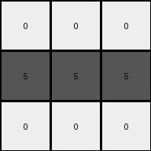

# 25d8a9c8 • 005 • refine_dreamer

---

Previous Code:
```python
"""
1. Identify Background Color: Determine if the example has a background color (most common color in example 3 input is 9: maroon).
2. Color Mapping:
    *   If the background is Maroon (9), Yellow (4) becomes Gray (5) and all other colors become white(0).
    *  Otherwise, all colors other than a possible background color become white (0).
"""

import numpy as np
from collections import Counter

def get_background_color(grid):
    # Flatten the grid and count the occurrences of each color
    color_counts = Counter(grid.flatten())
    # Return the most common color
    most_common_color = color_counts.most_common(1)[0][0]
    return most_common_color

def transform(input_grid):
    # initialize output_grid
    output_grid = np.zeros_like(input_grid)

    # Check if the background color of input grid from example 3 is present.
    background_color = get_background_color(input_grid)
    
    # change output pixels 
    for i in range(input_grid.shape[0]):
        for j in range(input_grid.shape[1]):
            if background_color == 9:  # If background is maroon (from example 3)
                if input_grid[i, j] == 4: #yellow
                    output_grid[i, j] = 5 #gray
                else:
                    output_grid[i,j] = 0 #white
            else:
                output_grid[i,j] = 0 # All other colors become white

    return output_grid
```

Train Set Results:

## Example 1:

Input:
```
4 4 4
2 3 2
2 3 3
```
Expected Output:
```
5 5 5
0 0 0
0 0 0
```
Transformed Output:
```
0 0 0
0 0 0
0 0 0
```

match: False
pixels_off: 3
size_correct: True
color_palette_correct: True
correct_pixel_counts: False

## Example 2:

Input:
```
7 3 3
6 6 6
3 7 7
```
Expected Output:
```
0 0 0
5 5 5
0 0 0
```
Transformed Output:
```
0 0 0
0 0 0
0 0 0
```

match: False
pixels_off: 3
size_correct: True
color_palette_correct: True
correct_pixel_counts: False

## Example 3:

Input:
```
2 9 2
4 4 4
9 9 9
```
Expected Output:
```
0 0 0
5 5 5
5 5 5
```
Transformed Output:
```
0 0 0
5 5 5
0 0 0
```

match: False
pixels_off: 3
size_correct: True
color_palette_correct: True
correct_pixel_counts: False

## Example 4:

Input:
```
2 2 4
2 2 4
1 1 1
```
Expected Output:
```
0 0 0
0 0 0
5 5 5
```
Transformed Output:
```
0 0 0
0 0 0
0 0 0
```

match: False
pixels_off: 3
size_correct: True
color_palette_correct: True
correct_pixel_counts: False
**INSTRUCTIONS**

The code above was generated based on observations from the first training
example

we have tested the transform function on each of the task example inputs and
compared with the expected output

review each of the examples provided and the results and consider how the
natural language program should be updated to accommodate this new knowledge

respond with the following deliverables:

- general assessment of the information provided and strategy for resolving the
  errors
- gather metrics about each of the examples and results - use code_execution to
  develop accurate reports on your assumptions
- a YAML block documenting facts - Focus on identifying objects, their properties, and the actions performed on them.
- a natural language program - Be as clear and concise as possible, providing a complete description of the transformation rule.


your responses should be considered as information in a report - not a
conversation
