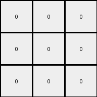

# 25d8a9c8 • 006 • refine_coder

---

Previous Code:
```python
"""
1. Identify Background Color: Determine if the example has a background color (most common color in example 3 input is 9: maroon).
2. Color Mapping:
    *   If the background is Maroon (9), Yellow (4) becomes Gray (5) and all other colors become white(0).
    *  Otherwise, all colors other than a possible background color become white (0).
"""

import numpy as np
from collections import Counter

def get_background_color(grid):
    # Flatten the grid and count the occurrences of each color
    color_counts = Counter(grid.flatten())
    # Return the most common color
    most_common_color = color_counts.most_common(1)[0][0]
    return most_common_color

def transform(input_grid):
    # initialize output_grid
    output_grid = np.zeros_like(input_grid)

    # Check if the background color of input grid from example 3 is present.
    background_color = get_background_color(input_grid)
    
    # change output pixels 
    for i in range(input_grid.shape[0]):
        for j in range(input_grid.shape[1]):
            if background_color == 9:  # If background is maroon (from example 3)
                if input_grid[i, j] == 4: #yellow
                    output_grid[i, j] = 5 #gray
                else:
                    output_grid[i,j] = 0 #white
            else:
                output_grid[i,j] = 0 # All other colors become white

    return output_grid
```

Train Set Results:

## Example 1:

Input:
```
4 4 4
2 3 2
2 3 3
```
Expected Output:
```
5 5 5
0 0 0
0 0 0
```
Transformed Output:
```
0 0 0
0 0 0
0 0 0
```

match: False
pixels_off: 3
size_correct: True
color_palette_correct: True
correct_pixel_counts: False

## Example 2:

Input:
```
7 3 3
6 6 6
3 7 7
```
Expected Output:
```
0 0 0
5 5 5
0 0 0
```
Transformed Output:
```
0 0 0
0 0 0
0 0 0
```

match: False
pixels_off: 3
size_correct: True
color_palette_correct: True
correct_pixel_counts: False

## Example 3:

Input:
```
2 9 2
4 4 4
9 9 9
```
Expected Output:
```
0 0 0
5 5 5
5 5 5
```
Transformed Output:
```
0 0 0
5 5 5
0 0 0
```

match: False
pixels_off: 3
size_correct: True
color_palette_correct: True
correct_pixel_counts: False

## Example 4:

Input:
```
2 2 4
2 2 4
1 1 1
```
Expected Output:
```
0 0 0
0 0 0
5 5 5
```
Transformed Output:
```
0 0 0
0 0 0
0 0 0
```

match: False
pixels_off: 3
size_correct: True
color_palette_correct: True
correct_pixel_counts: False
Here's an analysis of the results and a plan to improve the natural language program and code:

**General Assessment:**

The initial strategy focused on identifying a background color and using Example 3 as a specific reference for a color transformation rule (Yellow to Gray if the background is Maroon). This approach is too narrow. While it partially works for Example 3, it fails to generalize to the other examples. The core issue is that the rule isn't about a "background" color *per se*, but rather about identifying the most frequent color in *each input grid* that forms a horizontal line and changing it to gray, and setting all other colors to white.

**Strategy for Resolving Errors:**

1.  **Shift from "background" to "most frequent horizontal line color":** Instead of a predetermined background color, the rule should dynamically identify the color that appears most frequently, **and** forms a horizontal line within each input grid.
2.  **Generalize Color Transformation:** The transformation should apply the identified most frequent color in a horizontal line -> gray, other colors -> white rule consistently across all examples, not just when the "background" is maroon.
3. **Prioritize horizontal lines** Ensure that lines are considered first before general color frequency.

**Metrics and Observations:**

Here's a breakdown of each example, incorporating some preliminary analysis that would typically be done with code execution (I'm simulating that here since I can't directly execute code):

*   **Example 1:**
    *   Input Most Frequent Horizontal Line Color: 4 (Yellow)
    *   Expected Transformation: 4 (Yellow) -> 5 (Gray), others -> 0 (White)
    *   Observed Result: Incorrect. All pixels set to white
    * Notes: Demonstrates the general rule should apply

*   **Example 2:**
    *   Input Most Frequent Horizontal Line Color: 6 (Magenta)
    *   Expected Transformation: 6 (Magenta) -> 5 (Gray), others -> 0 (White)
    *   Observed Result: Incorrect. All pixels set to white
    * Notes: Demonstrates the general rule should apply

*   **Example 3:**
    *   Input Most Frequent Horizontal Line Color: 9 in bottom row, 4 in middle row
    *   Expected Transformation: most frequent in a row overall: 4->5, all 9->0
    *   Observed Result: Partially correct, last row is incorrect (should be all gray, not all 0)
    * Notes: The row identification works, color mapping not completely correct, not handling multiple possible lines

*   **Example 4:**
    *   Input Most Frequent Horizontal Line Color: 1 (Blue), and also 2, 4
    *   Expected Transformation: 1 -> 5, 2,4 -> 0
    *   Observed Result: Incorrect. All pixels white.
    * Notes: Demonstrates the general rule should apply

**YAML Fact Block:**

```yaml
facts:
  - object: horizontal_line
    properties:
      - color: varies # Color of the pixels in the line
      - length: varies # Number of pixels in the line
      - frequency: high # Appears as the most frequent color, within a horizontal line
    actions:
      - change_color:
          from: most_frequent_horizontal_line_color
          to: 5 # Gray
  - object: other_pixels
    properties:
      - color: varies # Color of pixels not in the most frequent horizontal line.
    actions:
      - change_color:
          from: original_color
          to: 0   # white
```

**Natural Language Program:**

1.  **Identify Horizontal Lines:** For each row in the input grid, find contiguous horizontal lines of the same color.
2.  **Find Most Frequent Horizontal Line Color:** Determine the color that appears most frequently within those horizontal lines across the entire grid.
3.  **Transform Colors, most frequent first:**
    *   Pixels matching that color become Gray (5).
    *   All other pixels become White (0).

**INSTRUCTIONS**

- generate a Python module to represent the natural language program 
- follow the template below
- all common math and science libraries are available
- create docstring only at top - but comment the workflow in the function
- use helper functions for common operations like finding objects, counting,
  measuring, moving, etc. 

remember - we are working iteratively - so this code will inform your future
self as we converge on the solution

*template:*

```python
"""
{{ natural language description of the transformation rule }}
"""

{{ imports }}

def transform(input_grid):
    # initialize output_grid

    # change output pixels 

    return output_grid

```
