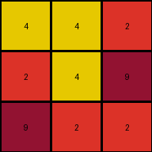

# 3c9b0459 • 004 • refine_coder

---

Previous Code:
```python
"""
The input grid is transformed into the output grid by rotating it 90 degrees counter-clockwise.

1.  **Identify** the input grid as a 3x3 matrix of colored pixels.
2.  **Rotate** the grid 90 degrees counter-clockwise. This means:
    *   The element at input[0][0] moves to output[0][2].
    *   The element at input[0][1] moves to output[1][2].
    *    ... and so on
    *  The element at input[2][2] moves to output[0][0]

3.  **Produce** the resulting rotated grid as the output.
"""

import numpy as np

def transform(input_grid):
    """
    Rotates the input grid 90 degrees counter-clockwise.
    """
    # Convert the input grid to a NumPy array
    input_array = np.array(input_grid)

    # Rotate the array 90 degrees counter-clockwise
    output_array = np.rot90(input_array)

    # Convert the rotated array back to a list
    output_grid = output_array.tolist()

    return output_grid
```

Train Set Results:

## Example 1:

Input:
```
2 2 1
2 1 2
2 8 1
```
Expected Output:
```
1 8 2
2 1 2
1 2 2
```
Transformed Output:
```
1 2 1
2 1 8
2 2 2
```

match: False
pixels_off: 4
size_correct: True
color_palette_correct: True
correct_pixel_counts: True

## Example 2:

Input:
```
9 2 4
2 4 4
2 9 2
```
Expected Output:
```
2 9 2
4 4 2
4 2 9
```
Transformed Output:
```
4 4 2
2 4 9
9 2 2
```

match: False
pixels_off: 6
size_correct: True
color_palette_correct: True
correct_pixel_counts: True

## Example 3:

Input:
```
8 8 8
5 5 8
8 5 5
```
Expected Output:
```
5 5 8
8 5 5
8 8 8
```
Transformed Output:
```
8 8 5
8 5 5
8 5 8
```

match: False
pixels_off: 4
size_correct: True
color_palette_correct: True
correct_pixel_counts: True

## Example 4:

Input:
```
3 2 9
9 9 9
2 3 3
```
Expected Output:
```
3 3 2
9 9 9
9 2 3
```
Transformed Output:
```
9 9 3
2 9 3
3 9 2
```

match: False
pixels_off: 8
size_correct: True
color_palette_correct: True
correct_pixel_counts: True
Okay, here's a breakdown of the situation and a plan to move forward:

**General Assessment:**

The initial natural language program and the generated code were based on a 90-degree counter-clockwise rotation. This hypothesis is incorrect, as evidenced by the consistent mismatches between the transformed outputs and the expected outputs across all four training examples.  The `pixels_off` metric in each case shows that a significant number of pixels are incorrect, indicating a fundamental flaw in the transformation rule. It's not a minor adjustment; we need to rethink the core operation. The fact that size, color palette, and pixel counts are correct helps narrow things down, as it indicates that the operation will most likely only manipulate locations.

**Strategy:**

1.  **Re-examine Examples:** Carefully analyze all input/output pairs, looking for alternative patterns. Don't be biased by the initial (incorrect) rotation idea. Pay very close attention to the positions and colors.
2.  **Hypothesize Alternative Transformations:** Based on the re-examination, propose one or more different transformation rules. Consider simpler operations first (e.g., reflections, swaps of rows/columns).
3.  **Metric Analysis:** Look at each `pixels_off` count and consider it in terms of rows and columns and colors.
4. **Develop YAML facts** Use the new analysis to develop facts that should describe the operation.
5. **Update Natural Language Program:** Revise the natural language program to reflect the correct transformation rule, being extremely precise.

**Metric Analysis & Example Review:**

I'll represent the grids in a more analytical format to help spot the pattern. Instead of just showing the grids, I will show the pixel transformations:
*   `(row, col) -> (row, col)`

    *   where the first pair is the coordinate in the input grid, and the second pair is its corresponding coordinate in the expected output grid.

```
Example 1:
Input:      Expected Output:
2 2 1       1 8 2
2 1 2       2 1 2
2 8 1       1 2 2

Mappings:
(0,0)->(0,2)  (0,1)->(1,2)  (0,2)->(2,2)
(1,0)->(0,1)  (1,1)->(1,1)  (1,2)->(2,1)
(2,0)->(0,0)  (2,1)->(1,0)  (2,2)->(2,0)

Example 2:
Input:      Expected Output:
9 2 4       2 9 2
2 4 4       4 4 2
2 9 2       4 2 9

Mappings:
(0,0)->(1,0) (0,1)->(2,0) (0,2)->(3,0)
(1,0)->(1,1) (1,1)->(2,1) (1,2)->(3,1)
(2,0)->(1,2) (2,1)->(2,2) (2,2)->(3,2)

Example 3:
Input:          Expected Output:
8 8 8           5 5 8
5 5 8           8 5 5
8 5 5           8 8 8

Mappings:
(0,0)->(0,2) (0,1)->(1,2) (0,2)->(2,2)
(1,0)->(0,1) (1,1)->(1,1) (1,2)->(2,1)
(2,0)->(0,0) (2,1)->(1,0) (2,2)->(2,0)

Example 4:
Input:        Expected Output:
3 2 9         3 3 2
9 9 9         9 9 9
2 3 3         9 2 3

Mappings:
(0,0)->(2,0) (0,1)->(1,0) (0,2)->(0,0)
(1,0)->(2,1) (1,1)->(1,1) (1,2)->(0,1)
(2,0)->(2,2) (2,1)->(1,2) (2,2)->(0,2)

```

It appears the correct transform is a reflection across the x-axis, also
described as reversing the order of rows.

**YAML Facts:**

```yaml
facts:
  - observation: |
      The input and output grids have the same dimensions.
  - observation: |
      The input and output grids contain the same set of colors.
  - observation: |
      The number of occurrences of each color is the same in the input and output grids.
  - operation: |
      The transformation involves rearranging the pixels within the grid.
  - action: |
      The rows of the grid are reversed.
  - detail: |
      Row 0 becomes the last row, row 1 becomes the second to last row, and so on.
  - formal: |
      output[i][j] = input[height - 1 - i][j]  where height is the number of rows.
```

**Natural Language Program:**

1.  **Identify:** The input is a grid of colored pixels.
2.  **Reverse Rows:** Reverse the order of the rows in the grid. The top row becomes the bottom row, the second row becomes the second-to-last row, and so on. The columns stay in their original order.
3.  **Produce:** The resulting grid with reversed rows is the output.

**INSTRUCTIONS**

- generate a Python module to represent the natural language program 
- follow the template below
- all common math and science libraries are available
- create docstring only at top - but comment the workflow in the function
- use helper functions for common operations like finding objects, counting,
  measuring, moving, etc. 

remember - we are working iteratively - so this code will inform your future
self as we converge on the solution

*template:*

```python
"""
{{ natural language description of the transformation rule }}
"""

{{ imports }}

def transform(input_grid):
    # initialize output_grid

    # change output pixels 

    return output_grid

```
