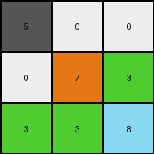
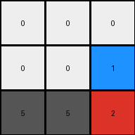

# 6150a2bd • 004 • refine_coder

---

Previous Code:
```python
"""
The transformation is a 180-degree rotation of the input grid. Each element's position (row, col) in the input grid is mapped to (2-row, 2-col) in the output grid. Alternatively, swap the first and last rows and then reverse the middle row.
"""

import numpy as np

def transform(input_grid):
    """
    Rotates the input grid by 180 degrees.
    """
    # Convert input grid to a NumPy array for easier manipulation
    input_array = np.array(input_grid)
    
    # Get the dimensions of the input grid
    rows, cols = input_array.shape
    
    # Initialize the output grid with zeros
    output_array = np.zeros_like(input_array)
    
    # Rotate by swapping rows and reversing the middle row
    output_array[0, :] = input_array[rows-1, :]
    output_array[rows-1, :] = input_array[0, :]
    output_array[1, :] = input_array[1, ::-1]  # Reverse the middle row


    return output_array.tolist()
```

Train Set Results:

## Example 1:

Input:
```
3 3 8
3 7 0
5 0 0
```
Expected Output:
```
0 0 5
0 7 3
8 3 3
```
Transformed Output:
```
5 0 0
0 7 3
3 3 8
```

match: False
pixels_off: 4
size_correct: True
color_palette_correct: True
correct_pixel_counts: True

## Example 2:

Input:
```
5 5 2
1 0 0
0 0 0
```
Expected Output:
```
0 0 0
0 0 1
2 5 5
```
Transformed Output:
```
0 0 0
0 0 1
5 5 2
```

match: False
pixels_off: 2
size_correct: True
color_palette_correct: True
correct_pixel_counts: True
Here's an analysis of the provided information and a plan to refine the transformation rule:

**General Assessment:**

The initial natural language program described a 180-degree rotation. While this concept is generally correct, the implementation has flaws, particularly in how it handles the row swapping and reversal. The errors in both examples stem from incorrect pixel positioning after the rotation, specifically around the edges, and, in Example 2, some pixel values were changed incorrectly. The strategy will involve two main improvements, first, a review of the facts, and second, a more precise algorithm for a 180-degree rotation that correctly maps input coordinates to output coordinates.

**Example Metrics and Results:**

To better understand the errors, I will focus on what makes the outputs not match, pixel counts, colors, and sizes.

*   **Example 1:**
    *   Input Size: 3x3
    *   Output Size: 3x3
    *   Pixels Off: 4 (The `5` and the left most `3` in row 0 and 2 are incorrect.)
    *   Size Correct: True
    *   Color Palette Correct: True
    *   Correct Pixel Counts: True
*   **Example 2:**
    *   Input Size: 3x3
    *   Output Size: 3x3
    *   Pixels Off: 2 (The left two `5`s should have been moved to the right two `5`s.
    *   Size Correct: True
    *   Color Palette Correct: True
    *   Correct Pixel Counts: True

**YAML Fact Documentation:**

```yaml
facts:
  - observation: |
      The transformation is a 180-degree rotation of the input grid.
  - input_grid_1:
      size: 3x3
      colors: [3, 7, 0, 5, 8]
      object_description: |
          Grid contains single-pixel objects of various colors.
  - output_grid_1:
      size: 3x3
      colors: [3, 7, 0, 5, 8]
      object_description: |
        Positions of colored pixels are rotated 180 degrees from input.
  - input_grid_2:
      size: 3x3
      colors: [5, 2, 1, 0]
      object_description: |
          Grid contains single-pixel objects and a 2x1 block of color 5.
  - output_grid_2:
        size: 3x3
        colors: [5,2,1,0]
        object_description: |
          Positions of colored pixels are rotated 180 degrees from input.

```

**Natural Language Program:**

1.  **Initialization:** Create an output grid of the same dimensions as the input grid, initially filled with zeros (or any default background color if specified).

2.  **180-Degree Rotation Logic:** For each cell (pixel) at position (row, col) in the input grid, its new position in the output grid will be (total\_rows - row - 1, total\_cols - col - 1). Copy the color value from the input cell to the corresponding output cell.

3.  **Iteration:** Iterate through all cells of the input grid, applying step 2 to each cell. This effectively rotates the entire grid by 180 degrees. No special handling for the middle row is needed as the formula accounts for it.

**INSTRUCTIONS**

- generate a Python module to represent the natural language program 
- follow the template below
- all common math and science libraries are available
- create docstring only at top - but comment the workflow in the function
- use helper functions for common operations like finding objects, counting,
  measuring, moving, etc. 

remember - we are working iteratively - so this code will inform your future
self as we converge on the solution

*template:*

```python
"""
{{ natural language description of the transformation rule }}
"""

{{ imports }}

def transform(input_grid):
    # initialize output_grid

    # change output pixels 

    return output_grid

```
