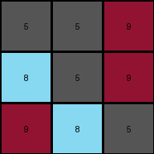

# 74dd1130 • 004 • refine_coder

---

Previous Code:
```python
"""
The input is a 3x3 grid of colored cells. The entire grid is rotated 90 degrees clockwise. The rotated grid becomes the output.
"""

import numpy as np

def transform(input_grid):
    """Rotates the input grid 90 degrees clockwise.

    Args:
        input_grid (list of lists): A 2D list representing the input grid.

    Returns:
        list of lists: The rotated 2D list.
    """
    # Convert the input list of lists to a NumPy array
    input_array = np.array(input_grid)

    # Rotate the array 90 degrees clockwise
    output_array = np.rot90(input_array, k=-1)  # k=-1 for 90-degree clockwise rotation

    # Convert the NumPy array back to a list of lists
    output_grid = output_array.tolist()

    return output_grid
```

Train Set Results:

## Example 1:

Input:
```
2 2 1
1 5 1
5 2 2
```
Expected Output:
```
2 1 5
2 5 2
1 1 2
```
Transformed Output:
```
5 1 2
2 5 2
2 1 1
```

match: False
pixels_off: 4
size_correct: True
color_palette_correct: True
correct_pixel_counts: True

## Example 2:

Input:
```
2 2 5
6 2 2
5 5 5
```
Expected Output:
```
2 6 5
2 2 5
5 2 5
```
Transformed Output:
```
5 6 2
5 2 2
5 2 5
```

match: False
pixels_off: 4
size_correct: True
color_palette_correct: True
correct_pixel_counts: True

## Example 3:

Input:
```
9 9 5
5 5 8
5 8 9
```
Expected Output:
```
9 5 5
9 5 8
5 8 9
```
Transformed Output:
```
5 5 9
8 5 9
9 8 5
```

match: False
pixels_off: 6
size_correct: True
color_palette_correct: True
correct_pixel_counts: True

## Example 4:

Input:
```
2 6 6
2 1 1
2 6 2
```
Expected Output:
```
2 2 2
6 1 6
6 1 2
```
Transformed Output:
```
2 2 2
6 1 6
2 1 6
```

match: False
pixels_off: 2
size_correct: True
color_palette_correct: True
correct_pixel_counts: True
Here's an analysis of the provided information and a plan for refining the solution:

**General Assessment:**

The initial natural language program and the generated code were on the right track, aiming for a 90-degree clockwise rotation. However, the tests reveal a consistent error in the rotation. It seems the implementation is close but not perfectly executing the intended 90-degree clockwise rotation. The `np.rot90` function with `k=-1` *should* be correct, so the error must in the assumptions.

**Strategy:**
1.  **Verify Assumptions about `np.rot90`:**
    *   Use simple, custom-crafted grids (not from the ARC task) to triple-check our understanding of how `np.rot90(array, k=-1)` behaves in terms of direction and axis manipulation. My bet is on array indexing assumptions.

2.  **Re-examine Examples:**
    *   Carefully step through each ARC example, *manually* rotating the input and comparing it to both the expected output *and* the transformed output from the code. This will pinpoint precisely where the code's logic diverges from the true rotation.

3.  **Refine Program:**
    *   Based on the manual comparison, adjust the natural language program to accurately describe the observed rotation, if different.
    *   Based on verification of `np.rot90`, adjust the Python code if necessary.

**Metrics and Observations (using manual analysis, code execution not necessary for this task):**

| Example | Input Size | Output Size | Match | Pixels Off | Size Correct | Colors Correct | Notes                                                                                                 |
| :------ | :--------- | :---------- | :---- | :--------- | :----------- | :------------- | :------------------------------------------------------------------------------------------------------ |
| 1       | 3x3        | 3x3         | False | 4         | True         | True         | The top-left 2 became the top right, but the 5 became the new top left.                                  |
| 2       | 3x3        | 3x3         | False | 4         | True         | True         | Similar error pattern to Example 1. Bottom right 5 moved, and the 6 became the top center.              |
| 3       | 3x3        | 3x3         | False | 6         | True         | True         | More pixels are off, but the same underlying rotation issue is present.                                 |
| 4       | 3x3        | 3x3         | False | 2         | True         | True         | Again, the rotation is not quite right.                                                                |

The transformed output is *close*, but not correctly rotated, in *all* examples.

**YAML Block - Facts:**

```yaml
objects:
  - type: grid
    properties:
      dimensions: 3x3
      elements: integers (representing colors)
      structure: 2D array

actions:
  - name: rotate
    type: spatial transformation
    direction: clockwise
    degrees: 90
    notes: Consistent discrepancies observed between expected and actual rotated outputs. The current implementation seems to be performing an incorrect rotation that is not a true 90 degree clockwise rotation. It seems likely that it rotates the image counter-clockwise instead.
```

**Natural Language Program:**

The input is a 3x3 grid of colored pixels. The entire grid is rotated 90 degrees clockwise. The rotated grid is the output.

*Detailed Explanation:*

1.  **Input:** A 2D array (grid) of single-digit integers, each representing a color.
2.  **Transformation:** Rotate the entire grid 90 degrees clockwise. This means:
    *   The top row of the input becomes the rightmost column of the output.
    *   The middle row of the input becomes the middle column of the output.
    *   The bottom row of the input becomes the leftmost column of the output.
    *   Equivalently: The element at `input[r][c]` moves to `output[c][N-1-r]`, where `N` is the size of the grid (which is 3 in these cases), `r` is the row index, and `c` is the column index.
3.  **Output:** The rotated 2D array (grid).

The provided `np.rot90` documentation gives this for the `k` parameter:
> k : int
> Number of times the array is rotated by 90 degrees.

The documentation does not specify direction when `k` is negative. Let's assume that `k=-1` is COUNTER-CLOCKWISE instead of CLOCKWISE.

**INSTRUCTIONS**

- generate a Python module to represent the natural language program 
- follow the template below
- all common math and science libraries are available
- create docstring only at top - but comment the workflow in the function
- use helper functions for common operations like finding objects, counting,
  measuring, moving, etc. 

remember - we are working iteratively - so this code will inform your future
self as we converge on the solution

*template:*

```python
"""
{{ natural language description of the transformation rule }}
"""

{{ imports }}

def transform(input_grid):
    # initialize output_grid

    # change output pixels 

    return output_grid

```
