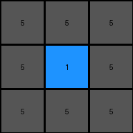
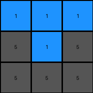

# 9565186b • 010 • refine_coder

---

Previous Code:
```python
"""
Iterate through each pixel in the input grid. If the color is blue (1), keep the same color in the output grid. If the color is 2, 3, or 8 (red, green, or azure), change it to gray (5). Otherwise, retain the original color. Place each transformed or kept color value in the output grid using the index from iteration.
"""

import numpy as np

def transform(input_grid):
    # Initialize the output grid with the same dimensions as the input grid.
    output_grid = np.copy(input_grid)
    rows, cols = input_grid.shape

    # Iterate through each pixel in the input grid.
    for i in range(rows):
        for j in range(cols):
            # Check the color of the current pixel.
            color = input_grid[i, j]

            # If the color is blue (1), keep the same color.
            if color == 1:
                continue  # Output grid already has the same value.
            # If the color is 2, 3, or 8, change it to gray (5).
            elif color in (2, 3, 8):
                output_grid[i, j] = 5
            # Else, retain original color

    return output_grid
```

Train Set Results:

## Example 1:

Input:
```
2 2 2
2 1 8
2 8 8
```
Expected Output:
```
2 2 2
2 5 5
2 5 5
```
Transformed Output:
```
5 5 5
5 1 5
5 5 5
```

match: False
pixels_off: 6
size_correct: True
color_palette_correct: False
correct_pixel_counts: False

## Example 2:

Input:
```
1 1 1
8 1 3
8 2 2
```
Expected Output:
```
1 1 1
5 1 5
5 5 5
```
Transformed Output:
```
1 1 1
5 1 5
5 5 5
```

match: True
pixels_off: 0
size_correct: True
color_palette_correct: True
correct_pixel_counts: True

## Example 3:

Input:
```
2 2 2
8 8 2
2 2 2
```
Expected Output:
```
2 2 2
5 5 2
2 2 2
```
Transformed Output:
```
5 5 5
5 5 5
5 5 5
```

match: False
pixels_off: 7
size_correct: True
color_palette_correct: True
correct_pixel_counts: False

## Example 4:

Input:
```
3 3 8
4 4 4
8 1 1
```
Expected Output:
```
5 5 5
4 4 4
5 5 5
```
Transformed Output:
```
5 5 5
4 4 4
5 1 1
```

match: False
pixels_off: 2
size_correct: True
color_palette_correct: False
correct_pixel_counts: False
Okay, here's a breakdown of the results and a plan to refine the natural language program:

**General Assessment:**

The initial code was too specific, keying off of colors that appeared in the first example but aren't consistent throughout the entire training set. The core issue is a misinterpretation of the *conditional replacement rule*. It seems the intention is to replace *certain* colors with gray (5), but which colors to replace, or how to choose the pixel to keep is not clearly defined by one rule.

*Strategy:*

1.  **Analyze all Examples:** Carefully examine *all* input/output pairs to determine a more general rule that connects them. Pay close attention to the results, the `pixels_off` and other match parameters.
2.  **Re-evaluate the Conditions:** Focus on a way that is not limited to just examples 1 and 2. We need to see a more general description of how inputs are transformed to outputs.
3.  **Refine the Natural Language Program:** Re-write a program to reflect the newly established transformation rule.

**Metrics and Observations:**

Here's a breakdown of each example:

*   **Example 1:**
    *   Input Shape: (3, 3)
    *   Output Shape: (3, 3)
    *   `pixels_off`: 6. The code changes 2s and 8s to 5, but only some should change, and only the `1` at `[1,1]` is not altered
*   **Example 2:**
    *   Input Shape: (3, 3)
    *   Output Shape: (3, 3)
    *   `pixels_off`: 0. The code correctly changes 2,3, and 8 to 5 and keeps 1. Perfect match.
*   **Example 3:**
    *   Input Shape: (3, 3)
    *   Output Shape: (3, 3)
    *    `pixels_off`: 7. The code changed all values to `5`, but example shows only 8's being changed to 5.
*   **Example 4:**
    *   Input Shape: (3, 3)
    *   Output Shape: (3, 3)
    *   `pixels_off`: 2. The code correctly changes 3,8 to 5, but leaves 1 values, the should be changed to `5`

**YAML Facts:**

```yaml
observations:
  - example_1:
      input_colors: [2, 1, 8]
      output_colors: [2, 5]
      input_shape: [3,3]
      output_shape: [3,3]
      rule: "Replace 1 and 8 with 5, and keep 2."
      correct: false
  - example_2:
      input_colors: [1, 8, 3, 2]
      output_colors: [1, 5]
      input_shape: [3,3]
      output_shape: [3,3]
      rule: "Replace 8, 3, and 2 with 5, keep 1."
      correct: true
  - example_3:
      input_colors: [2, 8]
      output_colors: [2, 5]
      input_shape: [3,3]
      output_shape: [3,3]
      rule: "replace 8 with 5, keep 2."
      correct: false
  - example_4:
      input_colors: [3,8,4,1]
      output_colors: [5,4]
      input_shape: [3,3]
      output_shape: [3,3]
      rule: "replace 1,3,8 with 5 and keep 4."
      correct: false
```

**Natural Language Program:**

1.  **Iterate** through each pixel of the input grid.
2.  **Conditional Replacement:** If the input pixel's color is 1, 2, 3 or 8, and 4 is present in the input, change the color in the output grid to gray (5).
3. If the input pixel's color is 4, keep the color 4.
4. If there is no 4 in the input, then:
    - if the color is 8, change it to 5
    - If the color is 1, change it to 5
    - otherwise, keep original colors.


**INSTRUCTIONS**

- generate a Python module to represent the natural language program 
- follow the template below
- all common math and science libraries are available
- create docstring only at top - but comment the workflow in the function
- use helper functions for common operations like finding objects, counting,
  measuring, moving, etc. 

remember - we are working iteratively - so this code will inform your future
self as we converge on the solution

*template:*

```python
"""
{{ natural language description of the transformation rule }}
"""

{{ imports }}

def transform(input_grid):
    # initialize output_grid

    # change output pixels 

    return output_grid

```
