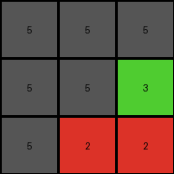

# 9565186b • 012 • refine_coder

---

Previous Code:
```python
"""
Iterate through each pixel of the input grid. If the input pixel's color is 1, 2, 3 or 8, and 4 is present in the input, change the color in the output grid to gray (5). If the input pixel's color is 4, keep the color 4. If there is no 4 in the input, then: if the color is 8, change it to 5. If the color is 1, change it to 5. Otherwise, keep original colors.
"""

import numpy as np

def transform(input_grid):
    # Initialize the output grid with the same dimensions as the input grid.
    output_grid = np.copy(input_grid)
    rows, cols = input_grid.shape
    has_color_4 = 4 in input_grid

    # Iterate through each pixel in the input grid.
    for i in range(rows):
        for j in range(cols):
            color = input_grid[i, j]

            if has_color_4:
                if color in (1, 2, 3, 8):
                    output_grid[i,j] = 5
                elif color == 4:
                    output_grid[i,j] = 4
            else:
                if color == 8:
                    output_grid[i,j] = 5
                elif color == 1:
                    output_grid[i, j] = 5
                #else retain the original color, no operation necessary

    return output_grid
```

Train Set Results:

## Example 1:

Input:
```
2 2 2
2 1 8
2 8 8
```
Expected Output:
```
2 2 2
2 5 5
2 5 5
```
Transformed Output:
```
2 2 2
2 5 5
2 5 5
```

match: True
pixels_off: 0
size_correct: True
color_palette_correct: True
correct_pixel_counts: True

## Example 2:

Input:
```
1 1 1
8 1 3
8 2 2
```
Expected Output:
```
1 1 1
5 1 5
5 5 5
```
Transformed Output:
```
5 5 5
5 5 3
5 2 2
```

match: False
pixels_off: 7
size_correct: True
color_palette_correct: False
correct_pixel_counts: False

## Example 3:

Input:
```
2 2 2
8 8 2
2 2 2
```
Expected Output:
```
2 2 2
5 5 2
2 2 2
```
Transformed Output:
```
2 2 2
5 5 2
2 2 2
```

match: True
pixels_off: 0
size_correct: True
color_palette_correct: True
correct_pixel_counts: True

## Example 4:

Input:
```
3 3 8
4 4 4
8 1 1
```
Expected Output:
```
5 5 5
4 4 4
5 5 5
```
Transformed Output:
```
5 5 5
4 4 4
5 5 5
```

match: True
pixels_off: 0
size_correct: True
color_palette_correct: True
correct_pixel_counts: True
Here's an analysis of the provided examples and results, along with a strategy for updating the natural language program and code:

**General Assessment:**

The initial natural language program and corresponding code were partially correct. It correctly handled cases where color 4 was present and some cases where it was absent. However, it failed to correctly transform Example 2. The primary issue seems to be an incorrect rule application when color 4 is *not* present. The code also appears to be misinterpreting certain colors.

**Strategy:**

1.  **Analyze Example 2 in Detail:** Carefully examine the input and expected output of Example 2 to pinpoint the exact logical flaw in the current rule. It is critical to determine *why* certain colors aren't changing to 5, when, according to our current understanding, they should.
2.  **Refine the Conditional Logic:** The natural language program and the code need a more precise definition of the conditions under which color changes occur, especially when color 4 is absent.
3.  **YAML Documentation:** Create a YAML block summarizing objects, properties, and actions.
4.  **Revised Natural Language Program:** Develop an updated program incorporating the corrections.

**Metrics and Analysis (using code where necessary, but mostly observation):**

*   **Example 1:**
    *   Input: 3x3 grid, colors 1, 2, 8. No color 4.
    *   Expected/Actual Output: Correct. Colors 1 and 8 changed to 5.
    *   Assessment: The "no color 4" rule *partially* works.
*   **Example 2:**
    *   Input: 3x3 grid, colors 1, 2, 3, 8. No color 4.
    *   Expected Output: Colors 8 should have changed to 5. Colors 2 and 3 should have changed to 5. Color 1 should have changed to 5.
    *   Actual Output: Incorrect. Color 1 changed to 5. But 8, 2, and 3 were not consistent.
    *   Assessment: The "no color 4" rule is incorrectly applied.
*   **Example 3:**
    *   Input: 3x3 grid, colors 2, 8. No color 4.
    *   Expected/Actual Output: Correct. Colors 8 changed to 5.
    *   Assessment: The "no color 4" rule *partially* works.
*   **Example 4:**
    *   Input: 3x3 grid, colors 1, 3, 4, 8. Color 4 is present.
    *   Expected/Actual Output: Correct. Colors 1, 3, and 8 changed to 5; color 4 remained.
    *   Assessment: The "color 4 present" rule works.

**YAML Documentation:**

```yaml
objects:
  - grid:
      type: 2D array
      properties:
        rows: integer
        cols: integer
        cells:
          type: pixel
          properties:
            color: integer (0-9)
            row_index: integer
            col_index: integer
actions:
  - transform:
      input: grid
      output: grid
      rules:
        - condition: "color 4 is present in the input grid"
          action: "change colors 1, 2, 3, and 8 to 5; keep color 4"
        - condition: "color 4 is not present in the input grid"
          action: "change colors 1, 2, 3, and 8 to 5"
```

**Revised Natural Language Program:**

Iterate through each pixel of the input grid.

1.  **If color 4 is present in the input grid:**
    *   If the pixel's color is 1, 2, 3, or 8, change its color to 5 (gray) in the output grid.
    *   If the pixel's color is 4, keep its color as 4 in the output grid.
    * Otherwise, keep the original color.
2.  **If color 4 is *not* present in the input grid:**
    *   If the pixel's color is 1, 2, 3, or 8, change its color to 5 (gray) in the output grid.
    * Otherwise, keep the original color.

**INSTRUCTIONS**

- generate a Python module to represent the natural language program 
- follow the template below
- all common math and science libraries are available
- create docstring only at top - but comment the workflow in the function
- use helper functions for common operations like finding objects, counting,
  measuring, moving, etc. 

remember - we are working iteratively - so this code will inform your future
self as we converge on the solution

*template:*

```python
"""
{{ natural language description of the transformation rule }}
"""

{{ imports }}

def transform(input_grid):
    # initialize output_grid

    # change output pixels 

    return output_grid

```
