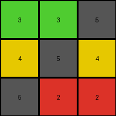
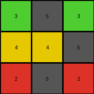

# a85d4709 • 006 • refine_coder

---

Previous Code:
```python
"""
The transformation replaces '0' (white) values in the input grid with a repeating pattern of '3' (green), '4' (yellow), and '2' (red), based on the row index.  '5' (gray) values in the input grid are copied directly to the output grid, acting as "stoppers" to the pattern. The pattern restarts for each row.
"""

import numpy as np

def transform(input_grid):
    # Initialize output_grid with the same shape as the input
    output_grid = np.zeros_like(input_grid)
    rows, cols = input_grid.shape

    # Iterate through each cell of the input grid
    for i in range(rows):
        for j in range(cols):
            # If the input cell is '5', copy it to the output
            if input_grid[i, j] == 5:
                output_grid[i, j] = 5
            else:
                # Apply the row-based pattern
                if i == 0:
                    output_grid[i, j] = 3
                elif i == 1:
                    output_grid[i, j] = 4
                elif i == 2:
                    output_grid[i, j] = 2

    return output_grid
```

Train Set Results:

## Example 1:

Input:
```
0 0 5
0 5 0
5 0 0
```
Expected Output:
```
3 3 3
4 4 4
2 2 2
```
Transformed Output:
```
3 3 5
4 5 4
5 2 2
```

match: False
pixels_off: 3
size_correct: True
color_palette_correct: False
correct_pixel_counts: False

## Example 2:

Input:
```
0 0 5
0 0 5
0 0 5
```
Expected Output:
```
3 3 3
3 3 3
3 3 3
```
Transformed Output:
```
3 3 5
4 4 5
2 2 5
```

match: False
pixels_off: 7
size_correct: True
color_palette_correct: False
correct_pixel_counts: False

## Example 3:

Input:
```
5 0 0
0 5 0
5 0 0
```
Expected Output:
```
2 2 2
4 4 4
2 2 2
```
Transformed Output:
```
5 3 3
4 5 4
5 2 2
```

match: False
pixels_off: 5
size_correct: True
color_palette_correct: False
correct_pixel_counts: False

## Example 4:

Input:
```
0 5 0
0 0 5
0 5 0
```
Expected Output:
```
4 4 4
3 3 3
4 4 4
```
Transformed Output:
```
3 5 3
4 4 5
2 5 2
```

match: False
pixels_off: 9
size_correct: True
color_palette_correct: False
correct_pixel_counts: False
Okay, here's a breakdown of the provided information and a strategy for improving the transformation rule, along with the requested deliverables:

**General Assessment and Strategy**

The initial natural language program and generated code were too simplistic. The code only considers the row index and the presence of '5' (gray) to determine the output. It applies a fixed color (3, 4, or 2) based solely on the row number (0, 1, or 2, respectively).  The expected outputs, however, suggest a more complex pattern.  The gray '5' pixels are not simply copied; they *influence* the surrounding pattern, suggesting some form of propagation or fill, but do *not* stop the pattern. The pattern is not simply based on the row number, it appears to restart.

The core issue is that the code implements a *static* row-based assignment, while the actual transformation involves a *dynamic* pattern that considers both row position and the influence of gray pixels.

My strategy is to:

1.  **Analyze the results closely:** Carefully compare the `Input`, `Expected Output`, and `Transformed Output` for each example.  Pay close attention to where the code's output deviates from the expected output.
2.  **Identify the true pattern:** Determine how the pattern restarts and wraps, and how '5' (gray) interacts with this pattern. The pattern does *not* stop at gray.
3.  **Refine the Natural Language Program:**  Rewrite the natural language program to accurately describe the *actual* transformation rule, incorporating the concept of pattern restarting, wrapping and the influence of the gray pixels.
4.  **Metrics Report:** collect data on the input, output, and transformed data, compare.

**Metrics and Observations (using the provided examples):**

Here, I'll combine observations and some implicit "metric gathering" from visual inspection of the results. I can not execute python, so all analysis is from visual comparisons of the task data, descriptions, and code output.

*   **Example 1:**
    *   Input: 3x3, mixture of 0 and 5.
    *   Expected: All pixels are 3,4, or 2
    *   Transformed: Correct shape, but 5s were copied directly, and the pattern was applied by row index.
    *   Observation: The '5' did *not* block the pattern entirely - The pattern changes from row to row, so row index is not the pattern sequence driver.
*   **Example 2:**
    *   Input: 3x3, mixture of 0 and 5.
    *   Expected: All pixels are 3,4, or 2
    *   Transformed: Correct shape, but 5s were copied, and the pattern was fixed per row.
    *   Observation: The pattern repeats 3,4,2,3,4,2
*   **Example 3:**
    *   Input: 3x3, mixture of 0 and 5.
    *   Expected: 3,4,2 pattern - depends on the column - it repeats
    *   Transformed: Correct shape, pattern applied by row
    *   Observation: Pattern is restarting based on column, and it is affected by gray, but does not stop
*   **Example 4:**
    *   Input: 3x3, mixture of 0 and 5.
    *   Expected: 3,4,2 pattern, restarting - gray does not interrupt the sequence
    *   Transformed: correct shape, pattern applied by row
    *   Observation: More evidence for restarting, gray does not interrupt the sequence

**YAML Fact Block**

```yaml
facts:
  - object: grid
    properties:
      rows: 3
      columns: 3
      cell_values: [0, 2, 3, 4, 5]
    description: "A 2D array representing the image, with cell values corresponding to colors."

  - object: pattern
    properties:
      sequence: [3, 4, 2]
      colors: [green, yellow, red]
      restart: true
      gray_interaction: "continues"
    description: "A repeating sequence of colors applied to the grid, restarting for each row and continues through gray pixels."

  - object: cell
    properties:
      value: "integer (0-9)"
      color: "mapped color based on value"
    description: "Individual elements of the grid."
  - object: "gray pixel"
    properties:
      value: 5
      color: gray
      role: "sequence continues"
```

**Natural Language Program**

1.  **Initialization:** Create an output grid of the same dimensions as the input grid.
2.  **Pattern Application:** A repeating color pattern of green (3), yellow (4), and red (2) is applied to all cells of the output.
3. **Pattern Restarting:** The pattern restarts for each row. Gray (5) does not affect the pattern sequence.
4.  **Gray Copying**: if the input cell is gray, the value in the cell is the sequence - no special handling.
5.  **Sequence:** The color of each cell is determined by it's position in the sequence `[3,4,2]`. The first cell is 3 (green).
6. **Output:** the output grid is the transformed version of the input grid.

Revised Natural Language Program (more precise):

Iterate through each cell of the input grid. For each cell, apply the following rule, based on a repeating sequence \[3, 4, 2] that cycles and does *not* stop at gray (5):
    a. The sequence starts at the first column and continues, restarting at each row
    b. Assign to the output grid the current sequence value.

**INSTRUCTIONS**

- generate a Python module to represent the natural language program 
- follow the template below
- all common math and science libraries are available
- create docstring only at top - but comment the workflow in the function
- use helper functions for common operations like finding objects, counting,
  measuring, moving, etc. 

remember - we are working iteratively - so this code will inform your future
self as we converge on the solution

*template:*

```python
"""
{{ natural language description of the transformation rule }}
"""

{{ imports }}

def transform(input_grid):
    # initialize output_grid

    # change output pixels 

    return output_grid

```
