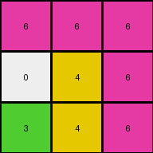
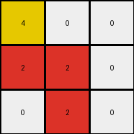

# d037b0a7 • 003 • refine_dreamer

---

Previous Code:
```python
"""
1.  **Identify Key Pixels:** Find the pixel with the value 6 (magenta) in the input grid.
2.  **Magenta Propagation:**  Propagate the value '6' downwards and to the left, replacing any '0' (white) pixels encountered. Stop propagation in a direction when a non-zero pixel is met.
3. **Yellow propogation** Propogate the value '4' downwards.
4. Ignore other non-zero pixels.
"""

import numpy as np

def get_top_right_nonzero(grid):
    for j in range(grid.shape[1] - 1, -1, -1):
        for i in range(grid.shape[0]):
            if grid[i, j] != 0:
                return (i, j)
    return None

def transform(input_grid):
    # initialize output_grid
    output_grid = np.copy(input_grid)
    rows, cols = input_grid.shape

    # find top right non zero
    top_right_coords = get_top_right_nonzero(input_grid)
    if top_right_coords is None:
        return output_grid

    top_right_value = input_grid[top_right_coords]

    # propogate magenta
    i, j = top_right_coords
    # Propagate left
    for k in range(j, -1, -1):
        if input_grid[i,k] == 0:
            output_grid[i, k] = top_right_value
        else:
          if (i,k) != (i,j):
            break

    # Propagate down
    for k in range(i, rows):
        if input_grid[k, j] == 0:
            output_grid[k, j] = top_right_value
        else:
          if (k,j) != (i,j):
            break
          

    # propogate 4 downwards

    for row_index in range(rows):
        for col_index in range(cols):
          if output_grid[row_index,col_index] == 4:
              for k in range(row_index + 1, rows):
                  if output_grid[k,col_index] == 0:
                      output_grid[k,col_index] = 4
                  else:
                      break
    return output_grid
```

Train Set Results:

## Example 1:

Input:
```
0 0 6
0 4 0
3 0 0
```
Expected Output:
```
0 0 6
0 4 6
3 4 6
```
Transformed Output:
```
6 6 6
0 4 6
3 4 6
```

match: False
pixels_off: 2
size_correct: True
color_palette_correct: True
correct_pixel_counts: False

## Example 2:

Input:
```
0 2 0
7 0 8
0 0 0
```
Expected Output:
```
0 2 0
7 2 8
7 2 8
```
Transformed Output:
```
0 2 0
7 8 8
0 0 8
```

match: False
pixels_off: 3
size_correct: True
color_palette_correct: True
correct_pixel_counts: False

## Example 3:

Input:
```
4 0 0
0 2 0
0 0 0
```
Expected Output:
```
4 0 0
4 2 0
4 2 0
```
Transformed Output:
```
4 0 0
2 2 0
0 2 0
```

match: False
pixels_off: 2
size_correct: True
color_palette_correct: True
correct_pixel_counts: False
**INSTRUCTIONS**

The code above was generated based on observations from the first training
example

we have tested the transform function on each of the task example inputs and
compared with the expected output

review each of the examples provided and the results and consider how the
natural language program should be updated to accommodate this new knowledge

respond with the following deliverables:

- general assessment of the information provided and strategy for resolving the
  errors
- gather metrics about each of the examples and results - use code_execution to
  develop accurate reports on your assumptions
- a YAML block documenting facts - Focus on identifying objects, their properties, and the actions performed on them.
- a natural language program - Be as clear and concise as possible, providing a complete description of the transformation rule.


your responses should be considered as information in a report - not a
conversation
