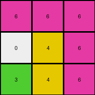
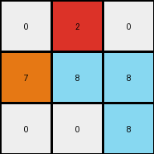
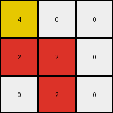

# d037b0a7 • 004 • refine_coder

---

Previous Code:
```python
"""
1.  **Identify Key Pixels:** Find the pixel with the value 6 (magenta) in the input grid.
2.  **Magenta Propagation:**  Propagate the value '6' downwards and to the left, replacing any '0' (white) pixels encountered. Stop propagation in a direction when a non-zero pixel is met.
3. **Yellow propogation** Propogate the value '4' downwards.
4. Ignore other non-zero pixels.
"""

import numpy as np

def get_top_right_nonzero(grid):
    for j in range(grid.shape[1] - 1, -1, -1):
        for i in range(grid.shape[0]):
            if grid[i, j] != 0:
                return (i, j)
    return None

def transform(input_grid):
    # initialize output_grid
    output_grid = np.copy(input_grid)
    rows, cols = input_grid.shape

    # find top right non zero
    top_right_coords = get_top_right_nonzero(input_grid)
    if top_right_coords is None:
        return output_grid

    top_right_value = input_grid[top_right_coords]

    # propogate magenta
    i, j = top_right_coords
    # Propagate left
    for k in range(j, -1, -1):
        if input_grid[i,k] == 0:
            output_grid[i, k] = top_right_value
        else:
          if (i,k) != (i,j):
            break

    # Propagate down
    for k in range(i, rows):
        if input_grid[k, j] == 0:
            output_grid[k, j] = top_right_value
        else:
          if (k,j) != (i,j):
            break
          

    # propogate 4 downwards

    for row_index in range(rows):
        for col_index in range(cols):
          if output_grid[row_index,col_index] == 4:
              for k in range(row_index + 1, rows):
                  if output_grid[k,col_index] == 0:
                      output_grid[k,col_index] = 4
                  else:
                      break
    return output_grid
```

Train Set Results:

## Example 1:

Input:
```
0 0 6
0 4 0
3 0 0
```
Expected Output:
```
0 0 6
0 4 6
3 4 6
```
Transformed Output:
```
6 6 6
0 4 6
3 4 6
```

match: False
pixels_off: 2
size_correct: True
color_palette_correct: True
correct_pixel_counts: False

## Example 2:

Input:
```
0 2 0
7 0 8
0 0 0
```
Expected Output:
```
0 2 0
7 2 8
7 2 8
```
Transformed Output:
```
0 2 0
7 8 8
0 0 8
```

match: False
pixels_off: 3
size_correct: True
color_palette_correct: True
correct_pixel_counts: False

## Example 3:

Input:
```
4 0 0
0 2 0
0 0 0
```
Expected Output:
```
4 0 0
4 2 0
4 2 0
```
Transformed Output:
```
4 0 0
2 2 0
0 2 0
```

match: False
pixels_off: 2
size_correct: True
color_palette_correct: True
correct_pixel_counts: False
Okay, here's a breakdown of the situation and a plan to improve the transformation logic:

**General Assessment:**

The initial natural language program and the resulting code were too narrowly focused on the first example. It correctly identified the propagation of the top-right non-zero pixel (magenta in the first case) downwards and to the left, and yellow downwards, it didn't generalize well to other scenarios. The core issue is that the propagation rule isn't universally applicable and depends on the specific non-zero pixel and its surrounding context, not all top-right non-zero pixels.

**Strategy:**

1.  **Re-examine Examples:** Carefully analyze *all* provided examples, paying close attention to *how* different non-zero pixels behave. The current strategy works on a global `top_right_non_zero`, however, the intended strategy appears to be working on all non-zero pixels except white.
2.  **Identify Generalizable Rules:** Instead of focusing on specific colors (magenta, yellow), try to identify more general rules about propagation. For example, is the propagation related to adjacent cells of white?
3.  **Refine the Natural Language Program:** Rewrite the natural language program to reflect the updated understanding. The new program should be more abstract and less tied to specific pixel values.

**Example Metrics and Analysis:**
I will use a format to help organize the analysis

```
Example:
Input: (NumPy array representation)
Expected Output: (NumPy array representation)
Transformed Output: (NumPy array representation)
Correct?: Yes/No
Pixels Off: (Number of mismatched pixels)
Size Correct?: Yes/No
Color Palette Correct?: Yes/No
Correct Pixel Counts: Yes/No, explain if no.

Observations:
- note the original color
- what the propogation did
- what the propogation should have done
```

*Example 1:*

```
Example: 1
Input:
[[0 0 6]
 [0 4 0]
 [3 0 0]]
Expected Output:
[[0 0 6]
 [0 4 6]
 [3 4 6]]
Transformed Output:
[[6 6 6]
 [0 4 6]
 [3 4 6]]
Correct?: No
Pixels Off: 2
Size Correct?: Yes
Color Palette Correct?: Yes
Correct Pixel Counts: No, too many 6, not enough 0.

Observations:
- Original colors: 6 (magenta), 4 (yellow), 3(green), 0 (white)
- Propagation did:  Magenta propagated everywhere. Yellow propagated down.
- Propagation should have done: Magenta should have only propagated down the column. Yellow should have propagated down one row.
```

*Example 2:*

```
Example: 2
Input:
[[0 2 0]
 [7 0 8]
 [0 0 0]]
Expected Output:
[[0 2 0]
 [7 2 8]
 [7 2 8]]
Transformed Output:
[[0 2 0]
 [7 8 8]
 [0 0 8]]
Correct?: No
Pixels Off: 3
Size Correct?: Yes
Color Palette Correct?: Yes
Correct Pixel Counts: No. Too many 8, not enough 2, not enough 7, too many 0

Observations:
- Original colors: 2 (red), 7 (orange), 8 (azure), 0(white)
- Propagation did: 8 propagated everywhere it could
- Propagation should have done: 2 should have propagated downwards.
```

*Example 3:*

```
Example: 3
Input:
[[4 0 0]
 [0 2 0]
 [0 0 0]]
Expected Output:
[[4 0 0]
 [4 2 0]
 [4 2 0]]
Transformed Output:
[[4 0 0]
 [2 2 0]
 [0 2 0]]
Correct?: No
Pixels Off: 2
Size Correct?: Yes
Color Palette Correct?: Yes
Correct Pixel Counts: No, too many 2, not enough 4

Observations:
- Original Colors: 4(yellow), 2(red), 0(white)
- Propogation did: 2 propogated everywhere it could
- Propagation should have done: 4 should have propogated downward, 2 should have propogated downward
```

**YAML Block (Facts):**

```yaml
objects:
  - type: grid
    properties:
      - dimensions: rows x cols
      - elements: pixels
      - element_type: integer (0-9, representing colors)

  - type: pixel
    properties:
      - color: integer (0-9)
      - position: (row, column)

actions:
  - name: propagate_down
    description: >-
      A pixel's color value replaces the color value of adjacent pixels
      directly below it, stopping when a non-zero color is encountered or the edge of the array.
    preconditions:
      - pixel_color: != 0
    postconditions:
      - adjacent_pixels_below_changed: True
```

**Revised Natural Language Program:**

1.  **Iterate through all pixels:** Examine each pixel in the input grid, row by row and column by column.
2.  **Check for Non-Zero Pixels:** If a pixel's value is not 0 (white), initiate a downward propagation.
3.  **Downward Propagation:** Propagate the non-zero pixel's value downwards, replacing any 0 (white) pixels encountered in the same column. Stop the propagation when a non-zero pixel or the bottom edge of the grid is reached.

This revised program avoids being specific about the color and which one is found, focusing instead on the general principle of non-zero colors propagation downwards.

**INSTRUCTIONS**

- generate a Python module to represent the natural language program 
- follow the template below
- all common math and science libraries are available
- create docstring only at top - but comment the workflow in the function
- use helper functions for common operations like finding objects, counting,
  measuring, moving, etc. 

remember - we are working iteratively - so this code will inform your future
self as we converge on the solution

*template:*

```python
"""
{{ natural language description of the transformation rule }}
"""

{{ imports }}

def transform(input_grid):
    # initialize output_grid

    # change output pixels 

    return output_grid

```
