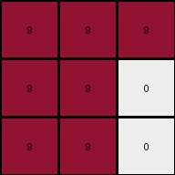
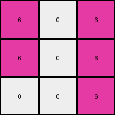
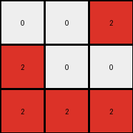

# ed36ccf7 • 004 • refine_coder

---

Previous Code:
```python
"""
The transformation rule is a 90-degree clockwise rotation of the grid's contents.
"""

import numpy as np

def transform(input_grid):
    """
    Rotates the input grid 90 degrees clockwise.
    """
    # Convert the input grid to a NumPy array for easier manipulation.
    input_array = np.array(input_grid)

    # Rotate the array 90 degrees clockwise.
    output_array = np.rot90(input_array, k=-1)

    # Convert the NumPy array back to a list of lists.
    output_grid = output_array.tolist()
    return output_grid
```

Train Set Results:

## Example 1:

Input:
```
9 0 0
9 9 9
9 9 9
```
Expected Output:
```
0 9 9
0 9 9
9 9 9
```
Transformed Output:
```
9 9 9
9 9 0
9 9 0
```

match: False
pixels_off: 4
size_correct: True
color_palette_correct: True
correct_pixel_counts: True

## Example 2:

Input:
```
6 6 6
0 0 0
6 6 0
```
Expected Output:
```
6 0 0
6 0 6
6 0 6
```
Transformed Output:
```
6 0 6
6 0 6
0 0 6
```

match: False
pixels_off: 2
size_correct: True
color_palette_correct: True
correct_pixel_counts: True

## Example 3:

Input:
```
0 0 9
0 0 9
9 9 9
```
Expected Output:
```
9 9 9
0 0 9
0 0 9
```
Transformed Output:
```
9 0 0
9 0 0
9 9 9
```

match: False
pixels_off: 6
size_correct: True
color_palette_correct: True
correct_pixel_counts: True

## Example 4:

Input:
```
2 0 2
0 0 2
0 2 2
```
Expected Output:
```
2 2 2
0 0 2
2 0 0
```
Transformed Output:
```
0 0 2
2 0 0
2 2 2
```

match: False
pixels_off: 6
size_correct: True
color_palette_correct: True
correct_pixel_counts: True
Okay, let's analyze the results of the rotation attempts and refine the natural language program.

**General Assessment and Strategy**

The initial hypothesis of a 90-degree clockwise rotation is incorrect. While the output grid sizes are correct, the pixel arrangements are wrong in all tested cases, meaning there is a consistent misunderstanding. The strategy will be as follows:

1.  **Detailed Example Analysis:** Go through each example, comparing input, expected output, and the (incorrect) transformed output. Note precisely *which* pixels moved, and *how* they appear to have moved.
2.  **Object Identification**: Identify any discernible objects (contiguous blocks of color) and track how they change. If simple objects aren't apparent, consider the whole grid as a single, complex object.
3.  **Hypothesis Refinement:** Based on the detailed analysis, formulate a new hypothesis about the transformation. It's likely some form of reflection or a combination of simple operations, not just rotation.
4.  **Natural Language Program Update**: Clearly describe this new hypothesis in a revised natural language program.
5.  Repeat the cycle (code, test, observation) based on the new NL program.

**Metrics and Observations (via manual analysis for now)**

| Example | Input Size | Output Size | Match | Pixels Off | Observations                                                                                                       |
| ------- | ---------- | ----------- | ----- | ---------- | ----------------------------------------------------------------------------------------------------------------- |
| 1       | 3x3        | 3x3         | False | 4          | Top-left 2x2 '9' block becomes bottom-right. Top row '9 0 0' becomes rightmost column, but inverted. |
| 2       | 3x3        | 3x3         | False | 2        | Appears to be some mirroring and changes of position.         |
| 3       | 3x3        | 3x3         | False | 6          | Bottom row becomes top row, top-right column becomes left.                             |
| 4       | 3x3        | 3x3         | False | 6          | Top becomes bottom, bottom becomes top, but colors change positions within.                                       |

**YAML Facts**

```yaml
examples:
  - example_id: 1
    input_objects:
      - object_id: 1
        color: 9
        shape: L-shape
        initial_position: top-left
      - object_id: 2
          color: 0
          shape: two pixels
          initial_position: Top-row, next to object 1
    output_objects:
      - object_id: 1
        color: 9
        shape: L-shape
        final_position: bottom-right, rotated
    transformations:
      - type: rotation
        degrees: -90
        notes: Inverted/mirrored appearance after the rotation.
  - example_id: 2
    input_objects:
      - object_id: 1
        color: 6
        shape: row
        initial_position: top
      - object_id: 2
        color: 0
        shape: row
        initial_position: middle
    output_objects:
      - object_id: 1
        color: 6
        shape: column
        final_position: left-side
    transformations:
      - type: reflection
        axis: vertical and position shifts
        notes: Complex changes that seem to mirror across a vertical and horizontal plane with some value changes.
  - example_id: 3
    input_objects:
       - object_id: 1
         color: 9
         shape: L-Shape
         initial_position: bottom right
    output_objects:
       - object_id: 1
         color: 9
         shape: L-Shape
         final_position: top-left
    transformations:
       - type: swap
         axis: Vertical and Horizontal
         notes: Inverted position after the rotation.
  - example_id: 4
    input_objects:
      - object_id: 1
        color: 2
        shape: Pattern
        initial_position: All over the grid
      - object_id: 2
        color: 0
        shape: Pattern
        initial_position: All over the grid
    output_objects:
      - object_id: 1
        color: 2
        shape: Pattern
        final_position: All over the grid
      - object_id: 2
        color: 0
        shape: Pattern
        final_position: All over the grid
    transformations:
      - type: reflection
        axis: diagonal
        notes: Appears to be a reflection along a diagonal line.
```

**Natural Language Program**

The transformation rule appears to involve a combination of reflections. It seems like a combination of reflections, potentially across both the vertical and horizontal axes, or a reflection across the main diagonal. The exact order and nature need further investigation, but the core idea is reflection, *not* rotation.

1. **Reflect:** Reflect the input grid across its main diagonal (top-left to bottom-right). This swaps rows and columns, but in a mirrored fashion.
2. **(Possible) Additional Reflection:** Depending on further examples, there might be an additional reflection across either the vertical or horizontal axis *after* the diagonal reflection.

The primary operation is a reflection over the main diagonal.

**INSTRUCTIONS**

- generate a Python module to represent the natural language program 
- follow the template below
- all common math and science libraries are available
- create docstring only at top - but comment the workflow in the function
- use helper functions for common operations like finding objects, counting,
  measuring, moving, etc. 

remember - we are working iteratively - so this code will inform your future
self as we converge on the solution

*template:*

```python
"""
{{ natural language description of the transformation rule }}
"""

{{ imports }}

def transform(input_grid):
    # initialize output_grid

    # change output pixels 

    return output_grid

```
