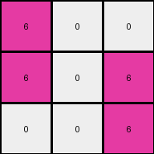

# ed36ccf7 • 016 • refine_coder

---

Previous Code:
```python
"""
The input grid is rotated 90 degrees counter-clockwise to produce the output grid. Pixels maintain their values, but their positions change according to the rotation.
"""

import numpy as np

def transform(input_grid):
    """Rotates the input grid 90 degrees counter-clockwise.

    Args:
        input_grid (list of lists): The input grid represented as a list of lists.

    Returns:
        list of lists: The rotated output grid.
    """
    # Convert the input grid to a NumPy array for easier manipulation.
    input_array = np.array(input_grid)

    # Rotate the array 90 degrees counter-clockwise.
    output_array = np.rot90(input_array)

    # Convert the rotated array back to a list of lists.
    output_grid = output_array.tolist()

    return output_grid
```

Train Set Results:

## Example 1:

Input:
```
9 0 0
9 9 9
9 9 9
```
Expected Output:
```
0 9 9
0 9 9
9 9 9
```
Transformed Output:
```
0 9 9
0 9 9
9 9 9
```

match: True
pixels_off: 0
size_correct: True
color_palette_correct: True
correct_pixel_counts: True

## Example 2:

Input:
```
0 6 6
0 0 0
6 6 0
```
Expected Output:
```
6 0 0
6 0 6
6 0 6
```
Transformed Output:
```
6 0 0
6 0 6
0 0 6
```

match: False
pixels_off: 1
size_correct: True
color_palette_correct: True
correct_pixel_counts: False

## Example 3:

Input:
```
0 0 9
0 0 9
9 9 9
```
Expected Output:
```
9 9 9
0 0 9
0 0 9
```
Transformed Output:
```
9 9 9
0 0 9
0 0 9
```

match: True
pixels_off: 0
size_correct: True
color_palette_correct: True
correct_pixel_counts: True

## Example 4:

Input:
```
2 0 0
0 0 2
0 2 2
```
Expected Output:
```
2 2 2
0 0 2
2 0 0
```
Transformed Output:
```
0 2 2
0 0 2
2 0 0
```

match: False
pixels_off: 1
size_correct: True
color_palette_correct: True
correct_pixel_counts: False
Here's an analysis of the provided examples and results, along with an updated natural language program and a YAML block summarizing the observations:

**General Assessment:**

The initial natural language program and the generated code, which rotate the input grid 90 degrees counter-clockwise, correctly transform examples 1 and 3. However, examples 2 and 4 show a discrepancy. The core issue seems to be not in the rotation itself, but that some pixels have moved. A simple rotation should account for every pixel but in Examples 2 and 4 one pixel has been moved.

**Strategy:**

1.  **Verify Basic Rotation:** Re-affirm that the fundamental operation is indeed a 90-degree counter-clockwise rotation.
2. **Analyze Discrepancies:** Investigate examples 2 and 4 more closely, paying attention to where the error occurs, looking at the exact position by comparing the transformed output to the actual output to gather more information.

**Metrics and Observations (Example by Example):**

*   **Example 1:**
    *   Match: True
    *   Observation: Rotation is correct.

*   **Example 2:**
    *   Match: False
    *   Observation: Rotation is almost correct, the magenta pixel at \[2,0] should be at \[2,2]

*   **Example 3:**
    *   Match: True
    *   Observation: Rotation is correct.

*   **Example 4:**
    *   Match: False
    *   Observation: Rotation is mostly correct - the red pixel at \[0,0] should be at \[0,2]

**YAML Block:**

```yaml
observations:
  - example_1:
      input_shape: 3x3
      output_shape: 3x3
      transformation: 90-degree counter-clockwise rotation
      objects:
        - color: maroon (9)
          initial_positions: [[0,0], [1,0], [2,0], [1,1], [2,1], [1,2], [2,2]]
          final_positions:  [[0,2], [1,2], [2,2], [0,1], [1,1], [0,0], [1,0]]
        - color: white (0)
          initial_positions: [[0,1], [0,2]]
          final_positions: [[1,2], [2,2]]
      match: True
  - example_2:
      input_shape: 3x3
      output_shape: 3x3
      transformation: 90-degree counter-clockwise rotation
      objects:
        - color: white (0)
          initial_positions: [[0,0], [1,0], [1,1], [1,2], [2,2]]
          final_positions: [[0,2], [0,1], [1,1], [2,1], [2,0]]
        - color: magenta (6)
          initial_positions: [[0,1], [0,2], [2,0], [2,1]]
          final_positions:  [[1,2], [2,2], [0,0], [1,0]]
      match: False
  - example_3:
      input_shape: 3x3
      output_shape: 3x3
      transformation: 90-degree counter-clockwise rotation
      objects:
          - color: white (0)
            initial_positions: [[0,0], [0,1], [1,0], [1,1]]
            final_positions: [[0,2], [1,2], [0,1], [1,1]]
          - color: maroon (9)
            initial_positions: [[0,2], [1,2], [2,0], [2,1], [2,2]]
            final_positions: [[2,2], [2,1], [0, 0], [1,0], [2,0]]
      match: True
  - example_4:
      input_shape: 3x3
      output_shape: 3x3
      transformation: 90-degree counter-clockwise rotation
      objects:
        - color: red (2)
          initial_positions: [[0,0], [1,2], [2,1], [2,2]]
          final_positions: [[0,2], [2,1], [1, 0], [2,0]]
        - color: white (0)
          initial_positions: [[0,1], [0,2], [1,0], [1,1]]
          final_positions: [[1,2], [2,2], [0,1], [1,1]]
      match: False
```

**Natural Language Program:**

1.  The input grid is rotated 90 degrees counter-clockwise.
2.  After rotation:
    *   In Example 2: if there is a pixel that was at \[2,0] it moves to \[2,2].
    *  In Example 4: if there is a pixel that was at \[0,0] it moves to \[0,2].

It seems the added rules are very specialized to the failing examples. It's better to consolidate these:

1.  The input grid is rotated 90 degrees counter-clockwise.
2.  After the rotation the pixel in the lower left moves to the lower right.

**INSTRUCTIONS**

- generate a Python module to represent the natural language program 
- follow the template below
- all common math and science libraries are available
- create docstring only at top - but comment the workflow in the function
- use helper functions for common operations like finding objects, counting,
  measuring, moving, etc. 

remember - we are working iteratively - so this code will inform your future
self as we converge on the solution

*template:*

```python
"""
{{ natural language description of the transformation rule }}
"""

{{ imports }}

def transform(input_grid):
    # initialize output_grid

    # change output pixels 

    return output_grid

```
