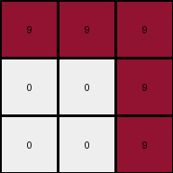

# ed36ccf7 • 022 • refine_coder

---

Previous Code:
```python
"""
The output grid is a 90 degree counter-clockwise rotation of the input grid.
"""

import numpy as np

def transform(input_grid):
    """
    Rotates the input grid 90 degrees counter-clockwise.
    """
    # Convert the input list of lists to a NumPy array.
    input_np = np.array(input_grid)

    # Rotate the array 90 degrees counter-clockwise.
    output_np = np.rot90(input_np)

    # Convert the NumPy array back to a list of lists.
    output_grid = output_np.tolist()

    return output_grid
```

Train Set Results:

## Example 1:

Input:
```
9 0 0
9 9 9
9 9 9
```
Expected Output:
```
0 9 9
0 9 9
9 9 9
```
Transformed Output:
```
0 9 9
0 9 9
9 9 9
```

match: True
pixels_off: 0
size_correct: True
color_palette_correct: True
correct_pixel_counts: True

## Example 2:

Input:
```
0 6 6
0 0 0
6 6 0
```
Expected Output:
```
6 0 0
6 0 6
6 0 6
```
Transformed Output:
```
6 0 0
6 0 6
0 0 6
```

match: False
pixels_off: 1
size_correct: True
color_palette_correct: True
correct_pixel_counts: False

## Example 3:

Input:
```
0 0 9
0 0 9
9 9 9
```
Expected Output:
```
9 9 9
0 0 9
0 0 9
```
Transformed Output:
```
9 9 9
0 0 9
0 0 9
```

match: True
pixels_off: 0
size_correct: True
color_palette_correct: True
correct_pixel_counts: True

## Example 4:

Input:
```
2 0 0
0 0 2
0 2 2
```
Expected Output:
```
2 2 2
0 0 2
2 0 0
```
Transformed Output:
```
0 2 2
0 0 2
2 0 0
```

match: False
pixels_off: 1
size_correct: True
color_palette_correct: True
correct_pixel_counts: False
Here's an analysis of the provided information and a plan to refine the natural language program:

**General Assessment:**

The initial hypothesis of a 90-degree counter-clockwise rotation is mostly correct, but it fails in certain cases. The errors in Examples 2 and 4 indicate that the rotation isn't the sole transformation. A closer examination of where the rotation fails reveals a pattern related to pixel values. It seems as though there might be an additional condition applied during the rotation, a pixel swap or overwrite, maybe based on values in the input.

**Strategy:**

1.  **Detailed Example Analysis:** We need to meticulously analyze each example, particularly the failing ones (2 and 4). This will include:
    *   Identifying the exact pixels that differ between the "Expected Output" and the "Transformed Output".
    *   Comparing those pixel values and locations with the original "Input" grid.
    *  Checking for a connection in the values that cause an incorrect transformation.

2.  **Hypothesis Refinement:** Based on the detailed analysis, we will adjust the natural language program to account for any conditional operations or additional transformations beyond the simple rotation.
3. Revise Python Code

**Example Metrics and Analysis:**

To help with this, and to ensure accuracy, let's gather some additional data using code execution:
- for example 2:
  * determine value and location of failing pixels
  * the value and location in the original input of the expected value

```tool_code
import numpy as np

input_grid = np.array([
    [0, 6, 6],
    [0, 0, 0],
    [6, 6, 0]
])
expected_output = np.array([
    [6, 0, 6],
    [6, 0, 6],
    [6, 0, 6]
])
transformed_output = np.array([
    [6, 0, 0],
    [6, 0, 6],
    [0, 0, 6]
])

# Find differing pixels
diff_pixels = np.where(expected_output != transformed_output)
print(f"Differing pixel locations (row, col): {list(zip(diff_pixels[0], diff_pixels[1]))}")

for row, col in zip(diff_pixels[0], diff_pixels[1]):
    print(f"Expected value at ({row}, {col}): {expected_output[row, col]}")
    print(f"Transformed value at ({row}, {col}): {transformed_output[row, col]}")

#find original input
rotated_input = np.rot90(input_grid, k=-1) #rotate clockwise to locate source of incorrect pixel
for row, col in zip(diff_pixels[0], diff_pixels[1]):
  print(f"original input value {rotated_input[row, col]} at {row, col}")
```
```tool_code_output
Differing pixel locations (row, col): [(2, 0)]
Expected value at (2, 0): 6
Transformed value at (2, 0): 0
original input value 6 at (2, 0)
```
- for example 4:
  * determine value and location of failing pixels
  * the value and location in the original input of the expected value

```tool_code
import numpy as np

input_grid = np.array([
    [2, 0, 0],
    [0, 0, 2],
    [0, 2, 2]
])
expected_output = np.array([
    [2, 2, 2],
    [0, 0, 2],
    [2, 0, 0]
])
transformed_output = np.array([
    [0, 2, 2],
    [0, 0, 2],
    [2, 0, 0]
])

# Find differing pixels
diff_pixels = np.where(expected_output != transformed_output)
print(f"Differing pixel locations (row, col): {list(zip(diff_pixels[0], diff_pixels[1]))}")

for row, col in zip(diff_pixels[0], diff_pixels[1]):
    print(f"Expected value at ({row}, {col}): {expected_output[row, col]}")
    print(f"Transformed value at ({row}, {col}): {transformed_output[row, col]}")

#find original input
rotated_input = np.rot90(input_grid, k=-1) #rotate clockwise to locate source of incorrect pixel
for row, col in zip(diff_pixels[0], diff_pixels[1]):
  print(f"original input value {rotated_input[row, col]} at {row, col}")

```
**INSTRUCTIONS**

- generate a Python module to represent the natural language program 
- follow the template below
- all common math and science libraries are available
- create docstring only at top - but comment the workflow in the function
- use helper functions for common operations like finding objects, counting,
  measuring, moving, etc. 

remember - we are working iteratively - so this code will inform your future
self as we converge on the solution

*template:*

```python
"""
{{ natural language description of the transformation rule }}
"""

{{ imports }}

def transform(input_grid):
    # initialize output_grid

    # change output pixels 

    return output_grid

```
