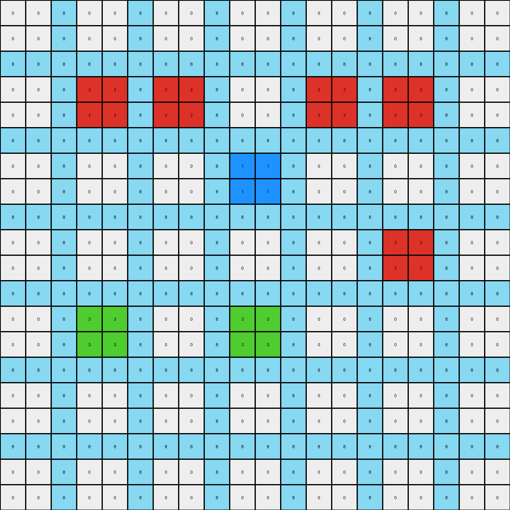
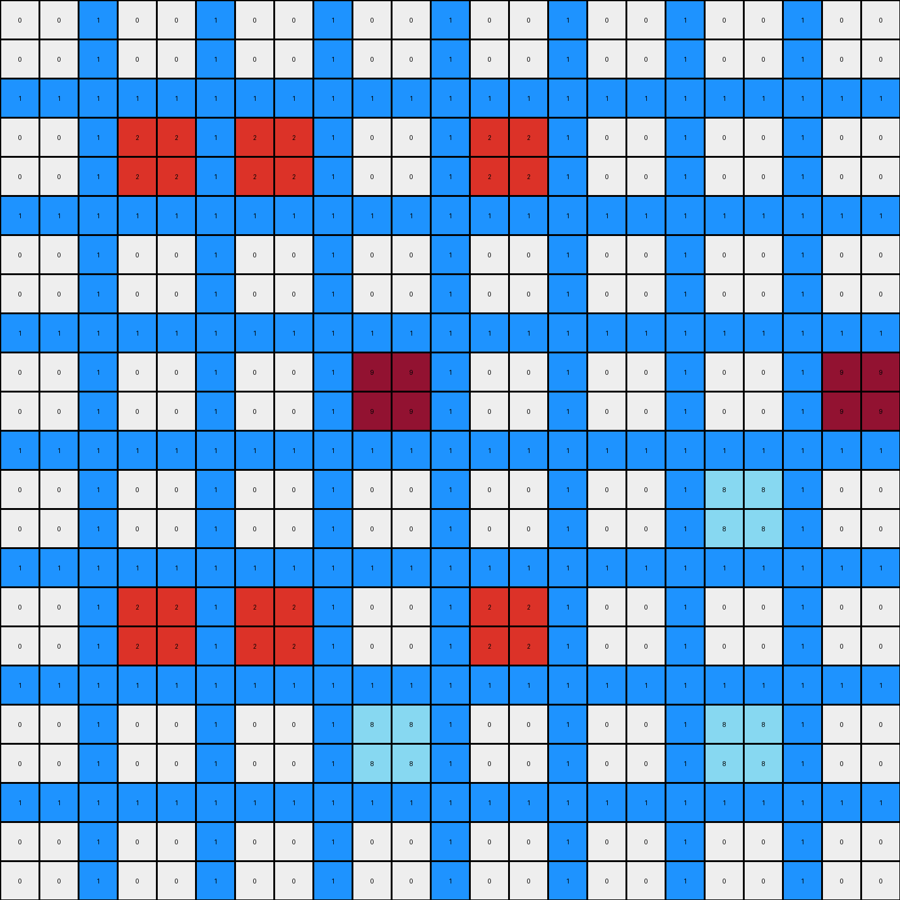

# 06df4c85 • 003 • refine_dreamer

---


Previous Code:
```python
"""
The transformation rule involves identifying 2x2 blocks of colors 1 (blue), 2 (red), and 3 (green) within an azure (8) background.
These blocks are then replicated horizontally based on their initial position. Red blocks starting at x=3 or x=9 are replicated 
to create a total of three instances of red blocks. Blue and Green are replicated once.
"""

import numpy as np

def find_2x2_blocks(grid, color):
    """Finds all 2x2 blocks of the specified color in the grid."""
    blocks = []
    height, width = grid.shape
    for y in range(height - 1):
        for x in range(width - 1):
            if (grid[y:y+2, x:x+2] == color).all():
                blocks.append((y, x))  # Store top-left corner coordinates
    return blocks

def transform(input_grid):
    """Transforms the input grid according to the replication rules."""
    output_grid = np.copy(input_grid)
    height, width = output_grid.shape

    # Find 2x2 blocks of colors 1, 2, and 3
    red_blocks = find_2x2_blocks(input_grid, 2)
    blue_blocks = find_2x2_blocks(input_grid, 1)
    green_blocks = find_2x2_blocks(input_grid, 3)
    
    # Replicate red blocks based on the starting position.
    for y, x in red_blocks:
      if x == 3 or x == 9:
          output_grid[y:y+2, 6:8] = 2
          output_grid[y:y+2, 12:14] = 2

    # Duplicate blue blocks
    for y, x in blue_blocks:
        output_grid[y:y+2, 9:11] = 1 #only one copy

    # Duplicate green blocks
    for y, x in green_blocks:
        output_grid[y:y+2, 9:11] = 3  #only one copy

    return output_grid
```

Train Set Results:

## Example 1:

Input:
```
0 0 8 0 0 8 0 0 8 0 0 8 0 0 8 0 0 8 0 0
0 0 8 0 0 8 0 0 8 0 0 8 0 0 8 0 0 8 0 0
8 8 8 8 8 8 8 8 8 8 8 8 8 8 8 8 8 8 8 8
0 0 8 2 2 8 0 0 8 0 0 8 0 0 8 2 2 8 0 0
0 0 8 2 2 8 0 0 8 0 0 8 0 0 8 2 2 8 0 0
8 8 8 8 8 8 8 8 8 8 8 8 8 8 8 8 8 8 8 8
0 0 8 0 0 8 0 0 8 1 1 8 0 0 8 0 0 8 0 0
0 0 8 0 0 8 0 0 8 1 1 8 0 0 8 0 0 8 0 0
8 8 8 8 8 8 8 8 8 8 8 8 8 8 8 8 8 8 8 8
0 0 8 0 0 8 0 0 8 0 0 8 0 0 8 2 2 8 0 0
0 0 8 0 0 8 0 0 8 0 0 8 0 0 8 2 2 8 0 0
8 8 8 8 8 8 8 8 8 8 8 8 8 8 8 8 8 8 8 8
0 0 8 3 3 8 0 0 8 3 3 8 0 0 8 0 0 8 0 0
0 0 8 3 3 8 0 0 8 3 3 8 0 0 8 0 0 8 0 0
8 8 8 8 8 8 8 8 8 8 8 8 8 8 8 8 8 8 8 8
0 0 8 0 0 8 0 0 8 0 0 8 0 0 8 0 0 8 0 0
0 0 8 0 0 8 0 0 8 0 0 8 0 0 8 0 0 8 0 0
8 8 8 8 8 8 8 8 8 8 8 8 8 8 8 8 8 8 8 8
0 0 8 0 0 8 0 0 8 0 0 8 0 0 8 0 0 8 0 0
0 0 8 0 0 8 0 0 8 0 0 8 0 0 8 0 0 8 0 0
```
Expected Output:
```
0 0 8 0 0 8 0 0 8 0 0 8 0 0 8 0 0 8 0 0
0 0 8 0 0 8 0 0 8 0 0 8 0 0 8 0 0 8 0 0
8 8 8 8 8 8 8 8 8 8 8 8 8 8 8 8 8 8 8 8
0 0 8 2 2 8 2 2 8 2 2 8 2 2 8 2 2 8 0 0
0 0 8 2 2 8 2 2 8 2 2 8 2 2 8 2 2 8 0 0
8 8 8 8 8 8 8 8 8 8 8 8 8 8 8 8 8 8 8 8
0 0 8 0 0 8 0 0 8 1 1 8 0 0 8 2 2 8 0 0
0 0 8 0 0 8 0 0 8 1 1 8 0 0 8 2 2 8 0 0
8 8 8 8 8 8 8 8 8 8 8 8 8 8 8 8 8 8 8 8
0 0 8 0 0 8 0 0 8 0 0 8 0 0 8 2 2 8 0 0
0 0 8 0 0 8 0 0 8 0 0 8 0 0 8 2 2 8 0 0
8 8 8 8 8 8 8 8 8 8 8 8 8 8 8 8 8 8 8 8
0 0 8 3 3 8 3 3 8 3 3 8 0 0 8 0 0 8 0 0
0 0 8 3 3 8 3 3 8 3 3 8 0 0 8 0 0 8 0 0
8 8 8 8 8 8 8 8 8 8 8 8 8 8 8 8 8 8 8 8
0 0 8 0 0 8 0 0 8 0 0 8 0 0 8 0 0 8 0 0
0 0 8 0 0 8 0 0 8 0 0 8 0 0 8 0 0 8 0 0
8 8 8 8 8 8 8 8 8 8 8 8 8 8 8 8 8 8 8 8
0 0 8 0 0 8 0 0 8 0 0 8 0 0 8 0 0 8 0 0
0 0 8 0 0 8 0 0 8 0 0 8 0 0 8 0 0 8 0 0
```
Transformed Output:
```
0 0 8 0 0 8 0 0 8 0 0 8 0 0 8 0 0 8 0 0
0 0 8 0 0 8 0 0 8 0 0 8 0 0 8 0 0 8 0 0
8 8 8 8 8 8 8 8 8 8 8 8 8 8 8 8 8 8 8 8
0 0 8 2 2 8 2 2 8 0 0 8 2 2 8 2 2 8 0 0
0 0 8 2 2 8 2 2 8 0 0 8 2 2 8 2 2 8 0 0
8 8 8 8 8 8 8 8 8 8 8 8 8 8 8 8 8 8 8 8
0 0 8 0 0 8 0 0 8 1 1 8 0 0 8 0 0 8 0 0
0 0 8 0 0 8 0 0 8 1 1 8 0 0 8 0 0 8 0 0
8 8 8 8 8 8 8 8 8 8 8 8 8 8 8 8 8 8 8 8
0 0 8 0 0 8 0 0 8 0 0 8 0 0 8 2 2 8 0 0
0 0 8 0 0 8 0 0 8 0 0 8 0 0 8 2 2 8 0 0
8 8 8 8 8 8 8 8 8 8 8 8 8 8 8 8 8 8 8 8
0 0 8 3 3 8 0 0 8 3 3 8 0 0 8 0 0 8 0 0
0 0 8 3 3 8 0 0 8 3 3 8 0 0 8 0 0 8 0 0
8 8 8 8 8 8 8 8 8 8 8 8 8 8 8 8 8 8 8 8
0 0 8 0 0 8 0 0 8 0 0 8 0 0 8 0 0 8 0 0
0 0 8 0 0 8 0 0 8 0 0 8 0 0 8 0 0 8 0 0
8 8 8 8 8 8 8 8 8 8 8 8 8 8 8 8 8 8 8 8
0 0 8 0 0 8 0 0 8 0 0 8 0 0 8 0 0 8 0 0
0 0 8 0 0 8 0 0 8 0 0 8 0 0 8 0 0 8 0 0
```

match: False
pixels_off: 12
size_correct: True
color_palette_correct: True
correct_pixel_counts: False

## Example 2:

Input:
```
0 0 1 0 0 1 0 0 1 0 0 1 0 0 1 0 0 1 0 0 1 0 0
0 0 1 0 0 1 0 0 1 0 0 1 0 0 1 0 0 1 0 0 1 0 0
1 1 1 1 1 1 1 1 1 1 1 1 1 1 1 1 1 1 1 1 1 1 1
0 0 1 2 2 1 0 0 1 0 0 1 4 4 1 0 0 1 0 0 1 0 0
0 0 1 2 2 1 0 0 1 0 0 1 4 4 1 0 0 1 0 0 1 0 0
1 1 1 1 1 1 1 1 1 1 1 1 1 1 1 1 1 1 1 1 1 1 1
0 0 1 0 0 1 0 0 1 0 0 1 0 0 1 0 0 1 0 0 1 0 0
0 0 1 0 0 1 0 0 1 0 0 1 0 0 1 0 0 1 0 0 1 0 0
1 1 1 1 1 1 1 1 1 1 1 1 1 1 1 1 1 1 1 1 1 1 1
0 0 1 0 0 1 0 0 1 9 9 1 0 0 1 0 0 1 0 0 1 9 9
0 0 1 0 0 1 0 0 1 9 9 1 0 0 1 0 0 1 0 0 1 9 9
1 1 1 1 1 1 1 1 1 1 1 1 1 1 1 1 1 1 1 1 1 1 1
0 0 1 0 0 1 0 0 1 0 0 1 0 0 1 0 0 1 8 8 1 0 0
0 0 1 0 0 1 0 0 1 0 0 1 0 0 1 0 0 1 8 8 1 0 0
1 1 1 1 1 1 1 1 1 1 1 1 1 1 1 1 1 1 1 1 1 1 1
0 0 1 2 2 1 0 0 1 0 0 1 0 0 1 0 0 1 0 0 1 0 0
0 0 1 2 2 1 0 0 1 0 0 1 0 0 1 0 0 1 0 0 1 0 0
1 1 1 1 1 1 1 1 1 1 1 1 1 1 1 1 1 1 1 1 1 1 1
0 0 1 0 0 1 0 0 1 8 8 1 0 0 1 0 0 1 8 8 1 0 0
0 0 1 0 0 1 0 0 1 8 8 1 0 0 1 0 0 1 8 8 1 0 0
1 1 1 1 1 1 1 1 1 1 1 1 1 1 1 1 1 1 1 1 1 1 1
0 0 1 0 0 1 0 0 1 0 0 1 0 0 1 0 0 1 0 0 1 0 0
0 0 1 0 0 1 0 0 1 0 0 1 0 0 1 0 0 1 0 0 1 0 0
```
Expected Output:
```
0 0 1 0 0 1 0 0 1 0 0 1 0 0 1 0 0 1 0 0 1 0 0
0 0 1 0 0 1 0 0 1 0 0 1 0 0 1 0 0 1 0 0 1 0 0
1 1 1 1 1 1 1 1 1 1 1 1 1 1 1 1 1 1 1 1 1 1 1
0 0 1 2 2 1 0 0 1 0 0 1 4 4 1 0 0 1 0 0 1 0 0
0 0 1 2 2 1 0 0 1 0 0 1 4 4 1 0 0 1 0 0 1 0 0
1 1 1 1 1 1 1 1 1 1 1 1 1 1 1 1 1 1 1 1 1 1 1
0 0 1 2 2 1 0 0 1 0 0 1 0 0 1 0 0 1 0 0 1 0 0
0 0 1 2 2 1 0 0 1 0 0 1 0 0 1 0 0 1 0 0 1 0 0
1 1 1 1 1 1 1 1 1 1 1 1 1 1 1 1 1 1 1 1 1 1 1
0 0 1 2 2 1 0 0 1 9 9 1 9 9 1 9 9 1 9 9 1 9 9
0 0 1 2 2 1 0 0 1 9 9 1 9 9 1 9 9 1 9 9 1 9 9
1 1 1 1 1 1 1 1 1 1 1 1 1 1 1 1 1 1 1 1 1 1 1
0 0 1 2 2 1 0 0 1 0 0 1 0 0 1 0 0 1 8 8 1 0 0
0 0 1 2 2 1 0 0 1 0 0 1 0 0 1 0 0 1 8 8 1 0 0
1 1 1 1 1 1 1 1 1 1 1 1 1 1 1 1 1 1 1 1 1 1 1
0 0 1 2 2 1 0 0 1 0 0 1 0 0 1 0 0 1 8 8 1 0 0
0 0 1 2 2 1 0 0 1 0 0 1 0 0 1 0 0 1 8 8 1 0 0
1 1 1 1 1 1 1 1 1 1 1 1 1 1 1 1 1 1 1 1 1 1 1
0 0 1 0 0 1 0 0 1 8 8 1 8 8 1 8 8 1 8 8 1 0 0
0 0 1 0 0 1 0 0 1 8 8 1 8 8 1 8 8 1 8 8 1 0 0
1 1 1 1 1 1 1 1 1 1 1 1 1 1 1 1 1 1 1 1 1 1 1
0 0 1 0 0 1 0 0 1 0 0 1 0 0 1 0 0 1 0 0 1 0 0
0 0 1 0 0 1 0 0 1 0 0 1 0 0 1 0 0 1 0 0 1 0 0
```
Transformed Output:
```
0 0 1 0 0 1 0 0 1 0 0 1 0 0 1 0 0 1 0 0 1 0 0
0 0 1 0 0 1 0 0 1 0 0 1 0 0 1 0 0 1 0 0 1 0 0
1 1 1 1 1 1 1 1 1 1 1 1 1 1 1 1 1 1 1 1 1 1 1
0 0 1 2 2 1 2 2 1 0 0 1 2 2 1 0 0 1 0 0 1 0 0
0 0 1 2 2 1 2 2 1 0 0 1 2 2 1 0 0 1 0 0 1 0 0
1 1 1 1 1 1 1 1 1 1 1 1 1 1 1 1 1 1 1 1 1 1 1
0 0 1 0 0 1 0 0 1 0 0 1 0 0 1 0 0 1 0 0 1 0 0
0 0 1 0 0 1 0 0 1 0 0 1 0 0 1 0 0 1 0 0 1 0 0
1 1 1 1 1 1 1 1 1 1 1 1 1 1 1 1 1 1 1 1 1 1 1
0 0 1 0 0 1 0 0 1 9 9 1 0 0 1 0 0 1 0 0 1 9 9
0 0 1 0 0 1 0 0 1 9 9 1 0 0 1 0 0 1 0 0 1 9 9
1 1 1 1 1 1 1 1 1 1 1 1 1 1 1 1 1 1 1 1 1 1 1
0 0 1 0 0 1 0 0 1 0 0 1 0 0 1 0 0 1 8 8 1 0 0
0 0 1 0 0 1 0 0 1 0 0 1 0 0 1 0 0 1 8 8 1 0 0
1 1 1 1 1 1 1 1 1 1 1 1 1 1 1 1 1 1 1 1 1 1 1
0 0 1 2 2 1 2 2 1 0 0 1 2 2 1 0 0 1 0 0 1 0 0
0 0 1 2 2 1 2 2 1 0 0 1 2 2 1 0 0 1 0 0 1 0 0
1 1 1 1 1 1 1 1 1 1 1 1 1 1 1 1 1 1 1 1 1 1 1
0 0 1 0 0 1 0 0 1 8 8 1 0 0 1 0 0 1 8 8 1 0 0
0 0 1 0 0 1 0 0 1 8 8 1 0 0 1 0 0 1 8 8 1 0 0
1 1 1 1 1 1 1 1 1 1 1 1 1 1 1 1 1 1 1 1 1 1 1
0 0 1 0 0 1 0 0 1 0 0 1 0 0 1 0 0 1 0 0 1 0 0
0 0 1 0 0 1 0 0 1 0 0 1 0 0 1 0 0 1 0 0 1 0 0
```

match: False
pixels_off: 52
size_correct: True
color_palette_correct: True
correct_pixel_counts: False

## Example 3:

Input:
```
0 0 4 0 0 4 0 0 4 0 0 4 0 0 4 0 0 4 0 0 4 0 0
0 0 4 0 0 4 0 0 4 0 0 4 0 0 4 0 0 4 0 0 4 0 0
4 4 4 4 4 4 4 4 4 4 4 4 4 4 4 4 4 4 4 4 4 4 4
0 0 4 3 3 4 0 0 4 0 0 4 0 0 4 2 2 4 0 0 4 0 0
0 0 4 3 3 4 0 0 4 0 0 4 0 0 4 2 2 4 0 0 4 0 0
4 4 4 4 4 4 4 4 4 4 4 4 4 4 4 4 4 4 4 4 4 4 4
0 0 4 0 0 4 0 0 4 0 0 4 0 0 4 0 0 4 0 0 4 0 0
0 0 4 0 0 4 0 0 4 0 0 4 0 0 4 0 0 4 0 0 4 0 0
4 4 4 4 4 4 4 4 4 4 4 4 4 4 4 4 4 4 4 4 4 4 4
0 0 4 0 0 4 0 0 4 2 2 4 0 0 4 0 0 4 2 2 4 0 0
0 0 4 0 0 4 0 0 4 2 2 4 0 0 4 0 0 4 2 2 4 0 0
4 4 4 4 4 4 4 4 4 4 4 4 4 4 4 4 4 4 4 4 4 4 4
0 0 4 0 0 4 0 0 4 0 0 4 0 0 4 0 0 4 0 0 4 0 0
0 0 4 0 0 4 0 0 4 0 0 4 0 0 4 0 0 4 0 0 4 0 0
4 4 4 4 4 4 4 4 4 4 4 4 4 4 4 4 4 4 4 4 4 4 4
0 0 4 0 0 4 0 0 4 0 0 4 0 0 4 0 0 4 0 0 4 0 0
0 0 4 0 0 4 0 0 4 0 0 4 0 0 4 0 0 4 0 0 4 0 0
4 4 4 4 4 4 4 4 4 4 4 4 4 4 4 4 4 4 4 4 4 4 4
0 0 4 3 3 4 0 0 4 0 0 4 0 0 4 3 3 4 0 0 4 0 0
0 0 4 3 3 4 0 0 4 0 0 4 0 0 4 3 3 4 0 0 4 0 0
4 4 4 4 4 4 4 4 4 4 4 4 4 4 4 4 4 4 4 4 4 4 4
0 0 4 0 0 4 0 0 4 0 0 4 0 0 4 0 0 4 0 0 4 0 0
0 0 4 0 0 4 0 0 4 0 0 4 0 0 4 0 0 4 0 0 4 0 0
```
Expected Output:
```
0 0 4 0 0 4 0 0 4 0 0 4 0 0 4 0 0 4 0 0 4 0 0
0 0 4 0 0 4 0 0 4 0 0 4 0 0 4 0 0 4 0 0 4 0 0
4 4 4 4 4 4 4 4 4 4 4 4 4 4 4 4 4 4 4 4 4 4 4
0 0 4 3 3 4 0 0 4 0 0 4 0 0 4 2 2 4 0 0 4 0 0
0 0 4 3 3 4 0 0 4 0 0 4 0 0 4 2 2 4 0 0 4 0 0
4 4 4 4 4 4 4 4 4 4 4 4 4 4 4 4 4 4 4 4 4 4 4
0 0 4 3 3 4 0 0 4 0 0 4 0 0 4 0 0 4 0 0 4 0 0
0 0 4 3 3 4 0 0 4 0 0 4 0 0 4 0 0 4 0 0 4 0 0
4 4 4 4 4 4 4 4 4 4 4 4 4 4 4 4 4 4 4 4 4 4 4
0 0 4 3 3 4 0 0 4 2 2 4 2 2 4 2 2 4 2 2 4 0 0
0 0 4 3 3 4 0 0 4 2 2 4 2 2 4 2 2 4 2 2 4 0 0
4 4 4 4 4 4 4 4 4 4 4 4 4 4 4 4 4 4 4 4 4 4 4
0 0 4 3 3 4 0 0 4 0 0 4 0 0 4 0 0 4 0 0 4 0 0
0 0 4 3 3 4 0 0 4 0 0 4 0 0 4 0 0 4 0 0 4 0 0
4 4 4 4 4 4 4 4 4 4 4 4 4 4 4 4 4 4 4 4 4 4 4
0 0 4 3 3 4 0 0 4 0 0 4 0 0 4 0 0 4 0 0 4 0 0
0 0 4 3 3 4 0 0 4 0 0 4 0 0 4 0 0 4 0 0 4 0 0
4 4 4 4 4 4 4 4 4 4 4 4 4 4 4 4 4 4 4 4 4 4 4
0 0 4 3 3 4 3 3 4 3 3 4 3 3 4 3 3 4 0 0 4 0 0
0 0 4 3 3 4 3 3 4 3 3 4 3 3 4 3 3 4 0 0 4 0 0
4 4 4 4 4 4 4 4 4 4 4 4 4 4 4 4 4 4 4 4 4 4 4
0 0 4 0 0 4 0 0 4 0 0 4 0 0 4 0 0 4 0 0 4 0 0
0 0 4 0 0 4 0 0 4 0 0 4 0 0 4 0 0 4 0 0 4 0 0
```
Transformed Output:
```
0 0 4 0 0 4 0 0 4 0 0 4 0 0 4 0 0 4 0 0 4 0 0
0 0 4 0 0 4 0 0 4 0 0 4 0 0 4 0 0 4 0 0 4 0 0
4 4 4 4 4 4 4 4 4 4 4 4 4 4 4 4 4 4 4 4 4 4 4
0 0 4 3 3 4 0 0 4 3 3 4 0 0 4 2 2 4 0 0 4 0 0
0 0 4 3 3 4 0 0 4 3 3 4 0 0 4 2 2 4 0 0 4 0 0
4 4 4 4 4 4 4 4 4 4 4 4 4 4 4 4 4 4 4 4 4 4 4
0 0 4 0 0 4 0 0 4 0 0 4 0 0 4 0 0 4 0 0 4 0 0
0 0 4 0 0 4 0 0 4 0 0 4 0 0 4 0 0 4 0 0 4 0 0
4 4 4 4 4 4 4 4 4 4 4 4 4 4 4 4 4 4 4 4 4 4 4
0 0 4 0 0 4 2 2 4 2 2 4 2 2 4 0 0 4 2 2 4 0 0
0 0 4 0 0 4 2 2 4 2 2 4 2 2 4 0 0 4 2 2 4 0 0
4 4 4 4 4 4 4 4 4 4 4 4 4 4 4 4 4 4 4 4 4 4 4
0 0 4 0 0 4 0 0 4 0 0 4 0 0 4 0 0 4 0 0 4 0 0
0 0 4 0 0 4 0 0 4 0 0 4 0 0 4 0 0 4 0 0 4 0 0
4 4 4 4 4 4 4 4 4 4 4 4 4 4 4 4 4 4 4 4 4 4 4
0 0 4 0 0 4 0 0 4 0 0 4 0 0 4 0 0 4 0 0 4 0 0
0 0 4 0 0 4 0 0 4 0 0 4 0 0 4 0 0 4 0 0 4 0 0
4 4 4 4 4 4 4 4 4 4 4 4 4 4 4 4 4 4 4 4 4 4 4
0 0 4 3 3 4 0 0 4 3 3 4 0 0 4 3 3 4 0 0 4 0 0
0 0 4 3 3 4 0 0 4 3 3 4 0 0 4 3 3 4 0 0 4 0 0
4 4 4 4 4 4 4 4 4 4 4 4 4 4 4 4 4 4 4 4 4 4 4
0 0 4 0 0 4 0 0 4 0 0 4 0 0 4 0 0 4 0 0 4 0 0
0 0 4 0 0 4 0 0 4 0 0 4 0 0 4 0 0 4 0 0 4 0 0
```

match: False
pixels_off: 36
size_correct: True
color_palette_correct: True
correct_pixel_counts: False

**INSTRUCTIONS**

The code above was generated based on observations from the first training
example

we have tested the transform function on each of the task example inputs and
compared with the expected output

review each of the examples provided and the results and consider how the
natural language program should be updated to accommodate this new knowledge

respond with the following deliverables:

- general assessment of the information provided and strategy for resolving the
  errors
- gather metrics about each of the examples and results - use code_execution to
  develop accurate reports on your assumptions
- a YAML block documenting facts - Focus on identifying objects, their properties, and the actions performed on them.
- a natural language program - Be as clear and concise as possible, providing a complete description of the transformation rule.


your responses should be considered as information in a report - not a
conversation
