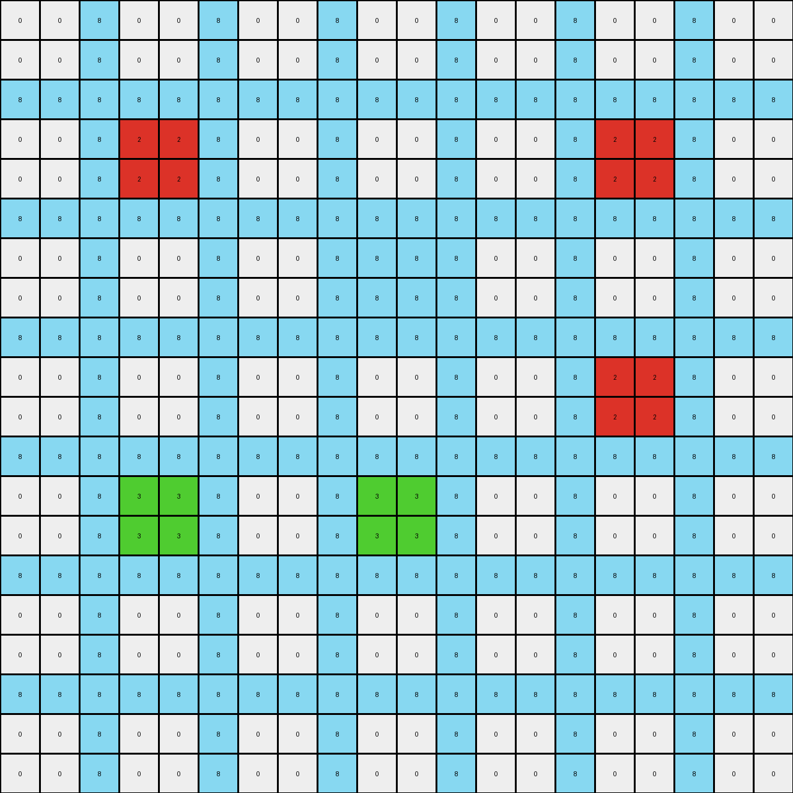

# 06df4c85 • 009 • refine_dreamer

---


Previous Code:
```python
"""
1. **Identify Colored Objects:** Locate all contiguous blocks of pixels with colors other than white (0) and blue (1). These are the initial "colored objects" (red, yellow, maroon, and azure).

2. **Horizontal Expansion:** Iterate through each row of the grid.
    *   If a pixel is blue (1) and is horizontally adjacent to the *same* colored object on *both* its left and right, change the blue pixel's color to match that of the object.
    * if a blue pixel has different colored objects to its left and right, then maintain its color

3.  **Iterate through colored objects:**
    * For the objects with the colors, maroon(9) and azure(8), expand the objects within their respective vertical sections in the entire column if there is an azure object.

4. **No vertical consideration:** The color propagation/modification of the blue pixel happens only horizontally within a row.
"""

import numpy as np

def find_objects(grid):
    """Finds contiguous objects of the same color, excluding white (0) and blue (1)."""
    objects = []
    visited = np.zeros_like(grid, dtype=bool)
    rows, cols = grid.shape

    def dfs(row, col, color, obj):
        if (row < 0 or row >= rows or col < 0 or col >= cols or
                visited[row, col] or grid[row, col] != color):
            return
        visited[row, col] = True
        obj.append((row, col))
        dfs(row + 1, col, color, obj)
        dfs(row - 1, col, color, obj)
        dfs(row, col + 1, color, obj)
        dfs(row, col - 1, color, obj)

    for row in range(rows):
        for col in range(cols):
            if not visited[row, col] and grid[row, col] not in [0, 1]:
                obj = []
                dfs(row, col, grid[row, col], obj)
                objects.append((grid[row, col], obj))  # Store color and object pixels
    return objects

def transform(input_grid):
    """Transforms the input grid according to the rules."""
    output_grid = np.copy(input_grid)
    rows, cols = output_grid.shape
    objects = find_objects(input_grid)

    # Horizontal Expansion
    for row in range(rows):
        for col in range(1, cols - 1):  # Iterate through inner columns
            if output_grid[row, col] == 1:
                left_color = output_grid[row, col - 1]
                right_color = output_grid[row, col + 1]
                if left_color == right_color and left_color not in [0, 1]:
                    output_grid[row, col] = left_color

    # Vertical Expansion of maroon(9) and azure(8) objects
    for color, obj_pixels in objects:
         if color in [8, 9]:
            obj_rows = [p[0] for p in obj_pixels]
            obj_cols = [p[1] for p in obj_pixels]

            min_col = min(obj_cols)
            max_col = max(obj_cols)

            
            for r in range(rows):
              for c in range(min_col, max_col+1):
                  if input_grid[r,c] == 1:
                    left_color = -1
                    right_color = -1

                    for i in range(c-1, -1, -1):
                      if input_grid[r,i] in [8,9]:
                        left_color = input_grid[r,i]
                        break
                    for i in range(c+1, cols):
                      if input_grid[r,i] in [8,9]:
                        right_color = input_grid[r,i]
                        break
                    if left_color == right_color and left_color == color:

                        output_grid[r,c] = color

    return output_grid
```

Train Set Results:

## Example 1:

Input:
```
0 0 8 0 0 8 0 0 8 0 0 8 0 0 8 0 0 8 0 0
0 0 8 0 0 8 0 0 8 0 0 8 0 0 8 0 0 8 0 0
8 8 8 8 8 8 8 8 8 8 8 8 8 8 8 8 8 8 8 8
0 0 8 2 2 8 0 0 8 0 0 8 0 0 8 2 2 8 0 0
0 0 8 2 2 8 0 0 8 0 0 8 0 0 8 2 2 8 0 0
8 8 8 8 8 8 8 8 8 8 8 8 8 8 8 8 8 8 8 8
0 0 8 0 0 8 0 0 8 1 1 8 0 0 8 0 0 8 0 0
0 0 8 0 0 8 0 0 8 1 1 8 0 0 8 0 0 8 0 0
8 8 8 8 8 8 8 8 8 8 8 8 8 8 8 8 8 8 8 8
0 0 8 0 0 8 0 0 8 0 0 8 0 0 8 2 2 8 0 0
0 0 8 0 0 8 0 0 8 0 0 8 0 0 8 2 2 8 0 0
8 8 8 8 8 8 8 8 8 8 8 8 8 8 8 8 8 8 8 8
0 0 8 3 3 8 0 0 8 3 3 8 0 0 8 0 0 8 0 0
0 0 8 3 3 8 0 0 8 3 3 8 0 0 8 0 0 8 0 0
8 8 8 8 8 8 8 8 8 8 8 8 8 8 8 8 8 8 8 8
0 0 8 0 0 8 0 0 8 0 0 8 0 0 8 0 0 8 0 0
0 0 8 0 0 8 0 0 8 0 0 8 0 0 8 0 0 8 0 0
8 8 8 8 8 8 8 8 8 8 8 8 8 8 8 8 8 8 8 8
0 0 8 0 0 8 0 0 8 0 0 8 0 0 8 0 0 8 0 0
0 0 8 0 0 8 0 0 8 0 0 8 0 0 8 0 0 8 0 0
```
Expected Output:
```
0 0 8 0 0 8 0 0 8 0 0 8 0 0 8 0 0 8 0 0
0 0 8 0 0 8 0 0 8 0 0 8 0 0 8 0 0 8 0 0
8 8 8 8 8 8 8 8 8 8 8 8 8 8 8 8 8 8 8 8
0 0 8 2 2 8 2 2 8 2 2 8 2 2 8 2 2 8 0 0
0 0 8 2 2 8 2 2 8 2 2 8 2 2 8 2 2 8 0 0
8 8 8 8 8 8 8 8 8 8 8 8 8 8 8 8 8 8 8 8
0 0 8 0 0 8 0 0 8 1 1 8 0 0 8 2 2 8 0 0
0 0 8 0 0 8 0 0 8 1 1 8 0 0 8 2 2 8 0 0
8 8 8 8 8 8 8 8 8 8 8 8 8 8 8 8 8 8 8 8
0 0 8 0 0 8 0 0 8 0 0 8 0 0 8 2 2 8 0 0
0 0 8 0 0 8 0 0 8 0 0 8 0 0 8 2 2 8 0 0
8 8 8 8 8 8 8 8 8 8 8 8 8 8 8 8 8 8 8 8
0 0 8 3 3 8 3 3 8 3 3 8 0 0 8 0 0 8 0 0
0 0 8 3 3 8 3 3 8 3 3 8 0 0 8 0 0 8 0 0
8 8 8 8 8 8 8 8 8 8 8 8 8 8 8 8 8 8 8 8
0 0 8 0 0 8 0 0 8 0 0 8 0 0 8 0 0 8 0 0
0 0 8 0 0 8 0 0 8 0 0 8 0 0 8 0 0 8 0 0
8 8 8 8 8 8 8 8 8 8 8 8 8 8 8 8 8 8 8 8
0 0 8 0 0 8 0 0 8 0 0 8 0 0 8 0 0 8 0 0
0 0 8 0 0 8 0 0 8 0 0 8 0 0 8 0 0 8 0 0
```
Transformed Output:
```
0 0 8 0 0 8 0 0 8 0 0 8 0 0 8 0 0 8 0 0
0 0 8 0 0 8 0 0 8 0 0 8 0 0 8 0 0 8 0 0
8 8 8 8 8 8 8 8 8 8 8 8 8 8 8 8 8 8 8 8
0 0 8 2 2 8 0 0 8 0 0 8 0 0 8 2 2 8 0 0
0 0 8 2 2 8 0 0 8 0 0 8 0 0 8 2 2 8 0 0
8 8 8 8 8 8 8 8 8 8 8 8 8 8 8 8 8 8 8 8
0 0 8 0 0 8 0 0 8 8 8 8 0 0 8 0 0 8 0 0
0 0 8 0 0 8 0 0 8 8 8 8 0 0 8 0 0 8 0 0
8 8 8 8 8 8 8 8 8 8 8 8 8 8 8 8 8 8 8 8
0 0 8 0 0 8 0 0 8 0 0 8 0 0 8 2 2 8 0 0
0 0 8 0 0 8 0 0 8 0 0 8 0 0 8 2 2 8 0 0
8 8 8 8 8 8 8 8 8 8 8 8 8 8 8 8 8 8 8 8
0 0 8 3 3 8 0 0 8 3 3 8 0 0 8 0 0 8 0 0
0 0 8 3 3 8 0 0 8 3 3 8 0 0 8 0 0 8 0 0
8 8 8 8 8 8 8 8 8 8 8 8 8 8 8 8 8 8 8 8
0 0 8 0 0 8 0 0 8 0 0 8 0 0 8 0 0 8 0 0
0 0 8 0 0 8 0 0 8 0 0 8 0 0 8 0 0 8 0 0
8 8 8 8 8 8 8 8 8 8 8 8 8 8 8 8 8 8 8 8
0 0 8 0 0 8 0 0 8 0 0 8 0 0 8 0 0 8 0 0
0 0 8 0 0 8 0 0 8 0 0 8 0 0 8 0 0 8 0 0
```

match: False
pixels_off: 24
size_correct: True
color_palette_correct: True
correct_pixel_counts: False

## Example 2:

Input:
```
0 0 1 0 0 1 0 0 1 0 0 1 0 0 1 0 0 1 0 0 1 0 0
0 0 1 0 0 1 0 0 1 0 0 1 0 0 1 0 0 1 0 0 1 0 0
1 1 1 1 1 1 1 1 1 1 1 1 1 1 1 1 1 1 1 1 1 1 1
0 0 1 2 2 1 0 0 1 0 0 1 4 4 1 0 0 1 0 0 1 0 0
0 0 1 2 2 1 0 0 1 0 0 1 4 4 1 0 0 1 0 0 1 0 0
1 1 1 1 1 1 1 1 1 1 1 1 1 1 1 1 1 1 1 1 1 1 1
0 0 1 0 0 1 0 0 1 0 0 1 0 0 1 0 0 1 0 0 1 0 0
0 0 1 0 0 1 0 0 1 0 0 1 0 0 1 0 0 1 0 0 1 0 0
1 1 1 1 1 1 1 1 1 1 1 1 1 1 1 1 1 1 1 1 1 1 1
0 0 1 0 0 1 0 0 1 9 9 1 0 0 1 0 0 1 0 0 1 9 9
0 0 1 0 0 1 0 0 1 9 9 1 0 0 1 0 0 1 0 0 1 9 9
1 1 1 1 1 1 1 1 1 1 1 1 1 1 1 1 1 1 1 1 1 1 1
0 0 1 0 0 1 0 0 1 0 0 1 0 0 1 0 0 1 8 8 1 0 0
0 0 1 0 0 1 0 0 1 0 0 1 0 0 1 0 0 1 8 8 1 0 0
1 1 1 1 1 1 1 1 1 1 1 1 1 1 1 1 1 1 1 1 1 1 1
0 0 1 2 2 1 0 0 1 0 0 1 0 0 1 0 0 1 0 0 1 0 0
0 0 1 2 2 1 0 0 1 0 0 1 0 0 1 0 0 1 0 0 1 0 0
1 1 1 1 1 1 1 1 1 1 1 1 1 1 1 1 1 1 1 1 1 1 1
0 0 1 0 0 1 0 0 1 8 8 1 0 0 1 0 0 1 8 8 1 0 0
0 0 1 0 0 1 0 0 1 8 8 1 0 0 1 0 0 1 8 8 1 0 0
1 1 1 1 1 1 1 1 1 1 1 1 1 1 1 1 1 1 1 1 1 1 1
0 0 1 0 0 1 0 0 1 0 0 1 0 0 1 0 0 1 0 0 1 0 0
0 0 1 0 0 1 0 0 1 0 0 1 0 0 1 0 0 1 0 0 1 0 0
```
Expected Output:
```
0 0 1 0 0 1 0 0 1 0 0 1 0 0 1 0 0 1 0 0 1 0 0
0 0 1 0 0 1 0 0 1 0 0 1 0 0 1 0 0 1 0 0 1 0 0
1 1 1 1 1 1 1 1 1 1 1 1 1 1 1 1 1 1 1 1 1 1 1
0 0 1 2 2 1 0 0 1 0 0 1 4 4 1 0 0 1 0 0 1 0 0
0 0 1 2 2 1 0 0 1 0 0 1 4 4 1 0 0 1 0 0 1 0 0
1 1 1 1 1 1 1 1 1 1 1 1 1 1 1 1 1 1 1 1 1 1 1
0 0 1 2 2 1 0 0 1 0 0 1 0 0 1 0 0 1 0 0 1 0 0
0 0 1 2 2 1 0 0 1 0 0 1 0 0 1 0 0 1 0 0 1 0 0
1 1 1 1 1 1 1 1 1 1 1 1 1 1 1 1 1 1 1 1 1 1 1
0 0 1 2 2 1 0 0 1 9 9 1 9 9 1 9 9 1 9 9 1 9 9
0 0 1 2 2 1 0 0 1 9 9 1 9 9 1 9 9 1 9 9 1 9 9
1 1 1 1 1 1 1 1 1 1 1 1 1 1 1 1 1 1 1 1 1 1 1
0 0 1 2 2 1 0 0 1 0 0 1 0 0 1 0 0 1 8 8 1 0 0
0 0 1 2 2 1 0 0 1 0 0 1 0 0 1 0 0 1 8 8 1 0 0
1 1 1 1 1 1 1 1 1 1 1 1 1 1 1 1 1 1 1 1 1 1 1
0 0 1 2 2 1 0 0 1 0 0 1 0 0 1 0 0 1 8 8 1 0 0
0 0 1 2 2 1 0 0 1 0 0 1 0 0 1 0 0 1 8 8 1 0 0
1 1 1 1 1 1 1 1 1 1 1 1 1 1 1 1 1 1 1 1 1 1 1
0 0 1 0 0 1 0 0 1 8 8 1 8 8 1 8 8 1 8 8 1 0 0
0 0 1 0 0 1 0 0 1 8 8 1 8 8 1 8 8 1 8 8 1 0 0
1 1 1 1 1 1 1 1 1 1 1 1 1 1 1 1 1 1 1 1 1 1 1
0 0 1 0 0 1 0 0 1 0 0 1 0 0 1 0 0 1 0 0 1 0 0
0 0 1 0 0 1 0 0 1 0 0 1 0 0 1 0 0 1 0 0 1 0 0
```
Transformed Output:
```
0 0 1 0 0 1 0 0 1 0 0 1 0 0 1 0 0 1 0 0 1 0 0
0 0 1 0 0 1 0 0 1 0 0 1 0 0 1 0 0 1 0 0 1 0 0
1 1 1 1 1 1 1 1 1 1 1 1 1 1 1 1 1 1 1 1 1 1 1
0 0 1 2 2 1 0 0 1 0 0 1 4 4 1 0 0 1 0 0 1 0 0
0 0 1 2 2 1 0 0 1 0 0 1 4 4 1 0 0 1 0 0 1 0 0
1 1 1 1 1 1 1 1 1 1 1 1 1 1 1 1 1 1 1 1 1 1 1
0 0 1 0 0 1 0 0 1 0 0 1 0 0 1 0 0 1 0 0 1 0 0
0 0 1 0 0 1 0 0 1 0 0 1 0 0 1 0 0 1 0 0 1 0 0
1 1 1 1 1 1 1 1 1 1 1 1 1 1 1 1 1 1 1 1 1 1 1
0 0 1 0 0 1 0 0 1 9 9 1 0 0 1 0 0 1 0 0 1 9 9
0 0 1 0 0 1 0 0 1 9 9 1 0 0 1 0 0 1 0 0 1 9 9
1 1 1 1 1 1 1 1 1 1 1 1 1 1 1 1 1 1 1 1 1 1 1
0 0 1 0 0 1 0 0 1 0 0 1 0 0 1 0 0 1 8 8 1 0 0
0 0 1 0 0 1 0 0 1 0 0 1 0 0 1 0 0 1 8 8 1 0 0
1 1 1 1 1 1 1 1 1 1 1 1 1 1 1 1 1 1 1 1 1 1 1
0 0 1 2 2 1 0 0 1 0 0 1 0 0 1 0 0 1 0 0 1 0 0
0 0 1 2 2 1 0 0 1 0 0 1 0 0 1 0 0 1 0 0 1 0 0
1 1 1 1 1 1 1 1 1 1 1 1 1 1 1 1 1 1 1 1 1 1 1
0 0 1 0 0 1 0 0 1 8 8 1 0 0 1 0 0 1 8 8 1 0 0
0 0 1 0 0 1 0 0 1 8 8 1 0 0 1 0 0 1 8 8 1 0 0
1 1 1 1 1 1 1 1 1 1 1 1 1 1 1 1 1 1 1 1 1 1 1
0 0 1 0 0 1 0 0 1 0 0 1 0 0 1 0 0 1 0 0 1 0 0
0 0 1 0 0 1 0 0 1 0 0 1 0 0 1 0 0 1 0 0 1 0 0
```

match: False
pixels_off: 36
size_correct: True
color_palette_correct: True
correct_pixel_counts: False

## Example 3:

Input:
```
0 0 4 0 0 4 0 0 4 0 0 4 0 0 4 0 0 4 0 0 4 0 0
0 0 4 0 0 4 0 0 4 0 0 4 0 0 4 0 0 4 0 0 4 0 0
4 4 4 4 4 4 4 4 4 4 4 4 4 4 4 4 4 4 4 4 4 4 4
0 0 4 3 3 4 0 0 4 0 0 4 0 0 4 2 2 4 0 0 4 0 0
0 0 4 3 3 4 0 0 4 0 0 4 0 0 4 2 2 4 0 0 4 0 0
4 4 4 4 4 4 4 4 4 4 4 4 4 4 4 4 4 4 4 4 4 4 4
0 0 4 0 0 4 0 0 4 0 0 4 0 0 4 0 0 4 0 0 4 0 0
0 0 4 0 0 4 0 0 4 0 0 4 0 0 4 0 0 4 0 0 4 0 0
4 4 4 4 4 4 4 4 4 4 4 4 4 4 4 4 4 4 4 4 4 4 4
0 0 4 0 0 4 0 0 4 2 2 4 0 0 4 0 0 4 2 2 4 0 0
0 0 4 0 0 4 0 0 4 2 2 4 0 0 4 0 0 4 2 2 4 0 0
4 4 4 4 4 4 4 4 4 4 4 4 4 4 4 4 4 4 4 4 4 4 4
0 0 4 0 0 4 0 0 4 0 0 4 0 0 4 0 0 4 0 0 4 0 0
0 0 4 0 0 4 0 0 4 0 0 4 0 0 4 0 0 4 0 0 4 0 0
4 4 4 4 4 4 4 4 4 4 4 4 4 4 4 4 4 4 4 4 4 4 4
0 0 4 0 0 4 0 0 4 0 0 4 0 0 4 0 0 4 0 0 4 0 0
0 0 4 0 0 4 0 0 4 0 0 4 0 0 4 0 0 4 0 0 4 0 0
4 4 4 4 4 4 4 4 4 4 4 4 4 4 4 4 4 4 4 4 4 4 4
0 0 4 3 3 4 0 0 4 0 0 4 0 0 4 3 3 4 0 0 4 0 0
0 0 4 3 3 4 0 0 4 0 0 4 0 0 4 3 3 4 0 0 4 0 0
4 4 4 4 4 4 4 4 4 4 4 4 4 4 4 4 4 4 4 4 4 4 4
0 0 4 0 0 4 0 0 4 0 0 4 0 0 4 0 0 4 0 0 4 0 0
0 0 4 0 0 4 0 0 4 0 0 4 0 0 4 0 0 4 0 0 4 0 0
```
Expected Output:
```
0 0 4 0 0 4 0 0 4 0 0 4 0 0 4 0 0 4 0 0 4 0 0
0 0 4 0 0 4 0 0 4 0 0 4 0 0 4 0 0 4 0 0 4 0 0
4 4 4 4 4 4 4 4 4 4 4 4 4 4 4 4 4 4 4 4 4 4 4
0 0 4 3 3 4 0 0 4 0 0 4 0 0 4 2 2 4 0 0 4 0 0
0 0 4 3 3 4 0 0 4 0 0 4 0 0 4 2 2 4 0 0 4 0 0
4 4 4 4 4 4 4 4 4 4 4 4 4 4 4 4 4 4 4 4 4 4 4
0 0 4 3 3 4 0 0 4 0 0 4 0 0 4 0 0 4 0 0 4 0 0
0 0 4 3 3 4 0 0 4 0 0 4 0 0 4 0 0 4 0 0 4 0 0
4 4 4 4 4 4 4 4 4 4 4 4 4 4 4 4 4 4 4 4 4 4 4
0 0 4 3 3 4 0 0 4 2 2 4 2 2 4 2 2 4 2 2 4 0 0
0 0 4 3 3 4 0 0 4 2 2 4 2 2 4 2 2 4 2 2 4 0 0
4 4 4 4 4 4 4 4 4 4 4 4 4 4 4 4 4 4 4 4 4 4 4
0 0 4 3 3 4 0 0 4 0 0 4 0 0 4 0 0 4 0 0 4 0 0
0 0 4 3 3 4 0 0 4 0 0 4 0 0 4 0 0 4 0 0 4 0 0
4 4 4 4 4 4 4 4 4 4 4 4 4 4 4 4 4 4 4 4 4 4 4
0 0 4 3 3 4 0 0 4 0 0 4 0 0 4 0 0 4 0 0 4 0 0
0 0 4 3 3 4 0 0 4 0 0 4 0 0 4 0 0 4 0 0 4 0 0
4 4 4 4 4 4 4 4 4 4 4 4 4 4 4 4 4 4 4 4 4 4 4
0 0 4 3 3 4 3 3 4 3 3 4 3 3 4 3 3 4 0 0 4 0 0
0 0 4 3 3 4 3 3 4 3 3 4 3 3 4 3 3 4 0 0 4 0 0
4 4 4 4 4 4 4 4 4 4 4 4 4 4 4 4 4 4 4 4 4 4 4
0 0 4 0 0 4 0 0 4 0 0 4 0 0 4 0 0 4 0 0 4 0 0
0 0 4 0 0 4 0 0 4 0 0 4 0 0 4 0 0 4 0 0 4 0 0
```
Transformed Output:
```
0 0 4 0 0 4 0 0 4 0 0 4 0 0 4 0 0 4 0 0 4 0 0
0 0 4 0 0 4 0 0 4 0 0 4 0 0 4 0 0 4 0 0 4 0 0
4 4 4 4 4 4 4 4 4 4 4 4 4 4 4 4 4 4 4 4 4 4 4
0 0 4 3 3 4 0 0 4 0 0 4 0 0 4 2 2 4 0 0 4 0 0
0 0 4 3 3 4 0 0 4 0 0 4 0 0 4 2 2 4 0 0 4 0 0
4 4 4 4 4 4 4 4 4 4 4 4 4 4 4 4 4 4 4 4 4 4 4
0 0 4 0 0 4 0 0 4 0 0 4 0 0 4 0 0 4 0 0 4 0 0
0 0 4 0 0 4 0 0 4 0 0 4 0 0 4 0 0 4 0 0 4 0 0
4 4 4 4 4 4 4 4 4 4 4 4 4 4 4 4 4 4 4 4 4 4 4
0 0 4 0 0 4 0 0 4 2 2 4 0 0 4 0 0 4 2 2 4 0 0
0 0 4 0 0 4 0 0 4 2 2 4 0 0 4 0 0 4 2 2 4 0 0
4 4 4 4 4 4 4 4 4 4 4 4 4 4 4 4 4 4 4 4 4 4 4
0 0 4 0 0 4 0 0 4 0 0 4 0 0 4 0 0 4 0 0 4 0 0
0 0 4 0 0 4 0 0 4 0 0 4 0 0 4 0 0 4 0 0 4 0 0
4 4 4 4 4 4 4 4 4 4 4 4 4 4 4 4 4 4 4 4 4 4 4
0 0 4 0 0 4 0 0 4 0 0 4 0 0 4 0 0 4 0 0 4 0 0
0 0 4 0 0 4 0 0 4 0 0 4 0 0 4 0 0 4 0 0 4 0 0
4 4 4 4 4 4 4 4 4 4 4 4 4 4 4 4 4 4 4 4 4 4 4
0 0 4 3 3 4 0 0 4 0 0 4 0 0 4 3 3 4 0 0 4 0 0
0 0 4 3 3 4 0 0 4 0 0 4 0 0 4 3 3 4 0 0 4 0 0
4 4 4 4 4 4 4 4 4 4 4 4 4 4 4 4 4 4 4 4 4 4 4
0 0 4 0 0 4 0 0 4 0 0 4 0 0 4 0 0 4 0 0 4 0 0
0 0 4 0 0 4 0 0 4 0 0 4 0 0 4 0 0 4 0 0 4 0 0
```

match: False
pixels_off: 36
size_correct: True
color_palette_correct: True
correct_pixel_counts: False

**INSTRUCTIONS**

The code above was generated based on observations from the first training
example

we have tested the transform function on each of the task example inputs and
compared with the expected output

review each of the examples provided and the results and consider how the
natural language program should be updated to accommodate this new knowledge

respond with the following deliverables:

- general assessment of the information provided and strategy for resolving the
  errors
- gather metrics about each of the examples and results - use code_execution to
  develop accurate reports on your assumptions
- a YAML block documenting facts - Focus on identifying objects, their properties, and the actions performed on them.
- a natural language program - Be as clear and concise as possible, providing a complete description of the transformation rule.


your responses should be considered as information in a report - not a
conversation
