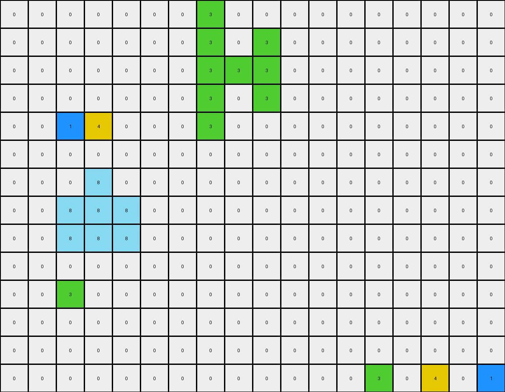
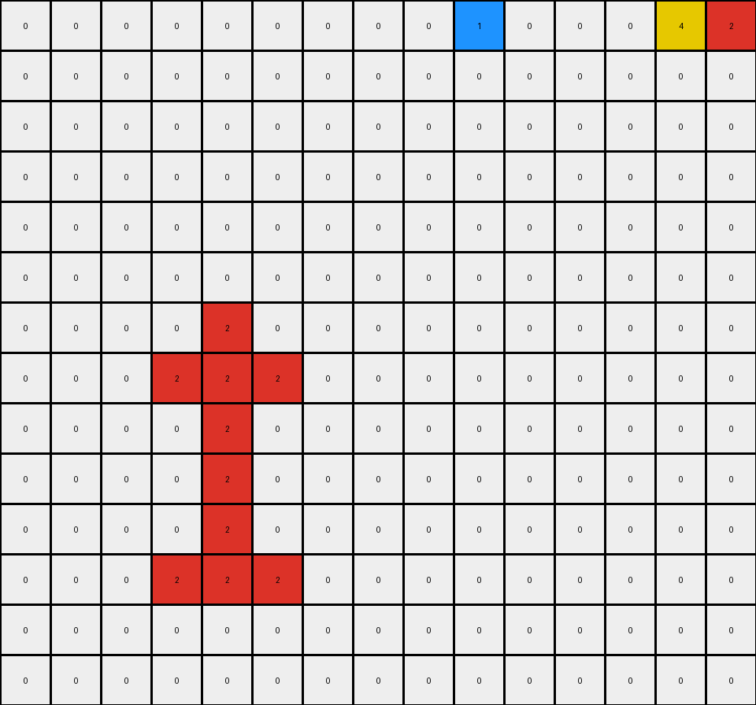
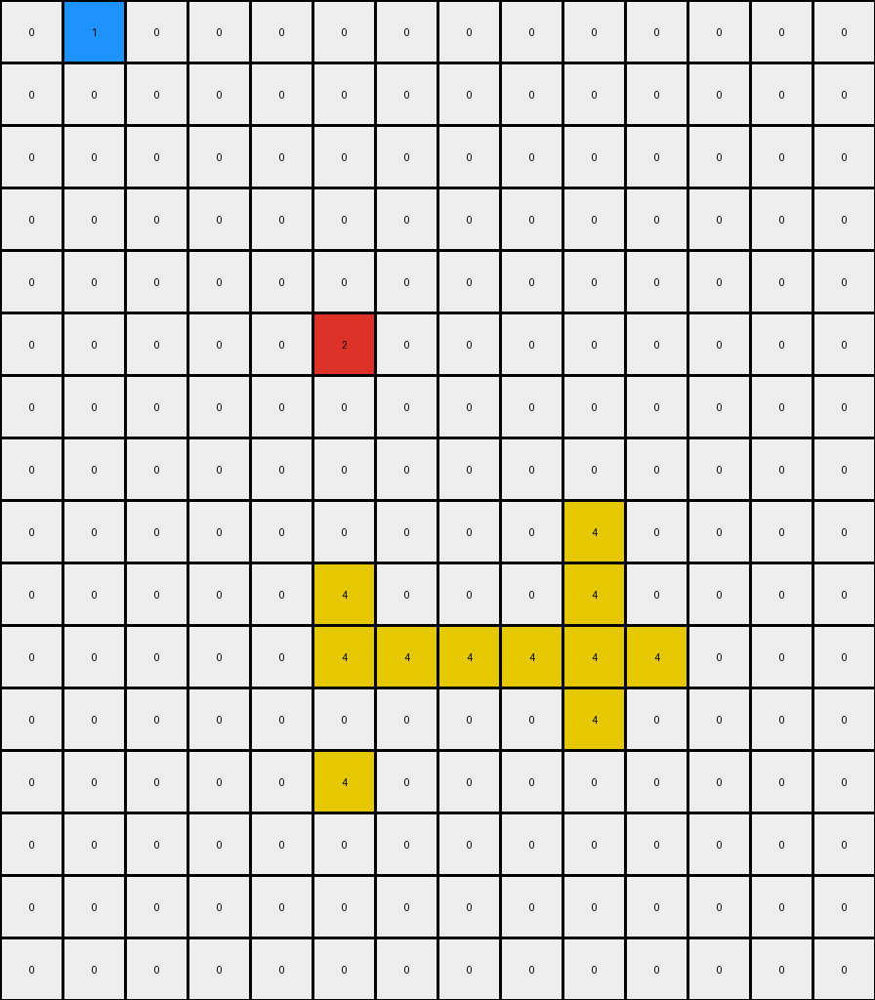

# 0e206a2e • 003 • refine_dreamer

---

Previous Code:
```python
"""
Transforms the input grid by moving connected regions of non-white pixels vertically. Objects in the upper half of the grid move down, and objects in the lower half move up. The movement continues until an object hits the grid boundary or another object.
"""

import numpy as np

def find_objects(grid):
    """
    Finds all contiguous regions (objects) of non-white (non-zero) pixels in the grid.

    Returns a list of objects, where each object is a list of (row, col) coordinates.
    """
    visited = set()
    objects = []

    def dfs(row, col, current_object):
        if (row, col) in visited or not (0 <= row < grid.shape[0] and 0 <= col < grid.shape[1]) or grid[row, col] == 0:
            return
        visited.add((row, col))
        current_object.append((row, col))
        dfs(row + 1, col, current_object)
        dfs(row - 1, col, current_object)
        dfs(row, col + 1, current_object)
        dfs(row, col - 1, current_object)

    for row in range(grid.shape[0]):
        for col in range(grid.shape[1]):
            if grid[row, col] != 0 and (row, col) not in visited:
                current_object = []
                dfs(row, col, current_object)
                objects.append(current_object)
    return objects

def calculate_centroid(object_coords):
    """
    Calculates the centroid (center of mass) of an object.
    """
    rows, cols = zip(*object_coords)
    return np.mean(rows), np.mean(cols)

def can_move(grid, object_coords, direction):
    """
    Checks if an object can move in the given direction.

    `direction`: 1 for down, -1 for up.
    """
    for row, col in object_coords:
        new_row = row + direction
        if not (0 <= new_row < grid.shape[0]):
            return False  # Hit grid boundary
        if grid[new_row, col] != 0 and (new_row, col) not in object_coords:
            return False  # Hit another object
    return True

def move_object(grid, object_coords, direction):
    """
    Moves an object in the given direction.

    `direction`: 1 for down, -1 for up.
    """
    new_object_coords = []
    for row, col in object_coords:
        new_object_coords.append((row + direction, col))
    return new_object_coords

def transform(input_grid):
    """
    Transforms the input grid according to the described rules.
    """
    grid = np.array(input_grid)  # work with numpy array
    output_grid = np.zeros_like(grid)  # Start with a blank grid

    # copy the white pixels to output
    for r in range(grid.shape[0]):
        for c in range(grid.shape[1]):
            if grid[r,c] == 0:
                output_grid[r,c] = 0
            
    objects = find_objects(grid)
    vertical_center = grid.shape[0] / 2

    for obj in objects:
        centroid_row, _ = calculate_centroid(obj)
        direction = 1 if centroid_row < vertical_center else -1

        moved_object = obj
        while can_move(grid, moved_object, direction):
            moved_object = move_object(grid, moved_object, direction)

        # Place moved object onto output grid
        for row, col in moved_object:
            output_grid[row, col] = grid[obj[0][0], obj[0][1]] # use original color from the input.

    return output_grid.tolist() # return as list
```

Train Set Results:

## Example 1:

Input:
```
0 0 0 0 0 0 0 0 0 0 0 0 0 0 0 0 0 0
0 0 0 8 0 0 0 0 0 0 0 0 0 0 0 0 0 0
0 0 3 8 1 0 0 0 0 0 0 0 0 0 0 4 0 0
0 0 8 4 8 0 0 0 0 0 0 0 0 0 0 0 0 0
0 0 0 0 0 0 0 0 0 0 0 0 0 3 0 0 0 1
0 0 0 0 0 0 0 0 0 0 0 0 0 0 0 0 0 0
0 0 0 0 0 0 0 3 0 0 0 0 0 0 0 0 0 0
0 0 0 0 0 0 0 8 0 8 0 0 0 0 0 0 0 0
0 0 0 0 0 0 0 8 8 4 0 0 0 0 0 0 0 0
0 0 1 0 0 0 0 8 0 8 0 0 0 0 0 0 0 0
0 0 0 4 0 0 0 1 0 0 0 0 0 0 0 0 0 0
0 0 3 0 0 0 0 0 0 0 0 0 0 0 0 0 0 0
0 0 0 0 0 0 0 0 0 0 0 0 0 0 0 0 0 0
0 0 0 0 0 0 0 0 0 0 0 0 0 0 0 0 0 0
```
Expected Output:
```
0 0 0 0 0 0 0 0 0 0 0 0 0 0 0 0 0 0
0 0 0 0 0 0 0 0 0 0 0 0 0 0 0 0 0 0
0 0 0 0 0 0 0 0 0 0 0 0 0 0 8 4 8 0
0 0 0 0 0 0 0 0 0 0 0 0 0 0 0 8 0 0
0 0 0 0 0 0 0 0 0 0 0 0 0 3 8 8 8 1
0 0 0 0 0 0 0 0 0 0 0 0 0 0 0 0 0 0
0 0 0 0 0 0 0 0 0 0 0 0 0 0 0 0 0 0
0 0 0 0 0 0 0 0 0 0 0 0 0 0 0 0 0 0
0 0 0 0 0 0 0 0 0 0 0 0 0 0 0 0 0 0
0 0 1 8 0 0 0 0 0 0 0 0 0 0 0 0 0 0
0 8 8 4 0 0 0 0 0 0 0 0 0 0 0 0 0 0
0 0 3 8 0 0 0 0 0 0 0 0 0 0 0 0 0 0
0 0 0 0 0 0 0 0 0 0 0 0 0 0 0 0 0 0
0 0 0 0 0 0 0 0 0 0 0 0 0 0 0 0 0 0
```
Transformed Output:
```
0 0 0 0 0 0 0 3 0 0 0 0 0 0 0 0 0 0
0 0 0 0 0 0 0 3 0 3 0 0 0 0 0 0 0 0
0 0 0 0 0 0 0 3 3 3 0 0 0 0 0 0 0 0
0 0 0 0 0 0 0 3 0 3 0 0 0 0 0 0 0 0
0 0 1 4 0 0 0 3 0 0 0 0 0 0 0 0 0 0
0 0 0 0 0 0 0 0 0 0 0 0 0 0 0 0 0 0
0 0 0 8 0 0 0 0 0 0 0 0 0 0 0 0 0 0
0 0 8 8 8 0 0 0 0 0 0 0 0 0 0 0 0 0
0 0 8 8 8 0 0 0 0 0 0 0 0 0 0 0 0 0
0 0 0 0 0 0 0 0 0 0 0 0 0 0 0 0 0 0
0 0 3 0 0 0 0 0 0 0 0 0 0 0 0 0 0 0
0 0 0 0 0 0 0 0 0 0 0 0 0 0 0 0 0 0
0 0 0 0 0 0 0 0 0 0 0 0 0 0 0 0 0 0
0 0 0 0 0 0 0 0 0 0 0 0 0 3 0 4 0 1
```

match: False
pixels_off: 37
size_correct: True
color_palette_correct: True
correct_pixel_counts: False

## Example 2:

Input:
```
0 0 0 0 0 0 0 0 0 0 0 0 0 0 0
0 0 0 0 0 0 0 0 0 0 0 0 0 0 0
0 0 0 0 0 0 0 0 0 0 0 0 0 0 0
0 0 0 0 2 0 0 0 0 0 0 0 0 0 0
0 0 0 4 3 3 0 0 0 0 0 0 0 0 0
0 0 0 0 3 0 0 0 0 0 0 0 0 0 0
0 0 0 0 3 0 0 0 0 0 0 0 0 0 0
0 0 0 0 3 0 0 0 0 0 0 0 0 0 0
0 0 0 3 1 3 0 0 0 0 0 0 0 0 0
0 0 0 0 0 0 0 0 0 0 0 0 0 0 0
0 0 0 0 0 0 0 0 0 0 0 0 0 4 0
0 0 0 0 0 0 0 0 0 1 0 0 0 0 2
0 0 0 0 0 0 0 0 0 0 0 0 0 0 0
0 0 0 0 0 0 0 0 0 0 0 0 0 0 0
```
Expected Output:
```
0 0 0 0 0 0 0 0 0 0 0 0 0 0 0
0 0 0 0 0 0 0 0 0 0 0 0 0 0 0
0 0 0 0 0 0 0 0 0 0 0 0 0 0 0
0 0 0 0 0 0 0 0 0 0 0 0 0 0 0
0 0 0 0 0 0 0 0 0 0 0 0 0 0 0
0 0 0 0 0 0 0 0 0 0 0 0 0 0 0
0 0 0 0 0 0 0 0 0 0 0 0 0 0 0
0 0 0 0 0 0 0 0 0 0 0 0 0 0 0
0 0 0 0 0 0 0 0 0 0 0 0 0 0 0
0 0 0 0 0 0 0 0 0 0 0 0 0 0 0
0 0 0 0 0 0 0 0 0 3 0 0 0 4 0
0 0 0 0 0 0 0 0 0 1 3 3 3 3 2
0 0 0 0 0 0 0 0 0 3 0 0 0 3 0
0 0 0 0 0 0 0 0 0 0 0 0 0 0 0
```
Transformed Output:
```
0 0 0 0 0 0 0 0 0 1 0 0 0 4 2
0 0 0 0 0 0 0 0 0 0 0 0 0 0 0
0 0 0 0 0 0 0 0 0 0 0 0 0 0 0
0 0 0 0 0 0 0 0 0 0 0 0 0 0 0
0 0 0 0 0 0 0 0 0 0 0 0 0 0 0
0 0 0 0 0 0 0 0 0 0 0 0 0 0 0
0 0 0 0 2 0 0 0 0 0 0 0 0 0 0
0 0 0 2 2 2 0 0 0 0 0 0 0 0 0
0 0 0 0 2 0 0 0 0 0 0 0 0 0 0
0 0 0 0 2 0 0 0 0 0 0 0 0 0 0
0 0 0 0 2 0 0 0 0 0 0 0 0 0 0
0 0 0 2 2 2 0 0 0 0 0 0 0 0 0
0 0 0 0 0 0 0 0 0 0 0 0 0 0 0
0 0 0 0 0 0 0 0 0 0 0 0 0 0 0
```

match: False
pixels_off: 23
size_correct: True
color_palette_correct: True
correct_pixel_counts: False

## Example 3:

Input:
```
0 0 0 0 0 0 0 0 0 0 0 0 0 0
0 0 0 0 0 0 0 0 0 0 0 0 0 0
0 0 0 0 0 0 0 0 0 4 0 0 0 0
0 0 0 0 0 8 0 0 0 8 0 0 0 0
0 0 0 0 0 1 8 8 8 2 8 0 0 0
0 0 0 0 0 0 0 0 0 8 0 0 0 0
0 0 0 0 0 0 0 0 0 0 0 0 0 0
0 0 0 0 0 0 0 0 0 0 0 0 0 0
0 0 0 0 0 0 0 0 0 0 0 0 0 0
0 0 0 0 0 0 0 0 0 0 0 0 0 0
0 0 0 0 0 0 0 0 0 0 0 0 0 0
0 1 0 0 0 2 0 0 0 0 0 0 0 0
0 0 0 0 0 0 0 0 0 0 0 0 0 0
0 0 0 0 0 4 0 0 0 0 0 0 0 0
0 0 0 0 0 0 0 0 0 0 0 0 0 0
0 0 0 0 0 0 0 0 0 0 0 0 0 0
```
Expected Output:
```
0 0 0 0 0 0 0 0 0 0 0 0 0 0
0 0 0 0 0 0 0 0 0 0 0 0 0 0
0 0 0 0 0 0 0 0 0 0 0 0 0 0
0 0 0 0 0 0 0 0 0 0 0 0 0 0
0 0 0 0 0 0 0 0 0 0 0 0 0 0
0 0 0 0 0 0 0 0 0 0 0 0 0 0
0 0 0 0 0 0 0 0 0 0 0 0 0 0
0 0 0 0 0 0 0 0 0 0 0 0 0 0
0 0 0 0 0 0 0 0 0 0 0 0 0 0
0 0 0 0 0 0 0 0 0 0 0 0 0 0
0 0 0 0 0 8 0 0 0 0 0 0 0 0
0 1 8 8 8 2 8 0 0 0 0 0 0 0
0 8 0 0 0 8 0 0 0 0 0 0 0 0
0 0 0 0 0 4 0 0 0 0 0 0 0 0
0 0 0 0 0 0 0 0 0 0 0 0 0 0
0 0 0 0 0 0 0 0 0 0 0 0 0 0
```
Transformed Output:
```
0 1 0 0 0 0 0 0 0 0 0 0 0 0
0 0 0 0 0 0 0 0 0 0 0 0 0 0
0 0 0 0 0 0 0 0 0 0 0 0 0 0
0 0 0 0 0 0 0 0 0 0 0 0 0 0
0 0 0 0 0 0 0 0 0 0 0 0 0 0
0 0 0 0 0 2 0 0 0 0 0 0 0 0
0 0 0 0 0 0 0 0 0 0 0 0 0 0
0 0 0 0 0 0 0 0 0 0 0 0 0 0
0 0 0 0 0 0 0 0 0 4 0 0 0 0
0 0 0 0 0 4 0 0 0 4 0 0 0 0
0 0 0 0 0 4 4 4 4 4 4 0 0 0
0 0 0 0 0 0 0 0 0 4 0 0 0 0
0 0 0 0 0 4 0 0 0 0 0 0 0 0
0 0 0 0 0 0 0 0 0 0 0 0 0 0
0 0 0 0 0 0 0 0 0 0 0 0 0 0
0 0 0 0 0 0 0 0 0 0 0 0 0 0
```

match: False
pixels_off: 21
size_correct: True
color_palette_correct: True
correct_pixel_counts: False
**INSTRUCTIONS**

The code above was generated based on observations from the first training
example

we have tested the transform function on each of the task example inputs and
compared with the expected output

review each of the examples provided and the results and consider how the
natural language program should be updated to accommodate this new knowledge

respond with the following deliverables:

- general assessment of the information provided and strategy for resolving the
  errors
- gather metrics about each of the examples and results - use code_execution to
  develop accurate reports on your assumptions
- a YAML block documenting facts - Focus on identifying objects, their properties, and the actions performed on them.
- a natural language program - Be as clear and concise as possible, providing a complete description of the transformation rule.


your responses should be considered as information in a report - not a
conversation
