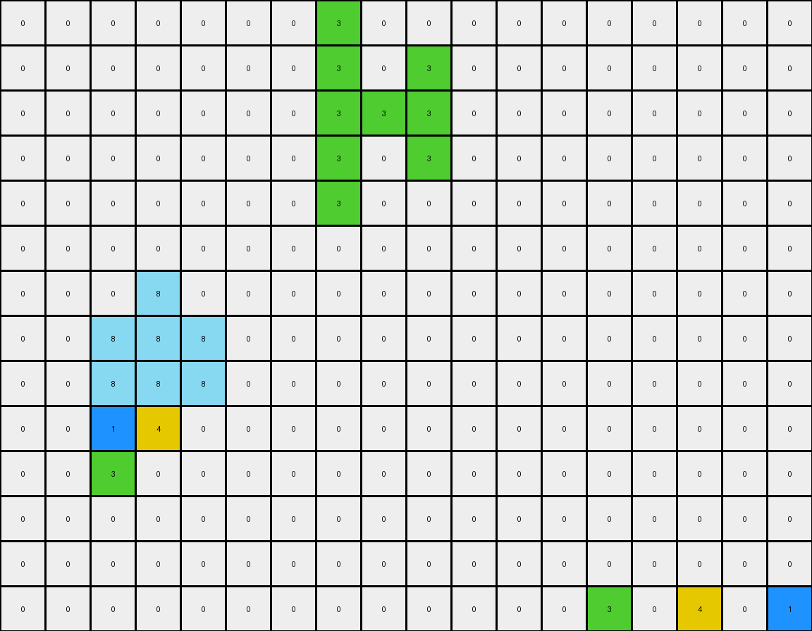
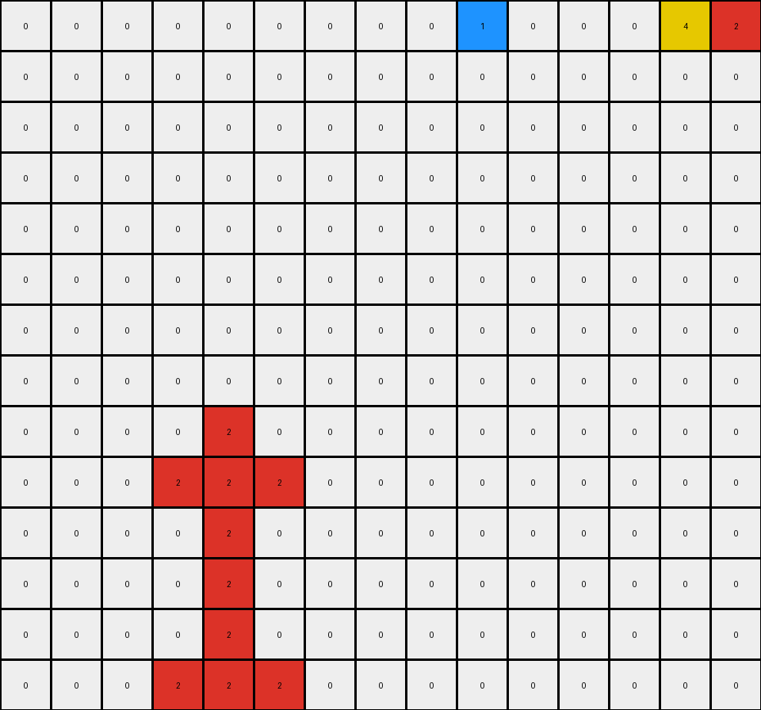
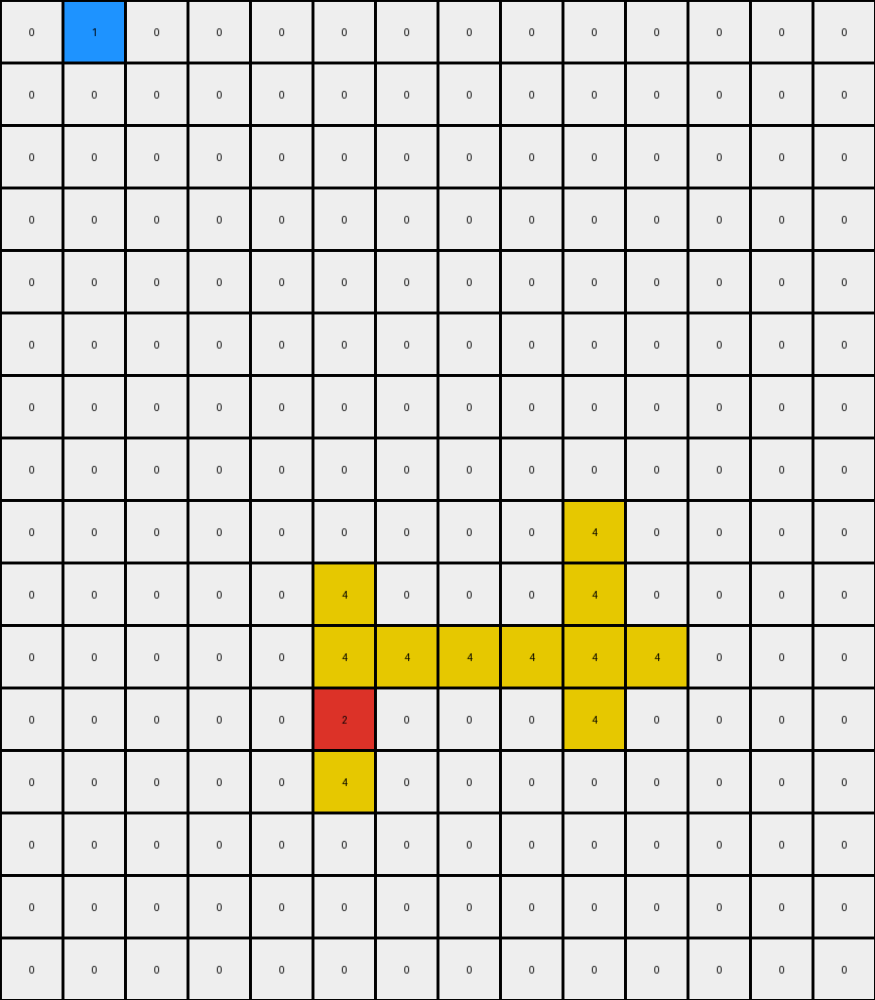

# 0e206a2e • 006 • refine_coder

---

Previous Code:
```python
"""
Transforms the input grid by moving connected regions of non-white pixels vertically. Objects in the upper half of the grid move down, and objects in the lower half move up. The movement continues until an object hits the grid boundary or another object, causing objects to stack.
"""

import numpy as np

def find_objects(grid):
    """
    Finds all contiguous regions (objects) of non-white (non-zero) pixels in the grid.

    Returns a list of objects, where each object is a list of (row, col) coordinates.
    """
    visited = set()
    objects = []

    def dfs(row, col, current_object):
        if (row, col) in visited or not (0 <= row < grid.shape[0] and 0 <= col < grid.shape[1]) or grid[row, col] == 0:
            return
        visited.add((row, col))
        current_object.append((row, col))
        dfs(row + 1, col, current_object)
        dfs(row - 1, col, current_object)
        dfs(row, col + 1, current_object)
        dfs(row, col - 1, current_object)

    for row in range(grid.shape[0]):
        for col in range(grid.shape[1]):
            if grid[row, col] != 0 and (row, col) not in visited:
                current_object = []
                dfs(row, col, current_object)
                objects.append(current_object)
    return objects

def calculate_centroid(object_coords):
    """
    Calculates the centroid (center of mass) of an object.
    """
    rows, cols = zip(*object_coords)
    return np.mean(rows), np.mean(cols)

def move_object(grid, object_coords, direction):
    """
    Moves an object's coordinates in the given direction, checking for collisions.

    `direction`: 1 for down, -1 for up.
    Returns: new object coordinates, and boolean indicating if move was possible
    """
    new_object_coords = []
    moved = True
    for row, col in object_coords:
        new_row = row + direction
        if not (0 <= new_row < grid.shape[0]):
          moved = False  # Hit grid boundary
          break;
        if grid[new_row, col] != 0 and (new_row, col) not in object_coords:
          moved = False # Hit another object.
          break;
        new_object_coords.append((new_row, col))
    
    if not moved:
      return object_coords, False # return original, not moved
    return new_object_coords, True # return new and moved == True

def transform(input_grid):
    # initialize output_grid
    grid = np.array(input_grid)  # work with numpy array
    output_grid = np.array(input_grid)  # Start with a copy of input

    # Find all objects
    objects = find_objects(grid)
    
    # sort objects by their vertical position (centroid row)
    objects.sort(key=lambda obj: calculate_centroid(obj)[0])

    # build the output grid progressively
    
    vertical_center = grid.shape[0] / 2
    
    moved_objects = []

    for obj in objects:
        color = grid[obj[0][0], obj[0][1]] # save the color
        centroid_row, _ = calculate_centroid(obj)
        direction = 1 if centroid_row < vertical_center else -1

        # clear object from grid, work with copy.
        temp_grid = np.copy(output_grid)
        for r,c in obj:
          temp_grid[r,c] = 0

        # Move object
        moved_object = obj
        moved = True
        while moved:
            moved_object, moved = move_object(temp_grid, moved_object, direction)

        # add moved object to output
        for row, col in moved_object:
            temp_grid[row, col] = color

        output_grid = temp_grid # update

    return output_grid.tolist() # return as list
```

Train Set Results:

## Example 1:

Input:
```
0 0 0 0 0 0 0 0 0 0 0 0 0 0 0 0 0 0
0 0 0 8 0 0 0 0 0 0 0 0 0 0 0 0 0 0
0 0 3 8 1 0 0 0 0 0 0 0 0 0 0 4 0 0
0 0 8 4 8 0 0 0 0 0 0 0 0 0 0 0 0 0
0 0 0 0 0 0 0 0 0 0 0 0 0 3 0 0 0 1
0 0 0 0 0 0 0 0 0 0 0 0 0 0 0 0 0 0
0 0 0 0 0 0 0 3 0 0 0 0 0 0 0 0 0 0
0 0 0 0 0 0 0 8 0 8 0 0 0 0 0 0 0 0
0 0 0 0 0 0 0 8 8 4 0 0 0 0 0 0 0 0
0 0 1 0 0 0 0 8 0 8 0 0 0 0 0 0 0 0
0 0 0 4 0 0 0 1 0 0 0 0 0 0 0 0 0 0
0 0 3 0 0 0 0 0 0 0 0 0 0 0 0 0 0 0
0 0 0 0 0 0 0 0 0 0 0 0 0 0 0 0 0 0
0 0 0 0 0 0 0 0 0 0 0 0 0 0 0 0 0 0
```
Expected Output:
```
0 0 0 0 0 0 0 0 0 0 0 0 0 0 0 0 0 0
0 0 0 0 0 0 0 0 0 0 0 0 0 0 0 0 0 0
0 0 0 0 0 0 0 0 0 0 0 0 0 0 8 4 8 0
0 0 0 0 0 0 0 0 0 0 0 0 0 0 0 8 0 0
0 0 0 0 0 0 0 0 0 0 0 0 0 3 8 8 8 1
0 0 0 0 0 0 0 0 0 0 0 0 0 0 0 0 0 0
0 0 0 0 0 0 0 0 0 0 0 0 0 0 0 0 0 0
0 0 0 0 0 0 0 0 0 0 0 0 0 0 0 0 0 0
0 0 0 0 0 0 0 0 0 0 0 0 0 0 0 0 0 0
0 0 1 8 0 0 0 0 0 0 0 0 0 0 0 0 0 0
0 8 8 4 0 0 0 0 0 0 0 0 0 0 0 0 0 0
0 0 3 8 0 0 0 0 0 0 0 0 0 0 0 0 0 0
0 0 0 0 0 0 0 0 0 0 0 0 0 0 0 0 0 0
0 0 0 0 0 0 0 0 0 0 0 0 0 0 0 0 0 0
```
Transformed Output:
```
0 0 0 0 0 0 0 3 0 0 0 0 0 0 0 0 0 0
0 0 0 0 0 0 0 3 0 3 0 0 0 0 0 0 0 0
0 0 0 0 0 0 0 3 3 3 0 0 0 0 0 0 0 0
0 0 0 0 0 0 0 3 0 3 0 0 0 0 0 0 0 0
0 0 0 0 0 0 0 3 0 0 0 0 0 0 0 0 0 0
0 0 0 0 0 0 0 0 0 0 0 0 0 0 0 0 0 0
0 0 0 8 0 0 0 0 0 0 0 0 0 0 0 0 0 0
0 0 8 8 8 0 0 0 0 0 0 0 0 0 0 0 0 0
0 0 8 8 8 0 0 0 0 0 0 0 0 0 0 0 0 0
0 0 1 4 0 0 0 0 0 0 0 0 0 0 0 0 0 0
0 0 3 0 0 0 0 0 0 0 0 0 0 0 0 0 0 0
0 0 0 0 0 0 0 0 0 0 0 0 0 0 0 0 0 0
0 0 0 0 0 0 0 0 0 0 0 0 0 0 0 0 0 0
0 0 0 0 0 0 0 0 0 0 0 0 0 3 0 4 0 1
```

match: False
pixels_off: 34
size_correct: True
color_palette_correct: True
correct_pixel_counts: False

## Example 2:

Input:
```
0 0 0 0 0 0 0 0 0 0 0 0 0 0 0
0 0 0 0 0 0 0 0 0 0 0 0 0 0 0
0 0 0 0 0 0 0 0 0 0 0 0 0 0 0
0 0 0 0 2 0 0 0 0 0 0 0 0 0 0
0 0 0 4 3 3 0 0 0 0 0 0 0 0 0
0 0 0 0 3 0 0 0 0 0 0 0 0 0 0
0 0 0 0 3 0 0 0 0 0 0 0 0 0 0
0 0 0 0 3 0 0 0 0 0 0 0 0 0 0
0 0 0 3 1 3 0 0 0 0 0 0 0 0 0
0 0 0 0 0 0 0 0 0 0 0 0 0 0 0
0 0 0 0 0 0 0 0 0 0 0 0 0 4 0
0 0 0 0 0 0 0 0 0 1 0 0 0 0 2
0 0 0 0 0 0 0 0 0 0 0 0 0 0 0
0 0 0 0 0 0 0 0 0 0 0 0 0 0 0
```
Expected Output:
```
0 0 0 0 0 0 0 0 0 0 0 0 0 0 0
0 0 0 0 0 0 0 0 0 0 0 0 0 0 0
0 0 0 0 0 0 0 0 0 0 0 0 0 0 0
0 0 0 0 0 0 0 0 0 0 0 0 0 0 0
0 0 0 0 0 0 0 0 0 0 0 0 0 0 0
0 0 0 0 0 0 0 0 0 0 0 0 0 0 0
0 0 0 0 0 0 0 0 0 0 0 0 0 0 0
0 0 0 0 0 0 0 0 0 0 0 0 0 0 0
0 0 0 0 0 0 0 0 0 0 0 0 0 0 0
0 0 0 0 0 0 0 0 0 0 0 0 0 0 0
0 0 0 0 0 0 0 0 0 3 0 0 0 4 0
0 0 0 0 0 0 0 0 0 1 3 3 3 3 2
0 0 0 0 0 0 0 0 0 3 0 0 0 3 0
0 0 0 0 0 0 0 0 0 0 0 0 0 0 0
```
Transformed Output:
```
0 0 0 0 0 0 0 0 0 1 0 0 0 4 2
0 0 0 0 0 0 0 0 0 0 0 0 0 0 0
0 0 0 0 0 0 0 0 0 0 0 0 0 0 0
0 0 0 0 0 0 0 0 0 0 0 0 0 0 0
0 0 0 0 0 0 0 0 0 0 0 0 0 0 0
0 0 0 0 0 0 0 0 0 0 0 0 0 0 0
0 0 0 0 0 0 0 0 0 0 0 0 0 0 0
0 0 0 0 0 0 0 0 0 0 0 0 0 0 0
0 0 0 0 2 0 0 0 0 0 0 0 0 0 0
0 0 0 2 2 2 0 0 0 0 0 0 0 0 0
0 0 0 0 2 0 0 0 0 0 0 0 0 0 0
0 0 0 0 2 0 0 0 0 0 0 0 0 0 0
0 0 0 0 2 0 0 0 0 0 0 0 0 0 0
0 0 0 2 2 2 0 0 0 0 0 0 0 0 0
```

match: False
pixels_off: 23
size_correct: True
color_palette_correct: True
correct_pixel_counts: False

## Example 3:

Input:
```
0 0 0 0 0 0 0 0 0 0 0 0 0 0
0 0 0 0 0 0 0 0 0 0 0 0 0 0
0 0 0 0 0 0 0 0 0 4 0 0 0 0
0 0 0 0 0 8 0 0 0 8 0 0 0 0
0 0 0 0 0 1 8 8 8 2 8 0 0 0
0 0 0 0 0 0 0 0 0 8 0 0 0 0
0 0 0 0 0 0 0 0 0 0 0 0 0 0
0 0 0 0 0 0 0 0 0 0 0 0 0 0
0 0 0 0 0 0 0 0 0 0 0 0 0 0
0 0 0 0 0 0 0 0 0 0 0 0 0 0
0 0 0 0 0 0 0 0 0 0 0 0 0 0
0 1 0 0 0 2 0 0 0 0 0 0 0 0
0 0 0 0 0 0 0 0 0 0 0 0 0 0
0 0 0 0 0 4 0 0 0 0 0 0 0 0
0 0 0 0 0 0 0 0 0 0 0 0 0 0
0 0 0 0 0 0 0 0 0 0 0 0 0 0
```
Expected Output:
```
0 0 0 0 0 0 0 0 0 0 0 0 0 0
0 0 0 0 0 0 0 0 0 0 0 0 0 0
0 0 0 0 0 0 0 0 0 0 0 0 0 0
0 0 0 0 0 0 0 0 0 0 0 0 0 0
0 0 0 0 0 0 0 0 0 0 0 0 0 0
0 0 0 0 0 0 0 0 0 0 0 0 0 0
0 0 0 0 0 0 0 0 0 0 0 0 0 0
0 0 0 0 0 0 0 0 0 0 0 0 0 0
0 0 0 0 0 0 0 0 0 0 0 0 0 0
0 0 0 0 0 0 0 0 0 0 0 0 0 0
0 0 0 0 0 8 0 0 0 0 0 0 0 0
0 1 8 8 8 2 8 0 0 0 0 0 0 0
0 8 0 0 0 8 0 0 0 0 0 0 0 0
0 0 0 0 0 4 0 0 0 0 0 0 0 0
0 0 0 0 0 0 0 0 0 0 0 0 0 0
0 0 0 0 0 0 0 0 0 0 0 0 0 0
```
Transformed Output:
```
0 1 0 0 0 0 0 0 0 0 0 0 0 0
0 0 0 0 0 0 0 0 0 0 0 0 0 0
0 0 0 0 0 0 0 0 0 0 0 0 0 0
0 0 0 0 0 0 0 0 0 0 0 0 0 0
0 0 0 0 0 0 0 0 0 0 0 0 0 0
0 0 0 0 0 0 0 0 0 0 0 0 0 0
0 0 0 0 0 0 0 0 0 0 0 0 0 0
0 0 0 0 0 0 0 0 0 0 0 0 0 0
0 0 0 0 0 0 0 0 0 4 0 0 0 0
0 0 0 0 0 4 0 0 0 4 0 0 0 0
0 0 0 0 0 4 4 4 4 4 4 0 0 0
0 0 0 0 0 2 0 0 0 4 0 0 0 0
0 0 0 0 0 4 0 0 0 0 0 0 0 0
0 0 0 0 0 0 0 0 0 0 0 0 0 0
0 0 0 0 0 0 0 0 0 0 0 0 0 0
0 0 0 0 0 0 0 0 0 0 0 0 0 0
```

match: False
pixels_off: 19
size_correct: True
color_palette_correct: True
correct_pixel_counts: False
Okay, here's a breakdown of the situation and a plan to move forward:

**General Assessment and Strategy**

The initial code, while conceptually on the right track, fails to accurately model the stacking behavior and object interactions described in the task. The core issue lies in how the code handles collisions and updates the grid during object movement. It seems to be mixing up operations on a temporary grid (`temp_grid`) with the main output grid (`output_grid`), leading to incorrect placement and overwriting of pixels. It is also misinterpreting objects, finding too many single pixel objects.

Here's the strategy to address these errors:

1.  **Refine Object Identification:** Ensure the `find_objects` function correctly identifies contiguous regions. The current Depth First Search (DFS) seems correct, but review to confirm.
2.  **Improve Collision Detection and Stacking:** The `move_object` function needs to accurately detect when an object encounters either the grid boundary *or another object*. The current logic seems correct, but will need verification.
3.  **Correct Grid Update:** The way the objects are moved and placed onto a temporary grid is incorrect. The objects should be moved one step at a time on the main output grid to correctly simulate stacking.
4.  **Iterative Movement:** Objects must move step-by-step, checking for collisions *after each step*.  The current code appears to attempt to achieve this, but the implementation is not causing objects to stack properly.

**Metrics and Observations**

Here's a summary of each example:

| Example | Match | Pixels Off | Size Correct | Color Palette | Pixel Counts | Notes                                                                                                                                                                      |
| ------- | ----- | ---------- | ------------ | ------------- | ------------ | -------------------------------------------------------------------------------------------------------------------------------------------------------------------------- |
| 1       | False | 34         | True         | True          | False        | Objects are not stacking correctly. Many single-pixel objects are not grouping.  The green and orange objects at the bottom merge into one long object.                                                |
| 2       | False | 23         | True         | True          | False        | The large magenta region at the bottom incorrectly becomes many single pixel objects. Objects moving up from the bottom also incorrectly pass through other pixels. |
| 3       | False | 19        | True         | True          | False        | The azure shape at the bottom moves up and incorrectly turns yellow and forms an L-shape.                                                 |

**YAML Fact Documentation**

```yaml
objects:
  - description: "Contiguous regions of non-white pixels."
    properties:
      - color: "The color value (1-9) of the pixels within the object."
      - centroid: "The average row and column coordinates of all pixels in the object."
      - direction: "The direction of movement, determined by the centroid's position relative to the grid's vertical center (1 for down, -1 for up)."
      - moved: "Boolean, indicates whether an object was able to move."
      - coordinates: "List of (row, col) tuples representing the pixel locations of the object."

actions:
  - name: "Move"
    description: "Objects move one pixel at a time in their assigned direction (up or down)."
  - name: "Collide"
    description: "Objects stop moving when they hit the grid boundary or another object."
  - name: "Stack"
    description: "Objects stack on top of each other when collisions occur."

grid:
  - properties:
    - dimensions: "The height and width of the grid."
    - vertical_center: "The midpoint of the grid's height, used to determine the direction of object movement."
```

**Natural Language Program**

1.  **Identify Objects:** Find all contiguous regions (objects) of non-white pixels in the input grid.
2.  **Determine Movement Direction:** Calculate the centroid (center of mass) of each object. Objects with centroids above the vertical center of the grid will move down (direction = 1). Objects with centroids below the vertical center will move up (direction = -1).
3.  **Iterative Movement and Stacking:**
    *   Sort the objects by their vertical centroid position. This prioritizes objects higher up in the grid.
    *   For each object:
        *   Iteratively move the object one pixel in its designated direction.
        *   After *each* pixel movement, check for collisions:
            *   If the object hits the grid boundary, stop moving it.
            *   If the object hits another object (a non-white pixel that is not part of itself), stop moving it.
        *   Place the object onto the output grid in its final position. Because movement occurs a single pixel at a time, and is checked on the output grid, objects will automatically stack.
4.  **Output:** The final output grid represents the result of all objects moving and stacking according to the rules.

The key differences between this natural language program and the one implicit in the previous code are: the iterative, one-pixel-at-a-time movement; the collision check *after each pixel movement*; and most importantly updating the output grid progressively after each object completes its movement. The prior approach appears to have bugs in the grid updating strategy.

**INSTRUCTIONS**

- generate a Python module to represent the natural language program 
- follow the template below
- all common math and science libraries are available
- create docstring only at top - but comment the workflow in the function
- use helper functions for common operations like finding objects, counting,
  measuring, moving, etc. 

remember - we are working iteratively - so this code will inform your future
self as we converge on the solution

*template:*

```python
"""
{{ natural language description of the transformation rule }}
"""

{{ imports }}

def transform(input_grid):
    # initialize output_grid

    # change output pixels 

    return output_grid

```
