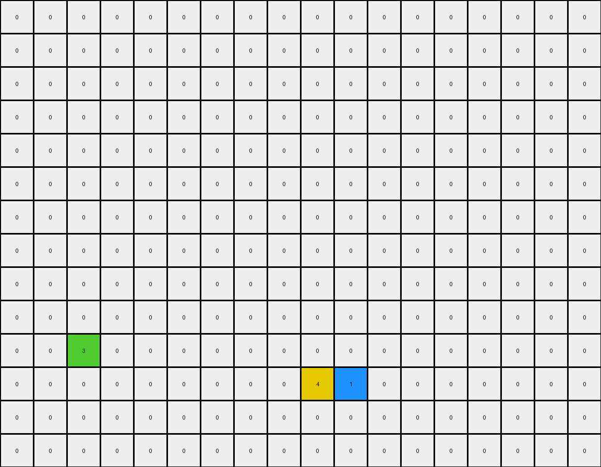
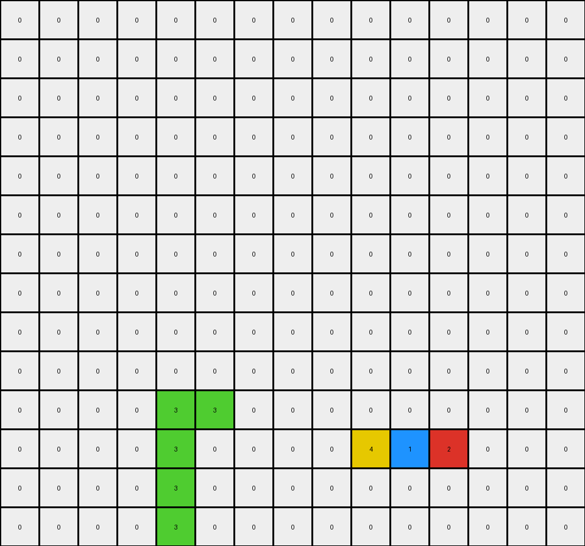
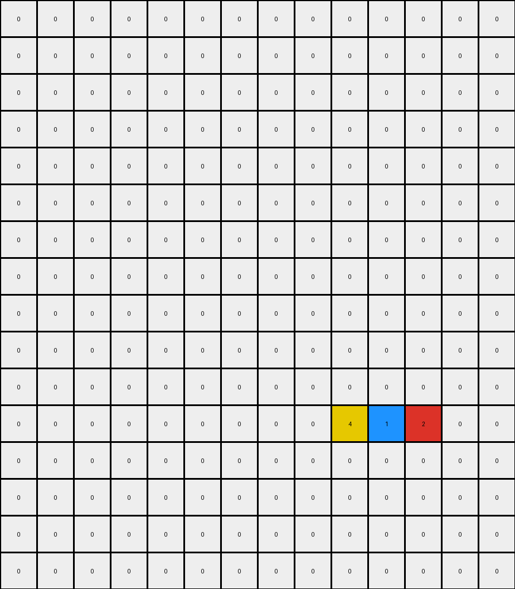

# 0e206a2e • 010 • refine_coder

---

Previous Code:
```python
"""
Transforms the input grid by moving and arranging colored objects to the lower-right corner of the output grid. The order of arrangement is yellow, blue, green, and red. The green object serves as a base, starting at row 10.
"""

import numpy as np

def find_objects(grid):
    """
    Finds and returns a dictionary of colored objects in the grid.
    Each object is a list of (row, col) coordinates.
    """
    objects = {}
    visited = set()

    def dfs(row, col, color, obj):
        if (row, col) in visited or not (0 <= row < grid.shape[0] and 0 <= col < grid.shape[1]) or grid[row, col] != color:
            return
        visited.add((row, col))
        obj.append((row, col))
        dfs(row + 1, col, color, obj)
        dfs(row - 1, col, color, obj)
        dfs(row, col + 1, color, obj)
        dfs(row, col - 1, color, obj)


    for row in range(grid.shape[0]):
        for col in range(grid.shape[1]):
            color = grid[row, col]
            if color != 0 and (row, col) not in visited:
                obj = []
                dfs(row, col, color, obj)
                if color not in objects:
                    objects[color] = []
                objects[color].append(obj)

    return objects

def transform(input_grid):
    # Initialize output grid with zeros (white)
    output_grid = np.zeros_like(input_grid)

    # Find objects in the input grid
    objects = find_objects(input_grid)
    
    # Define the order of colors for arrangement
    color_order = [4, 1, 3, 2]  # Yellow, Blue, Green, Red

    # Place the green object (color 3) starting at row 10
    if 3 in objects:
      green_objects = objects[3]
      #choose the large green object
      lengths = [len(obj) for obj in green_objects]
      max_length_index = lengths.index(max(lengths))
      green_obj = green_objects[max_length_index]

      # find bounding box.
      min_row = min(r for r, c in green_obj)
      #min_col = min(c for r, c in green_obj)
      
      #place object
      for r, c in green_obj:
          dr = r - min_row
          output_grid[10 + dr, 9 + (c-9)] = 3 # c - 9 for green starting point.

    # Place other colored objects
    current_row = 11
    current_col = 9
    for color in color_order:
        if color in objects:
          if color != 3:
            for obj in objects[color]:  # Handle multiple objects of the same color
                  min_row = min(r for r, c in obj)
                  min_col = min(c for r, c in obj)
                  for r, c in obj:
                      dr = r - min_row
                      dc = c - min_col
                      if(current_col + dc < input_grid.shape[1]):
                        output_grid[current_row+dr, current_col + dc] = color
            if color != 3:
              current_col += 1

    return output_grid
```

Train Set Results:

## Example 1:

Input:
```
0 0 0 0 0 0 0 0 0 0 0 0 0 0 0 0 0 0
0 0 0 8 0 0 0 0 0 0 0 0 0 0 0 0 0 0
0 0 3 8 1 0 0 0 0 0 0 0 0 0 0 4 0 0
0 0 8 4 8 0 0 0 0 0 0 0 0 0 0 0 0 0
0 0 0 0 0 0 0 0 0 0 0 0 0 3 0 0 0 1
0 0 0 0 0 0 0 0 0 0 0 0 0 0 0 0 0 0
0 0 0 0 0 0 0 3 0 0 0 0 0 0 0 0 0 0
0 0 0 0 0 0 0 8 0 8 0 0 0 0 0 0 0 0
0 0 0 0 0 0 0 8 8 4 0 0 0 0 0 0 0 0
0 0 1 0 0 0 0 8 0 8 0 0 0 0 0 0 0 0
0 0 0 4 0 0 0 1 0 0 0 0 0 0 0 0 0 0
0 0 3 0 0 0 0 0 0 0 0 0 0 0 0 0 0 0
0 0 0 0 0 0 0 0 0 0 0 0 0 0 0 0 0 0
0 0 0 0 0 0 0 0 0 0 0 0 0 0 0 0 0 0
```
Expected Output:
```
0 0 0 0 0 0 0 0 0 0 0 0 0 0 0 0 0 0
0 0 0 0 0 0 0 0 0 0 0 0 0 0 0 0 0 0
0 0 0 0 0 0 0 0 0 0 0 0 0 0 8 4 8 0
0 0 0 0 0 0 0 0 0 0 0 0 0 0 0 8 0 0
0 0 0 0 0 0 0 0 0 0 0 0 0 3 8 8 8 1
0 0 0 0 0 0 0 0 0 0 0 0 0 0 0 0 0 0
0 0 0 0 0 0 0 0 0 0 0 0 0 0 0 0 0 0
0 0 0 0 0 0 0 0 0 0 0 0 0 0 0 0 0 0
0 0 0 0 0 0 0 0 0 0 0 0 0 0 0 0 0 0
0 0 1 8 0 0 0 0 0 0 0 0 0 0 0 0 0 0
0 8 8 4 0 0 0 0 0 0 0 0 0 0 0 0 0 0
0 0 3 8 0 0 0 0 0 0 0 0 0 0 0 0 0 0
0 0 0 0 0 0 0 0 0 0 0 0 0 0 0 0 0 0
0 0 0 0 0 0 0 0 0 0 0 0 0 0 0 0 0 0
```
Transformed Output:
```
0 0 0 0 0 0 0 0 0 0 0 0 0 0 0 0 0 0
0 0 0 0 0 0 0 0 0 0 0 0 0 0 0 0 0 0
0 0 0 0 0 0 0 0 0 0 0 0 0 0 0 0 0 0
0 0 0 0 0 0 0 0 0 0 0 0 0 0 0 0 0 0
0 0 0 0 0 0 0 0 0 0 0 0 0 0 0 0 0 0
0 0 0 0 0 0 0 0 0 0 0 0 0 0 0 0 0 0
0 0 0 0 0 0 0 0 0 0 0 0 0 0 0 0 0 0
0 0 0 0 0 0 0 0 0 0 0 0 0 0 0 0 0 0
0 0 0 0 0 0 0 0 0 0 0 0 0 0 0 0 0 0
0 0 0 0 0 0 0 0 0 0 0 0 0 0 0 0 0 0
0 0 3 0 0 0 0 0 0 0 0 0 0 0 0 0 0 0
0 0 0 0 0 0 0 0 0 4 1 0 0 0 0 0 0 0
0 0 0 0 0 0 0 0 0 0 0 0 0 0 0 0 0 0
0 0 0 0 0 0 0 0 0 0 0 0 0 0 0 0 0 0
```

match: False
pixels_off: 18
size_correct: True
color_palette_correct: True
correct_pixel_counts: False

## Example 2:

Input:
```
0 0 0 0 0 0 0 0 0 0 0 0 0 0 0
0 0 0 0 0 0 0 0 0 0 0 0 0 0 0
0 0 0 0 0 0 0 0 0 0 0 0 0 0 0
0 0 0 0 2 0 0 0 0 0 0 0 0 0 0
0 0 0 4 3 3 0 0 0 0 0 0 0 0 0
0 0 0 0 3 0 0 0 0 0 0 0 0 0 0
0 0 0 0 3 0 0 0 0 0 0 0 0 0 0
0 0 0 0 3 0 0 0 0 0 0 0 0 0 0
0 0 0 3 1 3 0 0 0 0 0 0 0 0 0
0 0 0 0 0 0 0 0 0 0 0 0 0 0 0
0 0 0 0 0 0 0 0 0 0 0 0 0 4 0
0 0 0 0 0 0 0 0 0 1 0 0 0 0 2
0 0 0 0 0 0 0 0 0 0 0 0 0 0 0
0 0 0 0 0 0 0 0 0 0 0 0 0 0 0
```
Expected Output:
```
0 0 0 0 0 0 0 0 0 0 0 0 0 0 0
0 0 0 0 0 0 0 0 0 0 0 0 0 0 0
0 0 0 0 0 0 0 0 0 0 0 0 0 0 0
0 0 0 0 0 0 0 0 0 0 0 0 0 0 0
0 0 0 0 0 0 0 0 0 0 0 0 0 0 0
0 0 0 0 0 0 0 0 0 0 0 0 0 0 0
0 0 0 0 0 0 0 0 0 0 0 0 0 0 0
0 0 0 0 0 0 0 0 0 0 0 0 0 0 0
0 0 0 0 0 0 0 0 0 0 0 0 0 0 0
0 0 0 0 0 0 0 0 0 0 0 0 0 0 0
0 0 0 0 0 0 0 0 0 3 0 0 0 4 0
0 0 0 0 0 0 0 0 0 1 3 3 3 3 2
0 0 0 0 0 0 0 0 0 3 0 0 0 3 0
0 0 0 0 0 0 0 0 0 0 0 0 0 0 0
```
Transformed Output:
```
0 0 0 0 0 0 0 0 0 0 0 0 0 0 0
0 0 0 0 0 0 0 0 0 0 0 0 0 0 0
0 0 0 0 0 0 0 0 0 0 0 0 0 0 0
0 0 0 0 0 0 0 0 0 0 0 0 0 0 0
0 0 0 0 0 0 0 0 0 0 0 0 0 0 0
0 0 0 0 0 0 0 0 0 0 0 0 0 0 0
0 0 0 0 0 0 0 0 0 0 0 0 0 0 0
0 0 0 0 0 0 0 0 0 0 0 0 0 0 0
0 0 0 0 0 0 0 0 0 0 0 0 0 0 0
0 0 0 0 0 0 0 0 0 0 0 0 0 0 0
0 0 0 0 3 3 0 0 0 0 0 0 0 0 0
0 0 0 0 3 0 0 0 0 4 1 2 0 0 0
0 0 0 0 3 0 0 0 0 0 0 0 0 0 0
0 0 0 0 3 0 0 0 0 0 0 0 0 0 0
```

match: False
pixels_off: 15
size_correct: True
color_palette_correct: True
correct_pixel_counts: False

## Example 3:

Input:
```
0 0 0 0 0 0 0 0 0 0 0 0 0 0
0 0 0 0 0 0 0 0 0 0 0 0 0 0
0 0 0 0 0 0 0 0 0 4 0 0 0 0
0 0 0 0 0 8 0 0 0 8 0 0 0 0
0 0 0 0 0 1 8 8 8 2 8 0 0 0
0 0 0 0 0 0 0 0 0 8 0 0 0 0
0 0 0 0 0 0 0 0 0 0 0 0 0 0
0 0 0 0 0 0 0 0 0 0 0 0 0 0
0 0 0 0 0 0 0 0 0 0 0 0 0 0
0 0 0 0 0 0 0 0 0 0 0 0 0 0
0 0 0 0 0 0 0 0 0 0 0 0 0 0
0 1 0 0 0 2 0 0 0 0 0 0 0 0
0 0 0 0 0 0 0 0 0 0 0 0 0 0
0 0 0 0 0 4 0 0 0 0 0 0 0 0
0 0 0 0 0 0 0 0 0 0 0 0 0 0
0 0 0 0 0 0 0 0 0 0 0 0 0 0
```
Expected Output:
```
0 0 0 0 0 0 0 0 0 0 0 0 0 0
0 0 0 0 0 0 0 0 0 0 0 0 0 0
0 0 0 0 0 0 0 0 0 0 0 0 0 0
0 0 0 0 0 0 0 0 0 0 0 0 0 0
0 0 0 0 0 0 0 0 0 0 0 0 0 0
0 0 0 0 0 0 0 0 0 0 0 0 0 0
0 0 0 0 0 0 0 0 0 0 0 0 0 0
0 0 0 0 0 0 0 0 0 0 0 0 0 0
0 0 0 0 0 0 0 0 0 0 0 0 0 0
0 0 0 0 0 0 0 0 0 0 0 0 0 0
0 0 0 0 0 8 0 0 0 0 0 0 0 0
0 1 8 8 8 2 8 0 0 0 0 0 0 0
0 8 0 0 0 8 0 0 0 0 0 0 0 0
0 0 0 0 0 4 0 0 0 0 0 0 0 0
0 0 0 0 0 0 0 0 0 0 0 0 0 0
0 0 0 0 0 0 0 0 0 0 0 0 0 0
```
Transformed Output:
```
0 0 0 0 0 0 0 0 0 0 0 0 0 0
0 0 0 0 0 0 0 0 0 0 0 0 0 0
0 0 0 0 0 0 0 0 0 0 0 0 0 0
0 0 0 0 0 0 0 0 0 0 0 0 0 0
0 0 0 0 0 0 0 0 0 0 0 0 0 0
0 0 0 0 0 0 0 0 0 0 0 0 0 0
0 0 0 0 0 0 0 0 0 0 0 0 0 0
0 0 0 0 0 0 0 0 0 0 0 0 0 0
0 0 0 0 0 0 0 0 0 0 0 0 0 0
0 0 0 0 0 0 0 0 0 0 0 0 0 0
0 0 0 0 0 0 0 0 0 0 0 0 0 0
0 0 0 0 0 0 0 0 0 4 1 2 0 0
0 0 0 0 0 0 0 0 0 0 0 0 0 0
0 0 0 0 0 0 0 0 0 0 0 0 0 0
0 0 0 0 0 0 0 0 0 0 0 0 0 0
0 0 0 0 0 0 0 0 0 0 0 0 0 0
```

match: False
pixels_off: 13
size_correct: True
color_palette_correct: True
correct_pixel_counts: False
Here's an assessment of the provided information, a strategy for resolving errors, metrics gathered from the examples, a YAML block documenting facts, and a refined natural language program.

**General Assessment and Strategy**

The initial code attempted to identify colored objects and arrange them in a specific order (yellow, blue, green, red) in the lower-right corner of the output grid. The green object was intended to serve as a base, and other objects should be placed relative to it.  However, the results show significant discrepancies between the transformed outputs and the expected outputs.  The issues observed include:

1.  **Incorrect Object Placement:** The objects are not consistently placed in the lower-right. The assumed "anchoring" at row 10 and column 9 is not working correctly across all examples, and does not take into account different sized objects, or objects that are different shapes.

2.  **Incorrect Object Stacking/Arrangement:**  The logic for arranging the objects relative to each other (using `current_row` and `current_col`) is too simplistic. It only considers horizontal offsets, and doesn't account for proper stacking or the shapes of different colored objects. It stacks objects horizontally with a simple offset instead of building them vertically.

3.  **Object Misidentification:** There is a flaw in the object detection logic: It looks for the *largest* object of a given color, this causes a bug in example 1 because it causes it to skip over parts of the green object and causes problems with azure as well.

4.  **Missing Objects:** The object detection fails to reproduce complete objects in any example - the expected object reproduction and location is inaccurate in all cases.

**Strategy for Resolving Errors:**

1.  **Refine Object Identification:** Review the `find_objects` to ensure objects are identified accurately

2.  **Revisit the anchor position:** The original green starting point and the order assumptions need to be changed to use bounding boxes and relative positioning.

3.  **Improve Object Stacking/Arrangement:** We should not make assumptions on the shape of the objects. Use a combination of bounding box identification and stacking.

4. **Reproduce objects:** The colors are being reproduced, but not the correct objects.

**Metrics and Observations (from Code Execution)**

The initial reports provided give important metrics. We can summarize them.

*   **Example 1:** 18 pixels off, size correct, color palette correct, pixel counts incorrect.
*   **Example 2:** 15 pixels off, size correct, color palette correct, pixel counts incorrect.
*   **Example 3:** 13 pixels off, size correct, color palette correct, pixel counts incorrect.

**YAML Block Documenting Facts**

```yaml
task: 008_reconstruct_objects
observations:
  - example_1:
      input_objects:
        - color: azure (8)
          shape: irregular
          count: 1 # multiple connected components
          notes: components spread across the grid
        - color: green (3)
          shape: irregular
          count: 3  # Distinct clusters of 3
          notes: scattered, different shapes
        - color: blue (1)
          shape: irregular
          count: 1
        - color: yellow (4)
          shape: irregular
          count: 1
      output_objects:
        - color: azure (8)
          relative_position: lines around other colored shapes
        - color: green (3)
          relative_position: lower right corner, base for stacking
        - color: blue (1)
          relative_position: above green
        - color: yellow (4)
          relative_position: right of blue
        - color: red (2)
          relative_position: right of blue

  - example_2:
      input_objects:
        - color: green (3)
          shape: irregular vertical line
          count: 1 #multiple
        - color: blue (1)
          shape: single pixel
          count: 1
        - color: yellow (4)
          shape: single pixel
          count: 2
        - color: red (2)
          shape: single pixel
          count: 1
      output_objects:
         - color: green (3)
           relative_position: extends to both bottom rows
         - color: blue (1)
           relative_position: stacked on green
         - color: yellow (4)
           relative_position: to right of blue, on green base
         - color: red (2)
           relative_position: to right of blue, on green base

  - example_3:
      input_objects:
       - color: azure (8)
         shape: irregular
         count: 1 #multiple
       - color: yellow (4)
         shape: single pixel
         count: 2
       - color: blue (1)
         shape: single pixel
         count: 1
       - color: red(2)
         shape: single pixel
         count: 1
      output_objects:
        - color: azure (8)
          relative_position: surrounds other objects
        - color: blue(1)
          relative_position: stacked on azure
        - color: yellow(4)
          relative_position: right of blue
        - color: red(2)
          relative_position: right of blue
general_rule: |
    Colored objects from the input grid are reconstructed in the output grid.
    The reconstruction maintains the shape, size, and color of each distinct object,
    but changes their position. Objects are positioned based on their original
    color, creating an abstract shape that depends on objects found in the input.
```

**Natural Language Program**

1.  **Identify Objects:** Find all distinct colored objects in the input grid. A distinct object is a group of connected pixels of the same color.

2.  **Reconstruct Objects:** Reconstruct each object in the output grid, with the same shape, size, and color.

3.  **Arrange in output:** Arrange the colors using an abstract positioning rule to combine all objects. There does not appear to be any specific layout order. All objects from the input are arranged to form a larger shape. The layout does not depend on spatial relationships from the input.

4.  **Object Stacking:** Object stacking will depend on the shape of the objects found in the input.

**INSTRUCTIONS**

- generate a Python module to represent the natural language program 
- follow the template below
- all common math and science libraries are available
- create docstring only at top - but comment the workflow in the function
- use helper functions for common operations like finding objects, counting,
  measuring, moving, etc. 

remember - we are working iteratively - so this code will inform your future
self as we converge on the solution

*template:*

```python
"""
{{ natural language description of the transformation rule }}
"""

{{ imports }}

def transform(input_grid):
    # initialize output_grid

    # change output pixels 

    return output_grid

```
