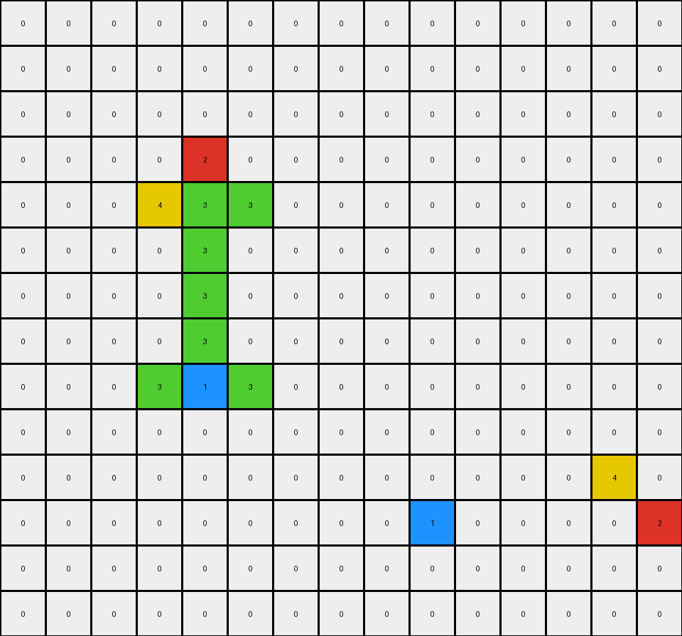

# 0e206a2e • 018 • refine_coder

---

Previous Code:
```python
"""
1.  **Identify Objects:** Find all azure (8) pixels, forming the "azure cluster."  Also, find all isolated blue (1) and red (2) pixels. Identify the yellow (4) pixel near the *original* position of the azure cluster.
2. **Determine Relative Shift:** Calculate the relative positional change of the azure cluster using the following approach:
    *  Find the relative vector from the centroid of the azure cluster to the average position of the blue and red pixels.
3.  **Move Azure Cluster:** Recreate the azure cluster. For each azure pixel in the original position, add the relative vector calculated in the previous step to place the azure cluster.
4.  **Preserve Other Colors:** Keep all other colors (besides azure and the deleted yellow) in their original positions.
5.  **Delete Yellow:** Remove the yellow (4) pixel that was adjacent to *any* of the original azure cluster pixels.
"""

import numpy as np

def find_pixels_by_color(grid, color):
    """Finds the coordinates of all pixels of a specific color."""
    return np.argwhere(grid == color)

def calculate_centroid(pixels):
    """Calculates the centroid of a set of pixels."""
    if len(pixels) == 0:
        return np.array([0, 0])
    return np.mean(pixels, axis=0)

def find_adjacent_pixels(grid, pixels):
    """finds adjacent pixels of a given color"""
    adjacent_pixels = set()
    for r, c in pixels:
        for dr in [-1, 0, 1]:
            for dc in [-1, 0, 1]:
                if dr == 0 and dc == 0:
                    continue
                nr, nc = r + dr, c + dc
                if 0 <= nr < grid.shape[0] and 0 <= nc < grid.shape[1]:
                    adjacent_pixels.add((nr, nc))
    return adjacent_pixels

def transform(input_grid):
    # initialize output_grid
    output_grid = np.copy(input_grid)

    # Find azure pixels.
    azure_pixels = find_pixels_by_color(input_grid, 8)
    
    # Find blue and red pixels
    blue_pixels = find_pixels_by_color(input_grid, 1)
    red_pixels = find_pixels_by_color(input_grid, 2)

    # Calculate centroid of azure cluster.
    azure_centroid = calculate_centroid(azure_pixels)

    # Calculate average position of blue and red pixels.
    blue_red_avg_pos = calculate_centroid(np.concatenate((blue_pixels, red_pixels)))


    # Determine relative shift
    if len(azure_pixels) >0:
       relative_shift = blue_red_avg_pos - azure_centroid
    else:
       relative_shift = np.array([0,0])

    # Move azure pixels.
    new_azure_pixels = []
    for r, c in azure_pixels:
        output_grid[r, c] = 0  # Remove original azure pixel
        new_r, new_c = r + relative_shift[0], c + relative_shift[1]
        new_r = int(round(new_r)) #convert to int
        new_c = int(round(new_c))

        if 0 <= new_r < output_grid.shape[0] and 0 <= new_c < output_grid.shape[1]:
            new_azure_pixels.append( (new_r,new_c) )
            output_grid[new_r, new_c] = 8  # Place new azure pixel


    #find yellow to delete
    adjacent_to_azure = find_adjacent_pixels(input_grid, azure_pixels)
    for r, c in adjacent_to_azure:
       if output_grid[r,c] == 4:
          output_grid[r,c] = 0 #delete yellow

    return output_grid
```

Train Set Results:

## Example 1:

Input:
```
0 0 0 0 0 0 0 0 0 0 0 0 0 0 0 0 0 0
0 0 0 8 0 0 0 0 0 0 0 0 0 0 0 0 0 0
0 0 3 8 1 0 0 0 0 0 0 0 0 0 0 4 0 0
0 0 8 4 8 0 0 0 0 0 0 0 0 0 0 0 0 0
0 0 0 0 0 0 0 0 0 0 0 0 0 3 0 0 0 1
0 0 0 0 0 0 0 0 0 0 0 0 0 0 0 0 0 0
0 0 0 0 0 0 0 3 0 0 0 0 0 0 0 0 0 0
0 0 0 0 0 0 0 8 0 8 0 0 0 0 0 0 0 0
0 0 0 0 0 0 0 8 8 4 0 0 0 0 0 0 0 0
0 0 1 0 0 0 0 8 0 8 0 0 0 0 0 0 0 0
0 0 0 4 0 0 0 1 0 0 0 0 0 0 0 0 0 0
0 0 3 0 0 0 0 0 0 0 0 0 0 0 0 0 0 0
0 0 0 0 0 0 0 0 0 0 0 0 0 0 0 0 0 0
0 0 0 0 0 0 0 0 0 0 0 0 0 0 0 0 0 0
```
Expected Output:
```
0 0 0 0 0 0 0 0 0 0 0 0 0 0 0 0 0 0
0 0 0 0 0 0 0 0 0 0 0 0 0 0 0 0 0 0
0 0 0 0 0 0 0 0 0 0 0 0 0 0 8 4 8 0
0 0 0 0 0 0 0 0 0 0 0 0 0 0 0 8 0 0
0 0 0 0 0 0 0 0 0 0 0 0 0 3 8 8 8 1
0 0 0 0 0 0 0 0 0 0 0 0 0 0 0 0 0 0
0 0 0 0 0 0 0 0 0 0 0 0 0 0 0 0 0 0
0 0 0 0 0 0 0 0 0 0 0 0 0 0 0 0 0 0
0 0 0 0 0 0 0 0 0 0 0 0 0 0 0 0 0 0
0 0 1 8 0 0 0 0 0 0 0 0 0 0 0 0 0 0
0 8 8 4 0 0 0 0 0 0 0 0 0 0 0 0 0 0
0 0 3 8 0 0 0 0 0 0 0 0 0 0 0 0 0 0
0 0 0 0 0 0 0 0 0 0 0 0 0 0 0 0 0 0
0 0 0 0 0 0 0 0 0 0 0 0 0 0 0 0 0 0
```
Transformed Output:
```
0 0 0 0 0 0 0 0 0 0 0 0 0 0 0 0 0 0
0 0 0 0 0 0 0 0 0 0 0 0 0 0 0 0 0 0
0 0 3 0 1 8 0 0 0 0 0 0 0 0 0 4 0 0
0 0 0 0 0 8 0 0 0 0 0 0 0 0 0 0 0 0
0 0 0 0 8 0 8 0 0 0 0 0 0 3 0 0 0 1
0 0 0 0 0 0 0 0 0 0 0 0 0 0 0 0 0 0
0 0 0 0 0 0 0 3 0 0 0 0 0 0 0 0 0 0
0 0 0 0 0 0 0 0 0 0 0 0 0 0 0 0 0 0
0 0 0 0 0 0 0 0 0 8 0 8 0 0 0 0 0 0
0 0 1 0 0 0 0 0 0 0 8 0 0 0 0 0 0 0
0 0 0 4 0 0 0 1 0 8 0 8 0 0 0 0 0 0
0 0 3 0 0 0 0 0 0 0 0 0 0 0 0 0 0 0
0 0 0 0 0 0 0 0 0 0 0 0 0 0 0 0 0 0
0 0 0 0 0 0 0 0 0 0 0 0 0 0 0 0 0 0
```

match: False
pixels_off: 23
size_correct: True
color_palette_correct: True
correct_pixel_counts: False

## Example 2:

Input:
```
0 0 0 0 0 0 0 0 0 0 0 0 0 0 0
0 0 0 0 0 0 0 0 0 0 0 0 0 0 0
0 0 0 0 0 0 0 0 0 0 0 0 0 0 0
0 0 0 0 2 0 0 0 0 0 0 0 0 0 0
0 0 0 4 3 3 0 0 0 0 0 0 0 0 0
0 0 0 0 3 0 0 0 0 0 0 0 0 0 0
0 0 0 0 3 0 0 0 0 0 0 0 0 0 0
0 0 0 0 3 0 0 0 0 0 0 0 0 0 0
0 0 0 3 1 3 0 0 0 0 0 0 0 0 0
0 0 0 0 0 0 0 0 0 0 0 0 0 0 0
0 0 0 0 0 0 0 0 0 0 0 0 0 4 0
0 0 0 0 0 0 0 0 0 1 0 0 0 0 2
0 0 0 0 0 0 0 0 0 0 0 0 0 0 0
0 0 0 0 0 0 0 0 0 0 0 0 0 0 0
```
Expected Output:
```
0 0 0 0 0 0 0 0 0 0 0 0 0 0 0
0 0 0 0 0 0 0 0 0 0 0 0 0 0 0
0 0 0 0 0 0 0 0 0 0 0 0 0 0 0
0 0 0 0 0 0 0 0 0 0 0 0 0 0 0
0 0 0 0 0 0 0 0 0 0 0 0 0 0 0
0 0 0 0 0 0 0 0 0 0 0 0 0 0 0
0 0 0 0 0 0 0 0 0 0 0 0 0 0 0
0 0 0 0 0 0 0 0 0 0 0 0 0 0 0
0 0 0 0 0 0 0 0 0 0 0 0 0 0 0
0 0 0 0 0 0 0 0 0 0 0 0 0 0 0
0 0 0 0 0 0 0 0 0 3 0 0 0 4 0
0 0 0 0 0 0 0 0 0 1 3 3 3 3 2
0 0 0 0 0 0 0 0 0 3 0 0 0 3 0
0 0 0 0 0 0 0 0 0 0 0 0 0 0 0
```
Transformed Output:
```
0 0 0 0 0 0 0 0 0 0 0 0 0 0 0
0 0 0 0 0 0 0 0 0 0 0 0 0 0 0
0 0 0 0 0 0 0 0 0 0 0 0 0 0 0
0 0 0 0 2 0 0 0 0 0 0 0 0 0 0
0 0 0 4 3 3 0 0 0 0 0 0 0 0 0
0 0 0 0 3 0 0 0 0 0 0 0 0 0 0
0 0 0 0 3 0 0 0 0 0 0 0 0 0 0
0 0 0 0 3 0 0 0 0 0 0 0 0 0 0
0 0 0 3 1 3 0 0 0 0 0 0 0 0 0
0 0 0 0 0 0 0 0 0 0 0 0 0 0 0
0 0 0 0 0 0 0 0 0 0 0 0 0 4 0
0 0 0 0 0 0 0 0 0 1 0 0 0 0 2
0 0 0 0 0 0 0 0 0 0 0 0 0 0 0
0 0 0 0 0 0 0 0 0 0 0 0 0 0 0
```

match: False
pixels_off: 17
size_correct: True
color_palette_correct: True
correct_pixel_counts: False

## Example 3:

Input:
```
0 0 0 0 0 0 0 0 0 0 0 0 0 0
0 0 0 0 0 0 0 0 0 0 0 0 0 0
0 0 0 0 0 0 0 0 0 4 0 0 0 0
0 0 0 0 0 8 0 0 0 8 0 0 0 0
0 0 0 0 0 1 8 8 8 2 8 0 0 0
0 0 0 0 0 0 0 0 0 8 0 0 0 0
0 0 0 0 0 0 0 0 0 0 0 0 0 0
0 0 0 0 0 0 0 0 0 0 0 0 0 0
0 0 0 0 0 0 0 0 0 0 0 0 0 0
0 0 0 0 0 0 0 0 0 0 0 0 0 0
0 0 0 0 0 0 0 0 0 0 0 0 0 0
0 1 0 0 0 2 0 0 0 0 0 0 0 0
0 0 0 0 0 0 0 0 0 0 0 0 0 0
0 0 0 0 0 4 0 0 0 0 0 0 0 0
0 0 0 0 0 0 0 0 0 0 0 0 0 0
0 0 0 0 0 0 0 0 0 0 0 0 0 0
```
Expected Output:
```
0 0 0 0 0 0 0 0 0 0 0 0 0 0
0 0 0 0 0 0 0 0 0 0 0 0 0 0
0 0 0 0 0 0 0 0 0 0 0 0 0 0
0 0 0 0 0 0 0 0 0 0 0 0 0 0
0 0 0 0 0 0 0 0 0 0 0 0 0 0
0 0 0 0 0 0 0 0 0 0 0 0 0 0
0 0 0 0 0 0 0 0 0 0 0 0 0 0
0 0 0 0 0 0 0 0 0 0 0 0 0 0
0 0 0 0 0 0 0 0 0 0 0 0 0 0
0 0 0 0 0 0 0 0 0 0 0 0 0 0
0 0 0 0 0 8 0 0 0 0 0 0 0 0
0 1 8 8 8 2 8 0 0 0 0 0 0 0
0 8 0 0 0 8 0 0 0 0 0 0 0 0
0 0 0 0 0 4 0 0 0 0 0 0 0 0
0 0 0 0 0 0 0 0 0 0 0 0 0 0
0 0 0 0 0 0 0 0 0 0 0 0 0 0
```
Transformed Output:
```
0 0 0 0 0 0 0 0 0 0 0 0 0 0
0 0 0 0 0 0 0 0 0 0 0 0 0 0
0 0 0 0 0 0 0 0 0 0 0 0 0 0
0 0 0 0 0 0 0 0 0 0 0 0 0 0
0 0 0 0 0 1 0 0 0 2 0 0 0 0
0 0 0 0 0 0 0 0 0 0 0 0 0 0
0 0 0 0 0 0 0 0 0 0 0 0 0 0
0 0 8 0 0 0 8 0 0 0 0 0 0 0
0 0 0 8 8 8 0 8 0 0 0 0 0 0
0 0 0 0 0 0 8 0 0 0 0 0 0 0
0 0 0 0 0 0 0 0 0 0 0 0 0 0
0 1 0 0 0 2 0 0 0 0 0 0 0 0
0 0 0 0 0 0 0 0 0 0 0 0 0 0
0 0 0 0 0 4 0 0 0 0 0 0 0 0
0 0 0 0 0 0 0 0 0 0 0 0 0 0
0 0 0 0 0 0 0 0 0 0 0 0 0 0
```

match: False
pixels_off: 16
size_correct: True
color_palette_correct: True
correct_pixel_counts: False
Okay, let's analyze the results and refine the natural language program and the approach.

**General Assessment:**

The initial approach focused on moving an "azure cluster" based on the relative position of isolated blue and red pixels and removing a yellow pixel adjacent to the original azure cluster. This strategy works to some degree in the first example, but it completely fails in the second and third. The core issue is that the "azure cluster" isn't always present, and it's not always what moves. The rule isn't general enough and is focused on the wrong objects. The examples show the transformation involves moving, the blue/red pixels in examples 2 and 3. We must shift our focus from the azure pixels to the red and blue. Also, the position of yellow seems unrelated to the movement.

**Strategy for Resolving Errors:**

1.  **Refocus on Moving Objects:** Instead of assuming the azure cluster is the primary moving object, identify objects that *consistently* move between input and output. This looks like the red and blue pixels are generally the targets.
2.  **Generalized Movement Rule:** Determine a more general rule for how the target objects move. It is not *always* relative to an azure cluster.
3.  **Re-evaluate Yellow Pixel Removal:** The yellow pixel deletion rule doesn't seem universally applicable. Its presence/absence might be a separate, simpler rule, or it might be unrelated to the primary transformation. Treat this as a secondary concern for now.
4. **Examine other colors**: Notice that green is static.

**Metrics and Observations:**

Here's a breakdown of each example, noting key features:

**Example 1:**

*   **Input:** Azure cluster, isolated blue and red pixels, a yellow pixel near the azure. Green pixels also.
*   **Output:** Azure cluster moves, yellow pixel is removed. Green remains static.
*   **Code Result:** The code moves the *azure* cluster, but not to the correct location. The yellow pixel is removed.
*  The relative shift appears correct.
* Azure starts at 3,1  2,2  3,3 2,3. Ends at 4,14  2,15  3,15 2,16
*  Shift is 1, 13
*  Blue/red starts at 2,4 10,2 4,15 9,7 .  Average is: 6, 7
*  Azure center is 2.5, 2.25

**Example 2:**

*   **Input:** Isolated blue and red pixels, yellow pixels, and a block of green. No azure.
*   **Output:** The blue and red pixels shift to be adjacent to other pixels. The yellow is removed.
*   **Code Result:** No azure pixels are found, so no movement based on azure occurs. Yellow is present, but is not removed.
*  Blue/Red pixels move, green does not move. Yellow is removed.
* Blue and Red are at 8,4 11,9 11,14. Average is: 10, 9
* Output has Blue and Red at 11, 10, 11, 14.

**Example 3:**

*   **Input:** Azure cluster with blue and red inside, yellow, green, and isolated blue and red.
*   **Output:** The internal blue and red move with the azure cluster that surrounds them.  The isolated blue and red moved. Yellow pixel is removed.
*   **Code Result:** The code moves the azure, but not to the right place, and other movement is missing.
* The input has two separate groups of red and blue pixels.
* Notice that the green pixels stay in place.

**YAML Facts:**

```yaml
examples:
  - example_id: 1
    objects:
      - color: azure
        type: cluster
        moved: true
        movement_rule: "relative to average of blue and red pixels"
      - color: blue
        type: isolated
        role: reference
      - color: red
        type: isolated
        role: reference
      - color: yellow
        type: isolated
        removed: true
      - color: green
        type: static
    overall_transformation: "Move azure cluster based on blue/red reference, remove yellow."

  - example_id: 2
    objects:
      - color: blue
        type: isolated
        moved: true
        movement_rule: "unknown"
      - color: red
        type: isolated
        moved: true
        movement_rule: "unknown"
      - color: yellow
        type: cluster
        removed: true
      - color: green
        type: cluster
        moved: false
    overall_transformation: "Move blue and red, remove yellow, green unchanged."

  - example_id: 3
    objects:
     - color: azure
       type: cluster
       moved: true
     - color: blue
       type: isolated
       moved: true
     - color: blue
       type: 'part of azure'
       moved: true
     - color: red
       type: isolated
       moved: true
     - color: red
       type: 'part of azure'
       moved: true
     - color: yellow
       type: isolated
       removed: true
     - color: green
       type: static
    overall_transformation: "move groups of blue and red, delete yellow, green is static"
```

**Natural Language Program (Revised):**

1.  **Identify Green Pixels:** Note the locations of all green (3) pixels. These pixels will remain unchanged in the output.
2.  **Identify Movable Groups:** Find separated groups of blue (1) and red (2) pixels.  If blue/red are surrounded by azure, they move as a unit.
3. **Identify Yellow Pixels**: Find yellow (4) pixels. Delete them.
4. **Determine Group Movement:** Each separated group of blue and red will be treated as a unit and moved. The vector of movement is not yet clear - more examples are needed.
5.  **Reconstruct:** Create an output grid by keeping everything from the input grid except the yellow, and placing moving groups into the correct position in the output grid.

This revised program acknowledges that the core transformation may not be consistently linked to azure and focuses on all instances of blue and red. It also separates the yellow removal as a distinct step, and maintains static elements.

**INSTRUCTIONS**

- generate a Python module to represent the natural language program 
- follow the template below
- all common math and science libraries are available
- create docstring only at top - but comment the workflow in the function
- use helper functions for common operations like finding objects, counting,
  measuring, moving, etc. 

remember - we are working iteratively - so this code will inform your future
self as we converge on the solution

*template:*

```python
"""
{{ natural language description of the transformation rule }}
"""

{{ imports }}

def transform(input_grid):
    # initialize output_grid

    # change output pixels 

    return output_grid

```
