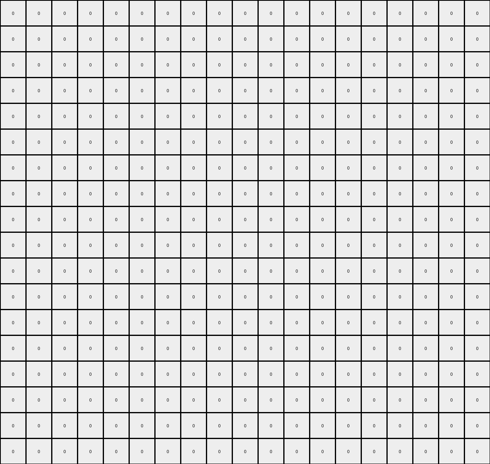

# 1a07d186 • 003 • refine_dreamer

---


Previous Code:
```python
"""
Transforms an input grid by preserving green and yellow pixels that are part of vertical lines and are adjacent to each other.
Other pixels are set to white (0).
"""

import numpy as np

def find_vertical_lines(grid, color):
    lines = []
    rows, cols = grid.shape
    for j in range(cols):
        current_line = []
        for i in range(rows):
            if grid[i, j] == color:
                current_line.append((i, j))
            else:
                if len(current_line) > 0:
                    lines.append(current_line)
                    current_line = []
        if len(current_line) > 0:
            lines.append(current_line)
    return lines

def transform(input_grid):
    # Initialize output grid with the same dimensions as the input grid, filled with white (0).
    output_grid = np.zeros_like(input_grid)

    # Find vertical lines of green (3) and yellow (4) pixels.
    green_lines = find_vertical_lines(input_grid, 3)
    yellow_lines = find_vertical_lines(input_grid, 4)
    
    # Flatten lists of lines into lists of pixels
    green_pixels = [pixel for line in green_lines for pixel in line]
    yellow_pixels = [pixel for line in yellow_lines for pixel in line]


    # Iterate through green pixels and check for adjacent yellow pixels.
    for (row, col) in green_pixels:
        if (row, col + 1) in yellow_pixels:
            output_grid[row, col] = 3

    # Iterate through yellow pixels and check for adjacent green pixels.
    for (row, col) in yellow_pixels:
         if (row, col - 1) in green_pixels:
            output_grid[row, col] = 4

    return output_grid
```

Train Set Results:

## Example 1:

Input:
```
0 0 0 3 0 0 0 0 0 0 0 0 4 0 0 0 0 0 0
0 0 0 3 0 0 0 0 0 0 0 0 4 0 0 0 0 0 0
0 0 0 3 0 0 0 0 0 0 0 0 4 0 0 0 0 0 0
0 4 0 3 0 0 3 0 0 0 0 0 4 0 0 0 0 0 0
0 0 0 3 0 0 0 0 0 0 0 0 4 0 0 0 0 0 0
0 0 0 3 0 0 0 0 0 0 0 0 4 0 0 0 0 0 0
0 0 0 3 0 0 0 0 0 0 0 0 4 0 0 0 0 0 0
0 0 0 3 0 0 0 0 0 4 0 0 4 0 0 0 0 0 0
0 0 0 3 0 0 0 0 0 0 0 0 4 0 0 0 0 0 0
0 0 0 3 0 0 0 0 0 0 0 0 4 0 0 0 0 0 0
0 0 0 3 0 0 0 2 0 0 0 0 4 0 0 0 0 0 0
0 0 0 3 0 0 0 0 0 0 0 0 4 0 0 0 3 0 0
0 0 0 3 0 0 0 0 0 0 0 0 4 0 0 0 0 0 0
0 0 0 3 0 0 0 0 0 0 0 0 4 0 0 0 0 0 0
0 0 0 3 0 0 0 0 0 0 0 0 4 0 0 0 0 0 0
0 0 0 3 0 0 0 0 0 0 0 0 4 0 0 0 0 0 0
0 0 0 3 0 0 0 0 0 0 0 0 4 0 0 0 0 0 0
0 0 0 3 0 0 0 0 0 0 0 0 4 0 0 0 0 0 0
```
Expected Output:
```
0 0 0 3 0 0 0 0 0 0 0 0 4 0 0 0 0 0 0
0 0 0 3 0 0 0 0 0 0 0 0 4 0 0 0 0 0 0
0 0 0 3 0 0 0 0 0 0 0 0 4 0 0 0 0 0 0
0 0 0 3 3 0 0 0 0 0 0 4 4 0 0 0 0 0 0
0 0 0 3 0 0 0 0 0 0 0 0 4 0 0 0 0 0 0
0 0 0 3 0 0 0 0 0 0 0 0 4 0 0 0 0 0 0
0 0 0 3 0 0 0 0 0 0 0 0 4 0 0 0 0 0 0
0 0 0 3 0 0 0 0 0 0 0 4 4 0 0 0 0 0 0
0 0 0 3 0 0 0 0 0 0 0 0 4 0 0 0 0 0 0
0 0 0 3 0 0 0 0 0 0 0 0 4 0 0 0 0 0 0
0 0 0 3 0 0 0 0 0 0 0 0 4 0 0 0 0 0 0
0 0 0 3 3 0 0 0 0 0 0 0 4 0 0 0 0 0 0
0 0 0 3 0 0 0 0 0 0 0 0 4 0 0 0 0 0 0
0 0 0 3 0 0 0 0 0 0 0 0 4 0 0 0 0 0 0
0 0 0 3 0 0 0 0 0 0 0 0 4 0 0 0 0 0 0
0 0 0 3 0 0 0 0 0 0 0 0 4 0 0 0 0 0 0
0 0 0 3 0 0 0 0 0 0 0 0 4 0 0 0 0 0 0
0 0 0 3 0 0 0 0 0 0 0 0 4 0 0 0 0 0 0
```
Transformed Output:
```
0 0 0 0 0 0 0 0 0 0 0 0 0 0 0 0 0 0 0
0 0 0 0 0 0 0 0 0 0 0 0 0 0 0 0 0 0 0
0 0 0 0 0 0 0 0 0 0 0 0 0 0 0 0 0 0 0
0 0 0 0 0 0 0 0 0 0 0 0 0 0 0 0 0 0 0
0 0 0 0 0 0 0 0 0 0 0 0 0 0 0 0 0 0 0
0 0 0 0 0 0 0 0 0 0 0 0 0 0 0 0 0 0 0
0 0 0 0 0 0 0 0 0 0 0 0 0 0 0 0 0 0 0
0 0 0 0 0 0 0 0 0 0 0 0 0 0 0 0 0 0 0
0 0 0 0 0 0 0 0 0 0 0 0 0 0 0 0 0 0 0
0 0 0 0 0 0 0 0 0 0 0 0 0 0 0 0 0 0 0
0 0 0 0 0 0 0 0 0 0 0 0 0 0 0 0 0 0 0
0 0 0 0 0 0 0 0 0 0 0 0 0 0 0 0 0 0 0
0 0 0 0 0 0 0 0 0 0 0 0 0 0 0 0 0 0 0
0 0 0 0 0 0 0 0 0 0 0 0 0 0 0 0 0 0 0
0 0 0 0 0 0 0 0 0 0 0 0 0 0 0 0 0 0 0
0 0 0 0 0 0 0 0 0 0 0 0 0 0 0 0 0 0 0
0 0 0 0 0 0 0 0 0 0 0 0 0 0 0 0 0 0 0
0 0 0 0 0 0 0 0 0 0 0 0 0 0 0 0 0 0 0
```

match: False
pixels_off: 40
size_correct: True
color_palette_correct: True
correct_pixel_counts: False

## Example 2:

Input:
```
0 0 0 2 0 0 0 0 0 0 0 0 0 0
0 0 0 0 0 0 0 0 0 4 0 0 0 0
0 0 0 0 0 0 0 0 0 0 0 0 0 0
2 2 2 2 2 2 2 2 2 2 2 2 2 2
0 0 0 0 0 0 0 0 0 0 0 0 0 0
0 0 0 0 0 0 0 0 0 0 1 0 0 0
0 0 0 0 0 0 0 0 0 0 0 0 0 0
0 0 0 0 0 0 2 0 0 0 0 0 0 0
0 0 0 0 0 0 0 0 0 0 0 0 0 0
0 0 0 0 0 0 0 0 0 0 0 0 0 0
1 1 1 1 1 1 1 1 1 1 1 1 1 1
0 0 0 0 0 0 0 0 0 0 0 0 0 0
0 0 0 0 0 0 0 0 0 0 0 0 0 0
0 0 1 0 0 0 0 0 0 0 2 0 0 0
0 0 0 0 0 0 0 0 0 0 0 0 0 0
```
Expected Output:
```
0 0 0 0 0 0 0 0 0 0 0 0 0 0
0 0 0 0 0 0 0 0 0 0 0 0 0 0
0 0 0 2 0 0 0 0 0 0 0 0 0 0
2 2 2 2 2 2 2 2 2 2 2 2 2 2
0 0 0 0 0 0 2 0 0 0 2 0 0 0
0 0 0 0 0 0 0 0 0 0 0 0 0 0
0 0 0 0 0 0 0 0 0 0 0 0 0 0
0 0 0 0 0 0 0 0 0 0 0 0 0 0
0 0 0 0 0 0 0 0 0 0 0 0 0 0
0 0 0 0 0 0 0 0 0 0 1 0 0 0
1 1 1 1 1 1 1 1 1 1 1 1 1 1
0 0 1 0 0 0 0 0 0 0 0 0 0 0
0 0 0 0 0 0 0 0 0 0 0 0 0 0
0 0 0 0 0 0 0 0 0 0 0 0 0 0
0 0 0 0 0 0 0 0 0 0 0 0 0 0
```
Transformed Output:
```
0 0 0 0 0 0 0 0 0 0 0 0 0 0
0 0 0 0 0 0 0 0 0 0 0 0 0 0
0 0 0 0 0 0 0 0 0 0 0 0 0 0
0 0 0 0 0 0 0 0 0 0 0 0 0 0
0 0 0 0 0 0 0 0 0 0 0 0 0 0
0 0 0 0 0 0 0 0 0 0 0 0 0 0
0 0 0 0 0 0 0 0 0 0 0 0 0 0
0 0 0 0 0 0 0 0 0 0 0 0 0 0
0 0 0 0 0 0 0 0 0 0 0 0 0 0
0 0 0 0 0 0 0 0 0 0 0 0 0 0
0 0 0 0 0 0 0 0 0 0 0 0 0 0
0 0 0 0 0 0 0 0 0 0 0 0 0 0
0 0 0 0 0 0 0 0 0 0 0 0 0 0
0 0 0 0 0 0 0 0 0 0 0 0 0 0
0 0 0 0 0 0 0 0 0 0 0 0 0 0
```

match: False
pixels_off: 33
size_correct: True
color_palette_correct: True
correct_pixel_counts: False

## Example 3:

Input:
```
0 0 0 0 0 0 0 0 0 0 0 0 0 0 0 0
0 0 0 1 0 0 0 8 0 0 0 0 0 0 0 0
0 0 0 0 0 0 0 0 0 0 0 0 0 0 0 0
0 0 0 0 0 0 0 0 0 0 0 0 0 0 0 0
0 0 0 0 0 0 0 0 0 0 0 0 0 0 0 0
8 8 8 8 8 8 8 8 8 8 8 8 8 8 8 8
0 0 0 0 0 0 0 0 0 0 0 0 0 0 0 0
0 0 0 0 0 0 0 0 0 0 0 0 0 0 0 0
0 0 0 0 0 0 0 0 0 0 0 8 0 0 0 0
0 0 0 0 0 0 0 0 0 0 0 0 0 0 0 0
0 0 0 0 0 0 0 0 0 0 0 0 0 0 0 0
0 0 0 0 0 0 0 0 0 0 0 0 0 0 0 0
0 0 0 8 0 0 0 0 0 0 0 0 0 0 0 0
0 0 0 0 0 0 0 0 0 0 0 0 1 0 0 0
0 0 0 0 0 0 0 0 0 0 0 0 0 0 0 0
```
Expected Output:
```
0 0 0 0 0 0 0 0 0 0 0 0 0 0 0 0
0 0 0 0 0 0 0 0 0 0 0 0 0 0 0 0
0 0 0 0 0 0 0 0 0 0 0 0 0 0 0 0
0 0 0 0 0 0 0 0 0 0 0 0 0 0 0 0
0 0 0 0 0 0 0 8 0 0 0 0 0 0 0 0
8 8 8 8 8 8 8 8 8 8 8 8 8 8 8 8
0 0 0 8 0 0 0 0 0 0 0 8 0 0 0 0
0 0 0 0 0 0 0 0 0 0 0 0 0 0 0 0
0 0 0 0 0 0 0 0 0 0 0 0 0 0 0 0
0 0 0 0 0 0 0 0 0 0 0 0 0 0 0 0
0 0 0 0 0 0 0 0 0 0 0 0 0 0 0 0
0 0 0 0 0 0 0 0 0 0 0 0 0 0 0 0
0 0 0 0 0 0 0 0 0 0 0 0 0 0 0 0
0 0 0 0 0 0 0 0 0 0 0 0 0 0 0 0
0 0 0 0 0 0 0 0 0 0 0 0 0 0 0 0
```
Transformed Output:
```
0 0 0 0 0 0 0 0 0 0 0 0 0 0 0 0
0 0 0 0 0 0 0 0 0 0 0 0 0 0 0 0
0 0 0 0 0 0 0 0 0 0 0 0 0 0 0 0
0 0 0 0 0 0 0 0 0 0 0 0 0 0 0 0
0 0 0 0 0 0 0 0 0 0 0 0 0 0 0 0
0 0 0 0 0 0 0 0 0 0 0 0 0 0 0 0
0 0 0 0 0 0 0 0 0 0 0 0 0 0 0 0
0 0 0 0 0 0 0 0 0 0 0 0 0 0 0 0
0 0 0 0 0 0 0 0 0 0 0 0 0 0 0 0
0 0 0 0 0 0 0 0 0 0 0 0 0 0 0 0
0 0 0 0 0 0 0 0 0 0 0 0 0 0 0 0
0 0 0 0 0 0 0 0 0 0 0 0 0 0 0 0
0 0 0 0 0 0 0 0 0 0 0 0 0 0 0 0
0 0 0 0 0 0 0 0 0 0 0 0 0 0 0 0
0 0 0 0 0 0 0 0 0 0 0 0 0 0 0 0
```

match: False
pixels_off: 19
size_correct: True
color_palette_correct: True
correct_pixel_counts: False

**INSTRUCTIONS**

The code above was generated based on observations from the first training
example

we have tested the transform function on each of the task example inputs and
compared with the expected output

review each of the examples provided and the results and consider how the
natural language program should be updated to accommodate this new knowledge

respond with the following deliverables:

- general assessment of the information provided and strategy for resolving the
  errors
- gather metrics about each of the examples and results - use code_execution to
  develop accurate reports on your assumptions
- a YAML block documenting facts - Focus on identifying objects, their properties, and the actions performed on them.
- a natural language program - Be as clear and concise as possible, providing a complete description of the transformation rule.


your responses should be considered as information in a report - not a
conversation
