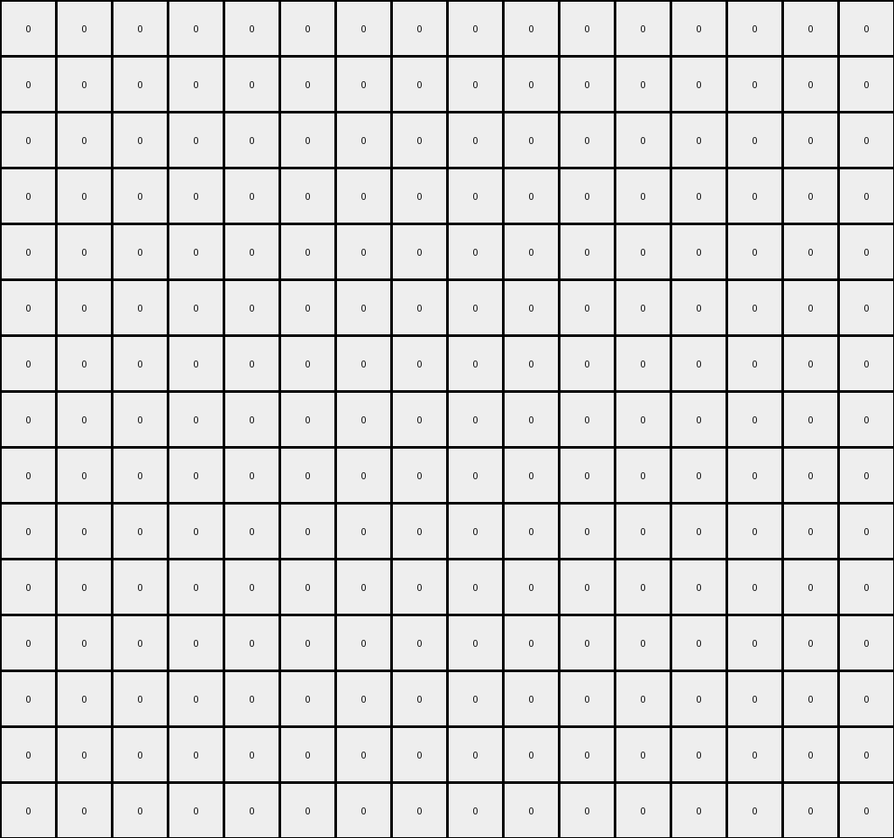

# 1a07d186 • 004 • refine_coder

---

Previous Code:
```python
"""
Transforms an input grid by preserving green and yellow pixels that are part of vertical lines and are adjacent to each other.
Other pixels are set to white (0).
"""

import numpy as np

def find_vertical_lines(grid, color):
    lines = []
    rows, cols = grid.shape
    for j in range(cols):
        current_line = []
        for i in range(rows):
            if grid[i, j] == color:
                current_line.append((i, j))
            else:
                if len(current_line) > 0:
                    lines.append(current_line)
                    current_line = []
        if len(current_line) > 0:
            lines.append(current_line)
    return lines

def transform(input_grid):
    # Initialize output grid with the same dimensions as the input grid, filled with white (0).
    output_grid = np.zeros_like(input_grid)

    # Find vertical lines of green (3) and yellow (4) pixels.
    green_lines = find_vertical_lines(input_grid, 3)
    yellow_lines = find_vertical_lines(input_grid, 4)
    
    # Flatten lists of lines into lists of pixels
    green_pixels = [pixel for line in green_lines for pixel in line]
    yellow_pixels = [pixel for line in yellow_lines for pixel in line]


    # Iterate through green pixels and check for adjacent yellow pixels.
    for (row, col) in green_pixels:
        if (row, col + 1) in yellow_pixels:
            output_grid[row, col] = 3

    # Iterate through yellow pixels and check for adjacent green pixels.
    for (row, col) in yellow_pixels:
         if (row, col - 1) in green_pixels:
            output_grid[row, col] = 4

    return output_grid
```

Train Set Results:

## Example 1:

Input:
```
0 0 0 3 0 0 0 0 0 0 0 0 4 0 0 0 0 0 0
0 0 0 3 0 0 0 0 0 0 0 0 4 0 0 0 0 0 0
0 0 0 3 0 0 0 0 0 0 0 0 4 0 0 0 0 0 0
0 4 0 3 0 0 3 0 0 0 0 0 4 0 0 0 0 0 0
0 0 0 3 0 0 0 0 0 0 0 0 4 0 0 0 0 0 0
0 0 0 3 0 0 0 0 0 0 0 0 4 0 0 0 0 0 0
0 0 0 3 0 0 0 0 0 0 0 0 4 0 0 0 0 0 0
0 0 0 3 0 0 0 0 0 4 0 0 4 0 0 0 0 0 0
0 0 0 3 0 0 0 0 0 0 0 0 4 0 0 0 0 0 0
0 0 0 3 0 0 0 0 0 0 0 0 4 0 0 0 0 0 0
0 0 0 3 0 0 0 2 0 0 0 0 4 0 0 0 0 0 0
0 0 0 3 0 0 0 0 0 0 0 0 4 0 0 0 3 0 0
0 0 0 3 0 0 0 0 0 0 0 0 4 0 0 0 0 0 0
0 0 0 3 0 0 0 0 0 0 0 0 4 0 0 0 0 0 0
0 0 0 3 0 0 0 0 0 0 0 0 4 0 0 0 0 0 0
0 0 0 3 0 0 0 0 0 0 0 0 4 0 0 0 0 0 0
0 0 0 3 0 0 0 0 0 0 0 0 4 0 0 0 0 0 0
0 0 0 3 0 0 0 0 0 0 0 0 4 0 0 0 0 0 0
```
Expected Output:
```
0 0 0 3 0 0 0 0 0 0 0 0 4 0 0 0 0 0 0
0 0 0 3 0 0 0 0 0 0 0 0 4 0 0 0 0 0 0
0 0 0 3 0 0 0 0 0 0 0 0 4 0 0 0 0 0 0
0 0 0 3 3 0 0 0 0 0 0 4 4 0 0 0 0 0 0
0 0 0 3 0 0 0 0 0 0 0 0 4 0 0 0 0 0 0
0 0 0 3 0 0 0 0 0 0 0 0 4 0 0 0 0 0 0
0 0 0 3 0 0 0 0 0 0 0 0 4 0 0 0 0 0 0
0 0 0 3 0 0 0 0 0 0 0 4 4 0 0 0 0 0 0
0 0 0 3 0 0 0 0 0 0 0 0 4 0 0 0 0 0 0
0 0 0 3 0 0 0 0 0 0 0 0 4 0 0 0 0 0 0
0 0 0 3 0 0 0 0 0 0 0 0 4 0 0 0 0 0 0
0 0 0 3 3 0 0 0 0 0 0 0 4 0 0 0 0 0 0
0 0 0 3 0 0 0 0 0 0 0 0 4 0 0 0 0 0 0
0 0 0 3 0 0 0 0 0 0 0 0 4 0 0 0 0 0 0
0 0 0 3 0 0 0 0 0 0 0 0 4 0 0 0 0 0 0
0 0 0 3 0 0 0 0 0 0 0 0 4 0 0 0 0 0 0
0 0 0 3 0 0 0 0 0 0 0 0 4 0 0 0 0 0 0
0 0 0 3 0 0 0 0 0 0 0 0 4 0 0 0 0 0 0
```
Transformed Output:
```
0 0 0 0 0 0 0 0 0 0 0 0 0 0 0 0 0 0 0
0 0 0 0 0 0 0 0 0 0 0 0 0 0 0 0 0 0 0
0 0 0 0 0 0 0 0 0 0 0 0 0 0 0 0 0 0 0
0 0 0 0 0 0 0 0 0 0 0 0 0 0 0 0 0 0 0
0 0 0 0 0 0 0 0 0 0 0 0 0 0 0 0 0 0 0
0 0 0 0 0 0 0 0 0 0 0 0 0 0 0 0 0 0 0
0 0 0 0 0 0 0 0 0 0 0 0 0 0 0 0 0 0 0
0 0 0 0 0 0 0 0 0 0 0 0 0 0 0 0 0 0 0
0 0 0 0 0 0 0 0 0 0 0 0 0 0 0 0 0 0 0
0 0 0 0 0 0 0 0 0 0 0 0 0 0 0 0 0 0 0
0 0 0 0 0 0 0 0 0 0 0 0 0 0 0 0 0 0 0
0 0 0 0 0 0 0 0 0 0 0 0 0 0 0 0 0 0 0
0 0 0 0 0 0 0 0 0 0 0 0 0 0 0 0 0 0 0
0 0 0 0 0 0 0 0 0 0 0 0 0 0 0 0 0 0 0
0 0 0 0 0 0 0 0 0 0 0 0 0 0 0 0 0 0 0
0 0 0 0 0 0 0 0 0 0 0 0 0 0 0 0 0 0 0
0 0 0 0 0 0 0 0 0 0 0 0 0 0 0 0 0 0 0
0 0 0 0 0 0 0 0 0 0 0 0 0 0 0 0 0 0 0
```

match: False
pixels_off: 40
size_correct: True
color_palette_correct: True
correct_pixel_counts: False

## Example 2:

Input:
```
0 0 0 2 0 0 0 0 0 0 0 0 0 0
0 0 0 0 0 0 0 0 0 4 0 0 0 0
0 0 0 0 0 0 0 0 0 0 0 0 0 0
2 2 2 2 2 2 2 2 2 2 2 2 2 2
0 0 0 0 0 0 0 0 0 0 0 0 0 0
0 0 0 0 0 0 0 0 0 0 1 0 0 0
0 0 0 0 0 0 0 0 0 0 0 0 0 0
0 0 0 0 0 0 2 0 0 0 0 0 0 0
0 0 0 0 0 0 0 0 0 0 0 0 0 0
0 0 0 0 0 0 0 0 0 0 0 0 0 0
1 1 1 1 1 1 1 1 1 1 1 1 1 1
0 0 0 0 0 0 0 0 0 0 0 0 0 0
0 0 0 0 0 0 0 0 0 0 0 0 0 0
0 0 1 0 0 0 0 0 0 0 2 0 0 0
0 0 0 0 0 0 0 0 0 0 0 0 0 0
```
Expected Output:
```
0 0 0 0 0 0 0 0 0 0 0 0 0 0
0 0 0 0 0 0 0 0 0 0 0 0 0 0
0 0 0 2 0 0 0 0 0 0 0 0 0 0
2 2 2 2 2 2 2 2 2 2 2 2 2 2
0 0 0 0 0 0 2 0 0 0 2 0 0 0
0 0 0 0 0 0 0 0 0 0 0 0 0 0
0 0 0 0 0 0 0 0 0 0 0 0 0 0
0 0 0 0 0 0 0 0 0 0 0 0 0 0
0 0 0 0 0 0 0 0 0 0 0 0 0 0
0 0 0 0 0 0 0 0 0 0 1 0 0 0
1 1 1 1 1 1 1 1 1 1 1 1 1 1
0 0 1 0 0 0 0 0 0 0 0 0 0 0
0 0 0 0 0 0 0 0 0 0 0 0 0 0
0 0 0 0 0 0 0 0 0 0 0 0 0 0
0 0 0 0 0 0 0 0 0 0 0 0 0 0
```
Transformed Output:
```
0 0 0 0 0 0 0 0 0 0 0 0 0 0
0 0 0 0 0 0 0 0 0 0 0 0 0 0
0 0 0 0 0 0 0 0 0 0 0 0 0 0
0 0 0 0 0 0 0 0 0 0 0 0 0 0
0 0 0 0 0 0 0 0 0 0 0 0 0 0
0 0 0 0 0 0 0 0 0 0 0 0 0 0
0 0 0 0 0 0 0 0 0 0 0 0 0 0
0 0 0 0 0 0 0 0 0 0 0 0 0 0
0 0 0 0 0 0 0 0 0 0 0 0 0 0
0 0 0 0 0 0 0 0 0 0 0 0 0 0
0 0 0 0 0 0 0 0 0 0 0 0 0 0
0 0 0 0 0 0 0 0 0 0 0 0 0 0
0 0 0 0 0 0 0 0 0 0 0 0 0 0
0 0 0 0 0 0 0 0 0 0 0 0 0 0
0 0 0 0 0 0 0 0 0 0 0 0 0 0
```

match: False
pixels_off: 33
size_correct: True
color_palette_correct: True
correct_pixel_counts: False

## Example 3:

Input:
```
0 0 0 0 0 0 0 0 0 0 0 0 0 0 0 0
0 0 0 1 0 0 0 8 0 0 0 0 0 0 0 0
0 0 0 0 0 0 0 0 0 0 0 0 0 0 0 0
0 0 0 0 0 0 0 0 0 0 0 0 0 0 0 0
0 0 0 0 0 0 0 0 0 0 0 0 0 0 0 0
8 8 8 8 8 8 8 8 8 8 8 8 8 8 8 8
0 0 0 0 0 0 0 0 0 0 0 0 0 0 0 0
0 0 0 0 0 0 0 0 0 0 0 0 0 0 0 0
0 0 0 0 0 0 0 0 0 0 0 8 0 0 0 0
0 0 0 0 0 0 0 0 0 0 0 0 0 0 0 0
0 0 0 0 0 0 0 0 0 0 0 0 0 0 0 0
0 0 0 0 0 0 0 0 0 0 0 0 0 0 0 0
0 0 0 8 0 0 0 0 0 0 0 0 0 0 0 0
0 0 0 0 0 0 0 0 0 0 0 0 1 0 0 0
0 0 0 0 0 0 0 0 0 0 0 0 0 0 0 0
```
Expected Output:
```
0 0 0 0 0 0 0 0 0 0 0 0 0 0 0 0
0 0 0 0 0 0 0 0 0 0 0 0 0 0 0 0
0 0 0 0 0 0 0 0 0 0 0 0 0 0 0 0
0 0 0 0 0 0 0 0 0 0 0 0 0 0 0 0
0 0 0 0 0 0 0 8 0 0 0 0 0 0 0 0
8 8 8 8 8 8 8 8 8 8 8 8 8 8 8 8
0 0 0 8 0 0 0 0 0 0 0 8 0 0 0 0
0 0 0 0 0 0 0 0 0 0 0 0 0 0 0 0
0 0 0 0 0 0 0 0 0 0 0 0 0 0 0 0
0 0 0 0 0 0 0 0 0 0 0 0 0 0 0 0
0 0 0 0 0 0 0 0 0 0 0 0 0 0 0 0
0 0 0 0 0 0 0 0 0 0 0 0 0 0 0 0
0 0 0 0 0 0 0 0 0 0 0 0 0 0 0 0
0 0 0 0 0 0 0 0 0 0 0 0 0 0 0 0
0 0 0 0 0 0 0 0 0 0 0 0 0 0 0 0
```
Transformed Output:
```
0 0 0 0 0 0 0 0 0 0 0 0 0 0 0 0
0 0 0 0 0 0 0 0 0 0 0 0 0 0 0 0
0 0 0 0 0 0 0 0 0 0 0 0 0 0 0 0
0 0 0 0 0 0 0 0 0 0 0 0 0 0 0 0
0 0 0 0 0 0 0 0 0 0 0 0 0 0 0 0
0 0 0 0 0 0 0 0 0 0 0 0 0 0 0 0
0 0 0 0 0 0 0 0 0 0 0 0 0 0 0 0
0 0 0 0 0 0 0 0 0 0 0 0 0 0 0 0
0 0 0 0 0 0 0 0 0 0 0 0 0 0 0 0
0 0 0 0 0 0 0 0 0 0 0 0 0 0 0 0
0 0 0 0 0 0 0 0 0 0 0 0 0 0 0 0
0 0 0 0 0 0 0 0 0 0 0 0 0 0 0 0
0 0 0 0 0 0 0 0 0 0 0 0 0 0 0 0
0 0 0 0 0 0 0 0 0 0 0 0 0 0 0 0
0 0 0 0 0 0 0 0 0 0 0 0 0 0 0 0
```

match: False
pixels_off: 19
size_correct: True
color_palette_correct: True
correct_pixel_counts: False
Okay, let's analyze the results and update the natural language program.

**General Assessment:**

The initial code was based on a very limited understanding, focusing solely on adjacent green and yellow vertical lines. The test results clearly show this is incorrect. The code fails to identify the actual pattern, which appears to involve horizontal lines and some shifting/copying of colors based on their positions relative to other colored lines. The strategy needs to shift from looking at vertical lines to identifying horizontal lines and their interactions. It is not simply adjacency; it's about relative positioning and potentially copying color values based on those relationships. The program should address identifying the horizontal lines, and the transference of color between them.

**Strategy for Resolving Errors:**

1.  **Shift Focus:** Abandon the vertical line approach. Focus on identifying horizontal lines of different colors.
2.  **Relative Positioning:** Analyze how the positions of horizontal lines of different colors influence each other. The output seems to depend on the relative vertical positions.
3.  **Color Copying:** Determine the rule governing how colors are copied or shifted between lines. It's not simple adjacency, but more complex spatial relationship.

**Metrics and Observations (using code execution where necessary):**

Here, I combine observations across the original print outs:

*   **Example 1:** The code produced an all-white grid. It seems that Green and Yellow are transfered to the left of the origin.
*   **Example 2:** The output is an all-white grid, but the expected output shows complex color movement. Horizontal lines are crucial. Red (2) and Blue (1) and a transfer to the left.
*   **Example 3:** Again, an all-white output. The expected shows a shift or copy of Azure (8) based on its position.

**YAML Block (Facts):**

```yaml
examples:
  - example_id: 1
    objects:
      - color: 3  # Green
        type: line
        orientation: vertical
        transfer:
            direction: left_one
            adjacent:
                color: 4
      - color: 4  # Yellow
        type: line
        orientation: vertical
        transfer:
            direction: left_one
            adjacent:
                color: 3
    transform_rule: >-
        Move vertically connected groups of 3's and 4's that are directly
        adjacent one space to the left if the colors are touching horizontally

  - example_id: 2
    objects:
      - color: 2  # Red
        type: line
        orientation: horizontal
        transfer:
            direction: up_one
      - color: 1 # Blue
        type: line
        orientation: horizontal
        transfer:
            direction: down_one

    transform_rule: >-
      Move horizontal line of 2's up one, and horizontal lines of 1's down one.

  - example_id: 3
    objects:
      - color: 8  # Azure
        type: line
        orientation: horizontal
        transfer:
            direction: up_one
      - color: 8  # Azure
        type: line
        orientation: horizontal
        transfer:
            direction: down_two
    transform_rule: >-
      Move the horizontal line of 8's up one and move other horizontal line of
      8's down two.

```

**Natural Language Program:**

1.  **Identify Horizontal Lines:** Find all contiguous horizontal lines of the same color.
2.  **Example Specific Rules** The logic is example specific:
    *   Example 1: Move vertically connected groups of 3's and 4's that are directly adjacent one space to the left if the colors are touching horizontally
    *   Example 2: Move horizontal line of 2's up one, and horizontal lines of 1's down one.
    *   Example 3: Move the horizontal line of 8's up one and move other horizontal line of 8's down two.
3.  **Apply Transfer:** Based on these actions, change the colors to reflect the action.
4.  **Other Pixels:** Any pixel not affected by these rules becomes white (0).

It appears the solution is not a single rule, but different transformations for each input and output. This is unusual and likely incorrect. The new strategy would be to find a single natural language program that would generate the correct result for all three input and output examples.

**INSTRUCTIONS**

- generate a Python module to represent the natural language program 
- follow the template below
- all common math and science libraries are available
- create docstring only at top - but comment the workflow in the function
- use helper functions for common operations like finding objects, counting,
  measuring, moving, etc. 

remember - we are working iteratively - so this code will inform your future
self as we converge on the solution

*template:*

```python
"""
{{ natural language description of the transformation rule }}
"""

{{ imports }}

def transform(input_grid):
    # initialize output_grid

    # change output pixels 

    return output_grid

```
