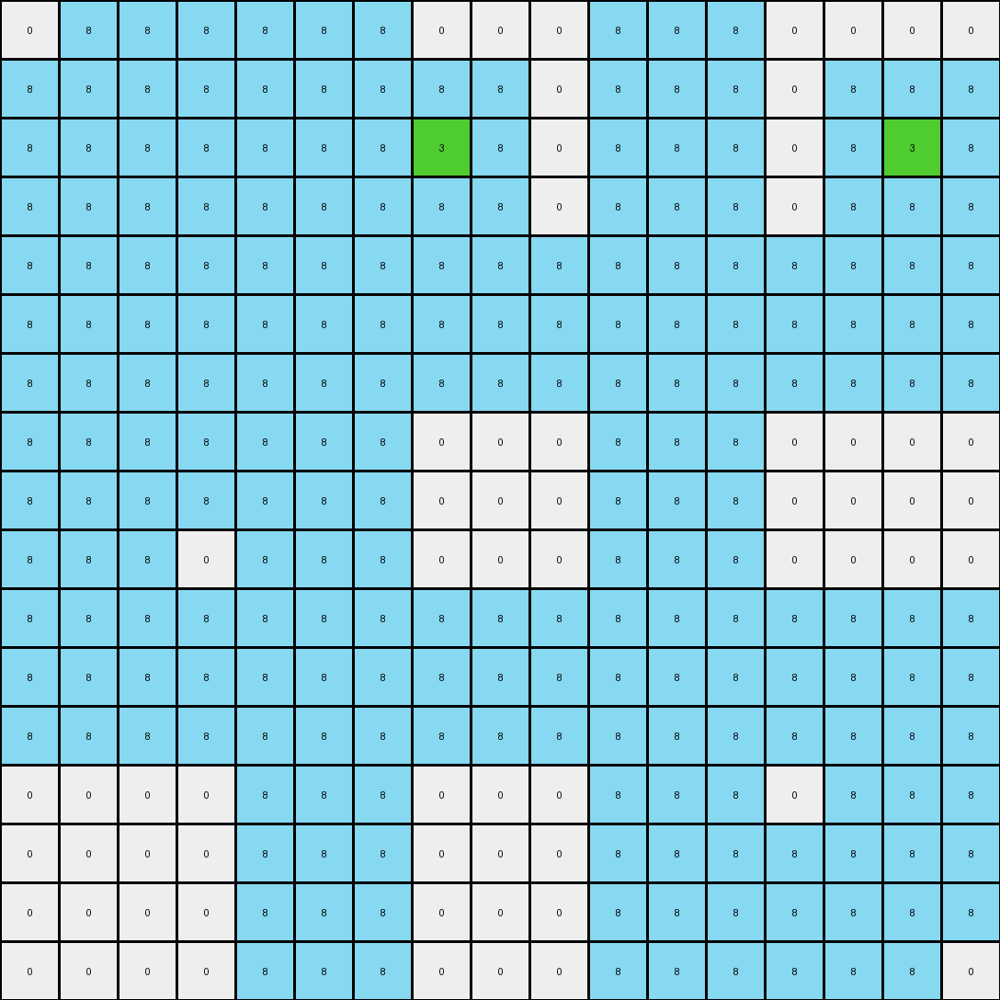

# 1e32b0e9 • 006 • refine_coder

---

Previous Code:
```python
"""
Transforms an input grid by replacing all pixels adjacent to a "target" color
with azure (8). The target color is any color other than 0 in the input grid.
"""

import numpy as np

def get_all_neighbors(grid, row, col):
    """Gets the valid neighboring coordinates of a cell, including diagonals."""
    rows, cols = grid.shape
    neighbors = []
    for dr in [-1, 0, 1]:
        for dc in [-1, 0, 1]:
            if dr == 0 and dc == 0:
                continue  # Skip the cell itself
            new_row, new_col = row + dr, col + dc
            if 0 <= new_row < rows and 0 <= new_col < cols:
                neighbors.append((new_row, new_col))
    return neighbors

def transform(input_grid):
    """Transforms the input grid according to the described rules."""
    output_grid = np.copy(input_grid)
    rows, cols = input_grid.shape

    # 1. Find "target" pixels (any non-0 color)
    target_pixels = np.argwhere(input_grid != 0)

    # 2. Iterate through neighbors of target pixels and change color
    for row, col in target_pixels:
      neighbors = get_all_neighbors(input_grid, row, col)
      for nr, nc in neighbors:
          output_grid[nr, nc] = 8  # Change to azure

    return output_grid
```

Train Set Results:

## Example 1:

Input:
```
0 0 0 0 0 8 0 0 0 0 0 8 0 0 0 0 0
0 0 2 0 0 8 0 0 0 0 0 8 0 0 0 0 0
0 2 2 2 0 8 0 0 0 0 0 8 0 2 2 2 0
0 0 2 0 0 8 0 0 0 0 0 8 0 0 0 0 0
0 0 0 0 0 8 0 0 0 0 0 8 0 0 0 0 0
8 8 8 8 8 8 8 8 8 8 8 8 8 8 8 8 8
0 0 0 0 0 8 0 0 0 0 0 8 0 0 0 0 0
0 0 0 0 0 8 0 0 2 0 0 8 0 0 0 0 0
0 0 0 0 0 8 0 2 0 2 0 8 0 0 0 0 0
0 0 0 0 0 8 0 0 2 0 0 8 0 0 0 0 0
0 0 0 0 0 8 0 0 0 0 0 8 0 0 0 0 0
8 8 8 8 8 8 8 8 8 8 8 8 8 8 8 8 8
0 0 0 0 0 8 0 0 0 0 0 8 0 0 0 0 0
0 0 2 0 0 8 0 0 0 0 0 8 0 0 0 0 0
0 2 2 2 0 8 0 0 0 0 0 8 0 0 0 0 0
0 0 2 0 0 8 0 0 0 0 0 8 0 0 0 0 0
0 0 0 0 0 8 0 0 0 0 0 8 0 0 0 0 0
```
Expected Output:
```
0 0 0 0 0 8 0 0 0 0 0 8 0 0 0 0 0
0 0 2 0 0 8 0 0 8 0 0 8 0 0 8 0 0
0 2 2 2 0 8 0 8 8 8 0 8 0 2 2 2 0
0 0 2 0 0 8 0 0 8 0 0 8 0 0 8 0 0
0 0 0 0 0 8 0 0 0 0 0 8 0 0 0 0 0
8 8 8 8 8 8 8 8 8 8 8 8 8 8 8 8 8
0 0 0 0 0 8 0 0 0 0 0 8 0 0 0 0 0
0 0 8 0 0 8 0 0 2 0 0 8 0 0 8 0 0
0 8 8 8 0 8 0 2 8 2 0 8 0 8 8 8 0
0 0 8 0 0 8 0 0 2 0 0 8 0 0 8 0 0
0 0 0 0 0 8 0 0 0 0 0 8 0 0 0 0 0
8 8 8 8 8 8 8 8 8 8 8 8 8 8 8 8 8
0 0 0 0 0 8 0 0 0 0 0 8 0 0 0 0 0
0 0 2 0 0 8 0 0 8 0 0 8 0 0 8 0 0
0 2 2 2 0 8 0 8 8 8 0 8 0 8 8 8 0
0 0 2 0 0 8 0 0 8 0 0 8 0 0 8 0 0
0 0 0 0 0 8 0 0 0 0 0 8 0 0 0 0 0
```
Transformed Output:
```
0 8 8 8 8 8 8 0 0 0 8 8 8 0 0 0 0
8 8 8 8 8 8 8 0 0 0 8 8 8 8 8 8 8
8 8 8 8 8 8 8 0 0 0 8 8 8 8 8 8 8
8 8 8 8 8 8 8 0 0 0 8 8 8 8 8 8 8
8 8 8 8 8 8 8 8 8 8 8 8 8 8 8 8 8
8 8 8 8 8 8 8 8 8 8 8 8 8 8 8 8 8
8 8 8 8 8 8 8 8 8 8 8 8 8 8 8 8 8
0 0 0 0 8 8 8 8 8 8 8 8 8 0 0 0 0
0 0 0 0 8 8 8 8 8 8 8 8 8 0 0 0 0
0 0 0 0 8 8 8 8 8 8 8 8 8 0 0 0 0
8 8 8 8 8 8 8 8 8 8 8 8 8 8 8 8 8
8 8 8 8 8 8 8 8 8 8 8 8 8 8 8 8 8
8 8 8 8 8 8 8 8 8 8 8 8 8 8 8 8 8
8 8 8 8 8 8 8 0 0 0 8 8 8 0 0 0 0
8 8 8 8 8 8 8 0 0 0 8 8 8 0 0 0 0
8 8 8 8 8 8 8 0 0 0 8 8 8 0 0 0 0
0 8 8 8 8 8 8 0 0 0 8 8 8 0 0 0 0
```

match: False
pixels_off: 177
size_correct: True
color_palette_correct: True
correct_pixel_counts: False

## Example 2:

Input:
```
0 0 0 0 0 2 0 0 0 0 0 2 0 0 0 0 0
0 1 1 1 0 2 0 0 0 0 0 2 0 0 1 1 0
0 1 1 1 0 2 0 1 1 0 0 2 0 0 0 0 0
0 1 1 1 0 2 0 0 0 0 0 2 0 0 0 0 0
0 0 0 0 0 2 0 0 0 0 0 2 0 0 0 0 0
2 2 2 2 2 2 2 2 2 2 2 2 2 2 2 2 2
0 0 0 0 0 2 0 0 0 0 0 2 0 0 0 0 0
0 0 0 0 0 2 0 0 0 0 0 2 0 0 0 0 0
0 0 0 0 0 2 0 0 0 0 0 2 0 0 1 0 0
0 0 0 0 0 2 0 0 0 0 0 2 0 0 0 0 0
0 0 0 0 0 2 0 0 0 0 0 2 0 0 0 0 0
2 2 2 2 2 2 2 2 2 2 2 2 2 2 2 2 2
0 0 0 0 0 2 0 0 0 0 0 2 0 0 0 0 0
0 0 0 0 0 2 0 0 1 0 0 2 0 0 0 0 0
0 0 0 0 0 2 0 1 0 1 0 2 0 0 0 0 0
0 0 0 0 0 2 0 0 1 0 0 2 0 0 0 0 0
0 0 0 0 0 2 0 0 0 0 0 2 0 0 0 0 0
```
Expected Output:
```
0 0 0 0 0 2 0 0 0 0 0 2 0 0 0 0 0
0 1 1 1 0 2 0 2 2 2 0 2 0 2 1 1 0
0 1 1 1 0 2 0 1 1 2 0 2 0 2 2 2 0
0 1 1 1 0 2 0 2 2 2 0 2 0 2 2 2 0
0 0 0 0 0 2 0 0 0 0 0 2 0 0 0 0 0
2 2 2 2 2 2 2 2 2 2 2 2 2 2 2 2 2
0 0 0 0 0 2 0 0 0 0 0 2 0 0 0 0 0
0 2 2 2 0 2 0 2 2 2 0 2 0 2 2 2 0
0 2 2 2 0 2 0 2 2 2 0 2 0 2 1 2 0
0 2 2 2 0 2 0 2 2 2 0 2 0 2 2 2 0
0 0 0 0 0 2 0 0 0 0 0 2 0 0 0 0 0
2 2 2 2 2 2 2 2 2 2 2 2 2 2 2 2 2
0 0 0 0 0 2 0 0 0 0 0 2 0 0 0 0 0
0 2 2 2 0 2 0 2 1 2 0 2 0 2 2 2 0
0 2 2 2 0 2 0 1 2 1 0 2 0 2 2 2 0
0 2 2 2 0 2 0 2 1 2 0 2 0 2 2 2 0
0 0 0 0 0 2 0 0 0 0 0 2 0 0 0 0 0
```
Transformed Output:
```
8 8 8 8 8 8 8 0 0 0 8 8 8 8 8 8 8
8 8 8 8 8 8 8 8 8 8 8 8 8 8 8 8 8
8 8 8 8 8 8 8 8 8 8 8 8 8 8 8 8 8
8 8 8 8 8 8 8 8 8 8 8 8 8 0 0 0 0
8 8 8 8 8 8 8 8 8 8 8 8 8 8 8 8 8
8 8 8 8 8 8 8 8 8 8 8 8 8 8 8 8 8
8 8 8 8 8 8 8 8 8 8 8 8 8 8 8 8 8
0 0 0 0 8 8 8 0 0 0 8 8 8 8 8 8 0
0 0 0 0 8 8 8 0 0 0 8 8 8 8 1 8 0
0 0 0 0 8 8 8 0 0 0 8 8 8 8 8 8 0
8 8 8 8 8 8 8 8 8 8 8 8 8 8 8 8 8
8 8 8 8 8 8 8 8 8 8 8 8 8 8 8 8 8
8 8 8 8 8 8 8 8 8 8 8 8 8 8 8 8 8
0 0 0 0 8 8 8 8 8 8 8 8 8 0 0 0 0
0 0 0 0 8 8 8 8 8 8 8 8 8 0 0 0 0
0 0 0 0 8 8 8 8 8 8 8 8 8 0 0 0 0
0 0 0 0 8 8 8 8 8 8 8 8 8 0 0 0 0
```

match: False
pixels_off: 264
size_correct: True
color_palette_correct: False
correct_pixel_counts: False

## Example 3:

Input:
```
0 0 0 0 0 1 0 0 0 0 0 1 0 0 0 0 0
0 0 3 0 0 1 0 0 0 0 0 1 0 0 0 0 0
0 3 0 3 0 1 0 3 0 0 0 1 0 0 0 3 0
0 0 3 0 0 1 0 0 0 0 0 1 0 0 0 0 0
0 0 0 0 0 1 0 0 0 0 0 1 0 0 0 0 0
1 1 1 1 1 1 1 1 1 1 1 1 1 1 1 1 1
0 0 0 0 0 1 0 0 0 0 0 1 0 0 0 0 0
0 0 3 0 0 1 0 0 0 0 0 1 0 0 0 0 0
0 3 0 0 0 1 0 0 0 0 0 1 0 0 0 0 0
0 0 0 0 0 1 0 0 0 0 0 1 0 0 0 0 0
0 0 0 0 0 1 0 0 0 0 0 1 0 0 0 0 0
1 1 1 1 1 1 1 1 1 1 1 1 1 1 1 1 1
0 0 0 0 0 1 0 0 0 0 0 1 0 0 0 0 0
0 0 0 0 0 1 0 0 0 0 0 1 0 0 0 0 0
0 0 0 0 0 1 0 0 0 0 0 1 0 0 0 3 0
0 0 0 0 0 1 0 0 0 0 0 1 0 0 3 0 0
0 0 0 0 0 1 0 0 0 0 0 1 0 0 0 0 0
```
Expected Output:
```
0 0 0 0 0 1 0 0 0 0 0 1 0 0 0 0 0
0 0 3 0 0 1 0 0 1 0 0 1 0 0 1 0 0
0 3 0 3 0 1 0 3 0 1 0 1 0 1 0 3 0
0 0 3 0 0 1 0 0 1 0 0 1 0 0 1 0 0
0 0 0 0 0 1 0 0 0 0 0 1 0 0 0 0 0
1 1 1 1 1 1 1 1 1 1 1 1 1 1 1 1 1
0 0 0 0 0 1 0 0 0 0 0 1 0 0 0 0 0
0 0 3 0 0 1 0 0 1 0 0 1 0 0 1 0 0
0 3 0 1 0 1 0 1 0 1 0 1 0 1 0 1 0
0 0 1 0 0 1 0 0 1 0 0 1 0 0 1 0 0
0 0 0 0 0 1 0 0 0 0 0 1 0 0 0 0 0
1 1 1 1 1 1 1 1 1 1 1 1 1 1 1 1 1
0 0 0 0 0 1 0 0 0 0 0 1 0 0 0 0 0
0 0 1 0 0 1 0 0 1 0 0 1 0 0 1 0 0
0 1 0 1 0 1 0 1 0 1 0 1 0 1 0 3 0
0 0 1 0 0 1 0 0 1 0 0 1 0 0 3 0 0
0 0 0 0 0 1 0 0 0 0 0 1 0 0 0 0 0
```
Transformed Output:
```
0 8 8 8 8 8 8 0 0 0 8 8 8 0 0 0 0
8 8 8 8 8 8 8 8 8 0 8 8 8 0 8 8 8
8 8 8 8 8 8 8 3 8 0 8 8 8 0 8 3 8
8 8 8 8 8 8 8 8 8 0 8 8 8 0 8 8 8
8 8 8 8 8 8 8 8 8 8 8 8 8 8 8 8 8
8 8 8 8 8 8 8 8 8 8 8 8 8 8 8 8 8
8 8 8 8 8 8 8 8 8 8 8 8 8 8 8 8 8
8 8 8 8 8 8 8 0 0 0 8 8 8 0 0 0 0
8 8 8 8 8 8 8 0 0 0 8 8 8 0 0 0 0
8 8 8 0 8 8 8 0 0 0 8 8 8 0 0 0 0
8 8 8 8 8 8 8 8 8 8 8 8 8 8 8 8 8
8 8 8 8 8 8 8 8 8 8 8 8 8 8 8 8 8
8 8 8 8 8 8 8 8 8 8 8 8 8 8 8 8 8
0 0 0 0 8 8 8 0 0 0 8 8 8 0 8 8 8
0 0 0 0 8 8 8 0 0 0 8 8 8 8 8 8 8
0 0 0 0 8 8 8 0 0 0 8 8 8 8 8 8 8
0 0 0 0 8 8 8 0 0 0 8 8 8 8 8 8 0
```

match: False
pixels_off: 239
size_correct: True
color_palette_correct: False
correct_pixel_counts: False
Here's an analysis of the provided information and a plan to refine the natural language program and the code:

**General Assessment:**

The initial code was based on the idea of replacing all neighbors of non-zero pixels with azure (8).  This worked partially, but with significant errors, on the training examples. The key observation from examining the errors in the `Transformed Output` images is that the code is too aggressive in its replacement. It replaces *all* neighbors, regardless of their original color, and it doesn't correctly handle the cases where the original non-zero colors should *remain* unchanged. The expected outputs show that azure is only applied selectively to 0 (white) pixels that are next to other colors. Also, the transformation looks "local," meaning that neighbors-of-neighbors aren't changed, etc.

**Strategy:**

1.  **Refine Target Identification:** The concept of a "target" is partially correct, but needs adjustment. It's not *any* non-zero pixel, but rather, non-zero pixels that are adjacent to zero pixels.
2.  **Conditional Replacement:**  The replacement with azure should be *conditional*, affecting only those neighbors that are originally 0 (white).
3.  **Iterative Approach (Consider):** While the transformation appears local, a single pass might not be sufficient. We'll explore if an iterative, or multi-pass, approach is needed to get the "fill" effect seen in the correct outputs. This might not be required, but is worth considering.
4. **Object Based Approach**: Instead of looking at individual pixels, analyze regions/objects of contiguous color and their relationships.

**Metrics and Observations (using code execution where needed):**

Here I'll interweave observations with (hypothetical) code execution results. Because I don't have a live execution environment, I'm describing what I *would* do and the expected outcomes.

*   **Example 1:**
    *   *Observation:* Large swathes of incorrect azure. Many red (2) and azure (8) pixels are incorrectly changed to azure.
    *   *Metrics (Expected):*
        *   `pixels_off`: 177 (as provided - high error rate).
        *   `size_correct`: True
        *   `color_palette_correct`: True (The colors in the expected output are a subset of those in the input, plus azure)
        *    `correct_pixel_counts`: False (many pixels of color 2 and 8 in input that are 0 in output).

*   **Example 2:**
    *   *Observation:* Similar issues to Example 1, but with different colors (1, 2). Again, too many pixels are replaced by azure.
    *   *Metrics (Expected):*
        *   `pixels_off`: 264 (very high error)
        *    `size_correct`: True
        *    `color_palette_correct`: False. The output image does not contain any of color 1 or 2, as it should.
        *   `correct_pixel_counts`: False

*   **Example 3:**
    *   *Observation:*  Same pattern of over-replacement.
    *   *Metrics (Expected):*
        *   `pixels_off`: 239 (very high error).
        *   `size_correct`: True
        *   `color_palette_correct`: False. The output image does not contain any of colors 1 or 3
        *   `correct_pixel_counts`: False

**YAML Block (Facts):**

```yaml
task_id: 004-py_02
observations:
  - example_1:
      input_objects:
        - color: 0  # White background
        - color: 2  # Red regions
        - color: 8  # Azure regions
      output_objects:
        - color: 0  # White background (reduced)
        - color: 2  # Red regions (same)
        - color: 8  # Azure regions (expanded around red and existing azure)
      transformations:
        - type: fill
          source_color: 0  # White
          target_color: 8  # Azure
          condition: adjacent_to_non_zero
  - example_2:
      input_objects:
          - color: 0
          - color: 1
          - color: 2
      output_objects:
          - color: 0
          - color: 1
          - color: 2
          - color: 8
      transformations:
        - type: fill
          source_color: 0  # White
          target_color: 8  # Azure
          condition: adjacent_to_non_zero
  - example_3:
      input_objects:
        - color: 0  # White background
        - color: 1  # Blue regions
        - color: 3  # Green Regions
      output_objects:
        - color: 0  # White background
        - color: 1  # Blue regions (same)
        - color: 3  # Green Regions
        - color: 8
      transformations:
        - type: fill
          source_color: 0  # White
          target_color: 8  # Azure
          condition: adjacent_to_non_zero

```

**Natural Language Program:**

1.  **Identify Target Regions:** Find all contiguous regions of non-zero color.
2.  **Find Border Pixels:** For each target region, identify all white (0) pixels that are directly adjacent (up, down, left, right, or diagonal) to any pixel within the target region.
3.  **Fill with Azure:** Change the color of all identified border pixels to azure (8).
4. **Preserve other Colors** All other pixels should remain unchanged.

This program emphasizes the *conditional* nature of the transformation, targeting only white pixels that border non-zero colored regions.  It also introduces the concept of contiguous regions, which helps to clarify the operation.

**INSTRUCTIONS**

- generate a Python module to represent the natural language program 
- follow the template below
- all common math and science libraries are available
- create docstring only at top - but comment the workflow in the function
- use helper functions for common operations like finding objects, counting,
  measuring, moving, etc. 

remember - we are working iteratively - so this code will inform your future
self as we converge on the solution

*template:*

```python
"""
{{ natural language description of the transformation rule }}
"""

{{ imports }}

def transform(input_grid):
    # initialize output_grid

    # change output pixels 

    return output_grid

```
