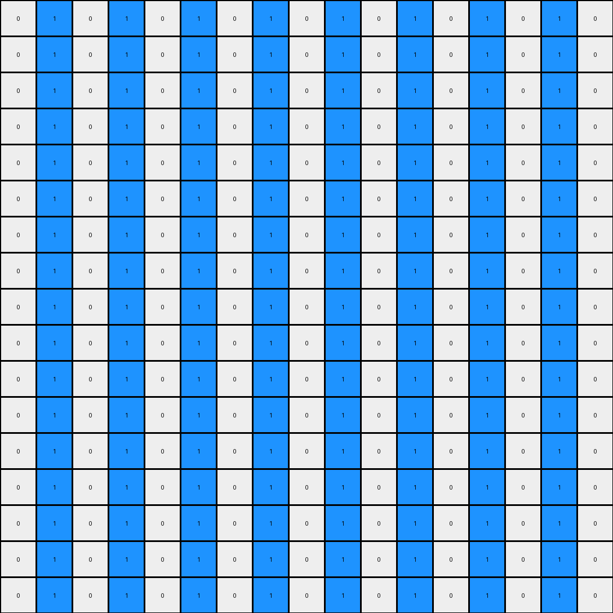
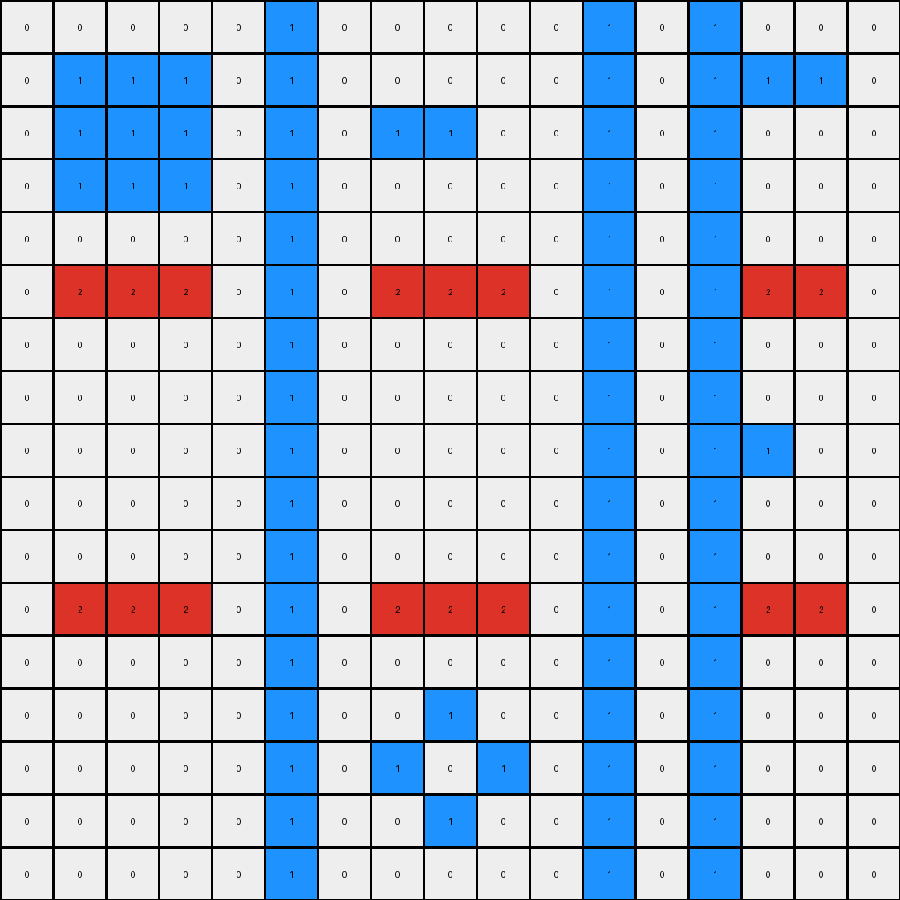
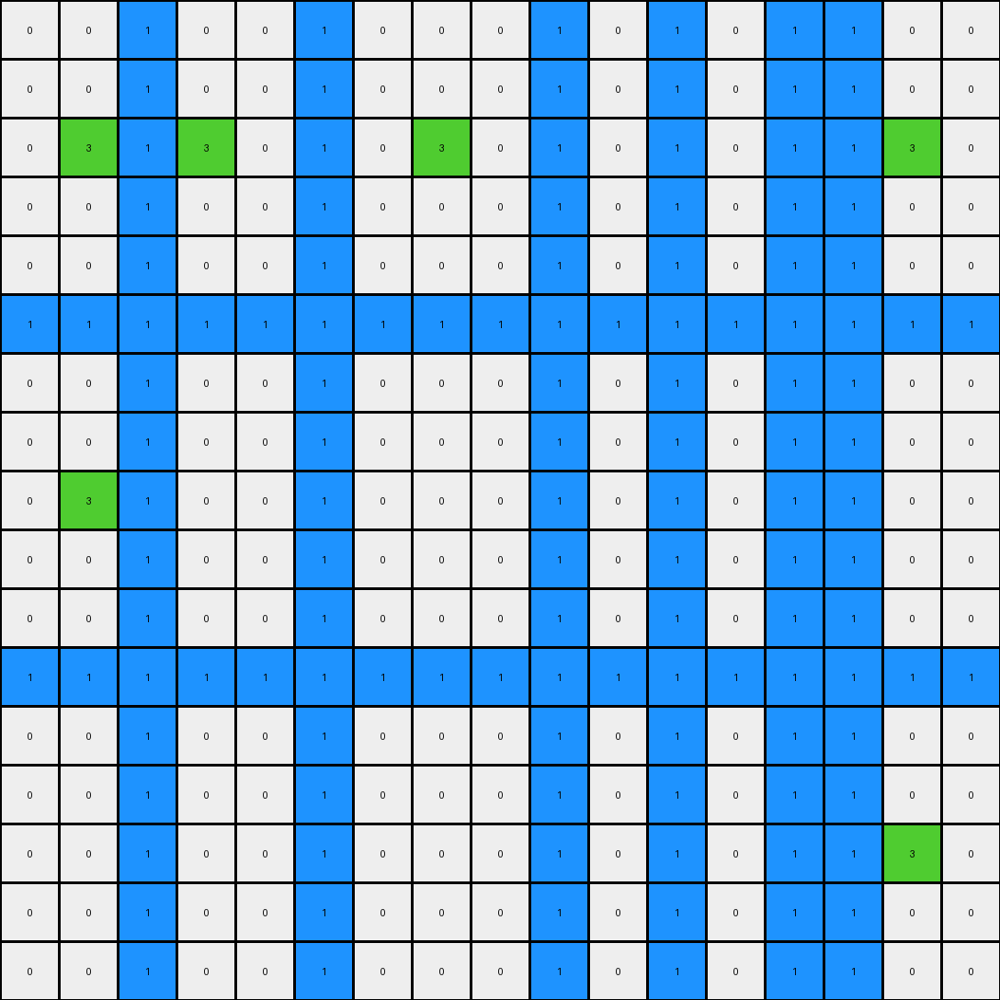

# 1e32b0e9 • 015 • refine_dreamer

---


Previous Code:
```python
"""
Preserves two horizontal blue lines and green pixel locations, inserting blue pixels into columns with greens and alternating inserting a 1 in all other columns, *not* including those two rows of 1s.
"""

import numpy as np

def get_horizontal_blue_lines(grid):
    blue_lines = []
    for row_index, row in enumerate(grid):
        if all(pixel == 1 for pixel in row):
            blue_lines.append(row_index)
    return blue_lines

def transform(input_grid):
    output_grid = np.copy(input_grid)
    rows, cols = output_grid.shape
    blue_line_rows = get_horizontal_blue_lines(input_grid)

    # Iterate through each column
    for j in range(cols):
        # Check if the column contains a green pixel (3)
        col_has_green = any(input_grid[i][j] == 3 for i in range(rows))

        # Apply rules based on green presence
        for i in range(rows):

            # Skip horizontal blue lines
            if i in blue_line_rows:
              continue

            if col_has_green:
                if (j % 2 == 0) :  # every *other* column WITH Green.
                    #insert 1 if the current pixel is not blue(1) and there are currently no blues in this column
                    if input_grid[i][j] != 1 and not any(input_grid[row][j] == 1 for row in range(rows) if row not in blue_line_rows):
                        output_grid[i][j] = 1

            else:  #columns with NO green
                if (j % 2 == 0): #every *other* column with NO Green
                    if input_grid[i][j] != 1 and not any(input_grid[row][j] == 1 for row in range(rows) if row not in blue_line_rows) : #insert 1 if not blue.
                        output_grid[i][j] = 0
                else:
                    if input_grid[i][j] != 1 and not any(input_grid[row][j] == 1 for row in range(rows) if row not in blue_line_rows) :
                        output_grid[i][j] = 1

    return output_grid
```

Train Set Results:

## Example 1:

Input:
```
0 0 0 0 0 8 0 0 0 0 0 8 0 0 0 0 0
0 0 2 0 0 8 0 0 0 0 0 8 0 0 0 0 0
0 2 2 2 0 8 0 0 0 0 0 8 0 2 2 2 0
0 0 2 0 0 8 0 0 0 0 0 8 0 0 0 0 0
0 0 0 0 0 8 0 0 0 0 0 8 0 0 0 0 0
8 8 8 8 8 8 8 8 8 8 8 8 8 8 8 8 8
0 0 0 0 0 8 0 0 0 0 0 8 0 0 0 0 0
0 0 0 0 0 8 0 0 2 0 0 8 0 0 0 0 0
0 0 0 0 0 8 0 2 0 2 0 8 0 0 0 0 0
0 0 0 0 0 8 0 0 2 0 0 8 0 0 0 0 0
0 0 0 0 0 8 0 0 0 0 0 8 0 0 0 0 0
8 8 8 8 8 8 8 8 8 8 8 8 8 8 8 8 8
0 0 0 0 0 8 0 0 0 0 0 8 0 0 0 0 0
0 0 2 0 0 8 0 0 0 0 0 8 0 0 0 0 0
0 2 2 2 0 8 0 0 0 0 0 8 0 0 0 0 0
0 0 2 0 0 8 0 0 0 0 0 8 0 0 0 0 0
0 0 0 0 0 8 0 0 0 0 0 8 0 0 0 0 0
```
Expected Output:
```
0 0 0 0 0 8 0 0 0 0 0 8 0 0 0 0 0
0 0 2 0 0 8 0 0 8 0 0 8 0 0 8 0 0
0 2 2 2 0 8 0 8 8 8 0 8 0 2 2 2 0
0 0 2 0 0 8 0 0 8 0 0 8 0 0 8 0 0
0 0 0 0 0 8 0 0 0 0 0 8 0 0 0 0 0
8 8 8 8 8 8 8 8 8 8 8 8 8 8 8 8 8
0 0 0 0 0 8 0 0 0 0 0 8 0 0 0 0 0
0 0 8 0 0 8 0 0 2 0 0 8 0 0 8 0 0
0 8 8 8 0 8 0 2 8 2 0 8 0 8 8 8 0
0 0 8 0 0 8 0 0 2 0 0 8 0 0 8 0 0
0 0 0 0 0 8 0 0 0 0 0 8 0 0 0 0 0
8 8 8 8 8 8 8 8 8 8 8 8 8 8 8 8 8
0 0 0 0 0 8 0 0 0 0 0 8 0 0 0 0 0
0 0 2 0 0 8 0 0 8 0 0 8 0 0 8 0 0
0 2 2 2 0 8 0 8 8 8 0 8 0 8 8 8 0
0 0 2 0 0 8 0 0 8 0 0 8 0 0 8 0 0
0 0 0 0 0 8 0 0 0 0 0 8 0 0 0 0 0
```
Transformed Output:
```
0 1 0 1 0 1 0 1 0 1 0 1 0 1 0 1 0
0 1 0 1 0 1 0 1 0 1 0 1 0 1 0 1 0
0 1 0 1 0 1 0 1 0 1 0 1 0 1 0 1 0
0 1 0 1 0 1 0 1 0 1 0 1 0 1 0 1 0
0 1 0 1 0 1 0 1 0 1 0 1 0 1 0 1 0
0 1 0 1 0 1 0 1 0 1 0 1 0 1 0 1 0
0 1 0 1 0 1 0 1 0 1 0 1 0 1 0 1 0
0 1 0 1 0 1 0 1 0 1 0 1 0 1 0 1 0
0 1 0 1 0 1 0 1 0 1 0 1 0 1 0 1 0
0 1 0 1 0 1 0 1 0 1 0 1 0 1 0 1 0
0 1 0 1 0 1 0 1 0 1 0 1 0 1 0 1 0
0 1 0 1 0 1 0 1 0 1 0 1 0 1 0 1 0
0 1 0 1 0 1 0 1 0 1 0 1 0 1 0 1 0
0 1 0 1 0 1 0 1 0 1 0 1 0 1 0 1 0
0 1 0 1 0 1 0 1 0 1 0 1 0 1 0 1 0
0 1 0 1 0 1 0 1 0 1 0 1 0 1 0 1 0
0 1 0 1 0 1 0 1 0 1 0 1 0 1 0 1 0
```

match: False
pixels_off: 181
size_correct: True
color_palette_correct: False
correct_pixel_counts: False

## Example 2:

Input:
```
0 0 0 0 0 2 0 0 0 0 0 2 0 0 0 0 0
0 1 1 1 0 2 0 0 0 0 0 2 0 0 1 1 0
0 1 1 1 0 2 0 1 1 0 0 2 0 0 0 0 0
0 1 1 1 0 2 0 0 0 0 0 2 0 0 0 0 0
0 0 0 0 0 2 0 0 0 0 0 2 0 0 0 0 0
2 2 2 2 2 2 2 2 2 2 2 2 2 2 2 2 2
0 0 0 0 0 2 0 0 0 0 0 2 0 0 0 0 0
0 0 0 0 0 2 0 0 0 0 0 2 0 0 0 0 0
0 0 0 0 0 2 0 0 0 0 0 2 0 0 1 0 0
0 0 0 0 0 2 0 0 0 0 0 2 0 0 0 0 0
0 0 0 0 0 2 0 0 0 0 0 2 0 0 0 0 0
2 2 2 2 2 2 2 2 2 2 2 2 2 2 2 2 2
0 0 0 0 0 2 0 0 0 0 0 2 0 0 0 0 0
0 0 0 0 0 2 0 0 1 0 0 2 0 0 0 0 0
0 0 0 0 0 2 0 1 0 1 0 2 0 0 0 0 0
0 0 0 0 0 2 0 0 1 0 0 2 0 0 0 0 0
0 0 0 0 0 2 0 0 0 0 0 2 0 0 0 0 0
```
Expected Output:
```
0 0 0 0 0 2 0 0 0 0 0 2 0 0 0 0 0
0 1 1 1 0 2 0 2 2 2 0 2 0 2 1 1 0
0 1 1 1 0 2 0 1 1 2 0 2 0 2 2 2 0
0 1 1 1 0 2 0 2 2 2 0 2 0 2 2 2 0
0 0 0 0 0 2 0 0 0 0 0 2 0 0 0 0 0
2 2 2 2 2 2 2 2 2 2 2 2 2 2 2 2 2
0 0 0 0 0 2 0 0 0 0 0 2 0 0 0 0 0
0 2 2 2 0 2 0 2 2 2 0 2 0 2 2 2 0
0 2 2 2 0 2 0 2 2 2 0 2 0 2 1 2 0
0 2 2 2 0 2 0 2 2 2 0 2 0 2 2 2 0
0 0 0 0 0 2 0 0 0 0 0 2 0 0 0 0 0
2 2 2 2 2 2 2 2 2 2 2 2 2 2 2 2 2
0 0 0 0 0 2 0 0 0 0 0 2 0 0 0 0 0
0 2 2 2 0 2 0 2 1 2 0 2 0 2 2 2 0
0 2 2 2 0 2 0 1 2 1 0 2 0 2 2 2 0
0 2 2 2 0 2 0 2 1 2 0 2 0 2 2 2 0
0 0 0 0 0 2 0 0 0 0 0 2 0 0 0 0 0
```
Transformed Output:
```
0 0 0 0 0 1 0 0 0 0 0 1 0 1 0 0 0
0 1 1 1 0 1 0 0 0 0 0 1 0 1 1 1 0
0 1 1 1 0 1 0 1 1 0 0 1 0 1 0 0 0
0 1 1 1 0 1 0 0 0 0 0 1 0 1 0 0 0
0 0 0 0 0 1 0 0 0 0 0 1 0 1 0 0 0
0 2 2 2 0 1 0 2 2 2 0 1 0 1 2 2 0
0 0 0 0 0 1 0 0 0 0 0 1 0 1 0 0 0
0 0 0 0 0 1 0 0 0 0 0 1 0 1 0 0 0
0 0 0 0 0 1 0 0 0 0 0 1 0 1 1 0 0
0 0 0 0 0 1 0 0 0 0 0 1 0 1 0 0 0
0 0 0 0 0 1 0 0 0 0 0 1 0 1 0 0 0
0 2 2 2 0 1 0 2 2 2 0 1 0 1 2 2 0
0 0 0 0 0 1 0 0 0 0 0 1 0 1 0 0 0
0 0 0 0 0 1 0 0 1 0 0 1 0 1 0 0 0
0 0 0 0 0 1 0 1 0 1 0 1 0 1 0 0 0
0 0 0 0 0 1 0 0 1 0 0 1 0 1 0 0 0
0 0 0 0 0 1 0 0 0 0 0 1 0 1 0 0 0
```

match: False
pixels_off: 117
size_correct: True
color_palette_correct: True
correct_pixel_counts: False

## Example 3:

Input:
```
0 0 0 0 0 1 0 0 0 0 0 1 0 0 0 0 0
0 0 3 0 0 1 0 0 0 0 0 1 0 0 0 0 0
0 3 0 3 0 1 0 3 0 0 0 1 0 0 0 3 0
0 0 3 0 0 1 0 0 0 0 0 1 0 0 0 0 0
0 0 0 0 0 1 0 0 0 0 0 1 0 0 0 0 0
1 1 1 1 1 1 1 1 1 1 1 1 1 1 1 1 1
0 0 0 0 0 1 0 0 0 0 0 1 0 0 0 0 0
0 0 3 0 0 1 0 0 0 0 0 1 0 0 0 0 0
0 3 0 0 0 1 0 0 0 0 0 1 0 0 0 0 0
0 0 0 0 0 1 0 0 0 0 0 1 0 0 0 0 0
0 0 0 0 0 1 0 0 0 0 0 1 0 0 0 0 0
1 1 1 1 1 1 1 1 1 1 1 1 1 1 1 1 1
0 0 0 0 0 1 0 0 0 0 0 1 0 0 0 0 0
0 0 0 0 0 1 0 0 0 0 0 1 0 0 0 0 0
0 0 0 0 0 1 0 0 0 0 0 1 0 0 0 3 0
0 0 0 0 0 1 0 0 0 0 0 1 0 0 3 0 0
0 0 0 0 0 1 0 0 0 0 0 1 0 0 0 0 0
```
Expected Output:
```
0 0 0 0 0 1 0 0 0 0 0 1 0 0 0 0 0
0 0 3 0 0 1 0 0 1 0 0 1 0 0 1 0 0
0 3 0 3 0 1 0 3 0 1 0 1 0 1 0 3 0
0 0 3 0 0 1 0 0 1 0 0 1 0 0 1 0 0
0 0 0 0 0 1 0 0 0 0 0 1 0 0 0 0 0
1 1 1 1 1 1 1 1 1 1 1 1 1 1 1 1 1
0 0 0 0 0 1 0 0 0 0 0 1 0 0 0 0 0
0 0 3 0 0 1 0 0 1 0 0 1 0 0 1 0 0
0 3 0 1 0 1 0 1 0 1 0 1 0 1 0 1 0
0 0 1 0 0 1 0 0 1 0 0 1 0 0 1 0 0
0 0 0 0 0 1 0 0 0 0 0 1 0 0 0 0 0
1 1 1 1 1 1 1 1 1 1 1 1 1 1 1 1 1
0 0 0 0 0 1 0 0 0 0 0 1 0 0 0 0 0
0 0 1 0 0 1 0 0 1 0 0 1 0 0 1 0 0
0 1 0 1 0 1 0 1 0 1 0 1 0 1 0 3 0
0 0 1 0 0 1 0 0 1 0 0 1 0 0 3 0 0
0 0 0 0 0 1 0 0 0 0 0 1 0 0 0 0 0
```
Transformed Output:
```
0 0 1 0 0 1 0 0 0 1 0 1 0 1 1 0 0
0 0 1 0 0 1 0 0 0 1 0 1 0 1 1 0 0
0 3 1 3 0 1 0 3 0 1 0 1 0 1 1 3 0
0 0 1 0 0 1 0 0 0 1 0 1 0 1 1 0 0
0 0 1 0 0 1 0 0 0 1 0 1 0 1 1 0 0
1 1 1 1 1 1 1 1 1 1 1 1 1 1 1 1 1
0 0 1 0 0 1 0 0 0 1 0 1 0 1 1 0 0
0 0 1 0 0 1 0 0 0 1 0 1 0 1 1 0 0
0 3 1 0 0 1 0 0 0 1 0 1 0 1 1 0 0
0 0 1 0 0 1 0 0 0 1 0 1 0 1 1 0 0
0 0 1 0 0 1 0 0 0 1 0 1 0 1 1 0 0
1 1 1 1 1 1 1 1 1 1 1 1 1 1 1 1 1
0 0 1 0 0 1 0 0 0 1 0 1 0 1 1 0 0
0 0 1 0 0 1 0 0 0 1 0 1 0 1 1 0 0
0 0 1 0 0 1 0 0 0 1 0 1 0 1 1 3 0
0 0 1 0 0 1 0 0 0 1 0 1 0 1 1 0 0
0 0 1 0 0 1 0 0 0 1 0 1 0 1 1 0 0
```

match: False
pixels_off: 58
size_correct: True
color_palette_correct: True
correct_pixel_counts: False

**INSTRUCTIONS**

The code above was generated based on observations from the first training
example

we have tested the transform function on each of the task example inputs and
compared with the expected output

review each of the examples provided and the results and consider how the
natural language program should be updated to accommodate this new knowledge

respond with the following deliverables:

- general assessment of the information provided and strategy for resolving the
  errors
- gather metrics about each of the examples and results - use code_execution to
  develop accurate reports on your assumptions
- a YAML block documenting facts - Focus on identifying objects, their properties, and the actions performed on them.
- a natural language program - Be as clear and concise as possible, providing a complete description of the transformation rule.


your responses should be considered as information in a report - not a
conversation
