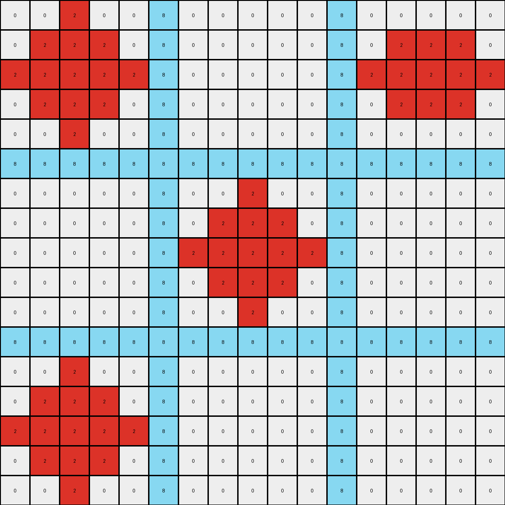

# 1e32b0e9 • 018 • refine_coder

---

Previous Code:
```python
"""
Preserves two complete horizontal lines of a single color, copies any unique colored pixels to their original location and fills adjacent areas of unique color pixels of the same color, except for preserved lines.
"""

import numpy as np

def get_horizontal_lines(grid):
    lines = []
    for row_index, row in enumerate(grid):
        first_pixel = row[0]
        if all(pixel == first_pixel for pixel in row) and first_pixel != 0:
            lines.append((row_index, first_pixel))
    return lines

def get_unique_color_pixels(grid, preserved_color):
    rows, cols = grid.shape
    color_counts = {}
    pixel_locations = {}

    for r in range(rows):
        for c in range(cols):
            color = grid[r, c]
            if color != 0 and color != preserved_color:
                if color not in color_counts:
                    color_counts[color] = 0
                    pixel_locations[color] = []
                color_counts[color] += 1
                pixel_locations[color].append((r, c))

    unique_pixels = {}
    for color, count in color_counts.items():
       if count > 0: # Just get colors that exist
         unique_pixels[color] = pixel_locations[color]
    return unique_pixels

def transform(input_grid):
    # Initialize output grid
    output_grid = np.copy(input_grid)
    rows, cols = output_grid.shape

    # Preserve horizontal lines
    horizontal_lines = get_horizontal_lines(input_grid)
    if len(horizontal_lines) == 2:
        preserved_row1, color1 = horizontal_lines[0]
        preserved_row2, color2 = horizontal_lines[1]

        # Ensure they are same
        if color1 != color2:
          return input_grid # Not a valid task

        preserved_color = color1

        # if they aren't the same color - return input, since this isn't
        # something our algorithm will handle

        for c in range(cols):
          output_grid[preserved_row1, c] = preserved_color
          output_grid[preserved_row2, c] = preserved_color
    else:
        return input_grid # Not a valid task

    # Get Unique Pixels
    unique_color_pixels = get_unique_color_pixels(input_grid, preserved_color)

    # Preserve unique color pixels, and Fill Rule
    for color, locations in unique_color_pixels.items():
        for r, c in locations:
            output_grid[r, c] = color # Preserve

            # Fill adjacent cells with same color
            neighbors = [(r-1, c), (r+1, c), (r, c-1), (r, c+1)]
            for nr, nc in neighbors:
                if 0 <= nr < rows and 0 <= nc < cols:
                    if nr != preserved_row1 and nr != preserved_row2:
                      if output_grid[nr, nc] == 0:
                        output_grid[nr, nc] = color

    return output_grid
```

Train Set Results:

## Example 1:

Input:
```
0 0 0 0 0 8 0 0 0 0 0 8 0 0 0 0 0
0 0 2 0 0 8 0 0 0 0 0 8 0 0 0 0 0
0 2 2 2 0 8 0 0 0 0 0 8 0 2 2 2 0
0 0 2 0 0 8 0 0 0 0 0 8 0 0 0 0 0
0 0 0 0 0 8 0 0 0 0 0 8 0 0 0 0 0
8 8 8 8 8 8 8 8 8 8 8 8 8 8 8 8 8
0 0 0 0 0 8 0 0 0 0 0 8 0 0 0 0 0
0 0 0 0 0 8 0 0 2 0 0 8 0 0 0 0 0
0 0 0 0 0 8 0 2 0 2 0 8 0 0 0 0 0
0 0 0 0 0 8 0 0 2 0 0 8 0 0 0 0 0
0 0 0 0 0 8 0 0 0 0 0 8 0 0 0 0 0
8 8 8 8 8 8 8 8 8 8 8 8 8 8 8 8 8
0 0 0 0 0 8 0 0 0 0 0 8 0 0 0 0 0
0 0 2 0 0 8 0 0 0 0 0 8 0 0 0 0 0
0 2 2 2 0 8 0 0 0 0 0 8 0 0 0 0 0
0 0 2 0 0 8 0 0 0 0 0 8 0 0 0 0 0
0 0 0 0 0 8 0 0 0 0 0 8 0 0 0 0 0
```
Expected Output:
```
0 0 0 0 0 8 0 0 0 0 0 8 0 0 0 0 0
0 0 2 0 0 8 0 0 8 0 0 8 0 0 8 0 0
0 2 2 2 0 8 0 8 8 8 0 8 0 2 2 2 0
0 0 2 0 0 8 0 0 8 0 0 8 0 0 8 0 0
0 0 0 0 0 8 0 0 0 0 0 8 0 0 0 0 0
8 8 8 8 8 8 8 8 8 8 8 8 8 8 8 8 8
0 0 0 0 0 8 0 0 0 0 0 8 0 0 0 0 0
0 0 8 0 0 8 0 0 2 0 0 8 0 0 8 0 0
0 8 8 8 0 8 0 2 8 2 0 8 0 8 8 8 0
0 0 8 0 0 8 0 0 2 0 0 8 0 0 8 0 0
0 0 0 0 0 8 0 0 0 0 0 8 0 0 0 0 0
8 8 8 8 8 8 8 8 8 8 8 8 8 8 8 8 8
0 0 0 0 0 8 0 0 0 0 0 8 0 0 0 0 0
0 0 2 0 0 8 0 0 8 0 0 8 0 0 8 0 0
0 2 2 2 0 8 0 8 8 8 0 8 0 8 8 8 0
0 0 2 0 0 8 0 0 8 0 0 8 0 0 8 0 0
0 0 0 0 0 8 0 0 0 0 0 8 0 0 0 0 0
```
Transformed Output:
```
0 0 2 0 0 8 0 0 0 0 0 8 0 0 0 0 0
0 2 2 2 0 8 0 0 0 0 0 8 0 2 2 2 0
2 2 2 2 2 8 0 0 0 0 0 8 2 2 2 2 2
0 2 2 2 0 8 0 0 0 0 0 8 0 2 2 2 0
0 0 2 0 0 8 0 0 0 0 0 8 0 0 0 0 0
8 8 8 8 8 8 8 8 8 8 8 8 8 8 8 8 8
0 0 0 0 0 8 0 0 2 0 0 8 0 0 0 0 0
0 0 0 0 0 8 0 2 2 2 0 8 0 0 0 0 0
0 0 0 0 0 8 2 2 2 2 2 8 0 0 0 0 0
0 0 0 0 0 8 0 2 2 2 0 8 0 0 0 0 0
0 0 0 0 0 8 0 0 2 0 0 8 0 0 0 0 0
8 8 8 8 8 8 8 8 8 8 8 8 8 8 8 8 8
0 0 2 0 0 8 0 0 0 0 0 8 0 0 0 0 0
0 2 2 2 0 8 0 0 0 0 0 8 0 0 0 0 0
2 2 2 2 2 8 0 0 0 0 0 8 0 0 0 0 0
0 2 2 2 0 8 0 0 0 0 0 8 0 0 0 0 0
0 0 2 0 0 8 0 0 0 0 0 8 0 0 0 0 0
```

match: False
pixels_off: 58
size_correct: True
color_palette_correct: True
correct_pixel_counts: False

## Example 2:

Input:
```
0 0 0 0 0 2 0 0 0 0 0 2 0 0 0 0 0
0 1 1 1 0 2 0 0 0 0 0 2 0 0 1 1 0
0 1 1 1 0 2 0 1 1 0 0 2 0 0 0 0 0
0 1 1 1 0 2 0 0 0 0 0 2 0 0 0 0 0
0 0 0 0 0 2 0 0 0 0 0 2 0 0 0 0 0
2 2 2 2 2 2 2 2 2 2 2 2 2 2 2 2 2
0 0 0 0 0 2 0 0 0 0 0 2 0 0 0 0 0
0 0 0 0 0 2 0 0 0 0 0 2 0 0 0 0 0
0 0 0 0 0 2 0 0 0 0 0 2 0 0 1 0 0
0 0 0 0 0 2 0 0 0 0 0 2 0 0 0 0 0
0 0 0 0 0 2 0 0 0 0 0 2 0 0 0 0 0
2 2 2 2 2 2 2 2 2 2 2 2 2 2 2 2 2
0 0 0 0 0 2 0 0 0 0 0 2 0 0 0 0 0
0 0 0 0 0 2 0 0 1 0 0 2 0 0 0 0 0
0 0 0 0 0 2 0 1 0 1 0 2 0 0 0 0 0
0 0 0 0 0 2 0 0 1 0 0 2 0 0 0 0 0
0 0 0 0 0 2 0 0 0 0 0 2 0 0 0 0 0
```
Expected Output:
```
0 0 0 0 0 2 0 0 0 0 0 2 0 0 0 0 0
0 1 1 1 0 2 0 2 2 2 0 2 0 2 1 1 0
0 1 1 1 0 2 0 1 1 2 0 2 0 2 2 2 0
0 1 1 1 0 2 0 2 2 2 0 2 0 2 2 2 0
0 0 0 0 0 2 0 0 0 0 0 2 0 0 0 0 0
2 2 2 2 2 2 2 2 2 2 2 2 2 2 2 2 2
0 0 0 0 0 2 0 0 0 0 0 2 0 0 0 0 0
0 2 2 2 0 2 0 2 2 2 0 2 0 2 2 2 0
0 2 2 2 0 2 0 2 2 2 0 2 0 2 1 2 0
0 2 2 2 0 2 0 2 2 2 0 2 0 2 2 2 0
0 0 0 0 0 2 0 0 0 0 0 2 0 0 0 0 0
2 2 2 2 2 2 2 2 2 2 2 2 2 2 2 2 2
0 0 0 0 0 2 0 0 0 0 0 2 0 0 0 0 0
0 2 2 2 0 2 0 2 1 2 0 2 0 2 2 2 0
0 2 2 2 0 2 0 1 2 1 0 2 0 2 2 2 0
0 2 2 2 0 2 0 2 1 2 0 2 0 2 2 2 0
0 0 0 0 0 2 0 0 0 0 0 2 0 0 0 0 0
```
Transformed Output:
```
0 1 1 1 0 2 0 0 0 0 0 2 0 0 1 1 0
1 1 1 1 1 2 0 1 1 0 0 2 0 1 1 1 1
1 1 1 1 1 2 1 1 1 1 0 2 0 0 1 1 0
1 1 1 1 1 2 0 1 1 0 0 2 0 0 0 0 0
0 1 1 1 0 2 0 0 0 0 0 2 0 0 0 0 0
2 2 2 2 2 2 2 2 2 2 2 2 2 2 2 2 2
0 0 0 0 0 2 0 0 0 0 0 2 0 0 0 0 0
0 0 0 0 0 2 0 0 0 0 0 2 0 0 1 0 0
0 0 0 0 0 2 0 0 0 0 0 2 0 1 1 1 0
0 0 0 0 0 2 0 0 0 0 0 2 0 0 1 0 0
0 0 0 0 0 2 0 0 0 0 0 2 0 0 0 0 0
2 2 2 2 2 2 2 2 2 2 2 2 2 2 2 2 2
0 0 0 0 0 2 0 0 1 0 0 2 0 0 0 0 0
0 0 0 0 0 2 0 1 1 1 0 2 0 0 0 0 0
0 0 0 0 0 2 1 1 1 1 1 2 0 0 0 0 0
0 0 0 0 0 2 0 1 1 1 0 2 0 0 0 0 0
0 0 0 0 0 2 0 0 1 0 0 2 0 0 0 0 0
```

match: False
pixels_off: 83
size_correct: True
color_palette_correct: True
correct_pixel_counts: False

## Example 3:

Input:
```
0 0 0 0 0 1 0 0 0 0 0 1 0 0 0 0 0
0 0 3 0 0 1 0 0 0 0 0 1 0 0 0 0 0
0 3 0 3 0 1 0 3 0 0 0 1 0 0 0 3 0
0 0 3 0 0 1 0 0 0 0 0 1 0 0 0 0 0
0 0 0 0 0 1 0 0 0 0 0 1 0 0 0 0 0
1 1 1 1 1 1 1 1 1 1 1 1 1 1 1 1 1
0 0 0 0 0 1 0 0 0 0 0 1 0 0 0 0 0
0 0 3 0 0 1 0 0 0 0 0 1 0 0 0 0 0
0 3 0 0 0 1 0 0 0 0 0 1 0 0 0 0 0
0 0 0 0 0 1 0 0 0 0 0 1 0 0 0 0 0
0 0 0 0 0 1 0 0 0 0 0 1 0 0 0 0 0
1 1 1 1 1 1 1 1 1 1 1 1 1 1 1 1 1
0 0 0 0 0 1 0 0 0 0 0 1 0 0 0 0 0
0 0 0 0 0 1 0 0 0 0 0 1 0 0 0 0 0
0 0 0 0 0 1 0 0 0 0 0 1 0 0 0 3 0
0 0 0 0 0 1 0 0 0 0 0 1 0 0 3 0 0
0 0 0 0 0 1 0 0 0 0 0 1 0 0 0 0 0
```
Expected Output:
```
0 0 0 0 0 1 0 0 0 0 0 1 0 0 0 0 0
0 0 3 0 0 1 0 0 1 0 0 1 0 0 1 0 0
0 3 0 3 0 1 0 3 0 1 0 1 0 1 0 3 0
0 0 3 0 0 1 0 0 1 0 0 1 0 0 1 0 0
0 0 0 0 0 1 0 0 0 0 0 1 0 0 0 0 0
1 1 1 1 1 1 1 1 1 1 1 1 1 1 1 1 1
0 0 0 0 0 1 0 0 0 0 0 1 0 0 0 0 0
0 0 3 0 0 1 0 0 1 0 0 1 0 0 1 0 0
0 3 0 1 0 1 0 1 0 1 0 1 0 1 0 1 0
0 0 1 0 0 1 0 0 1 0 0 1 0 0 1 0 0
0 0 0 0 0 1 0 0 0 0 0 1 0 0 0 0 0
1 1 1 1 1 1 1 1 1 1 1 1 1 1 1 1 1
0 0 0 0 0 1 0 0 0 0 0 1 0 0 0 0 0
0 0 1 0 0 1 0 0 1 0 0 1 0 0 1 0 0
0 1 0 1 0 1 0 1 0 1 0 1 0 1 0 3 0
0 0 1 0 0 1 0 0 1 0 0 1 0 0 3 0 0
0 0 0 0 0 1 0 0 0 0 0 1 0 0 0 0 0
```
Transformed Output:
```
0 0 3 0 0 1 0 0 0 0 0 1 0 0 0 0 0
0 3 3 3 0 1 0 3 0 0 0 1 0 0 0 3 0
3 3 3 3 3 1 3 3 3 0 0 1 0 0 3 3 3
0 3 3 3 0 1 0 3 0 0 0 1 0 0 0 3 0
0 0 3 0 0 1 0 0 0 0 0 1 0 0 0 0 0
1 1 1 1 1 1 1 1 1 1 1 1 1 1 1 1 1
0 0 3 0 0 1 0 0 0 0 0 1 0 0 0 0 0
0 3 3 3 0 1 0 0 0 0 0 1 0 0 0 0 0
3 3 3 0 0 1 0 0 0 0 0 1 0 0 0 0 0
0 3 0 0 0 1 0 0 0 0 0 1 0 0 0 0 0
0 0 0 0 0 1 0 0 0 0 0 1 0 0 0 0 0
1 1 1 1 1 1 1 1 1 1 1 1 1 1 1 1 1
0 0 0 0 0 1 0 0 0 0 0 1 0 0 0 0 0
0 0 0 0 0 1 0 0 0 0 0 1 0 0 0 3 0
0 0 0 0 0 1 0 0 0 0 0 1 0 0 3 3 3
0 0 0 0 0 1 0 0 0 0 0 1 0 3 3 3 0
0 0 0 0 0 1 0 0 0 0 0 1 0 0 3 0 0
```

match: False
pixels_off: 55
size_correct: True
color_palette_correct: True
correct_pixel_counts: False
Okay, let's analyze the results and update the natural language program.

**General Assessment:**

The current code is based on preserving two horizontal lines of the same color and filling areas adjacent to unique colored pixels. This approach clearly fails in all three examples, as evidenced by the high number of `pixels_off`. The filling logic also appears to be too aggressive and uncontrolled, leading to large areas of incorrect colors. The strategy needs to shift from simply preserving lines and filling, to a more sophisticated understanding of the relationships between objects and their positions. The core issue seems to be an incorrect interpretation of the filling rule: it's not just about filling adjacent to any unique color, but filling based on a combination of a 'line' concept, unique color, and proximity. In example two, diagonal neighbors are treated differently.

**Strategy for Resolving Errors:**

1.  **Re-examine the Filling Rule:** The current fill logic is too broad. We need to consider:
    *   **Connectivity:** Filling should likely be restricted to 4-connectivity (up, down, left, right) and not 8.
    *   **Context:** Filling seems to be related to extending the colors from the single-pixel-wide, colored lines.
    *   **Boundaries:** What stops the fill? It seems the fill is bounded by different colors and the edges of the grid.

2.  **Consider Line Properties:** It does not seem to matter that the lines are
    solid colors. It is more important that there are two lines.
    The color and location may matter.

3.  **Unique Colors are Important:** The code correctly determined which
    colors should be preserved and the ones that do not appear on the output
    (black in these examples.)

**Metrics and Observations (Example-Specific):**
I will describe what I observe, then provide yaml.

*   **Example 1:**
    *   There are two azure (8) lines.
    *   Unique colors are red (2) and azure (8).
    *   The red (2) pixels form horizontal lines.
    *   The filling of color 8 happens around each 8, except on rows with the
        full line.

*   **Example 2:**
    *   There are two red (2) lines.
    *   Unique colors are red (2) and blue (1).
    *   The blue pixels are where the fill boundaries will be.
    *   The red pixels in the line become the fill color.

*   **Example 3:**
    *   There are two blue (1) lines.
    *   Unique colors are blue(1) and green (3).
    *   The green pixels are where the fill boundaries will be.
    *   The filling only extends from single pixel wide lines, of any length 1
        or greater, to boundary.

**YAML Block (Facts):**

```yaml
example_1:
  objects:
    - type: horizontal_line
      color: 8
      rows: [5, 11]
    - type: unique_pixels
      color: 2
      locations: [[1,2], [2,1], [2,2], [2,3], [3,2], [7,8], [8,7], [8,8], [8,9], [9,8], [13, 2], [14, 1], [14, 2], [14, 3], [15, 2]]
    - type: unique_pixels
      color: 8
      locations: [[0,5],[0,10], [1,5],[1,10], [2,5],[2,10], [3,5],[3,10],[4,5],[4,10],[6,5],[6,10],[7,5],[7,10],[8,5],[8,10],[9,5],[9,10],[10,5],[10,10],[12,5],[12,10],[13,5],[13,10],[14,5],[14,10],[15,5],[15,10],[16,5],[16,10]]
  transformation:
    - preserve_lines: 8
    - extend_unique_colors: [2, 8]
    - fill_rule: 4-connectivity
example_2:
  objects:
    - type: horizontal_line
      color: 2
      rows: [5, 11]
    - type: unique_pixels
      color: 1
      locations:  [[1,1], [1,2], [1,3], [2,1], [2,2], [2,3], [2,7], [2,8], [3,1], [3,2], [3,3],[8,14], [13,8], [14,7], [14,8], [14,9], [15,7], [15,8], [15,9]]
    - type: unique_pixels
      color: 2
      locations: [[0,5],[0,10], [1,5],[1,10], [2,5],[2,10], [3,5],[3,10],[4,5],[4,10],[6,5],[6,10],[7,5],[7,10],[8,5],[8,10],[9,5],[9,10],[10,5],[10,10],[12,5],[12,10],[13,5],[13,10],[14,5],[14,10],[15,5],[15,10],[16,5],[16,10]]

  transformation:
    - preserve_lines: 2
    - extend_unique_colors: [1, 2]
    - fill_rule: 4-connectivity
example_3:
  objects:
    - type: horizontal_line
      color: 1
      rows: [5, 11]
    - type: unique_pixels
      color: 1
      locations: [[0,5],[0,10], [1,5],[1,10], [2,5],[2,10], [3,5],[3,10],[4,5],[4,10],[6,5],[6,10],[7,5],[7,10],[8,5],[8,10],[9,5],[9,10],[10,5],[10,10],[12,5],[12,10],[13,5],[13,10],[14,5],[14,10],[15,5],[15,10],[16,5],[16,10]]
    - type: unique_pixels
      color: 3
      locations:  [[1,2], [2,1], [2,3], [3,2], [7,2], [8,1], [14,15], [15,14]]

  transformation:
    - preserve_lines: 1
    - extend_unique_colors: [1, 3]
    - fill_rule: 4-connectivity

```

**Natural Language Program:**

1.  **Identify Horizontal Lines:** Find two complete horizontal lines of the *same* color within the input grid. If less than 2 lines, exit and return input
2.  **Identify Unique Colors:** Except for the line color, identify unique colors within the grid that occur one or more times
3.  **Preserve:** The horizontal lines remain unchanged.
4.  **Extend Unique Colors:** The unique colors should persist from input to output.
5. **Fill:** For all colors that appear on the same line, extend pixels of that color using 4-connectivity (up, down, left, right) until encountering a boundary (edge of grid or a different color). The fill should not extend through diagonal connections. Do not extend colors across the complete preserved lines.

**INSTRUCTIONS**

- generate a Python module to represent the natural language program 
- follow the template below
- all common math and science libraries are available
- create docstring only at top - but comment the workflow in the function
- use helper functions for common operations like finding objects, counting,
  measuring, moving, etc. 

remember - we are working iteratively - so this code will inform your future
self as we converge on the solution

*template:*

```python
"""
{{ natural language description of the transformation rule }}
"""

{{ imports }}

def transform(input_grid):
    # initialize output_grid

    # change output pixels 

    return output_grid

```
