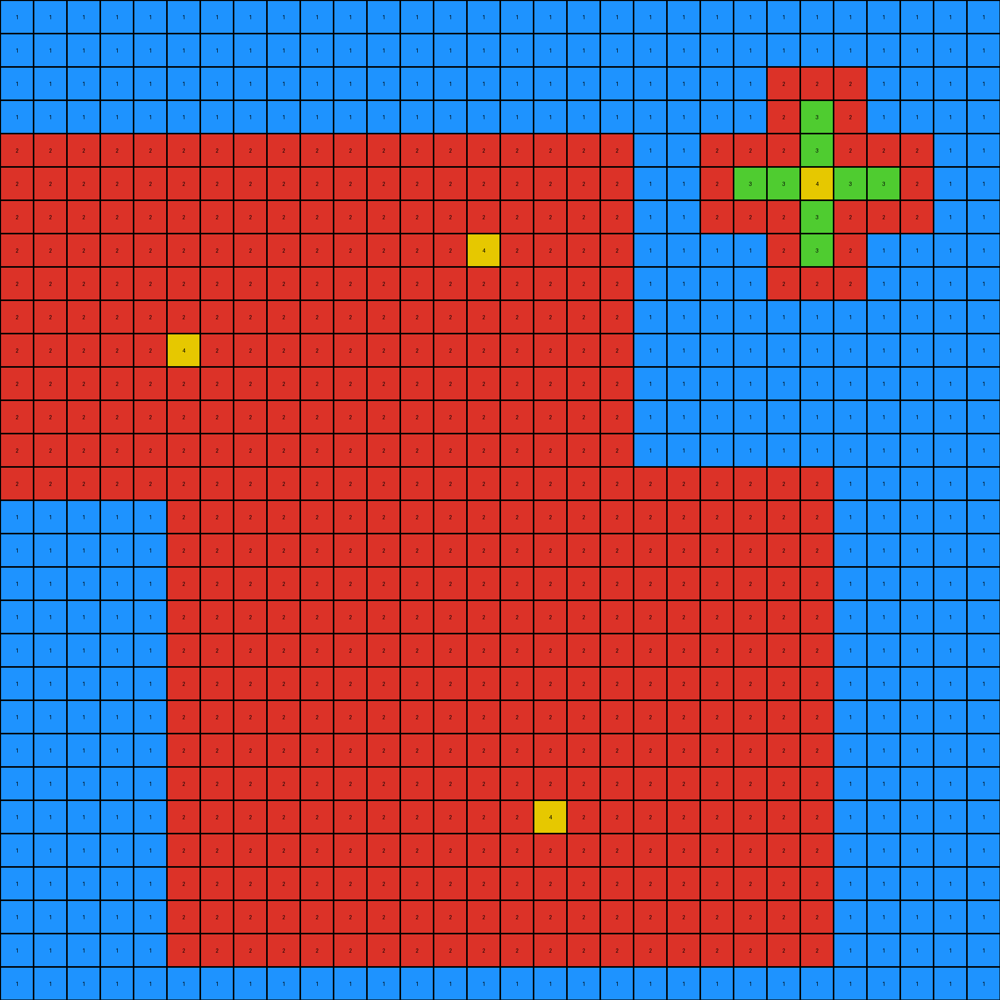

# 264363fd • 003 • refine_dreamer

---


Previous Code:
```python
"""
The transformation identifies a blue object within an azure background, traces (fully or partially) its outline with red pixels, and highlights points on the outline with green.
Original and copied objects have green highlights swapped.
"""

import numpy as np

def find_object(grid, color):
    # Find coordinates of all pixels of the specified color.
    coords = np.argwhere(grid == color)
    if coords.size == 0:
        return None
    return coords

def get_object_bounds(coords):
    # bounding box
    min_row = np.min(coords[:, 0])
    max_row = np.max(coords[:, 0])
    min_col = np.min(coords[:, 1])
    max_col = np.max(coords[:, 1])
    return min_row, max_row, min_col, max_col

def outline_object(grid, object_coords, outline_color):
    # Create an outline of the traced object with red pixels.
    min_row, max_row, min_col, max_col = get_object_bounds(object_coords)
    output_grid = np.copy(grid)

    for r in range(min_row, max_row + 1):
        for c in range(min_col, max_col + 1):
            if grid[r,c] == grid[object_coords[0][0], object_coords[0][1]]:

                #check neighbors
                neighbors = []
                for i in range(-1,2):
                    for j in range(-1,2):
                        if (i != 0 or j != 0):
                            neighbor_row = r + i
                            neighbor_col = c + j
                            if (0 <= neighbor_row < grid.shape[0] and 0 <= neighbor_col < grid.shape[1]):
                                  neighbors.append(grid[neighbor_row,neighbor_col])
                #if a neighbor is a different color than the object, we have an outline
                if any(neighbor != grid[object_coords[0][0], object_coords[0][1]] for neighbor in neighbors):
                    output_grid[r,c] = outline_color


    return output_grid

def find_green_highlight(grid, object_coords, highlight_color):
    # Find the green highlight within the traced object.
    min_row, max_row, min_col, max_col = get_object_bounds(object_coords)
    for r in range(min_row, max_row + 1):
        for c in range(min_col, max_col + 1):
             if grid[r, c] == highlight_color:
                return (r,c)
    return None

def transform(input_grid):
    # Initialize output grid with the same background color.
    output_grid = np.full(input_grid.shape, input_grid[0, 0])  # Assume background is top-left pixel

    # Find the blue object.
    blue_object_coords = find_object(input_grid, 1)

    # Trace the blue object with red.
    output_grid = outline_object(input_grid, blue_object_coords, 2)

    # find original green
    green_highlight_coords = find_green_highlight(input_grid,blue_object_coords, 3 )

    if (green_highlight_coords):
        output_grid[green_highlight_coords] = 3

    return output_grid
```

Train Set Results:

## Example 1:

Input:
```
8 8 8 8 8 8 8 8 8 8 8 8 8 8 8 8 8 8 8 8 8 8 8 8 8 8 8 8 8 8
8 8 1 1 1 1 1 1 1 1 1 1 1 1 1 1 1 1 1 8 8 8 8 8 8 8 8 8 8 8
8 8 1 1 1 1 1 1 1 1 1 1 1 1 1 1 1 1 1 8 8 8 8 8 8 2 8 8 8 8
8 8 1 1 1 1 1 1 1 1 1 1 1 1 1 1 1 1 1 8 8 8 8 8 3 2 3 8 8 8
8 8 1 1 1 1 1 1 1 1 1 1 1 1 1 1 1 1 1 8 8 8 8 2 2 3 2 2 8 8
8 8 1 1 1 3 1 1 1 1 1 1 1 1 1 1 1 1 1 8 8 8 8 8 3 2 3 8 8 8
8 8 1 1 1 1 1 1 1 1 1 1 1 1 1 1 1 1 1 8 8 8 8 8 8 2 8 8 8 8
8 8 1 1 1 1 1 1 1 1 1 1 1 1 1 1 1 1 1 8 8 8 8 8 8 8 8 8 8 8
8 8 1 1 1 1 1 1 1 1 1 1 1 1 1 1 1 1 1 8 8 8 8 8 8 8 8 8 8 8
8 8 1 1 1 1 1 1 1 1 1 1 1 1 1 1 1 1 1 8 8 8 8 8 8 8 8 8 8 8
8 8 1 1 1 1 1 1 1 1 1 1 1 1 1 1 1 1 1 8 8 8 8 8 8 8 8 8 8 8
8 8 1 1 1 1 1 1 1 1 1 1 1 1 1 1 1 1 1 8 8 8 8 8 8 8 8 8 8 8
8 8 1 1 1 1 1 1 1 1 1 1 1 1 1 1 1 1 1 8 8 8 8 8 8 8 8 8 8 8
8 8 1 1 1 1 1 1 1 1 1 1 1 1 1 1 1 1 1 8 8 8 8 8 8 8 8 8 8 8
8 8 1 1 1 1 1 1 1 1 1 1 1 1 1 1 1 1 1 8 8 8 8 8 8 8 8 8 8 8
8 8 1 1 1 1 1 1 1 1 1 1 1 1 1 1 1 1 1 8 8 8 8 8 8 8 8 8 8 8
8 8 8 8 8 8 8 8 8 8 8 8 8 8 8 8 8 8 8 8 8 8 8 8 8 8 8 8 8 8
8 8 8 8 8 8 8 8 8 8 8 8 8 8 8 8 8 8 8 8 8 8 8 8 8 8 8 8 8 8
8 8 8 8 8 8 8 8 1 1 1 1 1 1 1 1 1 1 1 1 1 1 1 1 1 1 8 8 8 8
8 8 8 8 8 8 8 8 1 1 1 1 1 1 1 1 1 1 1 1 1 1 1 1 1 1 8 8 8 8
8 8 8 8 8 8 8 8 1 1 1 1 1 1 1 1 1 1 1 1 1 1 1 1 1 1 8 8 8 8
8 8 8 8 8 8 8 8 1 1 1 1 1 1 1 1 1 1 1 1 1 1 1 1 1 1 8 8 8 8
8 8 8 8 8 8 8 8 1 1 1 1 1 1 1 1 1 1 1 1 1 1 1 1 1 1 8 8 8 8
8 8 8 8 8 8 8 8 1 1 1 1 1 1 1 1 1 1 1 1 1 1 1 1 1 1 8 8 8 8
8 8 8 8 8 8 8 8 1 1 1 1 1 1 1 1 1 1 1 1 1 1 1 1 1 1 8 8 8 8
8 8 8 8 8 8 8 8 1 1 1 1 1 1 1 1 1 3 1 1 1 1 1 1 1 1 8 8 8 8
8 8 8 8 8 8 8 8 1 1 1 1 1 1 1 1 1 1 1 1 1 1 1 1 1 1 8 8 8 8
8 8 8 8 8 8 8 8 8 8 8 8 8 8 8 8 8 8 8 8 8 8 8 8 8 8 8 8 8 8
8 8 8 8 8 8 8 8 8 8 8 8 8 8 8 8 8 8 8 8 8 8 8 8 8 8 8 8 8 8
8 8 8 8 8 8 8 8 8 8 8 8 8 8 8 8 8 8 8 8 8 8 8 8 8 8 8 8 8 8
```
Expected Output:
```
8 8 8 8 8 8 8 8 8 8 8 8 8 8 8 8 8 8 8 8 8 8 8 8 8 8 8 8 8 8
8 8 1 1 1 2 1 1 1 1 1 1 1 1 1 1 1 1 1 8 8 8 8 8 8 8 8 8 8 8
8 8 1 1 1 2 1 1 1 1 1 1 1 1 1 1 1 1 1 8 8 8 8 8 8 8 8 8 8 8
8 8 1 1 1 2 1 1 1 1 1 1 1 1 1 1 1 1 1 8 8 8 8 8 8 8 8 8 8 8
8 8 1 1 3 2 3 1 1 1 1 1 1 1 1 1 1 1 1 8 8 8 8 8 8 8 8 8 8 8
8 8 2 2 2 3 2 2 2 2 2 2 2 2 2 2 2 2 2 8 8 8 8 8 8 8 8 8 8 8
8 8 1 1 3 2 3 1 1 1 1 1 1 1 1 1 1 1 1 8 8 8 8 8 8 8 8 8 8 8
8 8 1 1 1 2 1 1 1 1 1 1 1 1 1 1 1 1 1 8 8 8 8 8 8 8 8 8 8 8
8 8 1 1 1 2 1 1 1 1 1 1 1 1 1 1 1 1 1 8 8 8 8 8 8 8 8 8 8 8
8 8 1 1 1 2 1 1 1 1 1 1 1 1 1 1 1 1 1 8 8 8 8 8 8 8 8 8 8 8
8 8 1 1 1 2 1 1 1 1 1 1 1 1 1 1 1 1 1 8 8 8 8 8 8 8 8 8 8 8
8 8 1 1 1 2 1 1 1 1 1 1 1 1 1 1 1 1 1 8 8 8 8 8 8 8 8 8 8 8
8 8 1 1 1 2 1 1 1 1 1 1 1 1 1 1 1 1 1 8 8 8 8 8 8 8 8 8 8 8
8 8 1 1 1 2 1 1 1 1 1 1 1 1 1 1 1 1 1 8 8 8 8 8 8 8 8 8 8 8
8 8 1 1 1 2 1 1 1 1 1 1 1 1 1 1 1 1 1 8 8 8 8 8 8 8 8 8 8 8
8 8 1 1 1 2 1 1 1 1 1 1 1 1 1 1 1 1 1 8 8 8 8 8 8 8 8 8 8 8
8 8 8 8 8 8 8 8 8 8 8 8 8 8 8 8 8 8 8 8 8 8 8 8 8 8 8 8 8 8
8 8 8 8 8 8 8 8 8 8 8 8 8 8 8 8 8 8 8 8 8 8 8 8 8 8 8 8 8 8
8 8 8 8 8 8 8 8 1 1 1 1 1 1 1 1 1 2 1 1 1 1 1 1 1 1 8 8 8 8
8 8 8 8 8 8 8 8 1 1 1 1 1 1 1 1 1 2 1 1 1 1 1 1 1 1 8 8 8 8
8 8 8 8 8 8 8 8 1 1 1 1 1 1 1 1 1 2 1 1 1 1 1 1 1 1 8 8 8 8
8 8 8 8 8 8 8 8 1 1 1 1 1 1 1 1 1 2 1 1 1 1 1 1 1 1 8 8 8 8
8 8 8 8 8 8 8 8 1 1 1 1 1 1 1 1 1 2 1 1 1 1 1 1 1 1 8 8 8 8
8 8 8 8 8 8 8 8 1 1 1 1 1 1 1 1 1 2 1 1 1 1 1 1 1 1 8 8 8 8
8 8 8 8 8 8 8 8 1 1 1 1 1 1 1 1 3 2 3 1 1 1 1 1 1 1 8 8 8 8
8 8 8 8 8 8 8 8 2 2 2 2 2 2 2 2 2 3 2 2 2 2 2 2 2 2 8 8 8 8
8 8 8 8 8 8 8 8 1 1 1 1 1 1 1 1 3 2 3 1 1 1 1 1 1 1 8 8 8 8
8 8 8 8 8 8 8 8 8 8 8 8 8 8 8 8 8 8 8 8 8 8 8 8 8 8 8 8 8 8
8 8 8 8 8 8 8 8 8 8 8 8 8 8 8 8 8 8 8 8 8 8 8 8 8 8 8 8 8 8
8 8 8 8 8 8 8 8 8 8 8 8 8 8 8 8 8 8 8 8 8 8 8 8 8 8 8 8 8 8
```
Transformed Output:
```
8 8 8 8 8 8 8 8 8 8 8 8 8 8 8 8 8 8 8 8 8 8 8 8 8 8 8 8 8 8
8 8 2 2 2 2 2 2 2 2 2 2 2 2 2 2 2 2 2 8 8 8 8 8 8 8 8 8 8 8
8 8 2 1 1 1 1 1 1 1 1 1 1 1 1 1 1 1 2 8 8 8 8 8 8 2 8 8 8 8
8 8 2 1 1 1 1 1 1 1 1 1 1 1 1 1 1 1 2 8 8 8 8 8 3 2 3 8 8 8
8 8 2 1 2 2 2 1 1 1 1 1 1 1 1 1 1 1 2 8 8 8 8 2 2 3 2 2 8 8
8 8 2 1 2 3 2 1 1 1 1 1 1 1 1 1 1 1 2 8 8 8 8 8 3 2 3 8 8 8
8 8 2 1 2 2 2 1 1 1 1 1 1 1 1 1 1 1 2 8 8 8 8 8 8 2 8 8 8 8
8 8 2 1 1 1 1 1 1 1 1 1 1 1 1 1 1 1 2 8 8 8 8 8 8 8 8 8 8 8
8 8 2 1 1 1 1 1 1 1 1 1 1 1 1 1 1 1 2 8 8 8 8 8 8 8 8 8 8 8
8 8 2 1 1 1 1 1 1 1 1 1 1 1 1 1 1 1 2 8 8 8 8 8 8 8 8 8 8 8
8 8 2 1 1 1 1 1 1 1 1 1 1 1 1 1 1 1 2 8 8 8 8 8 8 8 8 8 8 8
8 8 2 1 1 1 1 1 1 1 1 1 1 1 1 1 1 1 2 8 8 8 8 8 8 8 8 8 8 8
8 8 2 1 1 1 1 1 1 1 1 1 1 1 1 1 1 1 2 8 8 8 8 8 8 8 8 8 8 8
8 8 2 1 1 1 1 1 1 1 1 1 1 1 1 1 1 1 2 8 8 8 8 8 8 8 8 8 8 8
8 8 2 1 1 1 1 1 1 1 1 1 1 1 1 1 1 1 2 8 8 8 8 8 8 8 8 8 8 8
8 8 2 2 2 2 2 2 2 2 2 2 2 2 2 2 2 2 2 8 8 8 8 8 8 8 8 8 8 8
8 8 8 8 8 8 8 8 8 8 8 8 8 8 8 8 8 8 8 8 8 8 8 8 8 8 8 8 8 8
8 8 8 8 8 8 8 8 8 8 8 8 8 8 8 8 8 8 8 8 8 8 8 8 8 8 8 8 8 8
8 8 8 8 8 8 8 8 2 2 2 2 2 2 2 2 2 2 2 2 2 2 2 2 2 2 8 8 8 8
8 8 8 8 8 8 8 8 2 1 1 1 1 1 1 1 1 1 1 1 1 1 1 1 1 2 8 8 8 8
8 8 8 8 8 8 8 8 2 1 1 1 1 1 1 1 1 1 1 1 1 1 1 1 1 2 8 8 8 8
8 8 8 8 8 8 8 8 2 1 1 1 1 1 1 1 1 1 1 1 1 1 1 1 1 2 8 8 8 8
8 8 8 8 8 8 8 8 2 1 1 1 1 1 1 1 1 1 1 1 1 1 1 1 1 2 8 8 8 8
8 8 8 8 8 8 8 8 2 1 1 1 1 1 1 1 1 1 1 1 1 1 1 1 1 2 8 8 8 8
8 8 8 8 8 8 8 8 2 1 1 1 1 1 1 1 2 2 2 1 1 1 1 1 1 2 8 8 8 8
8 8 8 8 8 8 8 8 2 1 1 1 1 1 1 1 2 3 2 1 1 1 1 1 1 2 8 8 8 8
8 8 8 8 8 8 8 8 2 2 2 2 2 2 2 2 2 2 2 2 2 2 2 2 2 2 8 8 8 8
8 8 8 8 8 8 8 8 8 8 8 8 8 8 8 8 8 8 8 8 8 8 8 8 8 8 8 8 8 8
8 8 8 8 8 8 8 8 8 8 8 8 8 8 8 8 8 8 8 8 8 8 8 8 8 8 8 8 8 8
8 8 8 8 8 8 8 8 8 8 8 8 8 8 8 8 8 8 8 8 8 8 8 8 8 8 8 8 8 8
```

match: False
pixels_off: 161
size_correct: True
color_palette_correct: True
correct_pixel_counts: False

## Example 2:

Input:
```
1 1 1 1 1 1 1 1 1 1 1 1 1 1 1 1 1 1 1 1 1 1 1 1 1 1 1 1 1 1
1 1 1 1 1 1 1 1 1 1 1 1 1 1 1 1 1 1 1 1 1 1 1 1 1 1 1 1 1 1
1 1 1 1 1 1 1 1 1 1 1 1 1 1 1 1 1 1 1 1 1 1 1 1 1 1 1 1 1 1
1 1 1 1 1 1 1 1 1 1 1 1 1 1 1 1 1 1 1 1 1 1 1 1 3 1 1 1 1 1
1 1 1 1 1 1 1 1 1 1 1 1 1 1 1 1 1 1 1 1 1 1 1 1 3 1 1 1 1 1
1 2 2 2 2 2 2 2 2 2 2 2 2 2 2 2 2 2 1 1 1 1 3 3 4 3 3 1 1 1
1 2 2 2 2 2 2 2 2 2 2 2 2 2 2 2 2 2 1 1 1 1 1 1 3 1 1 1 1 1
1 2 2 2 2 2 2 2 2 2 2 2 2 2 4 2 2 2 1 1 1 1 1 1 3 1 1 1 1 1
1 2 2 2 2 2 2 2 2 2 2 2 2 2 2 2 2 2 1 1 1 1 1 1 1 1 1 1 1 1
1 2 2 2 2 2 2 2 2 2 2 2 2 2 2 2 2 2 1 1 1 1 1 1 1 1 1 1 1 1
1 2 2 2 2 4 2 2 2 2 2 2 2 2 2 2 2 2 1 1 1 1 1 1 1 1 1 1 1 1
1 2 2 2 2 2 2 2 2 2 2 2 2 2 2 2 2 2 1 1 1 1 1 1 1 1 1 1 1 1
1 2 2 2 2 2 2 2 2 2 2 2 2 2 2 2 2 2 1 1 1 1 1 1 1 1 1 1 1 1
1 2 2 2 2 2 2 2 2 2 2 2 2 2 2 2 2 2 1 1 1 1 1 1 1 1 1 1 1 1
1 1 1 1 1 1 1 1 1 1 1 1 1 1 1 1 1 1 1 1 1 1 1 1 1 1 1 1 1 1
1 1 1 1 1 1 2 2 2 2 2 2 2 2 2 2 2 2 2 2 2 2 2 2 1 1 1 1 1 1
1 1 1 1 1 1 2 2 2 2 2 2 2 2 2 2 2 2 2 2 2 2 2 2 1 1 1 1 1 1
1 1 1 1 1 1 2 2 2 2 2 2 2 2 2 2 2 2 2 2 2 2 2 2 1 1 1 1 1 1
1 1 1 1 1 1 2 2 2 2 2 2 2 2 2 2 2 2 2 2 2 2 2 2 1 1 1 1 1 1
1 1 1 1 1 1 2 2 2 2 2 2 2 2 2 2 2 2 2 2 2 2 2 2 1 1 1 1 1 1
1 1 1 1 1 1 2 2 2 2 2 2 2 2 2 2 2 2 2 2 2 2 2 2 1 1 1 1 1 1
1 1 1 1 1 1 2 2 2 2 2 2 2 2 2 2 2 2 2 2 2 2 2 2 1 1 1 1 1 1
1 1 1 1 1 1 2 2 2 2 2 2 2 2 2 2 2 2 2 2 2 2 2 2 1 1 1 1 1 1
1 1 1 1 1 1 2 2 2 2 2 2 2 2 2 2 2 2 2 2 2 2 2 2 1 1 1 1 1 1
1 1 1 1 1 1 2 2 2 2 2 2 2 2 2 2 4 2 2 2 2 2 2 2 1 1 1 1 1 1
1 1 1 1 1 1 2 2 2 2 2 2 2 2 2 2 2 2 2 2 2 2 2 2 1 1 1 1 1 1
1 1 1 1 1 1 2 2 2 2 2 2 2 2 2 2 2 2 2 2 2 2 2 2 1 1 1 1 1 1
1 1 1 1 1 1 2 2 2 2 2 2 2 2 2 2 2 2 2 2 2 2 2 2 1 1 1 1 1 1
1 1 1 1 1 1 1 1 1 1 1 1 1 1 1 1 1 1 1 1 1 1 1 1 1 1 1 1 1 1
1 1 1 1 1 1 1 1 1 1 1 1 1 1 1 1 1 1 1 1 1 1 1 1 1 1 1 1 1 1
```
Expected Output:
```
1 1 1 1 1 1 1 1 1 1 1 1 1 1 1 1 1 1 1 1 1 1 1 1 1 1 1 1 1 1
1 1 1 1 1 1 1 1 1 1 1 1 1 1 1 1 1 1 1 1 1 1 1 1 1 1 1 1 1 1
1 1 1 1 1 1 1 1 1 1 1 1 1 1 1 1 1 1 1 1 1 1 1 1 1 1 1 1 1 1
1 1 1 1 1 1 1 1 1 1 1 1 1 1 1 1 1 1 1 1 1 1 1 1 1 1 1 1 1 1
1 1 1 1 1 1 1 1 1 1 1 1 1 1 1 1 1 1 1 1 1 1 1 1 1 1 1 1 1 1
1 2 2 2 2 3 2 2 2 2 2 2 2 2 3 2 2 2 1 1 1 1 1 1 1 1 1 1 1 1
1 2 2 2 2 3 2 2 2 2 2 2 2 2 3 2 2 2 1 1 1 1 1 1 1 1 1 1 1 1
1 3 3 3 3 3 3 3 3 3 3 3 3 3 4 3 3 3 1 1 1 1 1 1 1 1 1 1 1 1
1 2 2 2 2 3 2 2 2 2 2 2 2 2 3 2 2 2 1 1 1 1 1 1 1 1 1 1 1 1
1 2 2 2 2 3 2 2 2 2 2 2 2 2 3 2 2 2 1 1 1 1 1 1 1 1 1 1 1 1
1 3 3 3 3 4 3 3 3 3 3 3 3 3 3 3 3 3 1 1 1 1 1 1 1 1 1 1 1 1
1 2 2 2 2 3 2 2 2 2 2 2 2 2 3 2 2 2 1 1 1 1 1 1 1 1 1 1 1 1
1 2 2 2 2 3 2 2 2 2 2 2 2 2 3 2 2 2 1 1 1 1 1 1 1 1 1 1 1 1
1 2 2 2 2 3 2 2 2 2 2 2 2 2 3 2 2 2 1 1 1 1 1 1 1 1 1 1 1 1
1 1 1 1 1 1 1 1 1 1 1 1 1 1 1 1 1 1 1 1 1 1 1 1 1 1 1 1 1 1
1 1 1 1 1 1 2 2 2 2 2 2 2 2 2 2 3 2 2 2 2 2 2 2 1 1 1 1 1 1
1 1 1 1 1 1 2 2 2 2 2 2 2 2 2 2 3 2 2 2 2 2 2 2 1 1 1 1 1 1
1 1 1 1 1 1 2 2 2 2 2 2 2 2 2 2 3 2 2 2 2 2 2 2 1 1 1 1 1 1
1 1 1 1 1 1 2 2 2 2 2 2 2 2 2 2 3 2 2 2 2 2 2 2 1 1 1 1 1 1
1 1 1 1 1 1 2 2 2 2 2 2 2 2 2 2 3 2 2 2 2 2 2 2 1 1 1 1 1 1
1 1 1 1 1 1 2 2 2 2 2 2 2 2 2 2 3 2 2 2 2 2 2 2 1 1 1 1 1 1
1 1 1 1 1 1 2 2 2 2 2 2 2 2 2 2 3 2 2 2 2 2 2 2 1 1 1 1 1 1
1 1 1 1 1 1 2 2 2 2 2 2 2 2 2 2 3 2 2 2 2 2 2 2 1 1 1 1 1 1
1 1 1 1 1 1 2 2 2 2 2 2 2 2 2 2 3 2 2 2 2 2 2 2 1 1 1 1 1 1
1 1 1 1 1 1 3 3 3 3 3 3 3 3 3 3 4 3 3 3 3 3 3 3 1 1 1 1 1 1
1 1 1 1 1 1 2 2 2 2 2 2 2 2 2 2 3 2 2 2 2 2 2 2 1 1 1 1 1 1
1 1 1 1 1 1 2 2 2 2 2 2 2 2 2 2 3 2 2 2 2 2 2 2 1 1 1 1 1 1
1 1 1 1 1 1 2 2 2 2 2 2 2 2 2 2 3 2 2 2 2 2 2 2 1 1 1 1 1 1
1 1 1 1 1 1 1 1 1 1 1 1 1 1 1 1 1 1 1 1 1 1 1 1 1 1 1 1 1 1
1 1 1 1 1 1 1 1 1 1 1 1 1 1 1 1 1 1 1 1 1 1 1 1 1 1 1 1 1 1
```
Transformed Output:
```
1 1 1 1 1 1 1 1 1 1 1 1 1 1 1 1 1 1 1 1 1 1 1 1 1 1 1 1 1 1
1 1 1 1 1 1 1 1 1 1 1 1 1 1 1 1 1 1 1 1 1 1 1 1 1 1 1 1 1 1
1 1 1 1 1 1 1 1 1 1 1 1 1 1 1 1 1 1 1 1 1 1 1 2 2 2 1 1 1 1
1 1 1 1 1 1 1 1 1 1 1 1 1 1 1 1 1 1 1 1 1 1 1 2 3 2 1 1 1 1
2 2 2 2 2 2 2 2 2 2 2 2 2 2 2 2 2 2 2 1 1 2 2 2 3 2 2 2 1 1
2 2 2 2 2 2 2 2 2 2 2 2 2 2 2 2 2 2 2 1 1 2 3 3 4 3 3 2 1 1
2 2 2 2 2 2 2 2 2 2 2 2 2 2 2 2 2 2 2 1 1 2 2 2 3 2 2 2 1 1
2 2 2 2 2 2 2 2 2 2 2 2 2 2 4 2 2 2 2 1 1 1 1 2 3 2 1 1 1 1
2 2 2 2 2 2 2 2 2 2 2 2 2 2 2 2 2 2 2 1 1 1 1 2 2 2 1 1 1 1
2 2 2 2 2 2 2 2 2 2 2 2 2 2 2 2 2 2 2 1 1 1 1 1 1 1 1 1 1 1
2 2 2 2 2 4 2 2 2 2 2 2 2 2 2 2 2 2 2 1 1 1 1 1 1 1 1 1 1 1
2 2 2 2 2 2 2 2 2 2 2 2 2 2 2 2 2 2 2 1 1 1 1 1 1 1 1 1 1 1
2 2 2 2 2 2 2 2 2 2 2 2 2 2 2 2 2 2 2 1 1 1 1 1 1 1 1 1 1 1
2 2 2 2 2 2 2 2 2 2 2 2 2 2 2 2 2 2 2 1 1 1 1 1 1 1 1 1 1 1
2 2 2 2 2 2 2 2 2 2 2 2 2 2 2 2 2 2 2 2 2 2 2 2 2 1 1 1 1 1
1 1 1 1 1 2 2 2 2 2 2 2 2 2 2 2 2 2 2 2 2 2 2 2 2 1 1 1 1 1
1 1 1 1 1 2 2 2 2 2 2 2 2 2 2 2 2 2 2 2 2 2 2 2 2 1 1 1 1 1
1 1 1 1 1 2 2 2 2 2 2 2 2 2 2 2 2 2 2 2 2 2 2 2 2 1 1 1 1 1
1 1 1 1 1 2 2 2 2 2 2 2 2 2 2 2 2 2 2 2 2 2 2 2 2 1 1 1 1 1
1 1 1 1 1 2 2 2 2 2 2 2 2 2 2 2 2 2 2 2 2 2 2 2 2 1 1 1 1 1
1 1 1 1 1 2 2 2 2 2 2 2 2 2 2 2 2 2 2 2 2 2 2 2 2 1 1 1 1 1
1 1 1 1 1 2 2 2 2 2 2 2 2 2 2 2 2 2 2 2 2 2 2 2 2 1 1 1 1 1
1 1 1 1 1 2 2 2 2 2 2 2 2 2 2 2 2 2 2 2 2 2 2 2 2 1 1 1 1 1
1 1 1 1 1 2 2 2 2 2 2 2 2 2 2 2 2 2 2 2 2 2 2 2 2 1 1 1 1 1
1 1 1 1 1 2 2 2 2 2 2 2 2 2 2 2 4 2 2 2 2 2 2 2 2 1 1 1 1 1
1 1 1 1 1 2 2 2 2 2 2 2 2 2 2 2 2 2 2 2 2 2 2 2 2 1 1 1 1 1
1 1 1 1 1 2 2 2 2 2 2 2 2 2 2 2 2 2 2 2 2 2 2 2 2 1 1 1 1 1
1 1 1 1 1 2 2 2 2 2 2 2 2 2 2 2 2 2 2 2 2 2 2 2 2 1 1 1 1 1
1 1 1 1 1 2 2 2 2 2 2 2 2 2 2 2 2 2 2 2 2 2 2 2 2 1 1 1 1 1
1 1 1 1 1 1 1 1 1 1 1 1 1 1 1 1 1 1 1 1 1 1 1 1 1 1 1 1 1 1
```

match: False
pixels_off: 216
size_correct: True
color_palette_correct: True
correct_pixel_counts: False

## Example 3:

Input:
```
8 8 8 8 8 8 8 8 8 8 8 8 8 8 8 8 8 8 8 8 8 8 8 8 8 8 8 8 8 8
8 8 8 8 8 8 8 8 8 8 8 8 8 8 8 8 8 8 8 8 8 8 8 8 8 8 8 8 8 8
8 8 8 8 8 8 8 8 8 8 8 3 3 3 3 3 3 3 3 3 3 3 3 3 3 3 3 8 8 8
8 8 8 8 8 8 8 8 8 8 8 3 3 3 3 3 3 3 3 3 3 3 3 3 3 3 3 8 8 8
8 8 8 8 8 8 8 8 8 8 8 3 3 3 3 3 3 3 3 3 3 3 3 3 3 3 3 8 8 8
8 8 8 8 8 8 8 8 8 8 8 3 3 3 3 3 3 3 3 3 3 3 3 3 3 3 3 8 8 8
8 8 8 8 8 8 8 8 8 8 8 3 3 3 3 3 3 3 3 3 3 3 3 4 3 3 3 8 8 8
8 8 8 8 8 8 8 8 8 8 8 3 3 3 3 3 3 3 3 3 3 3 3 3 3 3 3 8 8 8
8 8 8 8 8 8 8 8 8 8 8 3 3 3 3 3 3 3 3 3 3 3 3 3 3 3 3 8 8 8
8 3 3 3 3 3 3 3 3 3 8 3 3 3 3 3 3 3 3 3 3 3 3 3 3 3 3 8 8 8
8 3 3 3 3 3 3 3 3 3 8 3 3 3 3 4 3 3 3 3 3 3 3 3 3 3 3 8 8 8
8 3 3 3 3 3 3 3 3 3 8 3 3 3 3 3 3 3 3 3 3 3 3 3 3 3 3 8 8 8
8 3 3 3 4 3 3 3 3 3 8 3 3 3 3 3 3 3 3 3 3 3 3 3 3 3 3 8 8 8
8 3 3 3 3 3 3 3 3 3 8 3 3 3 3 3 3 3 3 3 3 3 3 3 3 3 3 8 8 8
8 3 3 3 3 3 3 3 3 3 8 3 3 3 3 3 3 3 3 3 3 3 3 3 3 3 3 8 8 8
8 3 3 3 3 3 3 3 3 3 8 8 8 8 8 8 8 8 8 8 8 8 8 8 8 8 8 8 8 8
8 3 3 3 3 3 3 3 3 3 8 8 3 3 3 3 3 3 3 3 3 3 8 8 8 8 8 8 8 8
8 3 3 3 3 3 3 3 3 3 8 8 3 3 3 3 3 3 3 3 3 3 8 8 8 8 8 8 8 8
8 3 3 3 3 3 3 3 3 3 8 8 3 3 3 3 3 3 3 3 3 3 8 8 8 8 8 8 8 8
8 3 3 3 3 3 3 3 3 3 8 8 3 3 3 3 3 3 3 3 3 3 8 8 8 8 8 8 8 8
8 3 3 3 3 3 3 3 3 3 8 8 3 3 3 3 3 3 4 3 3 3 8 8 8 8 8 8 8 8
8 3 3 3 3 3 3 3 3 3 8 8 3 3 3 3 3 3 3 3 3 3 8 8 8 8 8 8 8 8
8 3 3 3 3 3 3 3 3 3 8 8 3 3 3 3 3 3 3 3 3 3 8 8 8 8 8 8 8 8
8 3 3 3 3 3 3 3 3 3 8 8 8 8 8 8 8 8 8 8 8 8 8 8 8 8 8 8 8 8
8 8 8 8 8 8 8 8 8 8 8 8 8 8 8 8 8 8 8 8 8 8 8 8 5 8 8 8 8 8
8 8 8 8 8 8 8 8 8 8 8 8 8 8 8 8 8 8 8 8 8 8 8 6 5 6 8 8 8 8
8 8 8 8 8 8 8 8 8 8 8 8 8 8 8 8 8 8 8 8 8 8 8 6 4 6 8 8 8 8
8 8 8 8 8 8 8 8 8 8 8 8 8 8 8 8 8 8 8 8 8 8 8 6 5 6 8 8 8 8
8 8 8 8 8 8 8 8 8 8 8 8 8 8 8 8 8 8 8 8 8 8 8 8 5 8 8 8 8 8
8 8 8 8 8 8 8 8 8 8 8 8 8 8 8 8 8 8 8 8 8 8 8 8 8 8 8 8 8 8
```
Expected Output:
```
8 8 8 8 8 8 8 8 8 8 8 8 8 8 8 8 8 8 8 8 8 8 8 8 8 8 8 8 8 8
8 8 8 8 8 8 8 8 8 8 8 8 8 8 8 8 8 8 8 8 8 8 8 8 8 8 8 8 8 8
8 8 8 8 8 8 8 8 8 8 8 3 3 3 3 5 3 3 3 3 3 3 3 5 3 3 3 8 8 8
8 8 8 8 8 8 8 8 8 8 8 3 3 3 3 5 3 3 3 3 3 3 3 5 3 3 3 8 8 8
8 8 8 8 8 8 8 8 8 8 8 3 3 3 3 5 3 3 3 3 3 3 3 5 3 3 3 8 8 8
8 8 8 8 8 8 8 8 8 8 8 3 3 3 3 5 3 3 3 3 3 3 6 5 6 3 3 8 8 8
8 8 8 8 8 8 8 8 8 8 8 3 3 3 3 5 3 3 3 3 3 3 6 4 6 3 3 8 8 8
8 8 8 8 8 8 8 8 8 8 8 3 3 3 3 5 3 3 3 3 3 3 6 5 6 3 3 8 8 8
8 8 8 8 8 8 8 8 8 8 8 3 3 3 3 5 3 3 3 3 3 3 3 5 3 3 3 8 8 8
8 3 3 3 5 3 3 3 3 3 8 3 3 3 6 5 6 3 3 3 3 3 3 5 3 3 3 8 8 8
8 3 3 3 5 3 3 3 3 3 8 3 3 3 6 4 6 3 3 3 3 3 3 5 3 3 3 8 8 8
8 3 3 6 5 6 3 3 3 3 8 3 3 3 6 5 6 3 3 3 3 3 3 5 3 3 3 8 8 8
8 3 3 6 4 6 3 3 3 3 8 3 3 3 3 5 3 3 3 3 3 3 3 5 3 3 3 8 8 8
8 3 3 6 5 6 3 3 3 3 8 3 3 3 3 5 3 3 3 3 3 3 3 5 3 3 3 8 8 8
8 3 3 3 5 3 3 3 3 3 8 3 3 3 3 5 3 3 3 3 3 3 3 5 3 3 3 8 8 8
8 3 3 3 5 3 3 3 3 3 8 8 8 8 8 8 8 8 8 8 8 8 8 8 8 8 8 8 8 8
8 3 3 3 5 3 3 3 3 3 8 8 3 3 3 3 3 3 5 3 3 3 8 8 8 8 8 8 8 8
8 3 3 3 5 3 3 3 3 3 8 8 3 3 3 3 3 3 5 3 3 3 8 8 8 8 8 8 8 8
8 3 3 3 5 3 3 3 3 3 8 8 3 3 3 3 3 3 5 3 3 3 8 8 8 8 8 8 8 8
8 3 3 3 5 3 3 3 3 3 8 8 3 3 3 3 3 6 5 6 3 3 8 8 8 8 8 8 8 8
8 3 3 3 5 3 3 3 3 3 8 8 3 3 3 3 3 6 4 6 3 3 8 8 8 8 8 8 8 8
8 3 3 3 5 3 3 3 3 3 8 8 3 3 3 3 3 6 5 6 3 3 8 8 8 8 8 8 8 8
8 3 3 3 5 3 3 3 3 3 8 8 3 3 3 3 3 3 5 3 3 3 8 8 8 8 8 8 8 8
8 3 3 3 5 3 3 3 3 3 8 8 8 8 8 8 8 8 8 8 8 8 8 8 8 8 8 8 8 8
8 8 8 8 8 8 8 8 8 8 8 8 8 8 8 8 8 8 8 8 8 8 8 8 8 8 8 8 8 8
8 8 8 8 8 8 8 8 8 8 8 8 8 8 8 8 8 8 8 8 8 8 8 8 8 8 8 8 8 8
8 8 8 8 8 8 8 8 8 8 8 8 8 8 8 8 8 8 8 8 8 8 8 8 8 8 8 8 8 8
8 8 8 8 8 8 8 8 8 8 8 8 8 8 8 8 8 8 8 8 8 8 8 8 8 8 8 8 8 8
8 8 8 8 8 8 8 8 8 8 8 8 8 8 8 8 8 8 8 8 8 8 8 8 8 8 8 8 8 8
8 8 8 8 8 8 8 8 8 8 8 8 8 8 8 8 8 8 8 8 8 8 8 8 8 8 8 8 8 8
```
match: ERROR: 'NoneType' object is not subscriptable
pixels_off: None
size_correct: None
color_palette_correct: None
correct_pixel_counts: None

**INSTRUCTIONS**

The code above was generated based on observations from the first training
example

we have tested the transform function on each of the task example inputs and
compared with the expected output

review each of the examples provided and the results and consider how the
natural language program should be updated to accommodate this new knowledge

respond with the following deliverables:

- general assessment of the information provided and strategy for resolving the
  errors
- gather metrics about each of the examples and results - use code_execution to
  develop accurate reports on your assumptions
- a YAML block documenting facts - Focus on identifying objects, their properties, and the actions performed on them.
- a natural language program - Be as clear and concise as possible, providing a complete description of the transformation rule.


your responses should be considered as information in a report - not a
conversation
