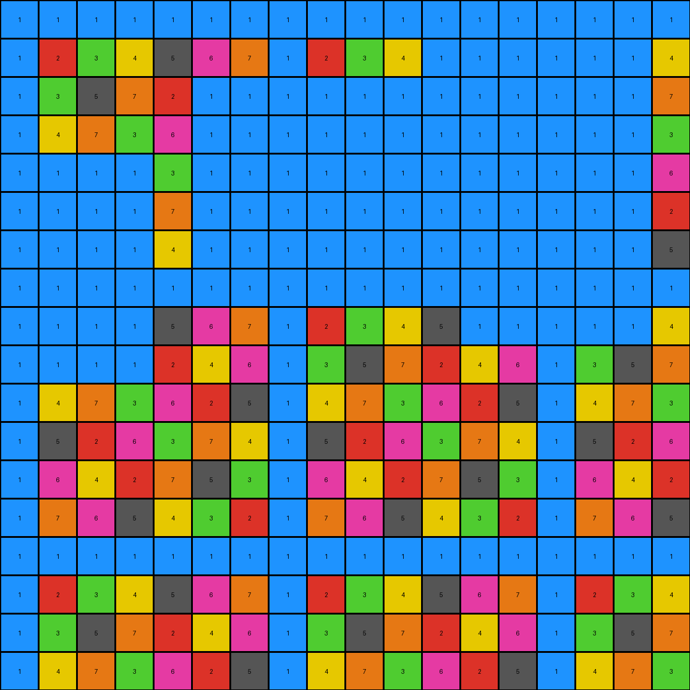

# 29ec7d0e • 004 • refine_coder

---

Previous Code:
```python
"""
The transformation erodes non-blue (non-1) regions adjacent to white (0) regions in the input grid.
"""

import numpy as np

def transform(input_grid):
    """
    Transforms the input grid by removing non-blue (non-1) pixels that are adjacent to white (0) pixels.
    """
    output_grid = np.copy(input_grid)
    rows, cols = input_grid.shape

    # Iterate through each pixel in the grid
    for r in range(rows):
        for c in range(cols):
            # Check if the current pixel is not blue (1)
            if input_grid[r, c] != 1:
                # Check for adjacent white (0) pixels
                is_adjacent_to_zero = False
                for i in range(max(0, r - 1), min(rows, r + 2)):
                    for j in range(max(0, c - 1), min(cols, c + 2)):
                        if input_grid[i, j] == 0:
                            is_adjacent_to_zero = True
                            break
                    if is_adjacent_to_zero:
                        break
                # If adjacent to zero, set the output pixel to blue(1)
                if is_adjacent_to_zero:
                    output_grid[r, c] = 1

    return output_grid
```

Train Set Results:

## Example 1:

Input:
```
1 1 1 0 0 1 1 1 1 1 1 1 1 1 1 1 1 1
1 2 3 0 0 1 2 3 4 5 1 2 3 4 5 1 2 3
1 3 5 0 0 1 3 5 2 4 0 0 5 2 4 1 3 5
1 4 2 5 3 1 4 2 5 3 0 0 2 5 3 1 4 2
1 5 4 3 2 1 0 0 3 2 1 5 4 3 2 1 5 4
1 1 1 1 1 1 0 0 1 1 1 0 0 0 1 1 1 1
1 2 3 4 5 1 2 3 4 5 1 0 0 0 5 1 2 3
1 3 5 2 4 1 3 5 2 4 1 3 5 2 4 1 3 5
1 4 2 5 3 1 4 2 5 3 1 4 2 5 3 1 4 2
1 5 4 3 2 1 5 4 3 2 1 5 4 3 2 1 5 4
0 0 0 0 1 1 1 1 1 1 1 1 1 1 1 1 1 1
0 0 0 0 5 1 2 3 4 5 1 2 3 4 5 1 2 3
0 0 0 0 4 1 3 5 2 4 1 3 5 2 4 1 3 5
1 4 2 5 3 1 4 2 5 3 1 4 2 5 3 1 4 2
1 5 4 3 2 1 5 4 3 2 1 5 4 3 2 1 5 4
1 1 1 1 1 1 1 1 1 1 1 1 1 1 1 1 1 1
1 2 3 4 5 1 2 3 4 5 1 2 3 4 5 1 2 3
1 3 5 2 4 1 3 5 2 4 1 3 5 2 4 1 3 5
```
Expected Output:
```
1 1 1 1 1 1 1 1 1 1 1 1 1 1 1 1 1 1
1 2 3 4 5 1 2 3 4 5 1 2 3 4 5 1 2 3
1 3 5 2 4 1 3 5 2 4 1 3 5 2 4 1 3 5
1 4 2 5 3 1 4 2 5 3 1 4 2 5 3 1 4 2
1 5 4 3 2 1 5 4 3 2 1 5 4 3 2 1 5 4
1 1 1 1 1 1 1 1 1 1 1 1 1 1 1 1 1 1
1 2 3 4 5 1 2 3 4 5 1 2 3 4 5 1 2 3
1 3 5 2 4 1 3 5 2 4 1 3 5 2 4 1 3 5
1 4 2 5 3 1 4 2 5 3 1 4 2 5 3 1 4 2
1 5 4 3 2 1 5 4 3 2 1 5 4 3 2 1 5 4
1 1 1 1 1 1 1 1 1 1 1 1 1 1 1 1 1 1
1 2 3 4 5 1 2 3 4 5 1 2 3 4 5 1 2 3
1 3 5 2 4 1 3 5 2 4 1 3 5 2 4 1 3 5
1 4 2 5 3 1 4 2 5 3 1 4 2 5 3 1 4 2
1 5 4 3 2 1 5 4 3 2 1 5 4 3 2 1 5 4
1 1 1 1 1 1 1 1 1 1 1 1 1 1 1 1 1 1
1 2 3 4 5 1 2 3 4 5 1 2 3 4 5 1 2 3
1 3 5 2 4 1 3 5 2 4 1 3 5 2 4 1 3 5
```
Transformed Output:
```
1 1 1 1 1 1 1 1 1 1 1 1 1 1 1 1 1 1
1 2 1 1 1 1 2 3 4 1 1 1 1 4 5 1 2 3
1 3 1 1 1 1 3 5 2 1 1 1 1 2 4 1 3 5
1 4 1 1 1 1 1 1 1 1 1 1 1 5 3 1 4 2
1 5 4 3 2 1 1 1 1 1 1 1 1 1 1 1 5 4
1 1 1 1 1 1 1 1 1 1 1 1 1 1 1 1 1 1
1 2 3 4 5 1 1 1 1 5 1 1 1 1 1 1 2 3
1 3 5 2 4 1 3 5 2 4 1 1 1 1 1 1 3 5
1 4 2 5 3 1 4 2 5 3 1 4 2 5 3 1 4 2
1 1 1 1 1 1 5 4 3 2 1 5 4 3 2 1 5 4
1 1 1 1 1 1 1 1 1 1 1 1 1 1 1 1 1 1
1 1 1 1 1 1 2 3 4 5 1 2 3 4 5 1 2 3
1 1 1 1 1 1 3 5 2 4 1 3 5 2 4 1 3 5
1 1 1 1 1 1 4 2 5 3 1 4 2 5 3 1 4 2
1 5 4 3 2 1 5 4 3 2 1 5 4 3 2 1 5 4
1 1 1 1 1 1 1 1 1 1 1 1 1 1 1 1 1 1
1 2 3 4 5 1 2 3 4 5 1 2 3 4 5 1 2 3
1 3 5 2 4 1 3 5 2 4 1 3 5 2 4 1 3 5
```

match: False
pixels_off: 56
size_correct: True
color_palette_correct: True
correct_pixel_counts: False

## Example 2:

Input:
```
1 1 1 1 1 1 1 0 0 0 1 1 1 1 1 1 1 1
1 2 3 4 5 6 1 0 0 0 5 6 1 2 3 4 5 6
1 3 5 1 3 5 1 0 0 0 3 5 1 3 5 1 3 5
1 4 1 4 1 4 1 0 0 0 1 4 1 4 1 4 1 4
1 5 3 1 5 3 1 5 3 1 5 0 0 0 3 1 5 3
1 6 5 0 0 0 0 6 5 4 3 0 0 0 5 4 3 2
1 1 1 0 0 0 0 1 1 1 1 1 1 1 1 1 1 1
1 2 3 0 0 0 0 2 3 4 5 6 1 2 3 4 5 6
1 3 5 1 3 5 1 3 5 1 3 5 1 3 5 1 3 5
1 4 1 4 1 4 1 4 1 4 1 4 1 4 1 4 1 4
1 5 3 1 5 3 1 5 3 1 5 3 1 5 3 1 5 3
1 6 5 4 3 2 1 0 0 0 3 2 0 0 0 0 3 2
1 1 1 1 1 1 1 0 0 0 1 1 0 0 0 0 1 1
1 2 3 4 5 6 1 0 0 0 5 6 0 0 0 0 5 6
1 3 5 1 3 5 1 3 5 1 3 5 1 3 5 1 3 5
1 4 1 4 1 4 1 4 1 4 1 4 1 4 1 4 1 4
1 5 3 1 5 3 1 5 3 1 5 3 1 5 3 1 5 3
1 6 5 4 3 2 1 6 5 4 3 2 1 6 5 4 3 2
```
Expected Output:
```
1 1 1 1 1 1 1 1 1 1 1 1 1 1 1 1 1 1
1 2 3 4 5 6 1 2 3 4 5 6 1 2 3 4 5 6
1 3 5 1 3 5 1 3 5 1 3 5 1 3 5 1 3 5
1 4 1 4 1 4 1 4 1 4 1 4 1 4 1 4 1 4
1 5 3 1 5 3 1 5 3 1 5 3 1 5 3 1 5 3
1 6 5 4 3 2 1 6 5 4 3 2 1 6 5 4 3 2
1 1 1 1 1 1 1 1 1 1 1 1 1 1 1 1 1 1
1 2 3 4 5 6 1 2 3 4 5 6 1 2 3 4 5 6
1 3 5 1 3 5 1 3 5 1 3 5 1 3 5 1 3 5
1 4 1 4 1 4 1 4 1 4 1 4 1 4 1 4 1 4
1 5 3 1 5 3 1 5 3 1 5 3 1 5 3 1 5 3
1 6 5 4 3 2 1 6 5 4 3 2 1 6 5 4 3 2
1 1 1 1 1 1 1 1 1 1 1 1 1 1 1 1 1 1
1 2 3 4 5 6 1 2 3 4 5 6 1 2 3 4 5 6
1 3 5 1 3 5 1 3 5 1 3 5 1 3 5 1 3 5
1 4 1 4 1 4 1 4 1 4 1 4 1 4 1 4 1 4
1 5 3 1 5 3 1 5 3 1 5 3 1 5 3 1 5 3
1 6 5 4 3 2 1 6 5 4 3 2 1 6 5 4 3 2
```
Transformed Output:
```
1 1 1 1 1 1 1 1 1 1 1 1 1 1 1 1 1 1
1 2 3 4 5 6 1 1 1 1 1 6 1 2 3 4 5 6
1 3 5 1 3 5 1 1 1 1 1 5 1 3 5 1 3 5
1 4 1 4 1 4 1 1 1 1 1 1 1 1 1 4 1 4
1 5 1 1 1 1 1 1 1 1 1 1 1 1 1 1 5 3
1 6 1 1 1 1 1 1 5 4 1 1 1 1 1 4 3 2
1 1 1 1 1 1 1 1 1 1 1 1 1 1 1 1 1 1
1 2 1 1 1 1 1 1 3 4 5 6 1 2 3 4 5 6
1 3 1 1 1 1 1 1 5 1 3 5 1 3 5 1 3 5
1 4 1 4 1 4 1 4 1 4 1 4 1 4 1 4 1 4
1 5 3 1 5 3 1 1 1 1 1 1 1 1 1 1 1 3
1 6 5 4 3 2 1 1 1 1 1 1 1 1 1 1 1 2
1 1 1 1 1 1 1 1 1 1 1 1 1 1 1 1 1 1
1 2 3 4 5 6 1 1 1 1 1 1 1 1 1 1 1 6
1 3 5 1 3 5 1 1 1 1 1 1 1 1 1 1 1 5
1 4 1 4 1 4 1 4 1 4 1 4 1 4 1 4 1 4
1 5 3 1 5 3 1 5 3 1 5 3 1 5 3 1 5 3
1 6 5 4 3 2 1 6 5 4 3 2 1 6 5 4 3 2
```

match: False
pixels_off: 70
size_correct: True
color_palette_correct: True
correct_pixel_counts: False

## Example 3:

Input:
```
1 1 1 1 1 1 1 1 1 1 1 1 1 1 1 1 1 1
1 2 3 4 5 6 7 1 2 3 4 5 6 7 1 2 3 4
1 3 5 7 2 4 6 1 3 5 7 2 0 0 0 0 5 7
1 4 7 3 6 2 0 0 0 0 0 0 0 0 0 0 7 3
1 5 2 6 3 7 0 0 0 0 0 0 0 0 0 0 2 6
1 0 0 2 7 5 0 0 0 0 2 7 0 0 0 0 4 2
1 0 0 5 4 3 0 0 0 0 5 4 3 0 0 0 6 5
1 0 0 1 1 1 1 1 1 1 1 1 1 0 0 0 1 1
1 0 0 4 5 6 7 1 2 3 4 5 6 7 1 2 3 4
1 3 5 7 2 4 6 1 3 5 7 2 4 6 1 3 5 7
1 4 7 3 6 2 5 1 4 7 3 6 2 5 1 4 7 3
1 5 2 6 3 7 4 1 5 2 6 3 7 4 1 5 2 6
1 6 4 2 7 5 3 1 6 4 2 7 5 3 1 6 4 2
1 7 6 5 4 3 2 1 7 6 5 4 3 2 1 7 6 5
1 1 1 1 1 1 1 1 1 1 1 1 1 1 1 1 1 1
1 2 3 4 5 6 7 1 2 3 4 5 6 7 1 2 3 4
1 3 5 7 2 4 6 1 3 5 7 2 4 6 1 3 5 7
1 4 7 3 6 2 5 1 4 7 3 6 2 5 1 4 7 3
```
Expected Output:
```
1 1 1 1 1 1 1 1 1 1 1 1 1 1 1 1 1 1
1 2 3 4 5 6 7 1 2 3 4 5 6 7 1 2 3 4
1 3 5 7 2 4 6 1 3 5 7 2 4 6 1 3 5 7
1 4 7 3 6 2 5 1 4 7 3 6 2 5 1 4 7 3
1 5 2 6 3 7 4 1 5 2 6 3 7 4 1 5 2 6
1 6 4 2 7 5 3 1 6 4 2 7 5 3 1 6 4 2
1 7 6 5 4 3 2 1 7 6 5 4 3 2 1 7 6 5
1 1 1 1 1 1 1 1 1 1 1 1 1 1 1 1 1 1
1 2 3 4 5 6 7 1 2 3 4 5 6 7 1 2 3 4
1 3 5 7 2 4 6 1 3 5 7 2 4 6 1 3 5 7
1 4 7 3 6 2 5 1 4 7 3 6 2 5 1 4 7 3
1 5 2 6 3 7 4 1 5 2 6 3 7 4 1 5 2 6
1 6 4 2 7 5 3 1 6 4 2 7 5 3 1 6 4 2
1 7 6 5 4 3 2 1 7 6 5 4 3 2 1 7 6 5
1 1 1 1 1 1 1 1 1 1 1 1 1 1 1 1 1 1
1 2 3 4 5 6 7 1 2 3 4 5 6 7 1 2 3 4
1 3 5 7 2 4 6 1 3 5 7 2 4 6 1 3 5 7
1 4 7 3 6 2 5 1 4 7 3 6 2 5 1 4 7 3
```
Transformed Output:
```
1 1 1 1 1 1 1 1 1 1 1 1 1 1 1 1 1 1
1 2 3 4 5 6 7 1 2 3 4 1 1 1 1 1 1 4
1 3 5 7 2 1 1 1 1 1 1 1 1 1 1 1 1 7
1 4 7 3 6 1 1 1 1 1 1 1 1 1 1 1 1 3
1 1 1 1 3 1 1 1 1 1 1 1 1 1 1 1 1 6
1 1 1 1 7 1 1 1 1 1 1 1 1 1 1 1 1 2
1 1 1 1 4 1 1 1 1 1 1 1 1 1 1 1 1 5
1 1 1 1 1 1 1 1 1 1 1 1 1 1 1 1 1 1
1 1 1 1 5 6 7 1 2 3 4 5 1 1 1 1 1 4
1 1 1 1 2 4 6 1 3 5 7 2 4 6 1 3 5 7
1 4 7 3 6 2 5 1 4 7 3 6 2 5 1 4 7 3
1 5 2 6 3 7 4 1 5 2 6 3 7 4 1 5 2 6
1 6 4 2 7 5 3 1 6 4 2 7 5 3 1 6 4 2
1 7 6 5 4 3 2 1 7 6 5 4 3 2 1 7 6 5
1 1 1 1 1 1 1 1 1 1 1 1 1 1 1 1 1 1
1 2 3 4 5 6 7 1 2 3 4 5 6 7 1 2 3 4
1 3 5 7 2 4 6 1 3 5 7 2 4 6 1 3 5 7
1 4 7 3 6 2 5 1 4 7 3 6 2 5 1 4 7 3
```

match: False
pixels_off: 74
size_correct: True
color_palette_correct: True
correct_pixel_counts: False

## Example 4:

Input:
```
1 1 1 1 1 1 1 1 1 1 1 1 1 1 1 1 1 1
1 2 3 4 5 6 7 8 1 2 3 4 5 6 7 8 1 2
1 3 5 7 1 3 5 7 1 3 5 7 1 3 5 7 1 3
1 4 7 2 5 8 3 6 1 4 7 2 5 8 0 0 1 4
1 5 1 5 1 5 1 5 1 5 1 5 1 5 0 0 1 5
1 6 3 8 5 2 7 4 1 6 3 8 5 2 0 0 1 6
1 7 5 3 1 7 5 3 1 7 5 3 1 7 5 3 1 7
1 8 7 6 5 4 3 2 1 8 7 6 5 4 3 2 1 8
1 1 1 0 0 0 0 0 1 1 1 1 1 1 1 1 1 1
1 2 3 0 0 0 0 0 1 2 3 4 5 6 7 8 1 2
1 3 5 7 0 0 0 0 1 3 5 7 1 3 5 7 1 3
1 4 7 2 5 8 3 6 1 4 7 2 5 8 3 6 1 4
1 5 1 5 1 5 1 5 1 5 1 5 1 5 1 5 1 5
1 6 3 8 5 2 0 0 1 6 3 8 5 2 7 4 1 6
1 7 5 3 1 7 0 0 1 7 5 3 1 7 5 3 1 7
1 8 7 6 0 0 3 2 1 8 7 6 5 4 3 2 1 8
1 1 1 1 0 0 1 1 1 1 1 1 1 1 1 1 1 1
1 2 3 4 5 6 7 8 1 2 3 4 5 6 7 8 1 2
```
Expected Output:
```
1 1 1 1 1 1 1 1 1 1 1 1 1 1 1 1 1 1
1 2 3 4 5 6 7 8 1 2 3 4 5 6 7 8 1 2
1 3 5 7 1 3 5 7 1 3 5 7 1 3 5 7 1 3
1 4 7 2 5 8 3 6 1 4 7 2 5 8 3 6 1 4
1 5 1 5 1 5 1 5 1 5 1 5 1 5 1 5 1 5
1 6 3 8 5 2 7 4 1 6 3 8 5 2 7 4 1 6
1 7 5 3 1 7 5 3 1 7 5 3 1 7 5 3 1 7
1 8 7 6 5 4 3 2 1 8 7 6 5 4 3 2 1 8
1 1 1 1 1 1 1 1 1 1 1 1 1 1 1 1 1 1
1 2 3 4 5 6 7 8 1 2 3 4 5 6 7 8 1 2
1 3 5 7 1 3 5 7 1 3 5 7 1 3 5 7 1 3
1 4 7 2 5 8 3 6 1 4 7 2 5 8 3 6 1 4
1 5 1 5 1 5 1 5 1 5 1 5 1 5 1 5 1 5
1 6 3 8 5 2 7 4 1 6 3 8 5 2 7 4 1 6
1 7 5 3 1 7 5 3 1 7 5 3 1 7 5 3 1 7
1 8 7 6 5 4 3 2 1 8 7 6 5 4 3 2 1 8
1 1 1 1 1 1 1 1 1 1 1 1 1 1 1 1 1 1
1 2 3 4 5 6 7 8 1 2 3 4 5 6 7 8 1 2
```
Transformed Output:
```
1 1 1 1 1 1 1 1 1 1 1 1 1 1 1 1 1 1
1 2 3 4 5 6 7 8 1 2 3 4 5 6 7 8 1 2
1 3 5 7 1 3 5 7 1 3 5 7 1 1 1 1 1 3
1 4 7 2 5 8 3 6 1 4 7 2 5 1 1 1 1 4
1 5 1 5 1 5 1 5 1 5 1 5 1 1 1 1 1 5
1 6 3 8 5 2 7 4 1 6 3 8 5 1 1 1 1 6
1 7 5 3 1 7 5 3 1 7 5 3 1 1 1 1 1 7
1 8 1 1 1 1 1 1 1 8 7 6 5 4 3 2 1 8
1 1 1 1 1 1 1 1 1 1 1 1 1 1 1 1 1 1
1 2 1 1 1 1 1 1 1 2 3 4 5 6 7 8 1 2
1 3 1 1 1 1 1 1 1 3 5 7 1 3 5 7 1 3
1 4 7 1 1 1 1 1 1 4 7 2 5 8 3 6 1 4
1 5 1 5 1 1 1 1 1 5 1 5 1 5 1 5 1 5
1 6 3 8 5 1 1 1 1 6 3 8 5 2 7 4 1 6
1 7 5 1 1 1 1 1 1 7 5 3 1 7 5 3 1 7
1 8 7 1 1 1 1 1 1 8 7 6 5 4 3 2 1 8
1 1 1 1 1 1 1 1 1 1 1 1 1 1 1 1 1 1
1 2 3 1 1 1 1 8 1 2 3 4 5 6 7 8 1 2
```

match: False
pixels_off: 54
size_correct: True
color_palette_correct: True
correct_pixel_counts: False
Okay, here's an analysis of the provided information and a plan to refine the natural language program and the code.

**General Assessment:**

The initial code and natural language program were based on a limited understanding from the first training example. The subsequent tests reveal a consistent pattern of errors: the code *incorrectly* replaces non-blue pixels adjacent to white pixels with blue pixels. It seems the transformation should *preserve* the original non-blue pixels, and *only* remove white pixels and add blue pixels that complete blue borders. The core issue is that the initial program was too aggressive in its erosion, turning non-blue pixels blue.

**Strategy:**

1.  **Re-evaluate the Core Concept:** Shift from "eroding non-blue" to "completing/extending blue borders".
2.  **Focus on White Pixels:** The transformation primarily involves white (0) pixels. Analyze their relationship to blue (1) pixels.
3.  **Preserve Other Colors:** Ensure that non-white and non-blue pixels are *not* modified. The transformation affects only the white pixels and adds blues in specific cases.
4.  **Iterative Refinement:** Use the test results to guide iterative improvements to both the natural language program and the code.
5.  **YAML for Structured Info** Create a YAML that extract essential aspects of the transformation from the examples to help build context

**Metrics and Observations (per example):**

I'll summarize observations, noting the key differences between the expected output and the transformed output. I'll also note the relations between the colored regions.

*   **Example 1:**
    *   The transformed output has incorrectly converted many non-blue pixels to blue, especially around the edges of existing blue regions and close to white pixels. The rule seems to connect regions of blues that have white in-between.

*   **Example 2:**
    *   Similar to Example 1, non-blue pixels near white pixels have been erroneously turned blue.

*   **Example 3:**
    *   Again, the same error. It converts non-blue colors next to white to blue.

*   **Example 4:**
    *   The error continues to follow the previously established pattern.

**YAML Block (Facts):**

```yaml
transformation_type: "border_completion"
objects:
  - name: "blue_regions"
    color: 1
    properties:
      - "contiguous"
      - "can_expand"
  - name: "white_regions"
    color: 0
    properties:
      - "adjacent_to_blue"
      - "gets_removed_or_becomes_blue"
  - name: "other_color_regions"
    color: "[2, 3, 4, 5, 6, 7, 8, 9]"
    properties:
      - "static"
      - "not_modified"
actions:
  - description: "Blue regions extend to cover adjacent white regions."
  - condition: "White region is adjacent to a blue region."
  - result: "White region becomes blue."
  - description: "White regions become blue to connect existing blue regions"
  - condition: "The new blue region connects two blue regions"
  - result: "White regions along the shortest path become blue"
```

**Natural Language Program:**

1.  **Identify** all contiguous regions of blue (1) pixels.
2.  **Identify** all white (0) pixels.
3. **Preserve** All pixels that are not white (0) are unchanged in the output.
4.  **Examine** white pixels adjacent to any blue pixel. These white pixels become blue in the output.
5. **Connect** If two separate blue regions can be connected by setting only white pixels to blue, then change those white pixes to blue

This revised natural language program aims to capture the observed behavior more accurately. It emphasizes the preservation of non-white/blue pixels and focuses on how blue regions expand by converting adjacent white pixels. The key difference from the previous iteration is that other colors stay unchanged.

**INSTRUCTIONS**

- generate a Python module to represent the natural language program 
- follow the template below
- all common math and science libraries are available
- create docstring only at top - but comment the workflow in the function
- use helper functions for common operations like finding objects, counting,
  measuring, moving, etc. 

remember - we are working iteratively - so this code will inform your future
self as we converge on the solution

*template:*

```python
"""
{{ natural language description of the transformation rule }}
"""

{{ imports }}

def transform(input_grid):
    # initialize output_grid

    # change output pixels 

    return output_grid

```
